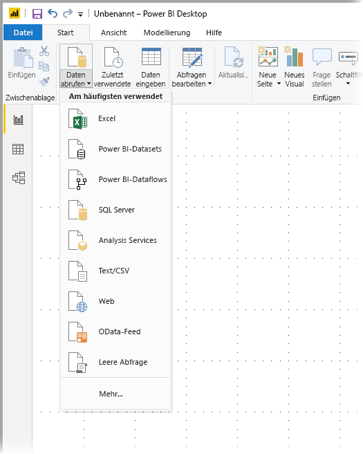
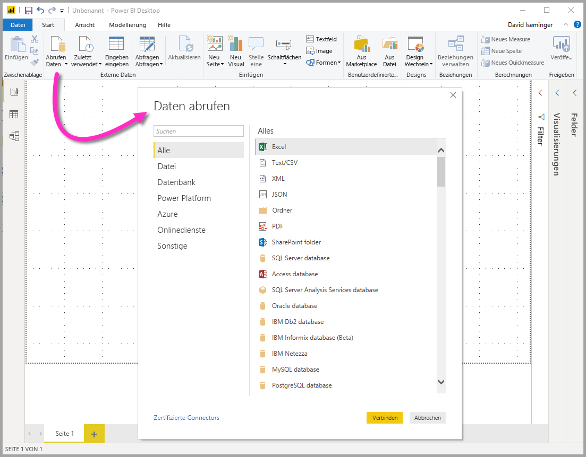
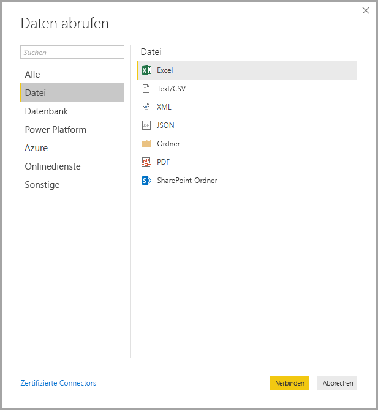
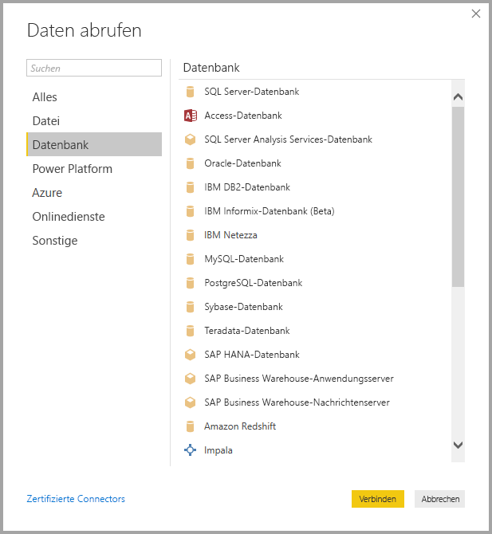
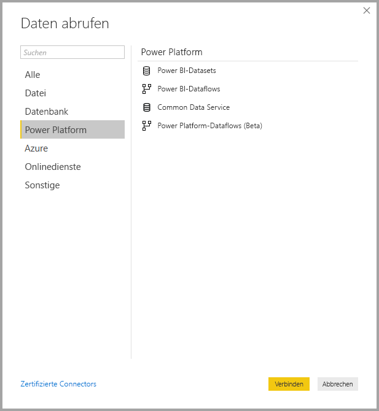
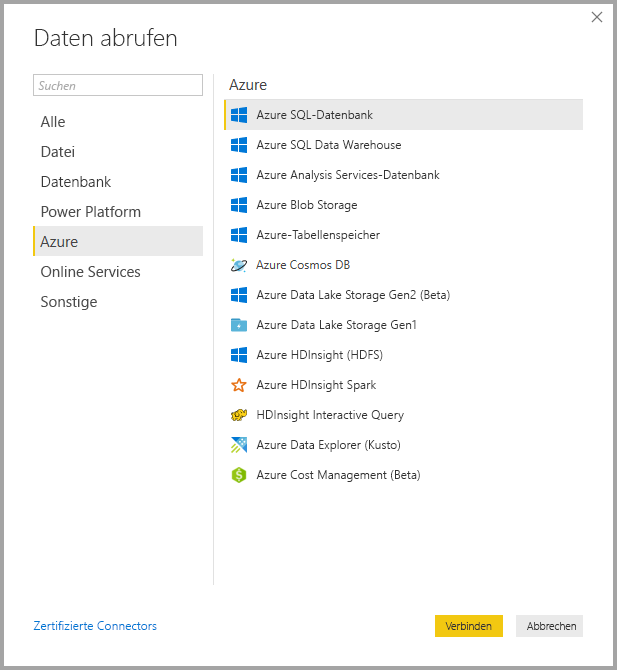
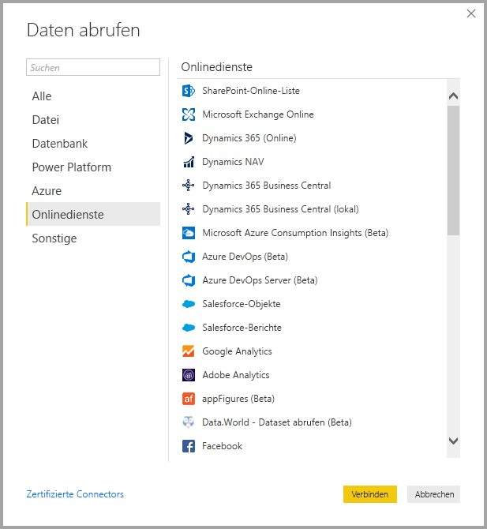
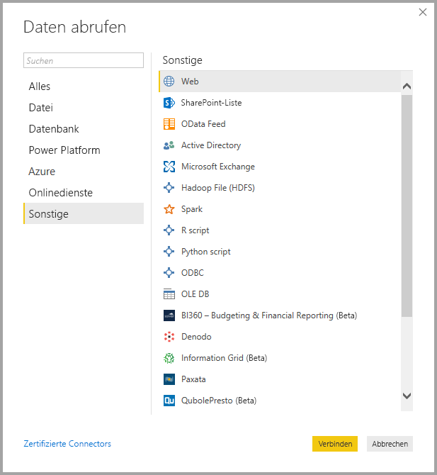
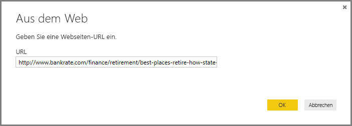
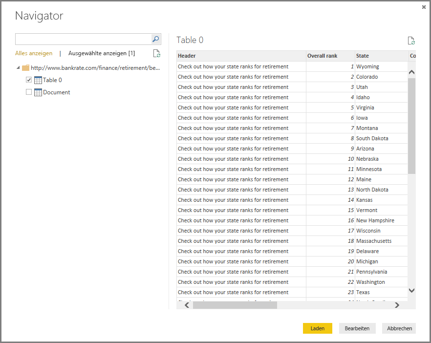

# <a name="data-sources-in-power-bi-desktop"></a>Datenquellen in Power BI Desktop

Mit Power BI Desktop können Sie Verbindungen mit Daten aus vielen verschiedenen Quellen herstellen. Eine vollständige Liste der verfügbaren Datenquellen finden Sie unter [Power BI-Datenquellen](power-bi-data-sources.md).

Wählen Sie zum Herstellen einer Verbindung mit Daten im Menüband **Start** den Eintrag **Daten abrufen** aus. Wenn Sie den Pfeil nach unten oder den Text **Daten abrufen** auf der Schaltfläche auswählen, wird das Datentypmenü **Am häufigsten verwendet** angezeigt, das in der folgenden Abbildung veranschaulicht wird:



Wenn Sie die Option **Mehr...** im Menü **Am häufigsten verwendet** auswählen, wird das Fenster **Daten abrufen** angezeigt. Sie können das Fenster **Daten abrufen** auch durch direktes Auswählen der **Symbolschaltfläche** **Daten abrufen** öffnen (und das Menü **Am häufigsten verwendet** umgehen).



> [!NOTE]
> Das Power BI-Team erweitert laufend die Datenquellen, die für **Power BI Desktop** und den **Power BI-Dienst** verfügbar sind. Daher finden Sie häufig Vorabversionen von noch nicht in der Endversion vorliegenden Datenquellen, die als *Beta* oder *Vorschau* gekennzeichnet sind. Für alle als *Beta* oder *Vorschau* markierten Datenquellen stehen nur eingeschränkter Support und weniger Funktionen zur Verfügung, und sie sollten nicht in Produktionsumgebungen verwendet werden. 

> Zudem sind alle Datenquellen, die als *Beta* oder *Vorschau* für **Power BI Desktop** gekennzeichnet sind, möglicherweise nicht für die Verwendung im **Power BI-Dienst** oder in anderen Microsoft-Diensten verfügbar, bis die Datenquelle allgemein verfügbar wird (GA).

## <a name="data-sources"></a>Datenquellen
Datentypen werden in die folgenden Kategorien unterteilt:

* Alles
* Datei
* Datenbank
* Power BI
* Azure
* Online-Dienste
* Sonstige

Die Kategorie **Alles** umfasst alle Datenverbindungstypen aus allen Kategorien.

Die Kategorie **Datei** bietet die folgenden Datenverbindungen:

* Excel
* Text/CSV
* XML
* JSON
* Ordner
* PDF
* SharePoint-Ordner

Die folgende Abbildung zeigt das Fenster **Daten abrufen** für **Datei**.



Die Kategorie **Datenbank** bietet die folgenden Datenverbindungen:

* SQL Server-Datenbank
* Access-Datenbank
* SQL Server Analysis Services-Datenbank
* Oracle-Datenbank
* IBM DB2-Datenbank
* IBM Informix-Datenbank (Beta)
* IBM Netezza
* MySQL-Datenbank
* PostgreSQL-Datenbank
* Sybase-Datenbank
* Teradata
* SAP HANA-Datenbank
* SAP Business Warehouse-Anwendungsserver
* SAP Business Warehouse-Nachrichtenserver
* Amazon Redshift
* Impala
* Google BigQuery
* Vertica
* Snowflake
* Essbase
* AtScale-Cubes (Beta)
* BI-Connector
* Dremio
* Exasol
* Indexima (Beta)
* InterSystems IRIS (Beta)
* Jethro (Beta)
* Kyligence Enterprise (Beta)
* MarkLogic (Beta)

> [!NOTE]
> Sie müssen einige Datenbankconnectors aktivieren, indem Sie **Datei > Optionen und Einstellungen > Optionen** und dann **Vorschaufeatures** auswählen und den Connector aktivieren. Wenn einige der oben genannten Connectors nicht angezeigt werden und Sie diese verwenden möchten, überprüfen Sie die Einstellungen von **Vorschaufeatures**. Außerdem stehen für alle als *Beta* oder *Vorschau* markierten Datenquellen nur eingeschränkter Support und weniger Funktionen zur Verfügung, und sie sollten nicht in Produktionsumgebungen verwendet werden.

Die folgende Abbildung zeigt das Fenster **Daten abrufen** für **Datenbank**.



Die Kategorie **Power Platform** bietet die folgenden Datenverbindungen:

* Power BI-Datasets
* Power BI-Dataflows
* Common Data Service
* Power Platform-Dataflows (Beta)

Die folgende Abbildung zeigt das Fenster **Daten abrufen** für **Power Platform**.



Die Kategorie **Azure** bietet die folgenden Datenverbindungen:

* Azure SQL-Datenbank
* Azure SQL Data Warehouse
* Azure Analysis Services-Datenbank
* Azure Blob Storage
* Azure-Tabellenspeicher
* Azure Cosmos DB
* Azure Data Lake Storage Gen2 (Beta)
* Azure Data Lake Storage Gen1
* Azure HDInsight (HDFS)
* Azure HDInsight Spark
* HDInsight Interactive Query
* Azure Data Explorer (Kusto)
* Azure Cost Management (Beta)

Die folgende Abbildung zeigt das Fenster **Daten abrufen** für **Azure**.



Die Kategorie **Online Services** bietet die folgenden Datenverbindungen:

* SharePoint-Online-Liste
* Microsoft Exchange Online
* Dynamics 365 (online)
* Dynamics NAV
* Dynamics 365 Business Central
* Dynamics 365 Business Central (lokal)
* Microsoft Azure Consumption Insights (Beta)
* Azure DevOps (Beta)
* Azure DevOps Server (Beta)
* Salesforce-Objekte
* Salesforce-Berichte
* Google Analytics
* Adobe Analytics
* appFigures (Beta)
* Data.World – Dataset abrufen (Beta)
* Facebook
* GitHub (Beta)
* MailChimp (Beta)
* Merketo (Beta)
* Mixpanel (Beta)
* Planview Enterprise One – PRM (Beta)
* Planview Projectplace (Beta)
* QuickBooks Online (Beta)
* Smartsheet
* SparkPost (Beta)
* Stripe (Beta)
* SweetIQ (Beta)
* Planview Enterprise One – CMT (Beta)
* Twilio (Beta)
* tyGraph (Beta)
* Webtrends (Beta)
* Zendesk (Beta)
* Dynamics 365 Customer Insights (Beta)
* Emigo Data Source (Beta)
* Entersoft Business Suite (Beta)
* Industrial App Store
* Intune Data Warehouse (Beta)
* Microsoft Graph-Sicherheit (Beta)
* Quick Base
* TeamDesk (Beta)


Die folgende Abbildung zeigt das Fenster **Daten abrufen** für **Onlinedienste** an.



Die Kategorie **Sonstige** bietet die folgenden Datenverbindungen:

* Web
* SharePoint-Liste
* OData-Feed
* Active Directory
* Microsoft Exchange
* Hadoop-Datei (HDFS)
* Spark
* R-Skript
* Python-Skript
* ODBC
* OLE DB
* BI360 – Budgeting & Financial Reporting (Beta)
* Denodo
* Information Grid (Beta)
* Paxata 
* QubolePresto (Beta)
* Roamler (Beta)
* SurveyMonkey (Beta)
* Tenforce (Smart)List (Beta)
* Workforce Dimensions (Beta)
* Leere Abfrage

Die folgende Abbildung zeigt das Fenster **Daten abrufen** für **Sonstige**.



> [!NOTE]
> Zurzeit ist es nicht möglich, eine Verbindung mit benutzerdefinierten Datenquellen herzustellen, die mit Azure Active Directory gesichert wurden.

## <a name="connecting-to-a-data-source"></a>Herstellen der Verbindung mit einer Datenquelle
Wenn Sie die Verbindung mit einer Datenquelle herstellen möchten, wählen Sie die Datenquelle im Fenster **Daten abrufen** und dann **Verbinden**aus. In der folgenden Abbildung ist **Web** aus der Datenverbindungskategorie **Sonstige** ausgewählt.


Es wird ein für den Typ der Datenverbindung spezifisches Verbindungsfenster angezeigt. Wenn Anmeldeinformationen erforderlich sind, werden Sie aufgefordert, diese bereitzustellen. Die folgende Abbildung zeigt eine URL, die eingegeben wird, um die Verbindung mit einer Webdatenquelle herzustellen.



Wählen Sie bei der Eingabe der URL oder Ressourcenverbindungsinformationen **OK**aus. Power BI Desktop stellt die Verbindung mit der Datenquelle her und zeigt die verfügbaren Datenquellen im **Navigator**an.



Sie können die Daten entweder durch Auswählen der Schaltfläche **Laden** laden, die sich am unteren Rand des Bereichs **Navigator** befindet, oder Sie bearbeiten die Abfrage vor dem Laden der Daten, indem Sie die Schaltfläche **Bearbeiten** auswählen.

Das ist alles, was zum Herstellen der Verbindung mit Datenquellen im Power BI-Designer erforderlich ist. Sie können eine Verbindung mit Daten aus der wachsenden Liste von Datenquellen herstellen, die wir kontinuierlich erweitern.

## <a name="using-pbids-files-to-get-data"></a>Verwenden von PBIDS-Dateien zum Abrufen von Daten

PBIDS-Dateien sind Power BI Desktop-Dateien, die eine bestimmte Struktur aufweisen und über eine PBIDS-Erweiterung verfügen, um anzugeben, dass es sich um eine Power BI-Datenquellendatei handelt.

Sie können eine PBIDS-Datei erstellen, um die Funktion **Daten abrufen** für Berichtersteller in Ihrem Unternehmen zu optimieren. Es wird empfohlen, dass Administratoren diese Dateien für häufig verwendete Verbindungen erstellen, um die Verwendung von PBIDS-Dateien für neue Berichtsautoren zu ermöglichen. 

Wenn ein Autor eine PBIDS-Datei öffnet, wird Power BI Desktop geöffnet und fordert den Benutzer zur Eingabe von Anmeldeinformationen auf, um sich zu authentifizieren und eine Verbindung mit der Datenquelle herzustellen, die in der Datei angegeben ist. Das Dialogfeld „Navigation“ wird angezeigt, und der Benutzer muss die Tabellen aus dieser Datenquelle auswählen, die in das Modell geladen werden sollen. Benutzer müssen möglicherweise auch die Datenbanken auswählen, wenn sie nicht in der PBIDS-Datei angegeben werden. 

Von diesem Zeitpunkt an kann der Benutzer mit dem Erstellen von Visualisierungen beginnen oder *Zuletzt verwendete Quellen* erneut besuchen, um einige neue Tabellen in das Modell zu laden. 

Zurzeit unterstützen PBIDS-Dateien nur eine einzelne Datenquelle in einer Datei. Wenn Sie mehr als eine Datenquelle angeben, tritt ein Fehler auf. 

Um die PBIDS-Datei zu erstellen, müssen Administratoren die erforderlichen Eingaben für eine einzelne Verbindung angeben. Sie können den Modus der Verbindung entweder als **DirectQuery** oder als **Import** angeben. Wenn **Modus** in der Datei fehlt/NULL ist, wird der Benutzer, der die Datei in Power BI Desktop öffnet, aufgefordert, „DirectQuery“ oder „Import“ auszuwählen. 

### <a name="pbids-file-examples"></a>Beispiele für PBIDS-Dateien

Dieser Abschnitt enthält einige Beispiele aus häufig verwendeten Datenquellen. Der PBIDS-Dateityp unterstützt bis auf zwei Ausnahmen nur Datenverbindungen, die auch in Power BI Desktop unterstützt werden: Live Connect und leere Abfrage. 

Die PBIDS-Datei enthält *keine* Authentifizierungsinformationen und keine Tabellen- und Schemainformationen.  

Im Folgenden finden Sie einige gängige Beispiele für PBIDS-Dateien, die aber nicht vollständig oder umfassend sind. Für andere Datenquellen finden Sie weitere Informationen im Thema [DSR-Format (Data Source Reference ) für Protokoll- und Adressinformationen](https://docs.microsoft.com/azure/data-catalog/data-catalog-dsr#data-source-reference-specification).

Diese Beispiele dienen nur als Übersicht, sind nicht umfassend und enthalten nicht alle unterstützten Connectors im DSR-Format. Administratoren oder Unternehmen können ihre eigenen Datenquellen anhand dieser Beispiele als Orientierungshilfe erstellen, aus denen sie ihre eigenen Datenquelldateien erstellen und unterstützen können. 


**Azure AS**
```
{ 
    "version": "0.1", 
    "connections": [ 
    { 
        "details": { 
        "protocol": "analysis-services", 
        "address": { 
            "server": "server-here" 
        }, 
        } 
    } 
    ] 
}
```


 

**Ordner**
```
{ 
  "version": "0.1", 
  "connections": [ 
    { 
      "details": { 
        "protocol": "folder", 
        "address": { 
            "path": "folder-path-here" 
        } 
      } 
    } 
  ] 
} 
```

**OData**
```
{ 
  "version": "0.1", 
  "connections": [ 
    { 
      "details": { 
        "protocol": "odata", 
        "address": { 
            "url": "URL-here" 
        } 
      } 
    } 
  ] 
} 
```
 
**SAP BW**
```
{ 
  "version": "0.1", 
  "connections": [ 
    { 
      "details": { 
        "protocol": "sap-bw-olap", 
        "address": { 
          "server": "server-name-here", 
          "systemNumber": "system-number-here", 
          "clientId": "client-id-here" 
        }, 
      } 
    } 
  ] 
} 
```
 
**SAP Hana**
```
{ 
  "version": "0.1", 
  "connections": [ 
    { 
      "details": { 
        "protocol": "sap-hana-sql", 
        "address": { 
          "server": "server-name-here:port-here" 
        }, 
      } 
    } 
  ] 
} 
```

**SharePoint-Liste**

Die URL muss auf die SharePoint-Website selbst und nicht auf eine Liste innerhalb der Website verweisen. Benutzer erhalten einen Navigator, mit dem Sie mindestens eine Liste von dieser Website auswählen können, die jeweils zu einer Tabelle im Modell wird. 
```
{ 
  "version": "0.1", 
  "connections": [ 
    { 
      "details": { 
        "protocol": "sharepoint-list", 
        "address": { 
          "url": "URL-here" 
        }, 
       } 
    } 
  ] 
} 
```
 
 
**SQL Server**
```
{ 
  "version": "0.1", 
  "connections": [ 
    { 
      "details": { 
        "protocol": "tds", 
        "address": { 
          "server": "server-name-here", 
          "database": "db-name-here (optional) "
        } 
      }, 
      "options": {}, 
      "mode": "DirectQuery" 
    } 
  ] 
} 
```
 

**Textdatei**
```
{ 
  "version": "0.1", 
  "connections": [ 
    { 
      "details": { 
        "protocol": "file", 
        "address": { 
            "path": "path-here" 
        } 
      } 
    } 
  ] 
} 
```
 

**Web**
```
{ 
  "version": "0.1", 
  "connections": [ 
    { 
      "details": { 
        "protocol": "http", 
        "address": { 
            "url": "URL-here" 
        } 
      } 
    } 
  ] 
} 
```
 

**Dataflow**
```
{
  "version": "0.1",
  "connections": [
    {
      "details": {
        "protocol": "powerbi-dataflows",
        "address": {
          "workspace":"workspace id (Guid)",
          "dataflow":"optional dataflow id (Guid)",
          "entity":"optional entity name"
        }
       }
    }
  ]
}
```


## <a name="next-steps"></a>Nächste Schritte
Mit Power BI Desktop können Sie viele Aufgaben ausführen. Weitere Informationen zu den Funktionen und Möglichkeiten finden Sie in den folgenden Ressourcen:

* [Was ist Power BI Desktop?](desktop-what-is-desktop.md)
* [Übersicht zu Abfragen mit Power BI Desktop](desktop-query-overview.md)
* [Datentypen in Power BI Desktop](desktop-data-types.md)
* [Strukturieren und Kombinieren von Daten mit Power BI Desktop](desktop-shape-and-combine-data.md)
* [Allgemeine Abfrageaufgaben in Power BI Desktop](desktop-common-query-tasks.md)    
