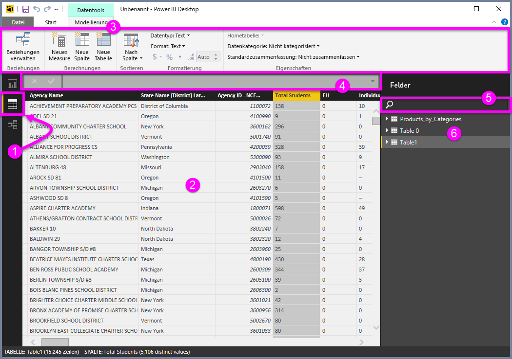
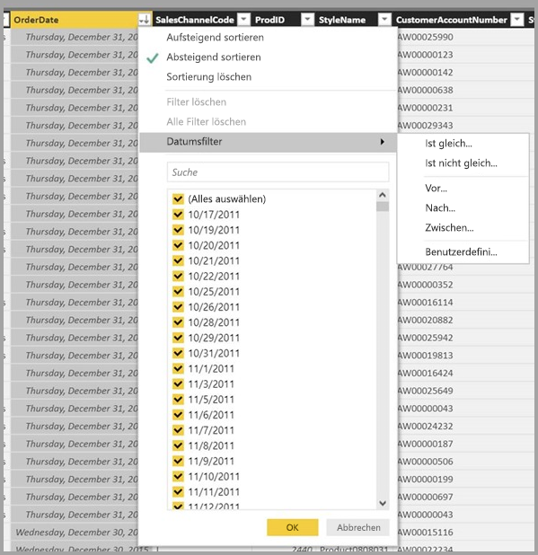

# Arbeiten mit der Datenansicht in Power BI Desktop

Die *Datenansicht* hilft Ihnen, Daten in einem *Power BI Desktop-Modell* zu überprüfen, zu untersuchen und zu verstehen. Sie unterscheidet sich von der Anzeige von Tabellen, Spalten und Daten im *Power Query-Editor*. In der Datenansicht sehen Sie die Daten, *nachdem* sie in das Modell geladen wurden.

Wenn Sie Ihre Daten modellieren, möchten Sie möglicherweise sehen, was tatsächlich in einer Tabelle oder Spalte vorhanden ist, ohne ein Visual im Berichtszeichenbereich zu erstellen. Möglicherweise möchten Sie auch bis auf Zeilenebene Einblick erhalten. Dies Funktion ist besonders nützlich, wenn Sie Measures und berechnete Spalten erstellen oder einen Datentyp/eine Datenkategorie identifizieren müssen.

Sehen Sie sich nun einige der Elemente in der Datenansicht näher an.

1. **Symbol für Datenansicht** Mit einem Klick auf dieses Symbol gelangen Sie zur Datenansicht.

2. **Datenraster** In diesem Bereich wird die ausgewählte Tabelle mit allen ihren Spalten und Zeilen angezeigt. Spalten, die aus der Ansicht *Bericht* ausgeblendet wurden, sind ausgegraut. Sie können mit der rechten Maustaste auf eine Spalte klicken, um Optionen anzuzeigen.

3. **Menüband für die Modellierung** Hier können Sie Beziehungen verwalten, Berechnungen erstellen und den Datentyp, das Format und die Datenkategorie einer Spalte ändern.

4. **Bearbeitungsleiste** Hier können Sie DAX-Formeln (Data Analysis Expression) für Measures und berechnete Spalten eingeben.

5. **Suchen** Hier können Sie nach einer Tabelle oder Spalte im Modell suchen.

6. **Liste „Felder“** Hier können Sie eine Tabelle oder Spalte auswählen, die im Datenraster angezeigt werden soll.

## Filtern in der Datensicht

Sie können Daten in der Datenansicht auch filtern und sortieren. In jeder Spalte wird ein Symbol angezeigt, das die Sortierreihenfolge angibt (bei aktivierter Sortierung).

Sie können einzelne Werte filtern oder erweiterte Filter auf Grundlage der Daten in der Spalte verwenden.

> [!NOTE]
> Wenn ein Power BI-Modell in einer anderen Kultur als der aktuellen Benutzeroberfläche erstellt wird, wird das Suchfeld in der Benutzeroberfläche der Datenansicht nur für Textfelder angezeigt. Dies gilt beispielsweise für ein Modell, das in der Sprache Englisch (USA) erstellt wurde und das Sie sich auf Spanisch anzeigen lassen.
