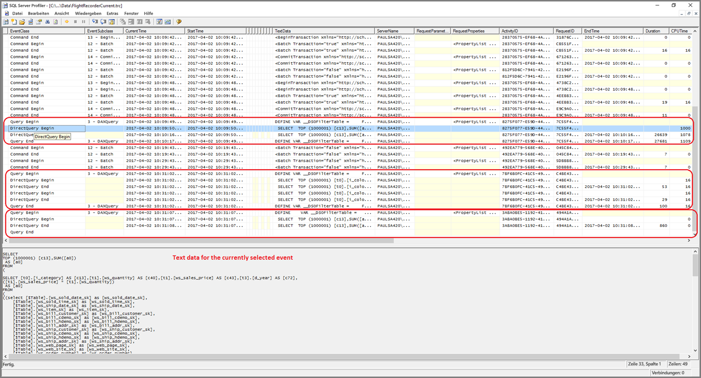
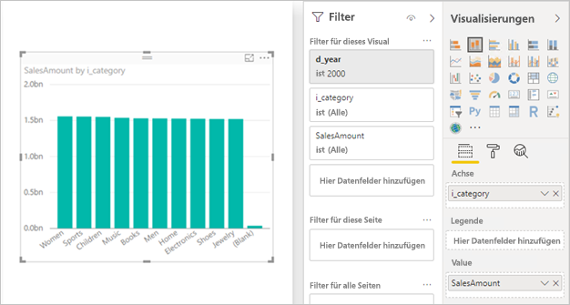

# <a name="directquery-model-troubleshooting-in-power-bi-desktop"></a>Problembehandlung für das DirectQuery-Model in Power BI Desktop

Dieser Artikel richtet sich an Datenmodellierer, die Power BI DirectQuery-Modelle entwickeln, die entweder mit Power BI Desktop oder dem Power BI-Dienst entwickelt wurden. Es wird beschrieben, wie Sie Leistungsprobleme diagnostizieren und weitere Informationen darüber erhalten können, wie Berichte optimiert werden.

## <a name="performance-analyzer"></a>Performance Analyzer

Es wird dringend empfohlen, die Diagnose von Leistungsproblemen in Power BI Desktop statt im Power BI-Dienst oder Power BI-Berichtsserver zu starten. Es ist häufig der Fall, dass Leistungsprobleme einfach auf dem Leistungsgrad der zugrunde liegenden Datenquelle basieren. Diese können in der isolierteren Umgebung von Power BI Desktop einfacher identifiziert und diagnostiziert werden, und bestimmte Komponenten können zunächst entfernt werden (wie das Power BI-Gateway). Nur wenn Leistungsprobleme nicht in Power BI Desktop vorhanden sind, sollte sich die Untersuchung auf die Eigenschaften des Berichts in Power BI fokussieren. Die [Leistungsanalyse](desktop-performance-analyzer.md) ist ein nützliches Tool zum Erkennen von Problemen in diesem Prozess.

Es wird auch empfohlen, zu versuchen, zunächst Probleme eines visuellen Elements zu isolieren, anstatt viele visuelle Element auf einer Seite.

Sofern Sie die oben in diesem Thema beschriebenen Schritte durchgeführt haben, verfügen Sie nun über ein einzelnes Visual auf einer Seite in Power BI Desktop, das noch immer träge ist. Sie können die Leistungsanalyse verwenden, um festzustellen, welche Abfragen von Power BI Desktop an die zugrunde liegende Quelle gesendet werden. Es ist auch möglich, Ablaufverfolgungen/Diagnoseinformationen anzuzeigen, sofern solche von der zugrunde liegenden Datenquelle ausgegeben wurden. Solche Ablaufverfolgungen können auch nützliche Informationen über die Details über die Ausführung der Abfrage und darüber enthalten, und wie diese verbessert werden kann.

Darüber hinaus ist es möglich, die Abfragen, die von Power BI zusammen mit den Ausführungszeiten gesendet wurden, anzuzeigen, auch wenn keine Ablaufverfolgungen vorhanden sind, so wie unten beschrieben.

## <a name="review-trace-files"></a>Überprüfen der Ablaufverfolgungsdateien

Standardmäßig protokolliert Power BI Desktop während einer gegebenen Sitzung Ereignisse in einer Ablaufverfolgungsdatei mit dem Namen **FlightRecorderCurrent.trc**.

Für einige DirectQuery-Quellen enthält dieses Protokoll alle Abfragen, die an die zugrunde liegende Datenquelle gesendet wurden (die verbleibenden DirectQuery-Quellen werden bald unterstützt). Die Quellen, die Abfragen an das Protokoll schreiben, lauten wie folgt:

- SQL Server
- Azure SQL-Datenbank
- Azure SQL Data Warehouse
- Oracle
- Teradata
- SAP HANA

Sie finden die Ablaufverfolgungsdatei im **AppData**-Ordner für den aktuellen Benutzer: _\\\<User>\AppData\Local\Microsoft\Power BI Desktop\AnalysisServicesWorkspaces_

Hier ist eine einfache Möglichkeit, zu diesem Ordner zu gelangen: Wählen Sie in Power BI Desktop die Optionen _Datei > Optionen und Einstellungen > Optionen_ aus, und wählen Sie dann die Seite **Diagnose** aus. Das folgende Dialogfeld wird angezeigt:


Wenn Sie den Link **Ordner mit Absturzabbild/Überwachungen öffnen** unter „Absturzabbilderfassung“ auswählen, wird der folgende Ordner geöffnet: _\\\<User>\AppData\Local\Microsoft\Power BI Desktop\Traces_

Beim Navigieren zum übergeordneten Ordner des Ordners wird der Ordner angezeigt, der _AnalysisServicesWorkspaces_ enthält, die einen Arbeitsbereich-Unterordner für jede offene Instanz von Power BI Desktop enthält. Diese Unterordner werden mit einem Integersuffix bezeichnet, z.B. _AnalysisServicesWorkspace2058279583_.

In diesem Ordner befindet sich ein _\Data_-Unterordner, die die Ablaufverfolgungsdatei „FlightRecorderCurrent.trc“ für die aktuelle Power BI-Sitzung enthält. Der entsprechende Arbeitsbereichsordner wird gelöscht, wenn die zugehörige Power BI Desktop-Sitzung endet.

Die Ablaufverfolgungsdateien können mithilfe des SQL Server Profiler-Tools geöffnet werden, das als kostenloser Download im Rahmen des SQL Server Management Studio verfügbar ist. Sie erhalten SSMS [hier](/sql/ssms/download-sql-server-management-studio-ssms?view=sql-server-2017).

Nachdem Sie SQL Server Management Studio heruntergeladen und installiert haben, führen Sie den SQL Server Profiler aus.



Um die Ablaufverfolgungsdatei zu öffnen, gehen Sie folgendermaßen vor:

1. Wählen Sie in SQL Server Profiler _Datei > Öffnen > Ablaufverfolgungsdatei_ aus.
2. Geben Sie den Pfad zur Ablaufverfolgungsdatei für die aktuell geöffnete Power BI-Sitzung ein, z.B.: _\\\<User>\AppData\Local\Microsoft\Power BI Desktop\AnalysisServicesWorkspaces\AnalysisServicesWorkspace2058279583\Data_
3. Öffnen von _FlightRecorderCurrent.trc_

Es werden alle Ereignisse aus der aktuellen Sitzung angezeigt. Ein kommentiertes Beispiel ist unten dargestellt, das Gruppen von Ereignissen markiert. Jede Gruppe verfügt über Folgendes:

- Ein Ereignis für den _Abfragebeginn_ und das _Ende der Abfrage_, das den Beginn und das Ende einer DAX-Abfrage darstellt, die von der Benutzeroberfläche (z.B. von einem visuellen Element oder durch Auffüllen einer Liste von Werten in der Filterbenutzeroberfläche) generiert wird.
- Ein oder mehrere Paare von Ereignissen für _DirectQuery – Anfang_ und _DirectQuery – Ende_ stellen eine an die zugrunde liegende Datenquelle gesendete Abfrage als Teil der Auswertung der DAX-Abfrage dar.

Beachten Sie, dass mehrere DAX-Abfragen parallel ausgeführt werden können, damit sich Ereignisse aus verschiedenen Gruppen überlappen können. Der Wert der Aktivitäts-ID kann verwendet werden, um zu bestimmen, welche Ereignisse zur selben Gruppe gehören.


Andere interessante Spalten sind die folgenden:

- **TextData:** Die Textdetails des Ereignisses. Für _Abfragebeginn/Ende der Abfrage-Ereignisse_ ist dies die DAX-Abfrage. Für _DirectQuery – Anfang/Ende-Ereignisse_ ist dies die SQL-Abfrage, die an die zugrunde liegende Quelle gesendet wird. Der Wert _TextData_ für das aktuell ausgewählte Ereignis wird auch im unteren Bereich angezeigt.
- **EndTime:** Der Zeitpunkt, zu dem das Ereignis abgeschlossen wurde.
- **Duration:** Die Dauer in Millisekunden, die zur Ausführung der DAX- oder SQL-Abfrage benötigt wird.
- **Error:** Gibt an, ob ein Fehler aufgetreten ist. In diesem Fall wird das Ergebnis auch rot angezeigt.

In der Abbildung oben wurden einige weniger relevante Spalten verschmälert, damit die relevanten Spalten einfacher gelesen werden können.

Die empfohlene Vorgehensweise zum Aufzeichnen von Ablaufverfolgungsdaten, um ein mögliches Leistungsproblem zu diagnostizieren, lautet wie folgt:

- Öffnen Sie eine einzelne Power BI Desktop-Sitzung (zur Vermeidung von Verwechslungen von mehreren Arbeitsbereichsordnern).
- Führen Sie die interessanten Aktionen in Power BI Desktop aus. Schließen Sie einige zusätzliche Aktionen mit ein, um sicherzustellen, dass die interessanten Ereignisse in die Ablaufverfolgungsdatei geleert werden.
- Öffnen Sie den SQL Server Profiler, und untersuchen Sie die Ablaufverfolgung, so wie vorher beschrieben. Denken Sie daran, dass die Ablaufverfolgungsdatei nach dem Schließen von Power BI Desktop gelöscht wird. Darüber hinaus werden zusätzliche Aktionen in Power BI Desktop nicht sofort angezeigt. Die Ablaufverfolgungsdatei muss geschlossen und noch mal geöffnet werden, um die neuen Ereignisse anzuzeigen.
- Halten Sie einzelne Sitzungen relativ klein (Aktionen von zehn Sekunden, nicht von hunderten), damit die Ablaufverfolgungsdatei leichter interpretiert werden kann (und weil es eine Einschränkung der Größe der Ablaufverfolgungsdatei gibt und deshalb bei langen Sitzungen die Gefahr besteht, dass frühe Ereignisse gelöscht werden).

## <a name="understand-queries-sent-to-the-source"></a>Verstehen der Abfragen, die an die Quelle gesendet werden

Das allgemeine Format der von Power BI Desktop generierten und gesendeten Abfragen verwendet Unterabfragen für jede der Modelltabellen, auf die verwiesen wird, wobei die Unterabfrage durch die Power Query-Abfrage definiert ist. Nehmen wir z. B. an, dass die folgenden TPC-DS-Tabellen in einer relationalen Datenbank in SQL Server vorhanden sind:


Beachten Sie das folgende Visual und seine Konfiguration. Beachten Sie dabei, dass der Wert **SalesAmount** mit dem folgenden Ausdruck definiert ist:

```dax

SalesAmount = SUMX(Web_Sales, [ws_sales_price] * [ws_quantity])

```



Wenn Sie dieses Visual aktualisieren, ergibt dies eine T-SQL-Abfrage, die Sie im nächsten Abschnitt sehen können. Wie Sie sehen können, gibt es drei Unterabfragen für die Modelltabellen **Web_Sales**, **Item** und **Date_dim**. Jede dieser Tabellen gibt alle Spalten der Modelltabelle zurück, obwohl durch das Visual eigentlich nur auf vier Spalten verwiesen wird. Diese Unterabfragen (sie sind schattiert) sind genau die Definition der Power Query-Abfragen. Die Verwendung von Unterabfragen beeinträchtigt nicht die Leistung für Datenquellen, die bisher für DirectQuery unterstützt wurden. Datenquellen wie SQL Server nehmen durch Entfernen der Verweise auf ungenutzte Spalten eine Optimierung vor.

Ein Grund, warum Power BI dieses Muster verwendet, ist, dass Sie eine Power Query-Abfrage definieren können, um eine bestimmte Abfrageanweisung zu verwenden. Es wird also „wie vorgesehen“ verwendet, ohne dass versucht wird, es neu zu schreiben. Beachten Sie, dass dieses Muster die Verwendung von Abfrageanweisungen einschränkt, die allgemeine Tabellenausdrücke (Common Table Expressions, CTEs) und gespeicherte Prozeduren verwenden. Diese Anweisung kann nicht in Unterabfragen verwendet werden.


## <a name="gateway-performance"></a>Gatewayleistung

Weitere Informationen zur Problembehandlung der Gatewayleistung finden Sie im Artikel [Problembehandlung bei Gateways – Power BI](service-gateway-onprem-tshoot.md).

## <a name="next-steps"></a>Nächste Schritte

Weitere Informationen zu DirectQuery finden Sie in den folgenden Ressourcen:

- [Verwenden von DirectQuery in Power BI Desktop](desktop-use-directquery.md)
- [DirectQuery-Modelle in Power BI Desktop](desktop-directquery-about.md)
- [Leitfaden für das DirectQuery-Modell in Power BI Desktop](guidance/directquery-model-guidance.md)
- Haben Sie Fragen? [Stellen Sie Ihre Frage in der Power BI-Community.](https://community.powerbi.com/)
