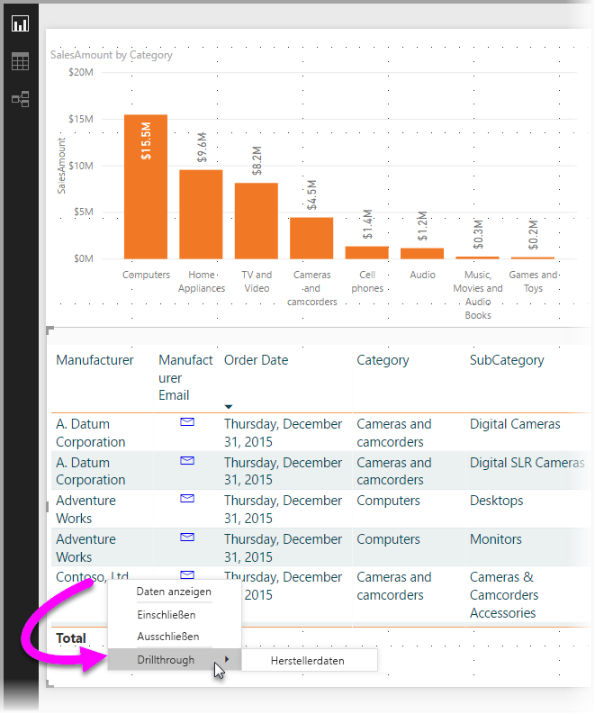
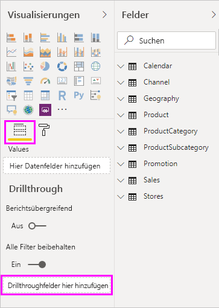
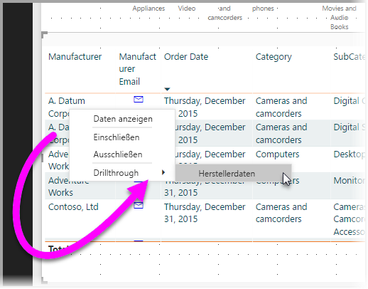
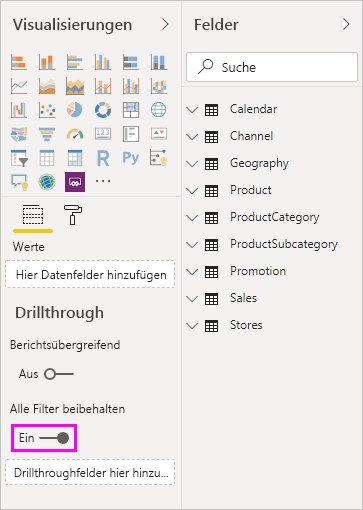
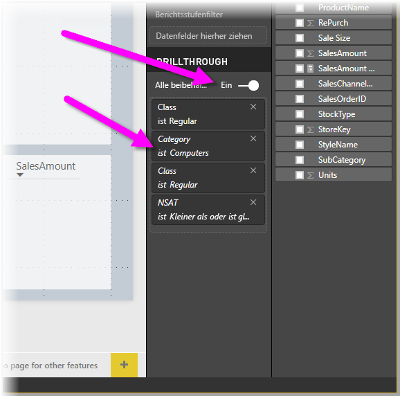
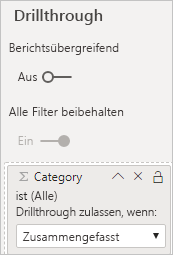

# Verwenden der Drillthroughfunktion in Power BI Desktop
Mit einem *Drillthrough* können Sie in Power BI Desktop in Ihrem Bericht eine Seite erstellen, die sich auf eine bestimmte Entität konzentriert, z. B. auf einen Lieferanten, einen Kunden oder einen Hersteller. Um einen Drillthrough zu verwenden, klicken Sie mit der rechten Maustaste auf einen Datenpunkt in anderen Berichtsseiten und führen einen Drillthrough zu der fokussierten Seite aus, um Details abzurufen, die entsprechend diesem Kontext gefiltert sind.

## Verwenden der Drillthroughfunktion
1. Um die Drillthroughfunktion zu verwenden, erstellen Sie eine Berichtsseite mit den Visuals, die Sie für den Entitätstyp benötigen, für den Sie den Drillthrough bereitstellen möchten. 

    Angenommen, Sie möchten die Drillthroughfunktion für Hersteller anwenden. In diesem Fall können Sie eine Drillthroughseite mit Visuals erstellen, die den Gesamtumsatz, die Summe der versandten Einheiten, den Umsatz nach Kategorie, den Umsatz nach Region usw. anzeigen. Das heißt, wenn Sie einen Drillthrough für diese Seite ausführen, gelten die Visuals spezifisch für den ausgewählten Hersteller.

2. Ziehen Sie dann auf der Drillthroughseite im Bereich **Visualisierungen** im Abschnitt **Felder** das Feld, für das Sie die Drillthroughfunktion aktivieren möchten, in den Bereich **Drillthroughfilter**.

    

    Wenn Sie dem Bereich **Drillthroughfilter** ein Feld hinzufügen, wird in Power BI Desktop automatisch ein *Zurück*-Schaltflächenvisual erstellt. Das Visual wird zur Schaltfläche in veröffentlichten Berichten. Benutzer, die Ihren Bericht im Power BI-Dienst nutzen, kehren mithilfe dieser Schaltfläche zu der Ausgangsberichtsseite zurück.

    

## Verwenden eines eigenen Bildes für die Schaltfläche „Zurück“    
 Da die Schaltfläche „Zurück“ ein Bild ist, können Sie das Bild dieses Visuals durch ein beliebiges Bild ersetzen. Das Visual wird weiterhin als Schaltfläche „Zurück“ fungieren, sodass die Berichtsleser zur vorherigen Seite zurückkehren können. 

Führen Sie die folgenden Schritte aus, um ein eigenes Bild für die Schaltfläche „Zurück“ zu verwenden:

1. Wählen Sie auf der Registerkarte **Start** die Option **Bild** aus. Suchen Sie dann Ihr Bild, und platzieren Sie es auf der Drillthroughseite.

2. Wählen Sie Ihr neues Bild auf der Drillthroughseite aus. Legen Sie im Bereich **Bild formatieren** den Schieberegler **Aktion** auf **Ein** und dann **Typ** auf **Zurück** fest. Jetzt funktioniert das Bild als Schaltfläche „Zurück“.

    

    
     Jetzt können Benutzer mit der rechten Maustaste auf einen Datenpunkt in Ihrem Bericht klicken, um ein Kontextmenü aufzurufen, das die Drillthroughfunktion für diese Seite unterstützt. 

    

    Wenn Berichtsleser einen Drillthrough ausführen, wird die Seite gefiltert, um Informationen zum Datenpunkt anzuzeigen, auf den mit der rechten Maustaste geklickt wurde. Angenommen, sie klicken mit der rechten Maustaste auf einen Datenpunkt für den Hersteller Contoso und wählen die Drillthroughfunktion aus. Die Drillthroughseite, auf die sie wechseln, wird nach Contoso gefiltert.

## Übergeben aller Filter an Drillthrough

Ab der Version vom Mai 2018 von Power BI Desktop können Sie alle angewendeten Filter an das Drillthroughfenster übergeben. Angenommen, Sie können nur eine bestimmte Produktkategorie und die dafür gefilterten Visuals auswählen und führen dann einen Drillthrough aus. Es interessiert Sie vielleicht, wie dieser Drillthrough mit all diesen angewendeten Filtern aussieht.

Um alle angewendeten Filter beizubehalten, legen Sie im Bereich **Visualisierungen** im Abschnitt **Drillthrough** die Option **Alle Filter beibehalten** auf **Ein** fest. 

In Power BI Desktop-Versionen, die vor Mai 2018 veröffentlicht wurden, entspricht das Verhalten dem Festlegen dieses Umschalters auf **Aus**.

Beim anschließenden Drillthrough für ein Visual können Sie sehen, welche Filter angewendet wurden, weil auf das Quellvisual temporäre Filter angewendet wurden. Im Abschnitt **Drillthrough** des Bereichs **Visualisierung** werden diese vorübergehenden Filter kursiv dargestellt. 

Obwohl Sie dafür auch die QuickInfoseiten verwenden können, wäre diese verwirrend, da es dann den Anschein hätte, dass die QuickInfo nicht ordnungsgemäß funktioniert. Deswegen wird nicht empfohlen, mit QuickInfos zu arbeiten.

## Hinzufügen eines Measures zu einem Drillthrough

Sie können alle Filter an das Drillthroughfenster übergeben und zusätzlich ein Measure oder eine zusammengefasste numerische Spalte dem Drillthroughbereich hinzufügen. Ziehen Sie das Drillthroughfeld auf die Karte **Drillthrough**, um es anzuwenden. 

Wenn Sie ein Measure oder eine zusammengefasste numerische Spalte hinzufügen, können Sie einen Drillthrough für die Seite ausführen, wenn das Feld im Bereich *Wert* eines Visuals verwendet wird.

Das ist bereits alles, was Sie über das Verwenden der Drillthroughfunktion in Berichten wissen müssen. Sie bietet eine hervorragende Möglichkeit, eine erweiterte Ansicht der Entitätsinformationen zu erhalten, die Sie für den Drillthroughfilter auswählen.

## Nächste Schritte

Folgende Artikel könnten Sie ebenfalls interessieren:

* [Use cross-report drillthrough in Power BI Desktop](desktop-cross-report-drill-through.md) (Verwenden der berichtsübergreifenden Drillthroughfunktion in Power BI Desktop)
* [Verwenden von Slicern in Power BI Desktop](visuals/power-bi-visualization-slicers.md)

