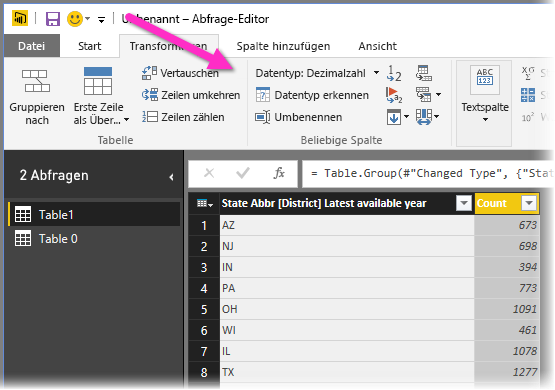

# Erste Schritte mit Power BI Desktop
Willkommen beim Leitfaden „Erste Schritte mit Power BI Desktop“. Im Folgenden wird veranschaulicht, wie Power BI Desktop funktioniert, wofür dieser Dienst verwendet werden kann und wie Sie stabile Datenmodelle und aussagekräftige Berichte erstellen, um Ihre Business Intelligence auszubauen.

Wenn Sie sich nur einen groben Überblick für die Funktions- und Verwendungsweise von Power BI Desktop machen möchten, reicht es, wenn Sie sich die einzelnen Abbildungen in diesem Artikel ansehen. Dafür benötigen Sie nur wenige Minuten. Ein tiefgreifendes Verständnis gewinnen Sie, wenn Sie jeden Abschnitt sorgfältig lesen, die einzelnen Schritte durchführen und Ihre eigene Power BI Desktop-Datei erstellen, die Sie anschließend im [Power BI-Dienst](https://app.powerbi.com/) veröffentlichen und für andere freigeben können.

Sie können sich auch das Video [Erste Schritte mit Power BI Desktop](https://www.youtube.com/watch?v=Qgam9M8I0xA) ansehen und die Excel-Arbeitsmappe mit [Finanzbeispielen](https://go.microsoft.com/fwlink/?LinkID=521962) herunterladen, um dem Video besser folgen zu können.

## So funktioniert Power BI Desktop
Power BI Desktop gibt Ihnen folgende Möglichkeiten:
1. Herstellen einer Verbindung mit Daten, einschließlich mehrerer Datenquellen
1. Strukturieren der Daten mithilfe von Abfragen, um aussagekräftige, überzeugende Datenmodelle zu schaffen
1. Verwenden von Datenmodellen zum Erstellen von Visualisierungen und Berichten 
1. Freigeben von Berichtsdateien, die andere nutzen, erweitern und ebenfalls freigeben können Sie können Power BI Desktop-Dateien ( *.pbix*) wie alle anderen Dateien freigeben, aber am besten laden Sie sie im [Power BI-Dienst](https://preview.powerbi.com/) hoch. 

In Power BI Desktop sind bewährte Microsoft-Technologien für Abfrage-Engines, die Datenmodellierung sowie die Visualisierung integriert. Nicht nur Datenanalysten können mit diesem Dienst Sammlungen von Abfragen, Datenverbindungen, Modellen und Berichten erstellen und diese problemlos für andere freigeben. Durch die Kombination aus Power BI Desktop und dem Power BI-Dienst können neue Erkenntnisse aus der Welt der Daten einfacher modelliert, gewonnen, geteilt und erweitert werden.

Power BI Desktop erfasst und optimiert an zentraler Stelle, was sonst meist weit verstreut und verbindungslos ist und vereinfacht damit den mühseligen Prozess beim Entwerfen und Erstellen von Business Intelligence-Repositorys und -Berichten.
Sind Sie bereit, Power BI Desktop auszuprobieren? Lassen Sie uns loslegen!

> [!NOTE]
> Für Daten und Berichte, die lokal gespeichert werden müssen, steht eine separate, spezielle Version von Power BI zur Verfügung: der [Power BI-Berichtsserver](report-server/get-started.md). Der Power BI-Berichtsserver verwendet eine separate und spezialisierte Version von Power BI Desktop: Power BI Desktop für Power BI-Berichtsserver. Diese kann nur mit der Berichtsserver-Version von Power BI verwendet werden. In diesem Artikel wird die Standardversion von Power BI Desktop beschrieben.

## Installieren und Ausführen von Power BI Desktop
Navigieren Sie zur entsprechenden [Downloadseite](https://powerbi.microsoft.com/desktop), um Power BI Desktop herunterzuladen, und klicken Sie auf **Download Free** (Kostenlos herunterladen). Alternativ finden Sie unter [Download- oder Sprachoptionen anzeigen](https://www.microsoft.com/download/details.aspx?id=58494) weitere Downloadoptionen. 

Außerdem können Sie Power BI Desktop über den Power BI-Dienst herunterladen. Klicken Sie erst in der oberen Menüleiste auf das Symbol zum **Herunterladen** und anschließend auf **Power BI Desktop**.

Klicken Sie auf der Seite „Microsoft Store“ auf **Get** (Herunterladen), und bearbeiten Sie nacheinander alle Eingabeaufforderungen, um Power BI Desktop auf Ihrem Computer zu installieren. Starten Sie Power BI Desktop über das Windows-**Startmenü** oder über das entsprechende Symbol auf der Windows-Taskleiste.

Wenn Power BI Desktop zum ersten Mal gestartet wird, wird der **Willkommensbildschirm** angezeigt.

Über den **Willkommensbildschirm** können Sie **Daten abrufen**, **zuletzt verwendete Quellen** abrufen, zuletzt verwendete Berichte öffnen, **andere Berichte öffnen** oder andere Links auswählen. Außerdem können Sie auswählen, ob der **Willkommensbildschirm** immer beim Start angezeigt werden soll. Klicken Sie auf das entsprechende Symbol, um den **Willkommensbildschirm** zu schließen.

Auf der linken Seite von Power BI Desktop finden Sie Symbole zu den drei Power BI Desktop-Ansichten: **Bericht**, **Daten**und **Beziehungen**, von oben nach unten. Die aktuelle Ansicht ist an der gelben Leiste auf der linken Seite zu erkennen. Sie können die Ansichten ändern, indem auf eins der Symbole klicken. 

Die Standardansicht ist die Ansicht **Bericht**. 

Power BI Desktop umfasst außerdem den **Power Query-Editor** , der in einem separaten Fenster geöffnet wird. Im **Power Query-Editor** können Sie Abfragen erstellen und Daten transformieren sowie anschließend das verfeinerte Datenmodell in Power BI Desktop laden, um Berichte zu erstellen.

## Verbinden mit Daten
Sobald Sie Power BI Desktop installiert haben, erhalten Sie Zugriff zur ständig wachsenden Welt der Daten. Sie können die verschiedenen verfügbaren Arten von Datenquellen anzeigen lassen, indem Sie auf der Registerkarte **Home** von Power BI Desktop auf **Daten abrufen** > **Mehr** klicken und im Fenster **Daten abrufen** die Liste **aller** Datenquellen durchscrollen. In diesem kurzen Überblick erhalten Sie Informationen dazu, wie Sie eine Reihe unterschiedlicher **Webdatenquellen** miteinander verbinden.

Angenommen, Sie sind Datenanalyst und arbeiten für einen Sonnenbrillenhändler. Sie möchten Ihrem Kunden dabei helfen, den Verkauf von Sonnenbrillen auf Orte auszurichten, in denen besonders häufig die Sonne scheint. In dem Artikel [Best and worst states for retirement](https://www.bankrate.com/retirement/best-and-worst-states-for-retirement/) (Die besten und schlechtesten Bundesstaaten für den Ruhestand) der Website Bankrate.com finden Sie interessante Daten zu diesem Thema.

Klicken Sie auf der Registerkarte **Home** in Power BI Desktop auf **Daten abrufen** > **Web**, um eine Verbindung mit einer Webdatenquelle herzustellen. 

Fügen Sie in das Dialogfeld **Aus dem Web** die Adresse *https:\//www.bankrate.com/retirement/best-and-worst-states-for-retirement/* in das **URL**-Feld ein, und klicken Sie anschließend auf **OK**. 

Wenn Sie dazu aufgefordert werden, klicken Sie erst auf dem Bildschirm **Auf Webinhalt zugreifen** und anschließend auf **Verbinden**, um anonymen Zugriff zu verwenden. 

Dann startet die Abfragefunktion von Power BI Desktop und die Webressource wird kontaktiert. Im Fenster **Navigator** werden die Informationen angezeigt, die der Webseite entnommen wurden. In diesem Fall werden eine Tabelle mit dem Namen **Ranking of best and worst states for retirement** (Rangfolge der besten und schlechtesten Bundesstaaten für den Ruhestand) sowie ein Dokument zurückgegeben. Da Sie an der Tabelle interessiert sind, klicken Sie auf diese, um eine Vorschau anzuzeigen.

An dieser Stelle können Sie auf **Laden** klicken, um die Tabelle zu laden, oder die Option **Daten transformieren** auswählen, um vor dem Laden Änderungen an der Tabelle vorzunehmen.

Wenn Sie auf **Daten transformieren** klicken, startet der Power Query-Editor, und es wird eine repräsentative Ansicht der Tabelle angezeigt. Der Bereich **Abfrageeinstellungen** befindet sich auf der rechten Seite. Diesen können Sie jederzeit abrufen, indem Sie auf der Registerkarte **Ansicht** des Power Query-Editors auf **Abfrageeinstellungen** klicken. 

Weitere Informationen zum Herstellen einer Verbindung mit Daten finden Sie unter [Verbinden mit Daten in Power BI Desktop](desktop-connect-to-data.md).

## Strukturieren von Daten
Nachdem Sie die Verbindung zu einer Datenquelle hergestellt haben, können Sie die Daten Ihren Anforderungen entsprechend anpassen. Wenn die Daten *strukturiert* werden sollen, können Sie dem Power Query-Editor ausführliche Anweisungen zum Anpassen von Daten beim Laden und Darstellen geben. Das Strukturieren von Daten hat keine Auswirkungen auf die ursprüngliche Datenquelle, sondern nur auf die jeweilige Datenansicht. 

> [!NOTE]
> Die in diesem Leitfaden verwendeten Tabellendaten können sich im Laufe der Zeit ändern. Somit können auch die durchzuführenden Schritte abweichen, weshalb Ihre Kreativität im Hinblick auf die Anpassung der einzelnen Schritte und Ergebnisse gefragt ist. 

Unter Umständen werden Daten beim Strukturieren *transformiert*, z. B. werden Spalten oder Tabellen umbenannt, Zeilen oder Spalten entfernt oder Datentypen geändert. Der Power Query-Editor erfasst diese Schritte sequenziell im Bereich **Abfrageeinstellungen** unter **Angewendete Schritte**. Bei jeder Verbindung dieser Abfrage mit der Datenquelle werden diese Schritte ausgeführt, damit die Daten stets Ihren Angaben entsprechend strukturiert werden. Dieser Vorgang wird jedes Mal ausgeführt, wenn Sie die Abfrage in Power BI Desktop verwenden oder wenn jemand auf die freigegebene Abfrage zugreift, z. B. im Power BI-Dienst. 

Beachten Sie, dass unter **Angewendete Schritte** in den **Abfrageeinstellungen** bereits einige Schritte angegeben sind. Sie können auf die einzelnen Schritte klicken, um deren jeweilige Auswirkungen im Power Query-Editor anzuzeigen. Sie haben zuerst eine Webquelle angegeben und dann eine Vorschau der Tabelle im Fenster **Navigator** anzeigen lassen. Im dritten Schritt (**Geänderter Typ**) hat Power BI ganze Zahlen beim Import erkannt und den ursprünglichen *Datentyp* aus dem **Webtext** in **Whole numbers** (Ganze Zahlen) geändert. 

Wenn Sie einen Datentyp ändern müssen, wählen Sie die zu ändernde(n) Spalte(n) aus. Halten Sie die **UMSCHALTTASTE** gedrückt, um mehrere nebeneinander liegende Spalten auszuwählen, oder drücken Sie **STRG**, um Spalten auszuwählen, die nicht nebeneinander liegen. Klicken Sie entweder erst mit der rechten Maustaste auf eine Spaltenüberschrift und anschließend mit der linken auf **Typ ändern**, oder klappen Sie auf der Registerkarte **Home** in der Gruppe **Transformieren** das Dropdownmenü neben **Datentyp** auf, und wählen Sie einen neuen Datentyp aus.

> [!NOTE]
> Der Power Query-Editor in Power BI Desktop verwendet das Menüband oder die Kontextmenüs für verfügbare Tasks. Die meisten Tasks, die auf den Registerkarten **Home** oder **Transformieren** im Menüband zur Auswahl stehen, können auch über einen Rechtsklick auf ein Element und Auswählen aus dem Kontextmenü aufgerufen werden.

Jetzt können Sie Ihre eigenen Änderungen und Transformationen auf die Daten anwenden und unter **Angewendete Schritte** abrufen. 

Wenn Sie beispielsweise für den Verkauf von Sonnenbrillen besonders an einer Rangfolge entsprechend dem Wetter interessiert sind, können Sie die Tabelle anhand der Spalte **Weather** (Wetter) sortieren anstatt nach der **Gesamtbewertung**. Klappen Sie das Dropdownmenü neben der Spaltenüberschrift **Weather** (Wetter) auf, und klicken Sie auf **Aufsteigend sortieren**. Die Daten werden jetzt anhand der Wetterwerte sortiert, und unter **Angewendete Schritte** wird der Schritt **Sortierte Zeilen** angezeigt. 

Da es für Sie uninteressant ist, Sonnenbrillen in den Bundesstaaten mit dem schlechtesten Wetter zu verkaufen, möchten Sie diese Bundesstaaten aus der Tabelle entfernen. Klicken Sie dafür auf der Registerkarte **Home** in der Gruppe **Zeilen verringern** auf **Zeilen entfernen** > **Untere Zeilen entfernen**. Geben Sie dann in das Dialogfeld **Untere Zeilen entfernen** *10* ein, und klicken Sie auf **OK**. 

Die zehn Zeilen mit den schlechtesten Wetterwerten werden daraufhin aus der Tabelle entfernt, und unter **Angewendete Schritte** wird der Schritt **Entfernte untere Zeilen** angezeigt.

Außerdem enthält die Tabelle für Ihren Geschmack zu viele Informationen, und Sie möchten die folgenden Spalten entfernen: **Affordability** (Erschwinglichkeit), **Crime** (Kriminalität), **Culture** (Kultur) und **Wellness**. Wählen Sie dafür die Überschriften der Spalten aus, die Sie entfernen möchten. Halten Sie die **UMSCHALTTASTE** gedrückt, um mehrere nebeneinander liegende Spalten auszuwählen, oder drücken Sie **STRG**, um Spalten auszuwählen, die nicht nebeneinander liegen. 

Klicken Sie dann auf der Registerkarte **Home** in der Gruppe **Spalten verwalten** auf **Spalten entfernen**. Alternativ können Sie auch mit der rechten Maustaste auf eine der Spaltenüberschriften klicken und anschließend im Menü auf die Option **Spalten entfernen** klicken. Dann werden die ausgewählten Spalten entfernt, und unter **Angewendete Schritte** wird der Schritt **Entfernte Spalten** angezeigt.

Möglicherweise fällt Ihnen dann auf, dass die Spalte **Affordability** (Erschwinglichkeit) für den Verkauf von Sonnenbrillen doch relevant sein könnte. Deshalb möchten Sie diese Spalte wieder hinzufügen. Im Bereich **Angewendete Schritte** können Sie ganz einfach Ihren letzten Schritt rückgängig machen, indem Sie auf das neben dem Schritt angezeigte **X** klicken. Wiederholen Sie nun den Schritt, und wählen Sie dabei nur die Spalten aus, die Sie wirklich löschen möchten. Wenn Sie mehr Flexibilität wünschen, können Sie jede Spalte einzeln in separaten Schritten löschen. 

Sie können auf jeden Schritt im Bereich **Angewendete Schritte** klicken und diesen löschen, umbenennen, in der Sequenz nach oben oder unten verschieben, oder anschließende Schritte hinzufügen oder löschen. Wenn es sich um einen Zwischenschritt handelt, zeigt Power BI Desktop eine Warnung an, wenn die Änderung Auswirkungen auf spätere Schritte haben und Ihre Abfrage unterbrechen kann.  

Wenn Sie die Tabelle beispielsweise nicht mehr anhand der Spalte **Weather** (Wetter) sortieren möchten, können Sie den Schritt **Sortierte Zeilen** auswählen. Dann zeigt Power BI Desktop eine Warnung an, um Sie darüber zu informieren, dass Ihre Abfrage unterbrochen werden könnte, wenn Sie diesen Schritt löschen. Sie haben die untersten zehn Zeilen entfernt, nachdem Sie die Tabelle anhand der Wetterwerte sortiert haben. Daher werden andere Zeilen entfernt, wenn Sie diese Sortierung aufheben. Außerdem wird eine Warnung angezeigt, wenn Sie den Schritt **Sortierte Zeilen** auswählen und versuchen, an diesem Punkt einen neuen Zwischenschritt einzufügen.  

Zum Schluss ändern Sie den Titel der Tabelle, sodass er sich auf den Verkauf von Sonnenbrillen anstelle des Ruhestands bezieht. Ersetzen Sie unter **Eigenschaften** im Bereich **Abfrageeinstellungen** den alten Titel durch *Best states for sunglass sales* (Beste Bundesstaaten für den Verkauf von Sonnenbrillen).

Dann sieht die fertige Abfrage zu Ihren strukturierten Daten wie folgt aus:

Weitere Informationen zum Strukturieren von Daten finden Sie unter [Strukturieren und Kombinieren von Daten in Power BI Desktop](desktop-shape-and-combine-data.md).

## Kombinieren von Daten
Die Daten zu verschiedenen Bundesstaaten sind interessant und nützlich für die Erstellung weiterer Analysen und Abfragen. Es gibt allerdings ein Problem: Bei den meisten Daten werden zweistellige Kürzel als Codes für die Bundesstaaten und nicht die vollen Namen verwendet. Sie müssen die Namen der Bundesstaaten in irgendeiner Weise mit den Kürzeln verknüpfen, um diese Daten verwenden zu können.

Aber keine Sorge: Dafür können Sie eine andere öffentliche Datenquelle verwenden. Allerdings müssen Sie die Daten erst umfassend strukturieren, bevor Sie sie mit Ihrer Tabelle zu den Sonnenbrillen *kombinieren* können.

Sie können die Daten zu den Staatenkürzeln in den Power Query-Editor importieren, indem Sie im Menüband auf der Registerkarte **Home** in der Gruppe **Neue Abfrage** auf **Neue Quelle** > **Web** klicken. 

Geben Sie im Dialogfeld **Aus dem Web** die URL für die Website mit den Staatenkürzeln ein: *https:\//en.wikipedia.org/wiki/List_of_U.S._state_abbreviations*.

Wählen Sie im Fenster **Navigator** die Tabelle **Codes and abbreviations for U.S. states, federal district, territories, and other regions** (Codes und Abkürzungen für US-Bundesstaaten, Bundesdistrikte, Gebiete und andere Regionen) aus, und klicken Sie dann auf **OK**. Dann wird die Tabelle im Power Query-Editor geöffnet.

Entfernen Sie alle Spalten bis auf **Name and status of region** (Name und Status der Region), **Name and status of region2** (Name und Status der Region2) und **ANSI**. Halten Sie dafür **STRG** gedrückt, und klicken Sie auf diese Spalten. Klicken Sie dann entweder erst mit der rechten Maustaste auf eine der Spaltenüberschriften und anschließend mit der linken auf **Andere Spalten entfernen**, oder klicken Sie auf der Registerkarte **Home** in der Gruppe **Spalten verwalten** auf **Andere Spalten entfernen**. 

Klicken Sie auf den Pfeil neben der Spaltenüberschrift **Name and status of region2** (Name und Status der Region2), und klicken Sie anschließend auf **Filter** > **Equals** (Ist gleich). Klappen Sie im Dialogfeld **Zeilen filtern** das Dropdownmenü zum Feld **Wert eingeben oder auswählen** neben **equals** (ist gleich) auf, und klicken Sie auf **State** (Bundesstaat). 

Wählen Sie erst neben dem Feld **equals** (ist gleich) **Oder** und anschließend **State ("Commonwealth")** (Bundesstaat („Commonwealth“)) aus. Wählen Sie **OK** aus. 

Wenn Sie zusätzliche Werte wie **Federal district** (Bundesdistrikt) und **island** (Insel) entfernt haben, verfügen Sie anschließend über eine Liste der 50 US-Bundesstaaten mit ihren offiziellen zweistelligen Kürzeln. Sie können die Spalten umbenennen, damit sie eindeutiger sind, z. B. in **State name** (Name des Bundesstaats), **Status** und **Abbreviation** (Abkürzung), indem Sie erst mit der rechten Maustaste auf die Spaltenüberschriften klicken und anschließend mit der linken auf **Umbenennen**.

Alle diese Schritte werden im Bereich **Abfrageeinstellungen** unter **Angewendete Schritte** erfasst.

Ihre strukturierte Tabelle sollte nun wie folgt aussehen:

Benennen Sie in den **Abfrageeinstellungen** im Feld **Eigenschaften** die Tabelle in *State codes* (Codes für Bundesstaaten) um. 

Wenn Sie die Tabelle **State codes** (Codes für Bundesstaaten) strukturiert haben, können Sie diese beiden Tabellen *kombinieren* und in einer Tabelle zusammenfassen. Da die Tabellen, über die Sie jetzt verfügen, auf Abfragen basieren, die Sie auf die Daten angewendet haben, werden sie auch *Abfragen* genannt. Zum Kombinieren von Daten gibt es zwei bevorzugte Möglichkeiten: *Zusammenführen* und *Anhängen*. 

Wenn Sie eine oder mehrere Spalten zu einer anderen Abfrage hinzufügen möchten, können Sie die Abfragen *zusammenführen*. Wenn Sie einer vorhandenen Abfrage zusätzliche Datenzeilen hinzufügen möchten, können Sie die Abfrage *anhängen*.

In diesem Fall sollten Sie die Abfrage **State codes** (Codes für Bundesstaaten) mit der Abfrage **Best states for sunglasses** (Beste Bundesstaaten für den Verkauf von Sonnenbrillen) *zusammenführen*. Wechseln Sie dazu zur Abfrage **Best states for sunglasses** (Beste Bundesstaaten für den Verkauf von Sonnenbrillen), indem Sie diese im linken Bereich des Power Query-Editors unter **Abfragen** auswählen. Klicken Sie anschließend auf der Registerkarte **Home** in der Gruppe **Kombinieren** auf **Abfragen zusammenführen**.

Klappen Sie im Fenster **Zusammenführen** das Dropdownmenü für das Feld auf, um **State codes** (Codes für Bundesstaaten) aus den anderen verfügbaren Abfragen auszuwählen. Wählen Sie die abzugleichende Spalte aus den einzelnen Tabellen aus. In diesem Fall müssen Sie **State** (Bundesstaat) aus der Abfrage **Best states for sunglasses** (Beste Bundesstaaten für Sonnenbrillen) und **State name** (Name des Bundesstaats) aus der Abfrage **State codes** (Codes für Bundesstaaten) auswählen. 

Wenn Ihnen das Dialogfeld **Datenschutzebenen** angezeigt wird, wählen Sie erst die Option **Ignore privacy levels checks for this file** (Überprüfung der Datenschutzebene für diese Datei ignorieren) aus, und klicken Sie anschließend auf **Speichern**. Wählen Sie **OK** aus. 

Dann wird auf der rechten Seite der Tabelle **Best states for sunglass sales** (Beste Bundesstaaten für den Verkauf von Sonnenbrillen) eine neue Spalte mit dem Namen **State codes** (Codes für Bundesstaaten) angezeigt. Diese enthält die Abfrage „State Code“ (Codes für Bundesstaaten), die Sie mit der Abfrage „Best States for Sunglass Sales“ (Beste Bundesstaaten für den Verkauf von Sonnenbrillen) zusammengeführt haben. Alle Spalten der zusammengeführten Tabelle werden in die Spalte **State codes** (Codes für Bundesstaaten) zusammengefasst. Sie können die zusammengeführte Tabelle *erweitern* und nur die gewünschten Spalten hinzufügen. 

Sie können die zusammengeführte Tabelle erweitern und auswählen, welche Spalten einbezogen werden sollen, indem Sie in der Spaltenüberschrift auf das Symbol **Erweitern** klicken. Wählen Sie im Dialogfeld **Erweitern** nur die Spalte **Abbreviation** (Abkürzung) aus. Deaktivieren Sie die Option **Ursprünglichen Spaltennamen als Präfix verwenden**, und klicken Sie anschließend auf **OK**. 

> [!NOTE]
> Sie können testen, wie Sie am besten die Tabelle **State codes** (Codes für Bundesstaaten) integrieren. Wenn Ihnen die Ergebnisse nicht gefallen, löschen Sie diesen Schritt einfach aus der Liste **Angewendete Schritte** im Bereich **Abfrageeinstellungen**. Auf diese Weise können Sie beliebig oft und so lange experimentieren, bis die Erweiterung Ihren Vorstellungen entspricht.

Eine umfangreichere Beschreibung der einzelnen Schritte zum Strukturieren und Kombinieren der Daten finden Sie unter [Strukturieren und Kombinieren von Daten in Power BI Desktop](desktop-shape-and-combine-data.md).

Sie verfügen jetzt über eine einzelne Abfragetabelle, in der zwei entsprechend den Anforderungen strukturierte Datenquellen miteinander kombiniert sind. Diese Abfrage kann als Grundlage für viele weitere interessante Datenverbindungen dienen, z. B. zu demografischen Daten, dem Vermögen oder den Freizeitmöglichkeiten in den einzelnen Bundesstaaten.

Jetzt verfügen Sie fürs Erste über genügend Daten, um einen interessanten Bericht in Power BI Desktop erstellen zu können. Da Sie damit einen wichtigen Schritt abgeschlossen haben, übernehmen Sie die Änderungen für den **Power Query-Editor**, und laden Sie sie in Power BI Desktop hoch, indem Sie im Menüband auf der Registerkarte **Home** auf **Close & Apply** (Schließen und übernehmen) klicken. Sie können auch nur **Apply** (Übernehmen) auswählen, damit die Abfrage im Power Query-Editor geöffnet bleibt, während Sie in Power BI Desktop arbeiten. 

Sie können weitere Änderungen an der Tabelle vornehmen, nachdem Sie sie in Power BI Desktop geladen haben, und das Modell noch mal laden, um die Änderungen zu übernehmen. Wenn Sie den **Power Query-Editor** über Power BI Desktop nochmals öffnen möchten, klicken Sie im Power BI Desktop-Menüband auf der Registerkarte **Home** auf **Abfragen bearbeiten**. 

## Erstellen von Berichten
In der Power BI Desktop-Ansicht **Bericht** können Sie Visualisierungen und Berichte erstellen. Die Ansicht **Bericht** besteht aus sechs Hauptbereichen:

1. Das Menüband im oberen Bereich, in dem häufige Aufgaben in Verbindung mit Berichten und Visualisierungen angezeigt werden
2. Der Canvasbereich, in dem Visualisierungen erstellt und angeordnet werden
3. Der Registerkartenbereich „Seiten“ am unteren Rand, in dem Sie Berichtsseiten auswählen oder hinzufügen können
4. Der Bereich **Filter**, in dem Sie Datenvisualisierungen filtern können
5. Der Bereich **Visualisierungen**, in dem Sie Visualisierungen hinzufügen, ändern oder anpassen und einen Drillthrough anwenden können
6. Der Bereich **Felder**, in dem die verfügbaren Felder in Ihren Abfragen angezeigt werden. Sie können diese Felder in den Canvasbereich, den Bereich **Filter** oder in den Bereich **Visualisierungen** ziehen, um Visualisierungen zu erstellen oder zu ändern.

Sie können die Bereiche **Filter**, **Visualisierungen** und **Felder** jeweils über die oben in den Bereichen angezeigten Felder auf- bzw. zuklappen. Wenn Sie die Bereiche zuklappen, haben Sie mehr Platz im Canvasbereich, um aussagekräftige Visualisierungen zu erstellen. 

Sie können einfache Visualisierungen erstellen, indem Sie ein beliebiges Feld in der Liste mit Feldern auswählen oder indem Sie das Feld aus der Liste **Felder** in die Canvas ziehen. Ziehen Sie beispielsweise das Feld **State** (Bundesstaat) aus **Best states for sunglass sales** (Beste Bundesstaaten für den Verkauf von Sonnenbrillen) in die Canvas, um zu sehen, was passiert.

So sollte dies aussehen. Power BI Desktop hat automatisch eine kartenbasierte Visualisierung erstellt, da die Software erkannt hat, dass das Feld **State** (Bundesstaat) Daten zur Geolocation enthält. Die Visualisierung enthält Datenpunkte für die 40 Bundesstaaten aus dem Datenmodell. 

Im Bereich **Visualisierungen** werden Informationen zur Visualisierung angezeigt, die Sie wie folgt ändern können. 

1. Anhand der Symbole können Sie erkennen, welche Art vom Visualisierung erstellt wurde. Sie können die Visualisierungsart ändern, indem Sie ein anderes Symbol auswählen. Stattdessen können Sie aber auch eine neue Visualisierung erstellen, indem Sie ein Symbol auswählen, für das noch keine Visualisierung vorhanden ist. 
2. Mithilfe der Option **Felder** im Bereich **Visualisierung** können Sie Datenfelder in die **Legende** und in andere Felder in dem Bereich ziehen. 
3. Die Option **Format** (Formatieren) bietet Ihnen die Möglichkeit, Formatierungen sowie andere Steuerelemente auf Visualisierungen anzuwenden. 

Es ist von der Art der Visualisierung und den vorhandenen Daten abhängig, welche Optionen in den Bereichen **Felder** und **Format** (Formatieren) angezeigt werden.

Angenommen, Sie möchten, dass in Ihrer Kartenvisualisierung nur die zehn Bundesstaaten mit dem besten Wetter hervorgehoben werden. Zeigen Sie dafür im Bereich **Filter** mit der Maus auf **State is (All)** (Bundesstaat (Alle)), und klappen Sie den angezeigten Pfeil auf. Klappen Sie das Dropdownmenü unter **Filtertyp** auf, und klicken Sie auf **Top N** (Erste N). Wählen Sie unter **Elemente anzeigen** die Option **Unten** aus, da Sie die Elemente mit den niedrigsten Rang anzeigen möchten, und geben Sie *10* in das nächste Feld ein.

Ziehen Sie das Feld **Weather** (Wetter) aus dem Bereich **Felder** in das Feld **Nach Wert**, und klicken Sie anschließend auf **Filter anwenden**. 

Jetzt sollten in Ihrer Kartenvisualisierung nur noch die zehn Bundesstaaten mit dem besten Wetter angezeigt werden. 

Benennen Sie die Visualisierung um, indem Sie im Bereich **Visualisierung** auf das Symbol **Format** (Formatieren) klicken, den **Titel** auswählen und unter **Titeltext** *Top 10 weather states* (10 Staaten mit dem besten Wetter) eingeben. 

Wenn Sie eine Visualisierung hinzuzufügen möchten, in der die Namen mit den zehn Bundesstaaten mit dem besten Wetter in ihrer Rangfolge von 1 bis 10 angezeigt werden, wählen Sie einen leeren Bereich der Canvas aus, und klicken Sie im Bereich **Visualisierung** auf das Symbol für **Säulendiagramme**. Wählen Sie im Bereich **Felder** die Optionen **State** (Bundesstaat) und **Weather** (Wetter) aus. Dann werden in einem Säulendiagramm die 40 Bundesstaaten in Ihre Abfrage angezeigt, entweder in absteigender Reihenfolge anhand ihres Rangs oder vom Staat mit dem schlechtesten Wetter hin zum Staat mit dem besten Wetter. 

Wenn Sie die Reihenfolge ändern möchten, sodass die Nummer 1 als Erstes angezeigt wird, klicken Sie oben rechts in der Visualisierung auf die Auslassungspunkte für **Weitere Optionen**, und wählen Sie aus dem Menü die Option **Aufsteigend sortieren** aus. 

Wenn Sie die Tabelle auf die zehn Bundesstaaten mit den besten Werten beschränken möchten, wenden Sie denselben Filter an wie für die Kartenvisualisierung. 

Sie können die Visualisierung auf die gleiche Weise wie die Kartenvisualisierung umbenennen. Ändern Sie außerdem im Bereich **Visualisierung** unter **Format** (Formatieren) **Y-Achse** > **Achsentitel** von **Weather** (Wetter) in *Weather ranking* (Rangfolge nach Wetter), damit deutlicher wird, worum es geht. Legen Sie anschließend den Selektor **Y-Achse** auf **Aus** und die Option **Datenbeschriftungen** auf **An** fest. 

Nun werden die zehn Staaten mit dem besten Wetter in aufsteigender Reihenfolge angezeigt. 

Sie können ähnliche oder andere Visualisierungen für die Felder **Affordability** (Erschwinglichkeit) und **Overall ranking** (Gesamtbewertung) erstellen oder mehrere Felder in einer Visualisierung kombinieren. Es gibt alle möglichen interessanten Berichte und Visualisierungen, die Sie erstellen können. Die folgenden Visualisierungen in Form einer **Tabelle** und eines **Linien- und gruppierten Säulendiagramms** stellen die zehn Bundesstaaten mit dem besten Wetter unter Berücksichtigung der Erschwinglichkeit und der Gesamtbewertung dar:

Sie können auf verschiedenen Berichtsseiten unterschiedliche Visualisierungen abrufen. Wenn Sie eine neue Seite hinzufügen möchten, klicken Sie auf das **+** -Symbol neben den bereits vorhanden Seiten auf der Seitenleiste, oder klicken Sie auf der Registerkarte **Home** des Menübands auf **Einfügen** > **Neue Seite**. Sie können Seiten umbenennen, indem Sie auf der Seitenleiste auf den Seitennamen doppelklicken, oder erst mit der rechten Maustaste auf die jeweilige Seite klicken und dann auf **Seite umbenennen** klicken. Geben Sie anschließend den neuen Namen ein. Wenn Sie zu einer anderen Seite des Berichts wechseln möchten, wählen Sie diese auf der Seitenleiste aus. 

Über die Registerkarte **Home** in der Gruppe **Einfügen** können Sie Textfelder, Bilder und Schaltflächen zu Ihren Berichtsseiten hinzufügen. Formatierungsoptionen für Visualisierungen können Sie festlegen, indem Sie eine Visualisierung auswählen und dann im Bereich **Visualisierungen** auf das Symbol **Format** (Formatieren) klicken. Wählen Sie zum Konfigurieren von Seitengrößen, Hintergründen und anderen Seiteninformationen das Symbol **Format** (Formatieren) aus. Dabei sollte keine Visualisierung ausgewählt sein.

Wenn Sie Ihre Seiten und Visualisierungen erstellt haben, klicken Sie auf **Datei** > **Speichern**, und speichern Sie Ihren Bericht. 

Weitere Informationen zu Berichten finden Sie unter [Berichtsansicht in Power BI Desktop](desktop-report-view.md).

## Freigeben Ihrer Arbeit
Sie können Ihre fertigen Power BI Desktop-Berichte für andere freigeben. Dafür gibt es verschiedene Möglichkeiten. Sie können die *PBIX*-Berichtsdatei entweder wie jede andere Datei verteilen, die *PBIX*-Datei aus dem Power BI-Dienst hochladen oder sie direkt über Power BI Desktop im Power BI-Dienst veröffentlichen. Sie müssen über ein Power BI Konto verfügen, um Berichte im Power BI-Dienst veröffentlichen oder in diesen hochladen zu können. 

Wenn Sie Ihre Dateien über Power BI Desktop im **Power BI**-Dienst veröffentlichen möchten, klicken Sie auf der Registerkarte **Home** des Menübands auf **Veröffentlichen**.

Möglicherweise werden Sie aufgefordert, sich bei Power BI anzumelden oder ein Ziel auszuwählen.

Sobald der Veröffentlichungsprozess abgeschlossen ist, wird das folgende Dialogfeld angezeigt:

Wenn Sie auf den Link klicken, wird Ihr Bericht auf der Power BI-Website unter **Mein Arbeitsbereich** > **Berichte** geöffnet. 

Ein anderes Verfahren zum Freigeben Ihrer Arbeit besteht darin, sie aus dem **Power BI** -Dienst zu laden. Navigieren Sie zu *https:\//app.powerbi.com*, um Power BI im Browser zu öffnen. Klicken Sie unten links auf der Power BI **Home**-Seite auf **Daten abrufen**, um Ihren Power BI Desktop-Bericht zu laden.

Wählen Sie auf der nächsten Seite im Abschnitt **Dateien** **Get** (Abrufen) aus.

Klicken Sie auf der nächsten Seite auf **Lokale Datei**. Navigieren Sie zu ihrer Power BI Desktop-Datei ( *.pbix*), wählen Sie sie aus, und klicken Sie auf **Öffnen**. 

Nach dem Import der Datei, wird sie im linken Bereich des Power BI-Diensts unter **Mein Arbeitsbereich** > **Berichte** aufgeführt.

Wenn Sie die Datei auswählen, wird die erste Seite des Berichts angezeigt. Sie können auf den Registerkarten auf der linken Seite des Berichts verschiedene Seiten auswählen. 

Sie können an einem Bericht Änderungen im **Power BI**-Dienst vornehmen, indem Sie oben auf der Berichtscanvas auf **Weitere Optionen** > **Bearbeiten** klicken. Klicken Sie zum Speichern der Änderungen auf **Kopie speichern**.

Es gibt diverse interessante Visualisierungen, die Sie im **Power BI**-Dienst aus Ihrem Bericht erstellen und an ein *Dashboard* heften können. Informationen zu Dashboards im **Power BI**-Dienst finden Sie unter [Tipps zum Gestalten von Power BI-Dashboards](service-dashboards-design-tips.md). Weitere Informationen zum Erstellen, Freigeben und Ändern von Dashboards finden Sie unter [Freigeben eines Dashboards](service-share-dashboards.md).

Wenn Sie einen Bericht oder ein Dashboard freigeben möchten, klicken Sie im oberen Bereich oder auf der Dashboardseite auf **Share** (Freigeben). Alternativ können Sie auch unter **Mein Arbeitsbereich** > **Berichte** oder **Mein Arbeitsbereich** > **Dashboards** auf das Symbol zum **Freigeben** neben dem Namen des Berichts oder Dashboards klicken.

Füllen Sie auf der Anzeige **Bericht freigeben** bzw. **Dashboard freigeben** alle Felder aus, um eine E-Mail zu senden oder um einen Link zu erhalten, über den Sie Ihren Bericht bzw. Ihr Dashboard für andere freigeben können. 

Es gibt diverse anspruchsvolle Mashups und Visualisierungen, die sich auf Daten beziehen und die Sie in Power BI Desktop und dem Power BI-Dienst erstellen können. 

## Nächste Schritte
Power BI Desktop unterstützt die Verbindung mit einem Diagnoseport. Der Diagnoseport erlaubt anderen Tools, eine Verbindung herzustellen und Überwachungen zu Diagnosezwecken durchzuführen. Wenn Sie den Diagnoseport verwenden, *können Sie keine Änderungen an dem Modell vornehmen. Änderungen am Modell können zu Datenbeschädigung und Datenverlust führen.*

Weitere Informationen zu den vielen Funktionen von Power BI Desktop finden Sie in den folgenden Ressourcen:

* [Abfrageübersicht in Power BI Desktop](desktop-query-overview.md)
* [Datenquellen in Power BI Desktop](desktop-data-sources.md)
* [Verbinden mit Daten in Power BI Desktop](desktop-connect-to-data.md)
* [Tutorial: Strukturieren und Kombinieren von Daten mit Power BI Desktop](desktop-shape-and-combine-data.md)
* [Allgemeine Abfrageaufgaben in Power BI Desktop](desktop-common-query-tasks.md)   