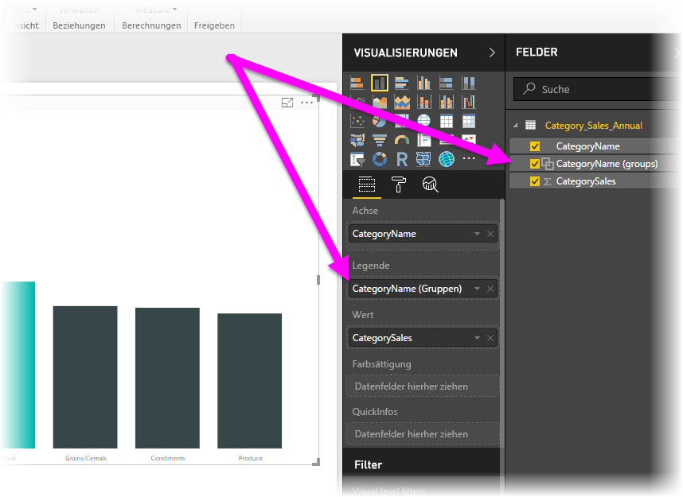
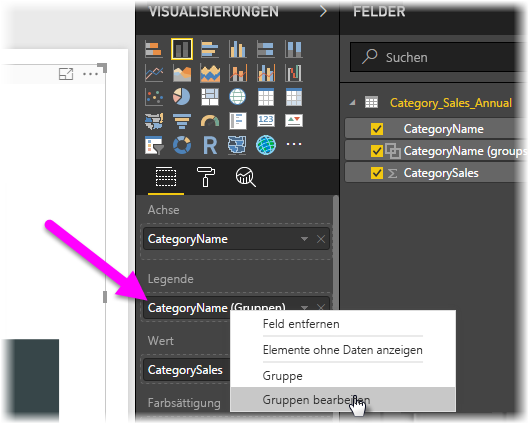

# Verwenden von Gruppierung und Diskretisierung in Power BI Desktop
Beim Erstellen von Visuals in Power BI Desktop werden die Daten basierend auf Werten in den zugrunde liegenden Daten in Blöcke (oder Gruppen) aggregiert. Häufig ist dies ausreichend, in manchen Situationen ist es jedoch sinnvoll, die Darstellung der Blöcke zu verfeinern. Beispielsweise möchten Sie eventuell drei Kategorien von Produkten in einer größeren Kategorie (einer *Gruppe*) anordnen. Alternativ sollen Umsatzzahlen in Diskretisierungen der Größe 1.000.000 US-Dollar statt in Blöcke von 923.983 US-Dollar unterteilt werden.

Sie können in Power BI Desktop Datenpunkte *gruppieren*, um Daten und Trends in den Visualisierungen deutlicher anzeigen, analysieren und untersuchen zu können. Sie können zudem die *Größe der Diskretisierung* festlegen, um Werte in Gruppen gleicher Größe zu unterteilen, die es ihnen erleichtern, Daten aussagekräftig zu visualisieren. Dieser Vorgang wird häufig als *Quantisierung* bezeichnet.

## Verwenden von Gruppierung
Wählen Sie zum Verwenden der Gruppierung mindestens zwei Elemente in einem Visual aus. Über STRG+Klick können Sie mehrere Elemente auswählen. Klicken Sie dann mit der rechten Maustaste auf eines der ausgewählten Elemente, und klicken Sie im Kontextmenü auf **Gruppieren**.

Nachdem die Gruppe erstellt wurde, wird sie dem Bucket **Legende** für das Visual hinzugefügt. Die Gruppe wird auch in der Liste **Felder** angezeigt.

Sie können die Mitglieder einer Gruppe problemlos bearbeiten. Klicken Sie mit der rechten Maustaste auf das Feld im Bucket **Legende** oder in der Liste **Felder**, und klicken Sie dann auf **Gruppen bearbeiten**.

Im Dialogfeld **Gruppen** können Sie neue Gruppen erstellen oder vorhandene Gruppen bearbeiten. Sie können *Gruppen* auch umbenennen. Doppelklicken Sie im Feld **Gruppen und Mitglieder** auf den Gruppentitel, und geben Sie dann einen neuen Namen ein.

Gruppen bieten Ihnen viele Möglichkeiten. Sie können Elemente von der Liste **Nicht gruppierte Werte** zu einer neuen oder einer existierenden Gruppe hinzufügen. Sie können eine neue Gruppe erstellen, indem Sie im Feld **Nicht gruppierte Werte** (mit STRG+Klick) mindestens zwei Elemente auswählen und dann auf die Schaltfläche **Gruppieren** klicken, die sich unter dem Feld befindet.

Sie können einen nicht gruppierten Wert zu einer bestehenden Gruppe hinzufügen, indem Sie einen der **nicht gruppierten Werte** und dann die bereits vorhandene Gruppe auswählen, der Sie den Wert hinzufügen möchten, und dann auf **Gruppieren** klicken. Sie können ein Element aus einer Gruppe zu entfernen, indem Sie im Feld **Gruppen und Mitglieder** auf das Element und dann auf **Gruppierung aufheben** klicken. Außerdem können Sie nicht gruppierte Kategorien in die Gruppe **Other** (Sonstiges) verschieben oder ungruppiert lassen.

> [!NOTE]
> Sie können im Bereich **Felder** Gruppen für jedes Feld erstellen, ohne mehrere Elemente in einem vorhandenen Visual auswählen zu müssen. Klicken Sie einfach mit der rechten Maustaste auf das Feld, und wählen Sie im angezeigten Menü **Neue Gruppe** aus.

## Verwenden von Diskretisierung
Sie können die Größe der Diskretisierung für numerische Felder und Zeitfelder in **Power BI Desktop** festlegen. Mit der Quantisierung können Sie die richtige Größe der in Power BI Desktop angezeigten Daten festlegen.

Sie können die Größe einer Quantisierung anwenden, indem Sie mit der rechten Maustaste auf ein **Feld** und dann auf **Neue Gruppe** klicken.

Legen Sie im Dialogfeld **Gruppen** die **Größe für Diskretisierung** nach Belieben fest.

Wenn Sie auf **OK** klicken, wird im Bereich **Felder** ein neues Feld angezeigt, an das **(Container)** angefügt ist. Sie können das Feld dann in den Zeichenbereich ziehen, um die Größe der Diskretisierung in einer Visualisierung zu verwenden.

In diesem [Video](https://www.youtube.com/watch?v=BRvdZSfO0DY) wird gezeigt, wie *Diskretisierung* angewendet wird.

Nun verfügen Sie über die nötigen Informationen, um *Gruppierung* und *Diskretisierung* zu verwenden und um sicherzustellen, dass die Visualisierungen in den Berichten die Daten genau so anzeigen, wie Sie es wünschen.
