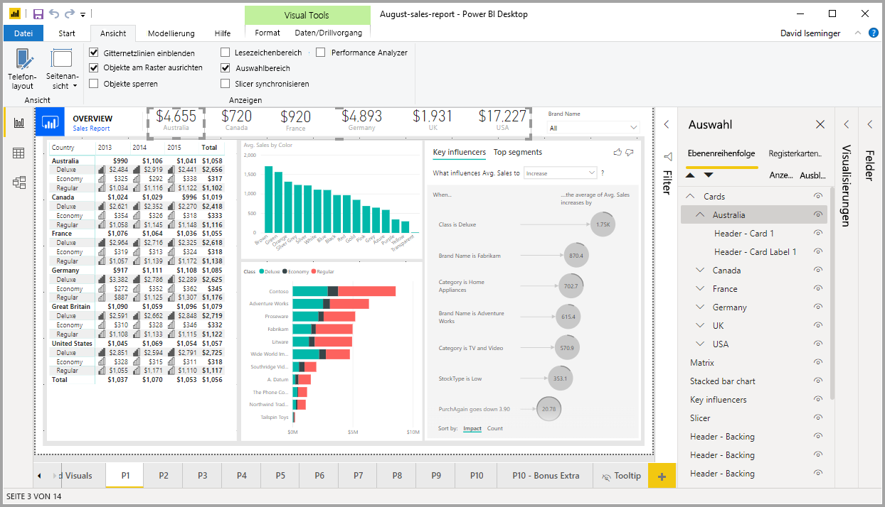
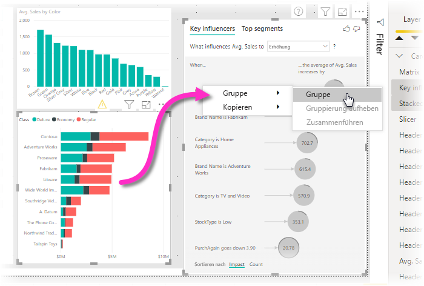
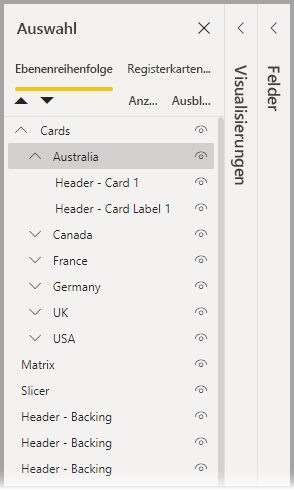
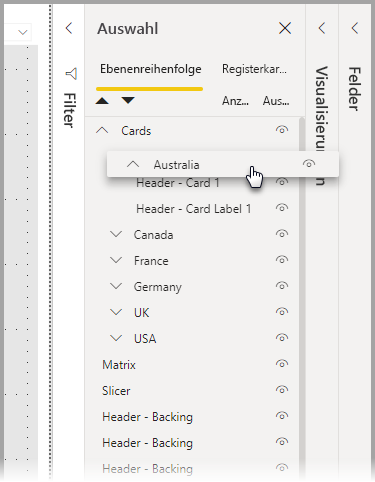
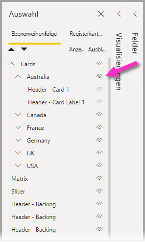

# Verwenden von Gruppierung in Power BI Desktop
Wenn Sie **Gruppierung** in **Power BI Desktop** verwenden, können Sie Visuals in Ihrem Bericht gruppieren, z. B. Schaltflächen, Textfelder, Formen, Bilder und alle Visuals, die Sie erstellen. Das funktioniert genauso wie das Gruppieren von Elementen in PowerPoint. Durch das Gruppieren von Visuals in einem Bericht können Sie die Gruppe wie ein einzelnes Objekt behandeln, und so das Verschieben, Ändern der Größe und das Arbeiten mit Ebenen in Ihrem Bericht einfacher, schneller und intuitiver zu gestalten.

## Erstellen von Gruppen

Gehen Sie wie folgt vor, um in Power BI Desktop eine Gruppe von Visuals zu erstellen: Wählen Sie das erste Visual aus dem Zeichenbereich aus, halten Sie die STRG-Taste gedrückt, und klicken Sie auf mindestens ein zusätzliches Visual, das in der Gruppe enthalten sein soll. Klicken Sie dann mit der rechten Maustaste auf die Sammlung der Visuals, und wählen Sie im Menü, das angezeigt wird, die Option **Gruppe** aus.

Gruppen werden im Bereich **Auswahl** angezeigt. Sie können so viele Gruppen von Visuals erstellen wie Ihr Bericht benötigt, und Sie können Gruppen von Visuals auch schachteln. In der folgenden Abbildung ist die Gruppe *Australien* unter der Gruppe *Karten* geschachtelt. Sie können eine Gruppe erweitern, indem Sie das Caretzeichen neben dem Gruppennamen auswählen, und Sie können sie reduzieren, indem Sie das Caretzeichen erneut auswählen. 

Im Bereich **Auswahl** können Sie auch einzelne Visuals per Drag & Drop in eine Gruppe einfügen, sie aus einer Gruppe entfernen, eine Gruppe schachteln oder eine Gruppe oder ein einzelnes Visual aus einer Schachtelung entfernen. Ziehen Sie einfach das Visual, das Sie anpassen möchten, mit der Maus, und legen Sie es an der gewünschten Position ab. Ebenen von Visuals werden, sofern eine Überlappung vorliegt, durch ihre Reihenfolge in der Liste der *Ebenenreihenfolge* bestimmt.

Wenn Sie eine Gruppierung aufheben möchten, wählen Sie die Gruppe aus, klicken Sie mit der rechten Maustaste, und wählen Sie die Option **Gruppierung aufheben** im angezeigten Menü aus.

## Ausblenden und Anzeigen von Visuals oder Gruppen

Gruppen, die den Bereich **Auswahl** verwenden, können problemlos ausgeblendet oder angezeigt werden. Wenn Sie eine Gruppierung ausblenden möchten, wählen Sie die Augenschaltfläche neben dem Gruppennamen (oder einem beliebigen einzelnen Visual) aus, um das Visual oder die Gruppe auszublenden oder anzuzeigen. In der folgenden Abbildung wird die Gruppe *Australien* ausgeblendet, und die restlichen Gruppen, die in der Gruppe *Karten* geschachtelt sind, werden angezeigt.

Wenn Sie eine Gruppe ausblenden, werden alle Visuals in dieser Gruppe ausgeblendet, und die Augenschaltfläche ist ausgegraut (nicht verfügbar, um ein- und auszublenden, da die gesamte Gruppe ausgeblendet ist). Wenn Sie nur ein bestimmtes Visual innerhalb einer Gruppe ausblenden möchten, klicken Sie einfach auf die Augenschaltfläche neben dem Visual, und nur dieses Visual in der Gruppe wird ausgeblendet.

## Auswählen von Visuals innerhalb einer Gruppe

Es gibt mehrere Möglichkeiten, Elemente innerhalb einer Gruppe von Visuals zu navigieren und auszuwählen. Das Verhalten wird in der folgenden Liste beschrieben:

* Wenn Sie in einer Gruppe auf einen leeren Bereich klicken (z. B. Leerraum zwischen Visuals), wird nichts ausgewählt.
* Wenn Sie auf ein Visual innerhalb einer Gruppe klicken, wird die gesamte Gruppe ausgewählt. Mit einem zweiten Klick wird das einzelne Visual ausgewählt.
* Wenn Sie eine Gruppe und dann ein anderes Objekt im Berichtszeichenbereich sowie im Kontextmenü die Option **Gruppe** auswählen, wird eine gruppierten Gruppe erstellt.
* Wenn Sie zwei Gruppen auswählen und dann mit der rechten Maustaste klicken, wird eine Option zum Zusammenführen der ausgewählten Gruppen angezeigt, anstatt sie zu schachteln.

## Anwenden von Hintergrundfarbe

Sie können auch eine Hintergrundfarbe auf eine Gruppe anwenden, indem Sie im Bereich **Visualisierungen** den Abschnitt **Formatierung** verwenden, wie in der folgenden Abbildung dargestellt. 

Wenn Sie eine Hintergrundfarbe anwenden, wird durch Klicken auf das Leerzeichen zwischen Visuals in der Gruppe die Gruppe ausgewählt (vergleichen Sie dies mit dem Klicken auf den Leerraum zwischen Visuals in einer Gruppe, wodurch die Gruppe nicht ausgewählt wird). 

## Nächste Schritte
Weitere Informationen zum Gruppieren erhalten Sie im folgenden Video:

* [Gruppieren in Power BI Desktop – Video](https://youtu.be/sf4n7VXoQHY?t=10)

Folgende Artikel könnten Sie ebenfalls interessieren:

* [Use cross-report drillthrough in Power BI Desktop](desktop-cross-report-drill-through.md) (Verwenden der berichtsübergreifenden Drillthroughfunktion in Power BI Desktop)
* [Verwenden von Slicern in Power BI Desktop](visuals/power-bi-visualization-slicers.md)

