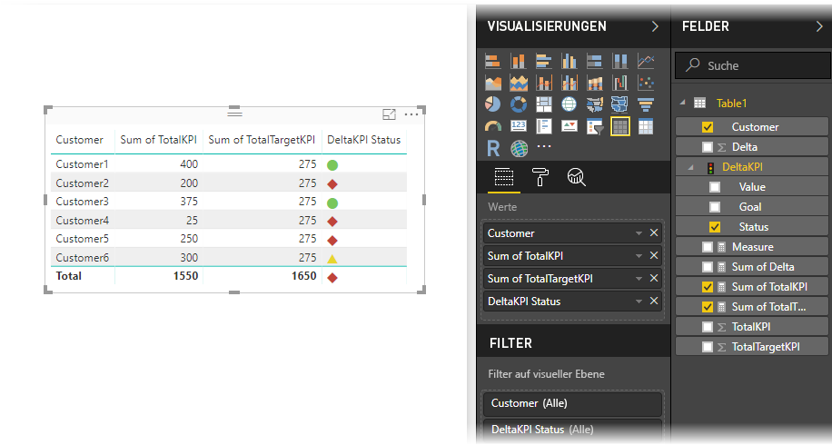

# Importieren und Anzeigen von KPIs in Power BI
Mit **Power BI Desktop** können Sie KPIs in Tabellen, Matrizen und Karten importieren und anzeigen.

Führen Sie die folgenden Schritte zum Importieren und Anzeigen von KPIs aus.

1. Beginnen Sie mit einer Excel-Arbeitsmappe mit Power Pivot-Modell und KPIs. In dieser Übung wird eine Arbeitsmappe mit dem Namen *KPIs* verwendet.

1. Importieren Sie die Excel-Arbeitsmappe mit **Datei -> Importieren -> Excel-Arbeitsmappeninhalte** in Power BI. [Erfahren Sie, wie Arbeitsmappen importiert werden](desktop-import-excel-workbooks.md). 

1. Nach dem Importieren in Power BI wird Ihre KPI im Bereich **Felder** mit dem  markiert angezeigt. Um eine KPI in Ihrem Bericht zu verwenden, achten Sie darauf, ihren Inhalt zu erweitern, sodass die Felder **Wert**, **Ziel** und **Status** verfügbar sind.

    

1. Importierte KPIs werden am besten in Standardvisualisierungstypen wie dem Typ **Tabelle** verwendet. Power BI bezieht auch den **KPI**-Visualisierungstyp ein, der nur zum Erstellen neuer KPIs verwendet werden sollte.
   
    

Das war schon alles. Mit KPIs können Sie Trends, Fortschritt oder andere wichtige Kennzahlen hervorheben.
