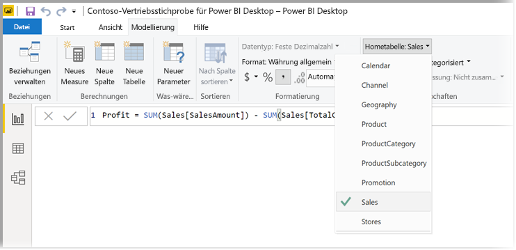
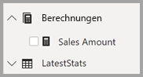

# <a name="create-measures-for-data-analysis-in-power-bi-desktop"></a>Erstellen von Measures für die Datenanalyse in Power BI Desktop

Power BI Desktop hilft Ihnen, Einblicke in Ihre Daten mit nur ein paar Mausklicks zu erstellen. Manchmal enthalten diese Daten aber einfach nicht alles, was Sie für die Antwort auf Ihre drängendsten Fragen benötigen. Measures können Ihnen in dieser Situation weiterhelfen.

Measures werden in einigen der am häufigsten verwendeten Datenanalysen verwendet. Einfache Zusammenfassungen wie Summen, Mittelwerte, Mindestwerte, Höchstwerte und Anzahlen können über den Bereich **Felder** festgelegt werden. Die berechneten Ergebnisse von Measures ändern sich ständig in Reaktion auf Ihre Interaktion mit Berichten und ermöglichen so eine schnelle und dynamische Untersuchung von Daten ohne Vorlauf. Sehen wir uns das einmal näher an. Weitere Informationen finden Sie unter [Erstellen berechneter Measures](/learn/modules/model-data-power-bi/4b-create-calculated-measures).

## <a name="understanding-measures"></a>Grundlegendes zu Measures

In Power BI Desktop werden Measures in der *Berichtsansicht* oder in der *Datenansicht* angezeigt. Von Ihnen selbst erstellte Measures werden in der **Feldliste** mit einem Rechnersymbol angezeigt. Sie können Measures nach Belieben benennen und sie einer neuen oder vorhandenen Visualisierung ganz wie jedes andere Feld hinzufügen.


> [!NOTE]
> Vielleicht sind auch *Quickmeasures* für Sie interessant. Hierbei handelt es sich um vordefinierte Measures, die in Dialogfeldern ausgewählt werden können. Sie bieten eine ideale Möglichkeit, schnell Measures zu erstellen. Zudem empfehlen sie sich, um die DAX-Syntax (Data Analysis Expressions) kennenzulernen, indem Sie sich die automatisch erstellten DAX-Formeln einmal näher ansehen. Weitere Informationen finden Sie unter [Quickmeasures](desktop-quick-measures.md).
> 
> 

## <a name="data-analysis-expressions"></a>Data Analysis Expressions

Measures berechnen ein Ergebnis mithilfe einer Ausdrucksformel. Zum Erstellen eigener Measures verwenden Sie die [DAX-Formelsprache](/dax/) (Data Analysis Expressions). DAX beinhaltet eine Bibliothek mit über 200 Funktionen, Operatoren und Konstrukten. Die Bibliothek bietet immense Flexibilität beim Erstellen von Measures zum Berechnen von Ergebnissen für nahezu jede benötigte Datenanalyse.

DAX-Formeln sind Excel-Formeln ziemlich ähnlich. DAX weist sogar viele der gleichen Funktionen auf wie Excel, z. B. `DATE`, `SUM` und `LEFT`. Aber die DAX-Funktionen sind für relationale Daten ausgelegt, wie wir sie in Power BI Desktop verwenden.

## <a name="lets-look-at-an-example"></a>Betrachten wir dazu ein Beispiel.

Lea ist Vertriebsmanagerin bei Contoso. Lea wird gebeten, Umsatzprognosen für Handelspartner für das nächste Geschäftsjahr zu erstellen. Lea entscheidet sich, ihren Schätzungen die Umsatzbeträge des letzten Jahres zugrunde zu legen und geht von einer jährlichen Steigerung von 6 Prozent aus, die sich aus verschiedenen Werbeaktionen ergeben, die für das nächste halbe Jahr geplant sind.

Lea importiert die Umsatzdaten des letzten Jahres in Power BI Desktop, um die Schätzungen zu melden. Lea findet das Feld **SalesAmount** (Umsatzbetrag) in der Tabelle **Reseller Sales** (Umsätze von Handelspartnern). Da die importierten Daten nur die Umsätze des letzten Jahres enthalten, benennt Lea das Feld **SalesAmount** (Umsatzbetrag) in *Last Years Sales* (Umsätze Vorjahr) um. Anschließend zieht Lea **Last Years Sales** auf den Berichtszeichenbereich. Das Feld wird im visualisierten Diagramm als Einzelwert dargestellt, bei dem es sich um die Summe aller Umsätze von Handelspartnern aus dem letzten Jahr handelt.

Lea fällt auf, dass eine Berechnung automatisch durchgeführt wurde, obwohl sie selbst keine Berechnung angegeben hat. Power BI Desktop hat ein eigenes Measure erstellt, indem alle Werte in **Last Years Sales** summiert wurden.

Lea benötigt jedoch ein Measure zum Berechnen der Prognosen für das nächste Jahr, das auf den Umsätzen des letzten Jahres basiert, multipliziert mit 1,06, um dem erwarteten Wachstum der Geschäftsaktivitäten von 6 Prozent Rechnung zu tragen. Für diese Berechnung erstellt Lea ein Measure. Mithilfe des Features *Neues Measure* erstellt sie ein neues Measure und gibt dann die folgende DAX-Formel ein:

```sql
    Projected Sales = SUM('Sales'[Last Years Sales])*1.06
```

Lea zieht dann das neue Measure „Projected Sales“ (Projizierte Umsätze) auf das Diagramm.


Sehr schnell und mit minimalem Aufwand hat Lea nun ein Measure zum Berechnen der geplanten Umsatzzahlen erstellt. Sie kann ihre Prognosen (Schätzung) noch genauer analysieren, indem sie nach bestimmten Handelspartnern filtert oder dem Bericht andere Felder hinzufügt.

## <a name="data-categories-for-measures"></a>Datenkategorien für Measures

Sie können auch die Datenkategorien für Measures auswählen.

Mit Datenkategorien können Sie unter anderem Measures zum dynamischen Erstellen von URLs verwenden und die Datenkategorie als Web-URL markieren.

Sie können Tabellen erstellen, die die Measures als Web-URLs anzeigen, und Sie können auf die URL klicken, die basierend auf Ihrer Auswahl erstellt wird. Dieser Ansatz ist insbesondere dann nützlich, wenn Sie eine Verknüpfung mit anderen Power BI-Berichten mithilfe von [URL-Filterparametern](service-url-filters.md) erstellen möchten.

## <a name="organizing-your-measures"></a>Organisieren Ihrer Measures

Measures verfügen über eine *Hometabelle*, in der definiert wird, wo sie in der Feldliste zu finden sind. Sie können deren Position ändern, indem Sie eine Position aus den Tabellen in Ihrem Modell auswählen.



Sie können Felder in einer Tabelle auch in *Anzeigeordnern* organisieren. Wählen Sie vom linken Rand in Power BI Desktop **Modell** aus. Wählen Sie im Bereich **Eigenschaften** das Feld, das aus der Liste der verfügbaren Felder verschoben werden soll. Geben Sie unter **Anzeigeordner** einen Namen für einen neuen Ordner ein, um diesen Ordner zu erstellen. Wenn ein neuer Ordner erstellt wird, wird das ausgewählte Feld in diesen Ordner verschoben.


Sie können Unterordner erstellen, indem Sie einen umgekehrten Schrägstrich verwenden. Beispielsweise erstellt *Finance\Currencies* (Finanzen/Währungen) einen Ordner *Finance* (Finanzen) und darin einen Ordner *Currencies* (Währungen).

Sie können einstellen, dass ein Feld in mehreren Ordnern angezeigt wird, indem Sie ein Semikolon verwenden, um die Ordnernamen zu trennen. Zum Beispiel führt die Aufteilung *Products\Names;Departments* (Produkte\Namen;Abteilungen) dazu, dass das Feld im Ordner *Departments* (Abteilungen) und im Ordner *Names* (Namen) innerhalb eines *Products*-Ordners (Produkte) angezeigt wird.

Sie können eine spezielle Tabelle erstellen, die nur Measures enthält. Diese Tabelle erscheint immer ganz oben bei **Felde**.r Erstellen Sie hierzu eine Tabelle mit nur einer Spalte. Sie können **Daten eingeben** nutzen, um die Tabelle zu erstellen. Verschieben Sie dann die Measures in diese Tabelle. Blenden Sie schließlich die Spalte (nicht die Tabelle) aus, die Sie erstellt haben. Klicken Sie auf den Pfeil am oberen Rand von **Felder** aus, um die Feldliste zu schließen und wieder zu öffnen, um Ihre Änderungen anzuzeigen.



## <a name="learn-more"></a>Weitere Informationen

Dies war eine kurze Einführung zum Thema Measures. Es gibt noch viel mehr Informationen, mit denen Sie lernen, wie Sie Ihre eigenen Measures erstellen. Weitere Informationen finden Sie im [Tutorial: Erstellen eigener Measures in Power BI Desktop](desktop-tutorial-create-measures.md) Dort können Sie eine Beispieldatei herunterladen und nach und nach Lektionen zum Erstellen weiterer Measures abrufen.  

Wenn Sie sich eingehender mit DAX befassen möchten, lesen Sie [DAX-Grundlagen in Power BI Desktop](desktop-quickstart-learn-dax-basics.md). Die [DAX-Referenz](/dax/) stellt detaillierte Artikel zu den einzelnen Funktionen, zu Syntax, Operatoren und Benennungskonventionen zur Verfügung. DAX ist schon seit mehreren Jahren in Power Pivot in Excel und SQL Server Analysis Services verfügbar. Aus diesem Grund sind noch viele weitere Ressourcen verfügbar. Sehen Sie sich unbedingt das [DAX-Ressourcencenter-Wiki](https://social.technet.microsoft.com/wiki/contents/articles/1088.dax-resource-center.aspx) an, in dem kompetente Mitglieder der BI-Community ihre DAX-Kenntnisse mit anderen teilen.
