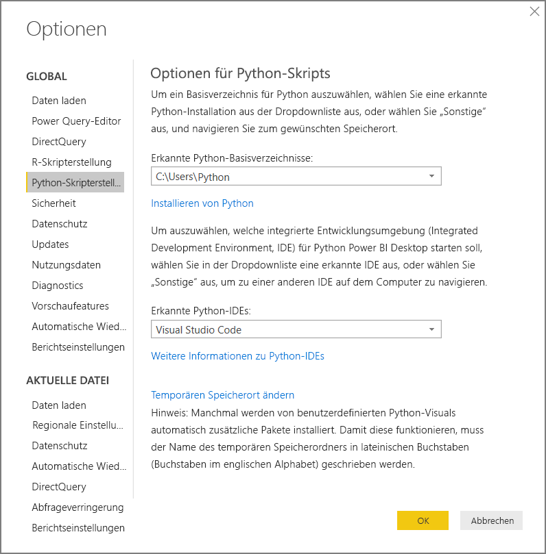
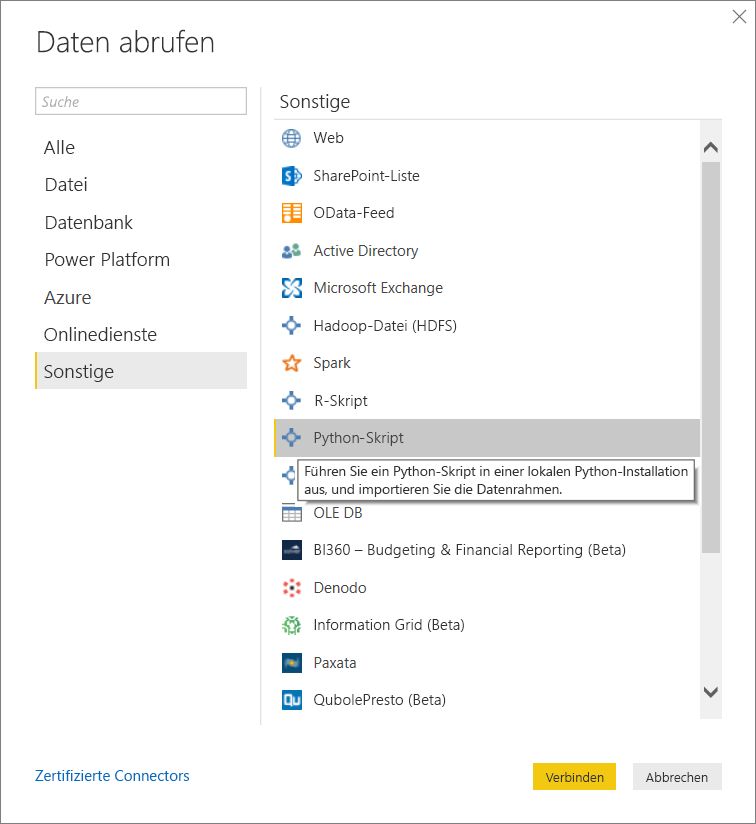
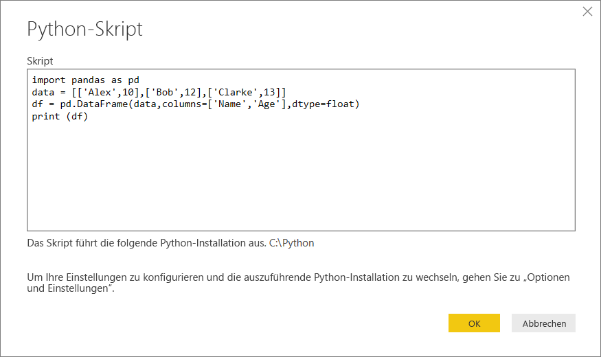
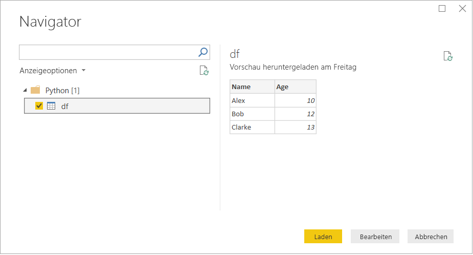

# <a name="run-python-scripts-in-power-bi-desktop"></a>Ausführen von Python-Skripts in Power BI Desktop

Sie können Python-Skripts direkt in Power BI Desktop ausführen und die resultierenden Datasets in ein Power BI Desktop-Datenmodell importieren.

## <a name="install-python"></a>Python installieren

Damit Sie Python-Skripts in Power BI Desktop ausführen können, müssen Sie Python auf dem lokalen Computer installieren. Sie können Python von der [Python-Website](https://www.python.org/) herunterladen. Das aktuelle Release für die Python-Skripterstellung unterstützt Unicode-Zeichen und Leerzeichen im Installationspfad.

### <a name="install-required-python-packages"></a>Installieren erforderlicher Python-Pakete

Für die Python-Integration in Power BI sind zwei Python-Pakete erforderlich:

* [Pandas](https://pandas.pydata.org/). Eine Softwarebibliothek für die Datenbearbeitung und -analyse. Sie stellt Datenstrukturen und Vorgänge zum Bearbeiten numerischer Tabellen und Zeitreihen bereit. Ihre importierten Daten müssen einen [Pandas-Datenrahmen](https://www.tutorialspoint.com/python_pandas/python_pandas_dataframe.htm) aufweisen. Ein Datenrahmen ist eine zweidimensionale Datenstruktur. Daten werden beispielsweise tabellarisch in Zeilen und Spalten angeordnet.
* [Matplotlib](https://matplotlib.org/). Eine Plotbibliothek für Python und ihre Erweiterung für numerische mathematische Berechnungen, [NumPy](https://www.numpy.org/). Sie stellt eine objektorientierte API zum Einbetten von Plots in Anwendungen mithilfe allgemeiner GUI-Toolkits wie Tkinter, wxPython, Qt oder GTK+ bereit.

Verwenden Sie das Befehlszeilentool [PIP](https://pip.pypa.io/en/stable/) in einer Konsole oder Shell, um die zwei Pakete zu installieren. Das PIP-Tool ist in den neueren Python-Versionen standardmäßig enthalten.

```CMD
pip install pandas
pip install matplotlib
```

## <a name="enable-python-scripting"></a>Aktivieren der Python-Skripterstellung

So aktivieren Sie die Python-Skripterstellung:

1. Klicken Sie in Power BI Desktop auf **Datei** > **Optionen und Einstellungen** > **Optionen** > **Python-Skripterstellung**. Daraufhin wird die Seite **Optionen für Python-Skripts** angezeigt.

   

1. Geben Sie bei Bedarf Ihren lokalen Python-Installationspfad unter **Erkannte Python-Basisverzeichnisse** ein.

   In der obigen Abbildung lautet der lokale Installationspfad von Python *C:\Python*. Stellen Sie sicher, dass der Pfad für die lokale Python-Installation ist, die von Power BI Desktop verwendet werden soll.

1. Wählen Sie **OK** aus.

Sobald Sie Ihre Python-Installation angegeben haben, können Sie Python-Skripts in Power BI Desktop ausführen.

## <a name="run-python-scripts"></a>Ausführen von Python-Skripts

Sie können Python-Skripts in nur wenigen Schritten ausführen und ein Datenmodell erstellen. Mit diesem Modell können Sie Berichte erstellen und diese im Power BI-Dienst freigeben.

### <a name="prepare-a-python-script"></a>Vorbereiten eines Python-Skripts

Erstellen Sie zunächst ein Skript in Ihrer lokalen Python-Entwicklungsumgebung, und stellen Sie sicher, dass es erfolgreich ausgeführt wird. Es folgt ein einfaches Python-Beispielskript, das Pandas importiert und einen Datenrahmen verwendet:

```python
import pandas as pd
data = [['Alex',10],['Bob',12],['Clarke',13]]
df = pd.DataFrame(data,columns=['Name','Age'],dtype=float)
print (df)
```

Nach der Ausführung gibt das Skript Folgendes zurück:

```python
     Name   Age
0    Alex  10.0
1     Bob  12.0
2  Clarke  13.0
```

Beim Vorbereiten und Ausführen eines Python-Skripts in Power BI Desktop müssen Sie einige Einschränkungen beachten:

* Es werden nur Pandas-Datenrahmen importiert. Stellen Sie darum sicher, dass die nach Power BI zu importierenden Daten in einem Datenrahmen dargestellt werden.
* Wenn die Ausführung eines Python-Skripts länger als 30 Minuten dauert, wird sie mit einem Timeout abgebrochen.
* Bei interaktiven Aufrufen in einem Python-Skript, z. B. beim Warten auf eine Benutzereingabe, wird die Ausführung des Skripts angehalten.
* Wenn Sie das Arbeitsverzeichnis im Python-Skript angeben, *müssen* Sie den vollständigen Pfad zu diesem Verzeichnis angeben – der relative Pfad genügt nicht.
* Geschachtelte Tabellen werden derzeit nicht unterstützt.

### <a name="run-your-python-script-and-import-data"></a>Ausführen des Python-Skripts und Importieren der Daten

So führen Sie Ihr Python-Skript in Power BI Desktop aus:

1. Wählen Sie im Menüband „Start“ die Option **Daten abrufen** > **Sonstige** aus.

1. Wählen Sie dann wie im folgenden Bild gezeigt **Sonstige** > **Python-Skript** aus:

   

1. Wählen Sie **Verbinden** aus. Ihre neueste lokal installierte Python-Version wird als Python-Engine ausgewählt. Kopieren Sie Ihr Skript in das angezeigte Dialogfeld **Python-Skript**. Hier geben Sie das zuvor gezeigte einfache Python-Skript ein.

   

1. Wählen Sie **OK** aus. Nach der erfolgreichen Ausführung des Skripts wird der **Navigator** angezeigt, und Sie können die Daten laden und verwenden. Wählen Sie für das Beispiel die Option **df** aus, wie im Bild gezeigt, und klicken Sie dann auf **Laden**.

    

### <a name="troubleshooting"></a>Problembehandlung

Wenn Python nicht installiert ist oder nicht erkannt wird, wird eine Warnung angezeigt. Es wird auch eine Warnung angezeigt, wenn Sie über mehrere Installationen auf dem lokalen Computer verfügen. In diesem Fall sollten Sie sich die Abschnitte „Installieren von Python“ und „Aktivieren der Python-Skripterstellung“ noch mal ansehen.


### <a name="refresh"></a>Aktualisieren

Sie können ein Python-Skript in Power BI Desktop aktualisieren. Navigieren Sie zum Aktualisieren zum Menüband **Start**, und klicken Sie dann auf **Aktualisieren**. Wenn Sie ein Python-Skript aktualisieren, führt Power BI Desktop das Python-Skript noch mal aus.

## <a name="next-steps"></a>Nächste Schritte

Betrachten Sie die folgenden zusätzlichen Informationen über Python in Power BI.

* [Erstellen von visuellen Python-Elementen in Power BI Desktop](desktop-python-visuals.md)
* [Verwenden einer externen Python-IDE mit Power BI](desktop-python-ide.md)
