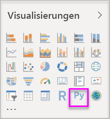
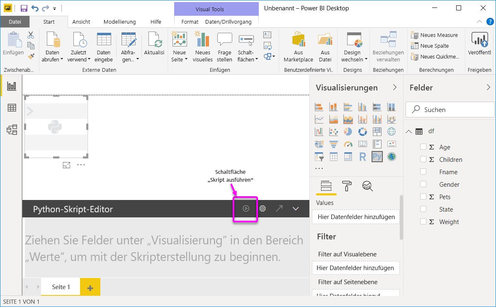
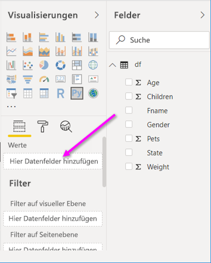
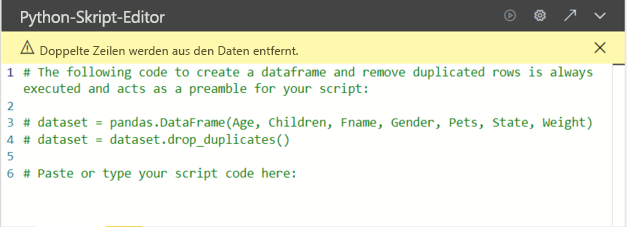
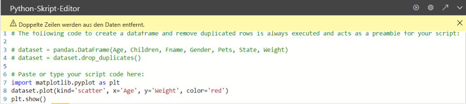

# <a name="create-power-bi-visuals-by-using-python"></a>Erstellen von Power BI-Visualisierungen mithilfe von Python
Mit **Power BI Desktop** können Sie **Python** zum Visualisieren Ihrer Daten verwenden.

## <a name="prerequisites"></a>Voraussetzungen

Bearbeiten Sie das Tutorial [Ausführen von Python-Skripts in Power BI Desktop](desktop-python-scripts.md). Verwenden Sie dafür das folgende Python-Skript:

```python
import pandas as pd 
df = pd.DataFrame({ 
    'Fname':['Harry','Sally','Paul','Abe','June','Mike','Tom'], 
    'Age':[21,34,42,18,24,80,22], 
    'Weight': [180, 130, 200, 140, 176, 142, 210], 
    'Gender':['M','F','M','M','F','M','M'], 
    'State':['Washington','Oregon','California','Washington','Nevada','Texas','Nevada'],
    'Children':[4,1,2,3,0,2,0],
    'Pets':[3,2,2,5,0,1,5] 
}) 
print (df) 
```
Im Artikel [Ausführen von Python-Skripts in Power BI Desktop](desktop-python-scripts.md) wird erläutert, wie Sie Python auf Ihrem lokalen Computer installieren und für die Python-Skripterstellung in **Power BI Desktop** aktivieren können. In diesem Tutorial werden Daten aus dem obigen Skript verwendet, um die Erstellung von Python-Visuals zu veranschaulichen.

## <a name="create-python-visuals-in-power-bi-desktop"></a>Erstellen von visuellen Python-Elementen in Power BI Desktop
1. Klicken Sie im Bereich **Visualisierung** auf das Symbol **Python-Visual**.
   
   

1.  Klicken Sie im daraufhin angezeigten Dialogfeld **Visuelle Skriptelemente aktivieren** auf **Aktivieren**. 

    Wenn Sie einem Bericht ein Python-Visual hinzufügen, führt **Power BI Desktop** die folgenden Aktionen aus:
   
     - Auf der Berichtzeichnungsfläche wird ein Platzhalterbild für ein visuelles Python-Element angezeigt.
   
     - Am unteren Rand des mittleren Bereichs wird der **Python-Skript-Editor** angezeigt.
   
    

1. Ziehen Sie als nächstes die Felder **Alter**, **Children** (Kinder), **Fname**, **Geschlecht**, **Pets** (Haustiere), **State** (Staat) und **Weight** (Gewicht) in den Abschnitt **Werte**, in dem die Meldung **Hier Datenfelder hinzufügen** angezeigt wird. 

    

   Ihr Python-Skript kann nur Felder verwenden, die dem Abschnitt **Werte** hinzugefügt wurden. Während Sie an Ihrem Python-Skript arbeiten, können Sie Felder zum Abschnitt **Werte** hinzufügen oder aus diesem entfernen. **Power BI Desktop** erkennt automatisch, wenn Änderungen an Feldern vorgenommen werden.
   
   > [!NOTE]
   > Der Standardaggregationstyp für visuelle Python-Elemente lautet *Nicht zusammenfassen*.
   > 
   > 
   
1. Jetzt können Sie die Daten verwenden, die Sie zum Erstellen einer Zeichnung ausgewählt haben. 

    Wenn Sie Felder auswählen oder entfernen, wird im Python-Skript-Editor automatisch Unterstützungscode generiert bzw. aus diesem entfernt. 
    
    Basierend auf Ihrer Auswahl generiert der Python-Skript-Editor den folgenden Bindungscode.

    * Der Editor hat mit den von Ihnen hinzugefügten Feldern einen **Dataset**-Datenrahmen erstellt. 
    * Die Standardaggregation lautet *Nicht zusammenfassen*.
    * Ähnlich wie bei Tabellenvisualisierungen werden Felder gruppiert und doppelte Zeilen nur einmal angezeigt.

        
   
     > [!TIP] 
     > In bestimmten Fällen sind Gruppierungen möglicherweise nicht erwünscht, oder es sollen alle Zeilen angezeigt werden, einschließlich doppelter Zeilen. Dann können Sie Ihrem Dataset ein Indexfeld hinzufügen, sodass alle Zeilen als eindeutig betrachtet werden und keine Gruppierung erfolgt.
   
   Sie können auf Spalten im Dataset zugreifen, indem Sie deren Namen verwenden. Beispielsweise können Sie das Dataset „Age“ (Alter) in Ihrem Python-Skript für den Zugriff auf das Feld „Alter“ codieren.

1. Mit dem Datenrahmen, der automatisch anhand der von Ihnen ausgewählten Felder generiert wurde, können Sie ein Python-Skript zum Erzeugen von Zeichnungen auf dem Python-Standardgerät schreiben. Sobald das Skript vollständig ist, sollten Sie auf der Titelleiste des **Python-Skript-Editors** auf **Ausführen** klicken.

   **Power BI Desktop** zeichnet das Visual neu, wenn eines der folgenden Ereignisse eintritt:
   
   * Wenn Sie auf der Titelleiste des **Python-Skript-Editors** **Ausführen** auswählen.
   * Bei jedem Ändern der Daten durch Aktualisieren, Filtern oder Hervorheben von Daten.
   
   Wenn Sie ein Python-Skript ausführen, das einen Fehler auslöst, wird das Python-Visual nicht gezeichnet, und es wird eine Fehlermeldung in der Canvas angezeigt. Sie können Fehlerdetails abrufen, indem Sie in der Meldung auf **Details anzeigen** klicken.

   Um eine größere Ansicht der Visualisierungen zu erhalten, können Sie den **Python-Skript-Editor**minimieren.

Im Folgenden erfahren Sie, wie Sie Visuals erstellen können.

## <a name="create-a-scatter-plot"></a>Erstellen eines Punktdiagramms

Wir wollen nun ein Punktdiagramm erstellen, um zu überprüfen, ob eine Korrelation zwischen dem Alter und dem Gewicht besteht. 

1. Geben Sie unter **Paste or type your script code here** (Hier Ihren Skriptcode einfügen oder eingeben) den folgenden Code ein:

   ```python
   import matplotlib.pyplot as plt 
   dataset.plot(kind='scatter', x='Age', y='Weight', color='red')
   plt.show() 
   ```  
   Der Bereich des Python-Skript-Editors sollte nun wie folgt aussehen:

   

   Die Bibliothek **Matplotlib** wird importiert, um die Visuals zu zeichnen und zu erstellen.

1. Wenn Sie auf die Schaltfläche **Skript ausführen** klicken, wird der Platzhalter für das Python-Visual durch das folgende Punktdiagramm ersetzt.

   

## <a name="create-a-line-plot-with-multiple-columns"></a>Erstellen eines Liniendiagramms mit mehreren Spalten

 Im Folgenden wird erläutert, wie Sie ein Liniendiagramm zu jeder Person erstellen, an dem die Anzahl der Kinder und Haustiere abgelesen werden können. Entfernen Sie den Code unter **Paste or type your script code here** (Hier Ihren Skriptcode einfügen oder eingeben), oder kommentieren Sie ihn aus, und geben Sie den folgenden Python-Code ein:

 ```python
 import matplotlib.pyplot as plt 
ax = plt.gca() 
dataset.plot(kind='line',x='Fname',y='Children',ax=ax) 
dataset.plot(kind='line',x='Fname',y='Pets', color='red', ax=ax) 
plt.show() 
```
Wenn Sie auf die Schaltfläche **Skript ausführen** klicken, wird das folgende Liniendiagramm mit mehreren Spalten generiert.

 

## <a name="create-a-bar-plot"></a>Erstellen eines Balkendiagramms

Zuletzt wollen wir ein Balkendiagramm zum Alter jeder Person erstellen. Entfernen Sie den Code unter **Paste or type your script code here** (Hier Ihren Skriptcode einfügen oder eingeben), oder kommentieren Sie ihn aus, und geben Sie den folgenden Python-Code ein:

```python
import matplotlib.pyplot as plt 
dataset.plot(kind='bar',x='Fname',y='Age') 
plt.show() 
```

Wenn Sie auf die Schaltfläche **Skript ausführen** klicken, wird das folgende Balkendiagramm erstellt:

 

## <a name="security"></a>Sicherheit

> [!IMPORTANT] 
  > **Sicherheit von Python-Skripts:** Visuelle Python-Elemente werden aus Python-Skripts erstellt, die Code mit Sicherheits- oder Datenschutzrisiken enthalten können. Wenn ein Benutzer ein visuelles Python-Element zum ersten Mal aufruft oder damit interagiert, wird eine Sicherheitswarnmeldung angezeigt. Aktivieren Sie visuelle Python-Elemente nur dann, wenn Sie dem Autor und der Quelle vertrauen, oder wenn Sie die zugehörigen Python-Skripts überprüft und nachvollzogen haben. 
  >  

## <a name="more-information-about-plotting-with-matprolib-pandas-and-python"></a>Weitere Informationen zum Zeichnen mit Matprolib, Pandas und Python

Dieses Tutorial soll Ihnen den Einstieg in die Erstellung von Visuals mit Python in **Power BI Desktop** erleichtern. Die vielen Optionen und Funktionen zum Erstellen von visuellen Berichten mithilfe von Python und den Bibliotheken Pandas und Matprolib können in diesem Rahmen nur grob vorgestellt werden. Es gibt noch viele weitere Informationen. Hier finden Sie einige Links, die Ihnen beim Start helfen:

* Dokumentation auf der [Matplotlib](https://matplotlib.org/)-Website. 
* [Matplotlib Tutorial: A Basic Guide to Use Matplotlib with Python (Matplotlib-Tutorial: Basisanleitung zur Verwendung von Matplotlib mit Python)](https://www.datasciencelearner.com/matplotlib-tutorial-complete-guide-to-use-matplotlib-with-python/) 
* [Matplotlib Tutorial – Python Matplotlib Library with Examples (Matplotlib-Tutorial: Matplotlib-Bibliothek für Python mit Beispielen)](https://www.edureka.co/blog/python-matplotlib-tutorial/) 
* [Pandas API Reference (API-Referenz für Pandas)](https://pandas.pydata.org/pandas-docs/stable/reference/index.html) 
* [Python-Visualisierungen im Power BI-Dienst](https://powerbi.microsoft.com/blog/python-visualizations-in-power-bi-service/) 
* [Erstellen von Python-Visuals in Power BI](https://www.absentdata.com/how-to-user-python-and-power-bi/)


## <a name="known-limitations"></a>Bekannte Einschränkungen

Für Python-Visuals in **Power BI Desktop** gelten einige Einschränkungen:

* Beschränkungen der Datengröße – die vom visuellen Python-Element zum Zeichnen verwendeten Daten sind auf 150.000 Zeilen beschränkt. Bei Auswahl von mehr als 150.000 Zeilen werden nur die oberen 150.000 Zeilen verwendet, und im Bild wird eine Meldung angezeigt.
* Auflösung – alle visuellen Python-Elemente werden mit 72 DPI angezeigt.
* Beschränkung der Berechnungszeit: Wenn die Berechnung des visuellen Python-Elements 5 Minuten überschreitet, wird die Ausführung aufgrund der Zeitüberschreitung abgebrochen und eine Fehlermeldung angezeigt.
* Beziehungen – wie bei anderen Power BI Desktop-Visualisierungen tritt ein Fehler auf, wenn Datenfelder aus unterschiedlichen Tabellen ausgewählt werden, zwischen denen keine Beziehung definiert ist.
* Visuelle Python-Elemente werden aktualisiert, wenn Daten aktualisiert, gefiltert oder hervorgehoben werden. Das Bild selbst ist jedoch nicht interaktiv und kann nicht als Quelle für die Kreuzfilterung verwendet werden.
* Python-Visuals reagieren auf das Hervorheben anderer Visuals. Sie können jedoch nicht auf Elemente in den Python-Visuals klicken, um eine Kreuzfilterung für andere Elemente durchzuführen.
* Nur auf dem Python-Standardanzeigegerät erzeugte Zeichnungen werden im Zeichenbereich ordnungsgemäß angezeigt. Verwenden Sie nicht explizit ein anderes Python-Anzeigegerät.

## <a name="next-steps"></a>Nächste Schritte

Betrachten Sie die folgenden zusätzlichen Informationen über Python in Power BI.

* [Ausführen von Python-Skripts in Power BI Desktop](desktop-python-scripts.md)
* [Verwenden einer externen Python-IDE mit Power BI](desktop-python-ide.md)

