# Abfrageübersicht in Power BI Desktop
Mit Power BI Desktop stellen Sie eine Verbindung zur Welt der Daten her, erstellen überzeugende und fundierte Berichte und teilen Ihre Ergebnisse mit anderen Personen, die dann auf Ihrer Arbeit aufbauen und so ihr Business Intelligence-Potenzial erweitern können.

Power BI Desktop verfügt über drei Ansichten:

* **Berichtsansicht.** Hier entwerfen Sie mithilfe selbst erstellter Abfragen ansprechende Visualisierungen, ordnen diese wie gewünscht und bei Bedarf auf mehreren Seiten an und geben Sie für andere Benutzer frei
* **Datenansicht.** Hier können Sie die Daten Ihres Berichts im Datenmodellformat anzeigen und Measures hinzufügen, neue Spalten erstellen und Beziehungen verwalten
* **Beziehungsansicht.** Hier können Sie eine grafische Darstellung der Beziehungen abrufen, die in Ihrem Datenmodell eingerichtet wurden, und diese je nach Bedarf verwalten oder ändern.

Sie können auf diese Ansichten zugreifen, indem Sie auf eins der drei Symbole auf der linken Seite von Power BI Desktop klicken. In der folgenden Abbildung ist die **Berichtsansicht** ausgewählt. Dies wird durch den gelben Streifen neben dem Symbol signalisiert.  

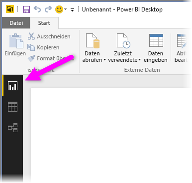

Im Lieferumfang von Power BI Desktop ist auch der Power Query-Editor enthalten. Diesen können Sie verwenden, um eine Verbindung mit Datenquellen herzustellen, um die Daten gemäß Ihren Anforderungen zu strukturieren und zu transformieren und um das Modell anschließend in Power BI Desktop zu laden.

Dieses Dokument bietet nur eine Übersicht über die Arbeit mit Daten im Power Query-Editor, aber es gibt noch viele weitere Artikel zu diesem Thema. Am Ende dieses Dokuments finden Sie Links zu detaillierten Anleitungen zu unterstützten Datentypen. Außerdem finden Sie Anleitungen zum Herstellen einer Verbindung mit Daten, zum Strukturieren von Daten, zum Erstellen von Beziehungen und zu den ersten Schritten.

Zuerst wollen wir uns aber mit dem Power Query-Editor vertraut machen.

## Power Query-Editor
Sie können den Power Query-Editor aufrufen, indem Sie auf der Registerkarte **Start** auf die Option **Abfragen bearbeiten** klicken.  

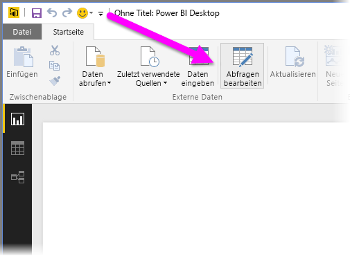

Solange noch keine Datenverbindungen hergestellt wurden, wird für den Power Query-Editor ein leerer Bereich angezeigt, zu dem Daten hinzugefügt werden können.  

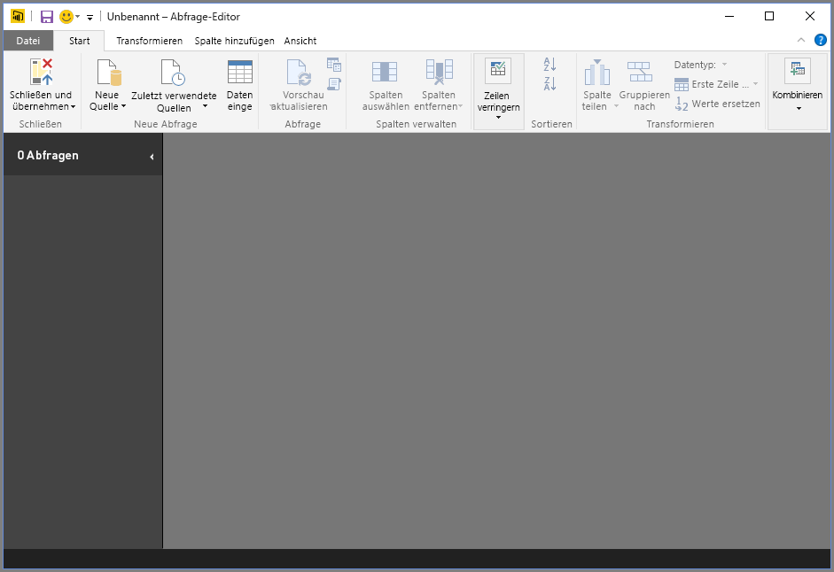

Sobald eine Abfrage geladen wurde, werden im Power Query-Editor weitere Informationen angezeigt. Wenn Sie eine Verbindung mit der folgenden Webdatenquelle herstellen, lädt der Power Query-Editor Informationen zu den Daten, mit deren Strukturierung Sie anschließend beginnen können:

[*https://www.bankrate.com/retirement/best-and-worst-states-for-retirement/*](https://www.bankrate.com/retirement/best-and-worst-states-for-retirement/)

Nach dem Herstellen der Datenverbindung sieht der Power Query-Editor wie folgt aus:

1. Im Menüband sind jetzt viele Schaltflächen aktiv, über die Sie die Daten in der Abfrage interaktiv bearbeiten können.
2. Im linken Bereich sind die Abfragen aufgelistet und können ausgewählt, angezeigt und strukturiert werden.
3. Im mittleren Bereich werden die Daten der ausgewählten Abfrage angezeigt und können dort strukturiert werden.
4. Der Bereich **Abfrageeinstellungen** wird angezeigt. Hier sind die Eigenschaften der Abfrage und die angewendeten Schritte aufgelistet.  
   
   

In den folgenden Abschnitten erhalten Sie Informationen zu allen vier Bereichen: dem Menüband, dem Abfragebereich, der Datenansicht und dem Bereich „Abfrageeinstellungen“.

## Das Menüband im Abfrage-Editor
Das Menüband im Power Query-Editor besteht aus vier Registerkarten: **Start**, **Modellierung**, **Spalte**und **Ansicht**.

Die Registerkarte **Start** enthält die allgemeinen Abfrageaufgaben.

Wenn Sie eine Datenverbindung herstellen und mit der Abfrageerstellung beginnen möchten, klicken Sie auf **Neue Quelle**. Ein Menü mit den am häufigsten verwendeten Datenquellen wird angezeigt.  

Weitere Informationen zu verfügbaren Datenquellen finden Sie unter **Datenquellen**. Informationen zum Herstellen von Datenverbindungen sowie entsprechende Beispiele und Schritte finden Sie unter **Verbinden mit Daten**.

Über die Registerkarte **Modellierung** erhalten Sie Zugriff auf häufig verwendete Tasks zur Datentransformierung. Beispiele:

* Das Hinzufügen oder Entfernen von Spalten
* Das Ändern von Datentypen 
* Das Teilen von Spalten 
* Andere datengesteuerte Tasks

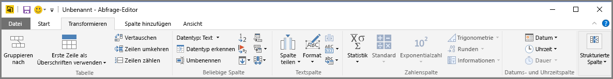

Weitere Informationen zum Transformieren von Daten sowie Beispiele hierzu finden Sie unter [Tutorial: Strukturieren und Kombinieren von Daten in Power BI Desktop](https://docs.microsoft.com/power-bi/desktop-shape-and-combine-data).

Die Registerkarte **Spalte hinzufügen** enthält weitere Aufgaben im Zusammenhang mit dem Hinzufügen einer Spalte, dem Formatieren von Spaltendaten und dem Hinzufügen benutzerdefinierter Spalten. In der folgenden Abbildung ist die Registerkarte **Spalte hinzufügen** dargestellt.  

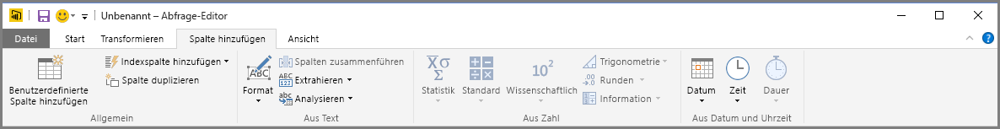

Die Registerkarte **Ansicht** im Menüband wird zum Umschalten der Anzeige bestimmter Bereiche oder Fenster verwendet. Sie dient auch zum Anzeigen des Erweiterten Editors. In der folgenden Abbildung ist die Registerkarte **Ansicht** dargestellt.  

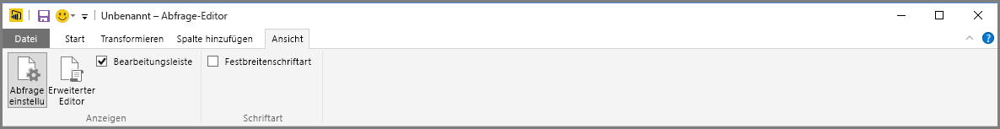

Es ist hilfreich zu wissen, dass viele der im Menüband verfügbaren Aufgaben auch über das Kontextmenü (zugänglich nach einem Rechtsklick auf eine Spalte oder andere Daten im mittleren Bereich) aufgerufen werden können.

## Linker Bereich (Abfragen)
Im linken Bereich bzw. im **Abfragebereich** werden die Anzahl der aktiven Abfragen sowie der Name der Abfrage angezeigt. Wenn Sie im linken Bereich eine Abfrage auswählen, werden die entsprechenden Daten im mittleren Bereich angezeigt. Hier können Sie die Daten entsprechend Ihren Anforderungen strukturieren und transformieren. Die folgende Abbildung zeigt den linken Bereich mit einer Abfrage.  

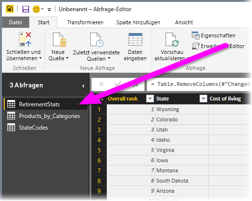

## Mittlerer Bereich (Datenbereich)
Im mittleren Bereich bzw. im **Datenbereich** werden die Daten der ausgewählten Abfrage angezeigt. Hier werden die meisten Aufgaben der **Abfrageansicht** ausgeführt.

Die folgende Abbildung zeigt die zuvor eingerichtete Webdatenverbindung. Die Spalte **Product** (Produkt) ist ausgewählt, und es wurde das Kontextmenü der Kopfzeile der Spalte geöffnet, um die verfügbaren Menüelemente anzuzeigen. Beachten Sie, dass viele Kontextmenüelemente auch als Schaltflächen auf den Registerkarten im Menüband verfügbar sind.  

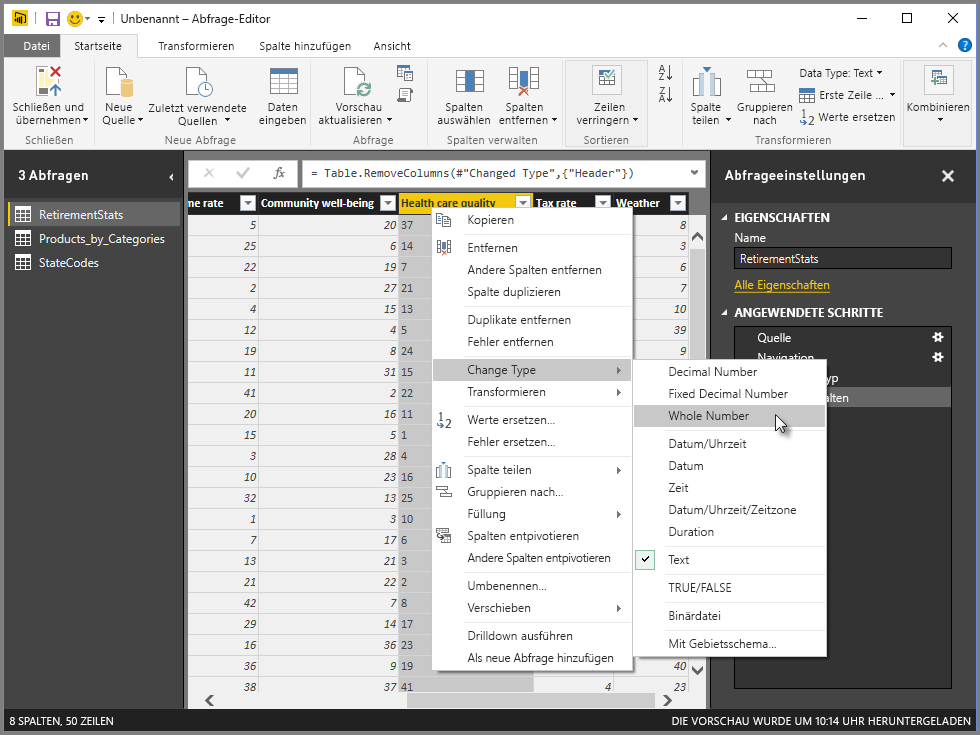

Wenn Sie auf ein Kontextmenüelement oder auf eine Schaltfläche auf dem Menüband klicken, wendet die Abfrage den Schritt auf die Daten an. Außerdem speichert sie den Schritt als Teil der Abfrage. Die Schritte werden wie im nächsten Abschnitt beschrieben im Bereich **Abfrageeinstellungen** in der entsprechenden Reihenfolge aufgezeichnet.  

## Der rechte Bereich (Abfrageeinstellungen)
Im rechten Bereich bzw. im Bereich **Abfrageeinstellungen** werden alle Schritte angezeigt, die einer Abfrage zugeordnet sind. Im folgenden Bild geht aus dem Bereich **Abfrageeinstellungen** unter **Angewendete Schritte** beispielsweise hervor, dass wir gerade den Typ der Spalte **Health care quality** geändert haben.

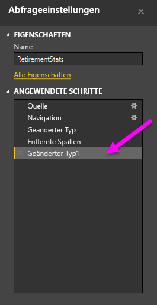

Beim Anwenden weiterer Strukturierungsschritte auf die Abfrage werden auch diese im Bereich **Angewendete Schritte** erfasst.

Sie sollten wissen, dass die zugrunde liegenden Daten *nicht* geändert werden. Stattdessen ändert und strukturiert der Power Query-Editor seine Ansicht der Daten. Außerdem ändert und strukturiert er die Ansicht jeglicher Interaktionen mit den zugrunde liegenden Daten basierend auf der strukturierten und geänderten Ansicht dieser Daten.

Im Bereich **Abfrageeinstellungen** können Sie Schritte nach Bedarf umbenennen, löschen oder neu anordnen. Klicken Sie dazu mit der rechten Maustaste in den Bereich **Angewendete Schritte**, und nehmen Sie im Kontextmenü die gewünschte Auswahl vor. Alle Abfrageschritte werden in der Reihenfolge ausgeführt, in der sie im Bereich **Angewendete Schritte** aufgeführt sind.

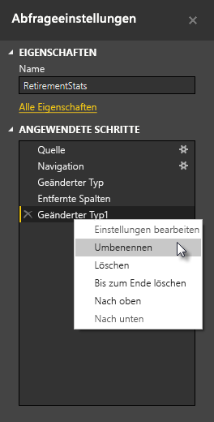

## Erweiterter Editor
Mit dem **Erweiterten Editor** können Sie den Code abrufen, den der Power Query-Editor bei jedem Schritt erstellt. Außerdem können Sie ihn nutzen, um einen eigenen Strukturierungscode zu erstellen. Zum Starten des Erweiterten Editors wählen Sie zunächst **Ansicht** im Menüband und dann **Erweiterter Editor**aus. Ein Fenster wird geöffnet, in dem der Code der vorhandenen Abfrage angezeigt wird.  
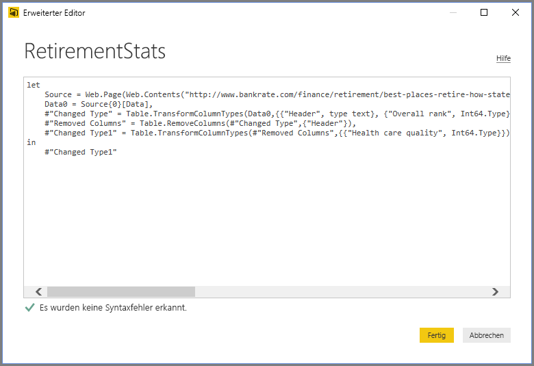

Im Fenster **Erweiterter Editor** können Sie den Code direkt bearbeiten. Zum Schließen des Fensters wählen Sie die Schaltfläche **Fertig** oder **Abbrechen** aus.  

## Speichern der Arbeit
Wenn Sie mit Ihrer Abfrage zufrieden sind, klicken Sie im **Dateimenü** des Power Query-Editors auf **Close & Apply** (Schließen und anwenden). Mit dieser Aktion werden die Änderungen angewendet und der Editor geschlossen.  

Nachfolgend zeigt Power BI Desktop in einem Dialogfeld eine Fortschrittsanzeige an.  

Wenn Sie fertig sind, kann Power BI Desktop Ihre Arbeit in Form einer *PBIX*-Datei speichern.

Klicken Sie zum Speichern Ihrer Arbeit wie in der folgenden Abbildung gezeigt auf **Datei** \> **Speichern** (oder **Datei** \> **Speichern unter**).  
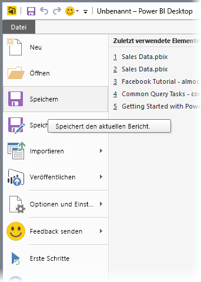

## Nächste Schritte
Mit Power BI Desktop können Sie viele Aufgaben ausführen. Weitere Informationen zu den Funktionen und Möglichkeiten finden Sie in den folgenden Ressourcen:

* [Was ist Power BI Desktop?](desktop-what-is-desktop.md)
* [Datenquellen in Power BI Desktop](desktop-data-sources.md)
* [Verbinden mit Daten in Power BI Desktop](desktop-connect-to-data.md)
* [Tutorial: Strukturieren und Kombinieren von Daten mit Power BI Desktop](desktop-shape-and-combine-data.md)
* [Durchführen allgemeiner Abfrageaufgaben in Power BI Desktop](desktop-common-query-tasks.md)   

