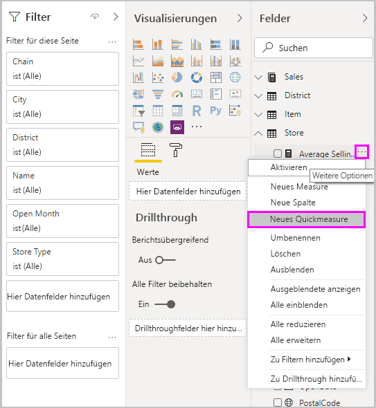
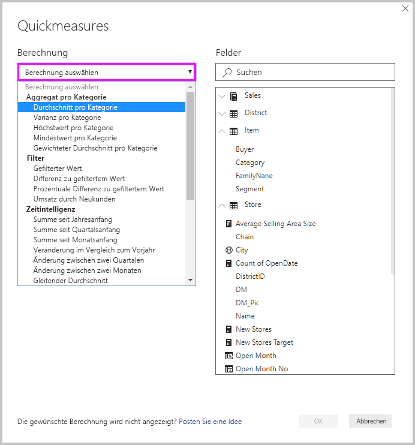
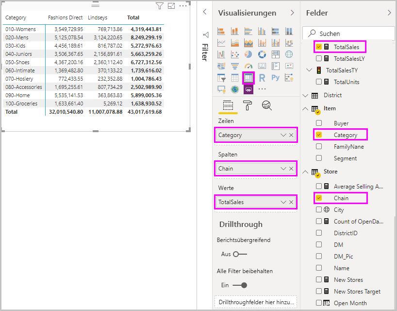
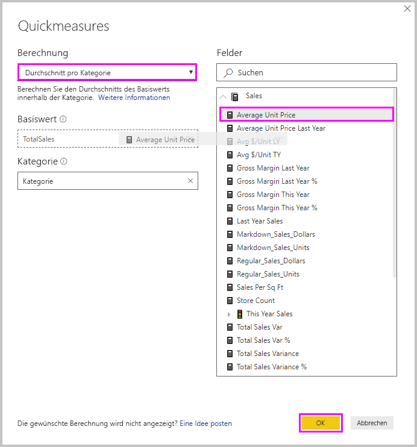
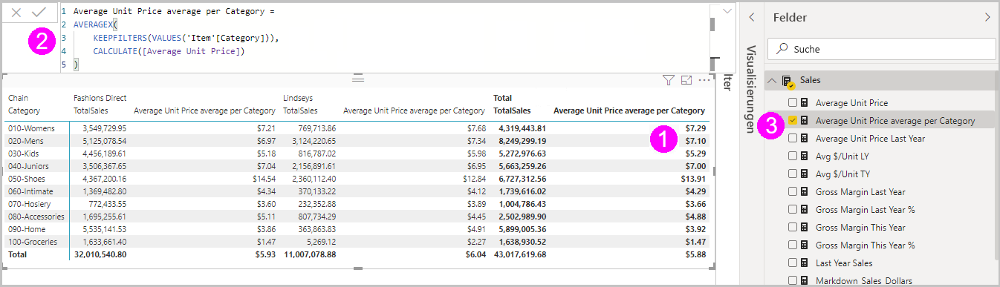
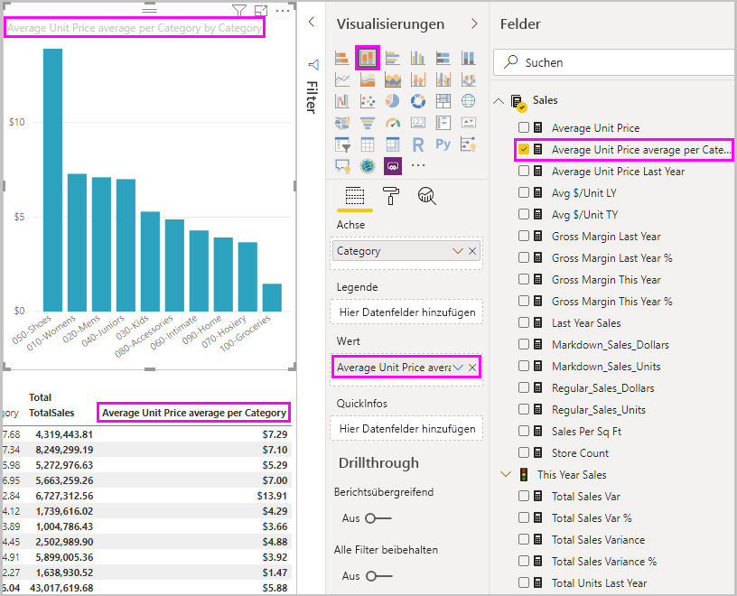
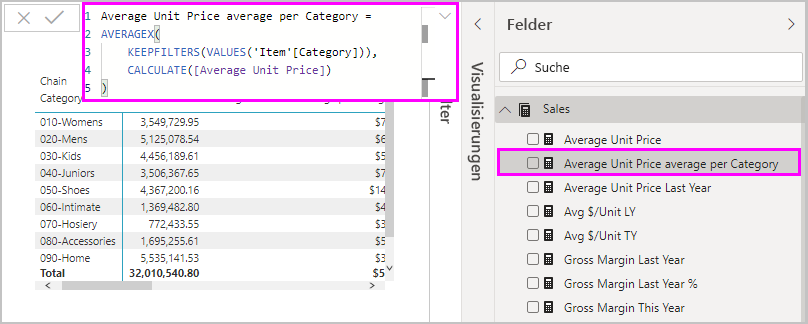
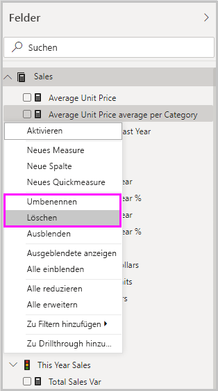

# Verwenden von Quickmeasures für gängige Berechnungsfunktionen
Mit *Quickmeasures* können Sie gängige und leistungsstarke Berechnungsfunktionen schnell und einfach verwenden. Ein Quickmeasure führt einen Satz von DAX-Befehlen (Data Analysis Expressions) im Hintergrund aus und zeigt dann Ergebnisse an, die Sie in Ihrem Bericht verwenden können. Sie müssen den DAX nicht selbst verfassen, sondern dieser wird entsprechend Ihren Eingaben in einem Dialogfeld automatisch erstellt. Es stehen zahlreiche Berechnungskategorien und Bearbeitungsmöglichkeiten zur Verfügung, mit denen Sie die Berechnungen an Ihre jeweiligen Anforderungen anpassen können. Und das womöglich Beste: Sie können sich ansehen, welche DAX-Befehle das Quickmeasure ausführt, und sich so besser mit DAX vertraut machen.

## Erstellen eines Quickmeasures

Klicken Sie zum Erstellen eines Quickmeasures in Power BI Desktop im Bereich **Felder** mit der rechten Maustaste auf ein beliebiges Element oder wählen Sie die Ellipse **...** neben dem Element. Wählen Sie dann im daraufhin angezeigten Menü **Neues Quickmeasure**. 

Sie können auch mit der rechten Maustaste auf den Dropdownpfeil neben einem beliebigen Wert im Bereich **Werte** eines vorhandenen Visuals klicken und im Menü **Neues Quickmeasure** auswählen. 

Wenn Sie **Neues Quickmeasure** auswählen, wird das Fenster **Quickmeasures** angezeigt, in dem Sie die gewünschte Berechnung und die Felder auswählen können, für die die Berechnung ausgeführt werden soll. 

Wählen Sie das Feld **Berechnung auswählen** aus, um eine umfassende Liste der verfügbaren Quickmeasures anzuzeigen. 

Die fünf Berechnungstypen für Quickmeasures und ihre Berechnungen lauten wie folgt:

* **Pro Kategorie aggregieren**
  * Durchschnitt pro Kategorie
  * Varianz pro Kategorie
  * Höchstwert pro Kategorie
  * Mindestwert pro Kategorie
  * Gewichteter Durchschnitt pro Kategorie
* **Filter**
  * Gefilterter Wert
  * Differenz zu gefiltertem Wert
  * Prozentuale Differenz zu gefiltertem Wert
  * Umsatz durch Neukunden
* **Zeitinformationen**
  * Summe seit Jahresanfang
  * Summe seit Quartalsanfang
  * Summe seit Monatsanfang
  * Veränderung im Vergleich zum Vorjahr
  * Änderung zwischen zwei Quartalen
  * Änderung zwischen zwei Monaten
  * Gleitender Durchschnitt
* **Gesamtergebnisse**
  * Laufende Summe
  * Gesamtsumme für die Kategorie (Filter angewendet)
  * Gesamtsumme für die Kategorie (Filter nicht angewendet)
* **Mathematische Operationen**
  * Addition
  * Subtraktion
  * Multiplikation
  * Division
  * Prozentualer Unterschied
  * Korrelationskoeffizient
* **Text**
  * Bewertungssterne
  * Verkettete Werteliste

Am Ende dieses Artikels erfahren Sie, wie Sie neue Quickmeasures, zugrunde liegende DAX-Formeln oder sonstige Ideen zu Quickmeasures vorschlagen können.

> [!NOTE]
> Bei Verwendung von SSAS-Liveverbindungen (SQL Server Analysis Services) sind einige Quickmeasures verfügbar. In Power BI Desktop werden nur Quickmeasures angezeigt, die für die Version von SSAS unterstützt werden, mit der die Verbindung hergestellt wird. Wenn eine Verbindung mit einer SSAS-Livedatenquelle besteht und bestimmte Quickmeasures nicht in der Liste enthalten sind, unterstützt die SSAS-Version, mit der die Verbindung besteht, die DAX-Befehle nicht, mit denen diese Quickmeasures implementiert wurden.

Nachdem Sie die für das Quickmeasure gewünschten Berechnungen und Felder ausgewählt haben, wählen Sie **OK** aus. Das neue Quickmeasure wird im Bereich **Felder** angezeigt, und die zugrunde liegende DAX-Formel wird in der Bearbeitungsleiste angezeigt. 

## Beispiel für Quickmeasure
Im Folgenden sehen wir uns die Verwendung eines Quickmeasures in der Praxis an.

Das folgende Matrixvisual zeigt eine Umsatztabelle für verschiedene Produkte. Hierbei handelt es sich um eine einfache Tabelle mit der Umsatzsumme der einzelnen Kategorien.

Wählen Sie bei ausgewähltem Matrixvisual den Dropdownpfeil neben **TotalSales** im Bereich **Werte** aus, und wählen Sie **Neues Quickmeasure** aus. 

Wählen Sie im Fenster **Quickmeasures** unter **Berechnung** die Option **Durchschnitt pro Kategorie** aus. 

Ziehen Sie **Average Unit Price** aus dem Bereich **Felder** in das Feld **Basiswert**. Behalten Sie **Kategorie** im Feld **Kategorie** bei, und wählen Sie **OK** aus. 

Sobald Sie **OK** auswählen, werden verschiedene Aktionen ausgeführt.

1. Das Matrixvisual verfügt über eine neue Spalte, in der der berechnete Durchschnitt pro Kategorie von **Average Unit Price** angezeigt wird.
   
2. Die DAX-Formel für das neue Quickmeasure wird in der Bearbeitungsleiste angezeigt. Weitere Informationen zur DAX-Formel finden Sie im [nächsten Abschnitt](#learn-dax-by-using-quick-measures).
   
3. Das neue Quickmeasure wird ausgewählt und im Bereich **Felder** hervorgehoben. 

Das neue Quickmeasure ist für jedes Visual im Bericht verfügbar, nicht nur für das Visual, für das Sie es erstellt haben. Die folgende Abbildung zeigt ein Säulendiagrammvisual, das mit dem neuen Quickmeasurefeld erstellt wurde.

## Kennenlernen von DAX über Quickmeasures
Ein großer Vorteil von Quickmeasures ist, dass Sie die DAX-Formel anzeigen, die das Measure implementiert. Wenn Sie im Bereich **Felder** ein Quickmeasure auswählen, wird die **Bearbeitungsleiste** mit der DAX-Formel angezeigt, die Power BI zur Implementierung des Measures erstellt hat.

In der Bearbeitungsleiste wird nicht nur die Formel hinter dem Measure angezeigt, sondern vor allem können Sie erkennen, wie Sie die DAX-Formeln erstellen, die den Quickmeasures zugrunde liegen.

Angenommen, Sie müssen eine Berechnung für einen Jahresvergleich durchführen, wissen aber nicht, wie Sie die DAX-Formel strukturieren oder wo Sie überhaupt anfangen sollen. In diesem Fall können Sie ein Quickmeasure mit der Berechnung **Änderung zwischen zwei Jahren** erstellen und sich die Darstellung im Visual und die Funktionsweise der DAX-Formel ansehen. Anschließend können Sie entweder direkt Änderungen an der DAX-Formel vornehmen oder ein ähnliches Measure erstellen, das Ihren Anforderungen und Erwartungen entspricht. Das ist fast so als hätten Sie einen Lehrer, der umgehend auf Ihre Was-wäre-wenn-Fragen reagiert – und das mit nur wenigen Mausklicks. 

Sie können Quickmeasures jederzeit wieder aus dem Modell löschen, wenn sie nicht Ihren Vorstellungen entsprechen. Dazu klicken Sie einfach mit der rechten Maustaste auf das Measure oder wählen **...** neben dem Measure und dann **Löschen** aus. Sie können ein Quickmeasure auch nach Belieben umbenennen, indem Sie im Menü **Umbenennen** auswählen. 

## Einschränkungen und Überlegungen
Folgende Einschränkungen und Überlegungen sollten Sie berücksichtigen:

- Sie können Quickmeasures verwenden, die dem Bereich **Felder** mit einem beliebigen Visual im Bericht hinzugefügt wurden.
- Sie können jederzeit die DAX-Formel anzeigen, die einem Quickmeasure zugeordnet ist. Wählen Sie hierzu im Bereich **Felder** das Measure aus, und sehen Sie sich die Formel in der Bearbeitungsleiste an.
- Quickmeasures sind nur verfügbar, wenn Sie das Modell ändern können. Wenn Sie mit bestimmten Liveverbindungen arbeiten, ist dies nicht der Fall. Tabellarische SSAS-Liveverbindungen werden wie beschrieben unterstützt.
- Beim Arbeiten im DirectQuery-Modus können Sie keine Quickmeasures mit Zeitintelligenz erstellen. Die DAX-Funktionen, die in diesen Quickmeasures verwendet werden, haben Auswirkungen auf die Leistung, wenn sie in die T-SQL-Anweisungen übersetzt werden, die an Ihre Datenquelle gesendet werden.

> [!IMPORTANT]
> DAX-Anweisungen für Quickmeasures verwenden nur Kommas als Trennzeichen für Argumente. Wenn Ihre Version von Power BI Desktop in einer Sprache lokalisiert ist, in der Kommas als Dezimaltrennzeichen verwendet werden, funktionieren Quickmeasures nicht ordnungsgemäß.

### Zeitintelligenz und Quickmeasures
Sie können eigene benutzerdefinierte Datumstabellen mit Zeitintelligenz-Quickmeasures verwenden. Wenn Sie ein externes Tabellenmodel verwenden, müssen Sie sicherstellen, dass die primäre Datumsspalte in dieser Tabelle beim Erstellen des Modells als Datumstabelle markiert wurde, wie unter [Festlegen als Datentabelle für die Verwendung der Zeitintelligenz](https://docs.microsoft.com/sql/analysis-services/tabular-models/specify-mark-as-date-table-for-use-with-time-intelligence-ssas-tabular). Wenn Sie Ihre eigene Datumstabelle importieren, stellen Sie sicher, dass Sie diese als Datumstabelle markieren, wie unter [Festlegen und Verwenden von Datumstabellen in Power BI Desktop](desktop-date-tables.md) beschrieben.

### Weitere Informationen und Beispiele
Haben Sie eine Idee für ein neues Quickmeasure? Sehr gut! Sehen Sie sich die Seite [Power BI Ideas](https://go.microsoft.com/fwlink/?linkid=842906) an, und teilen Sie uns Ihre Ideen und DAX-Formeln für Quickmeasures mit, die Sie sich in Power BI Desktop wünschen. Möglicherweise ergänzen wir sie in der Liste der Quickmeasures in einer zukünftigen Version.

