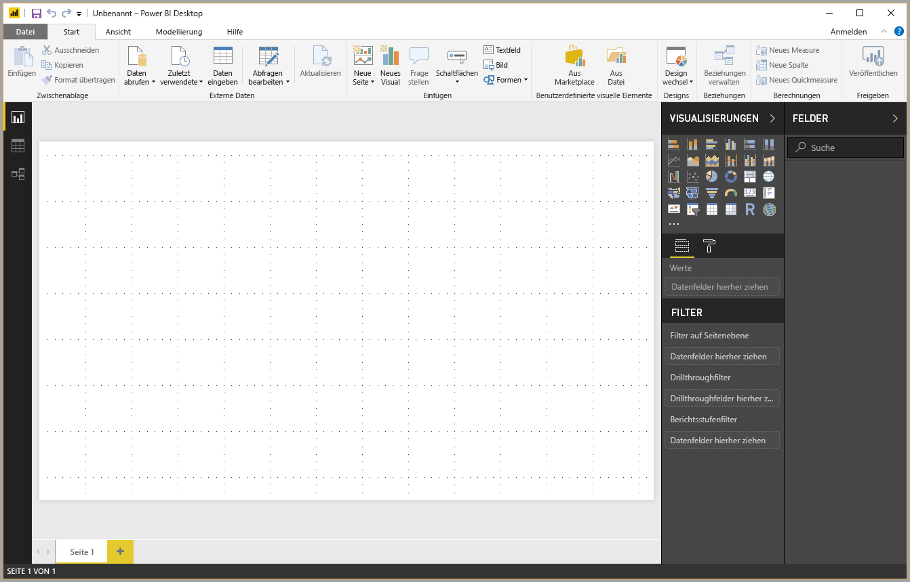
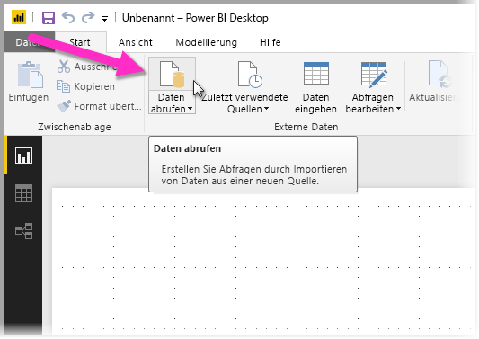
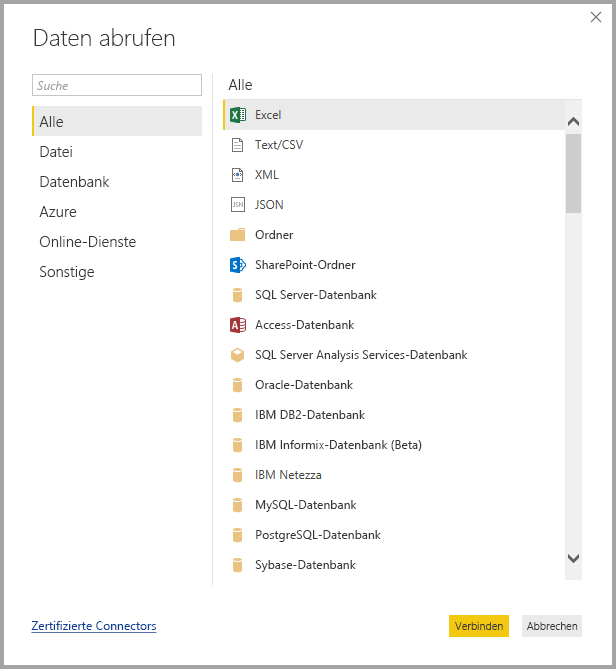
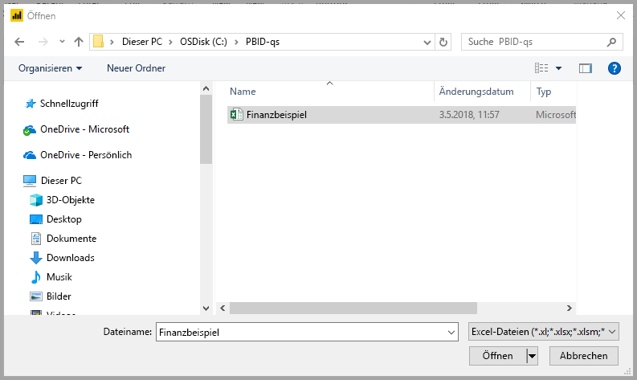
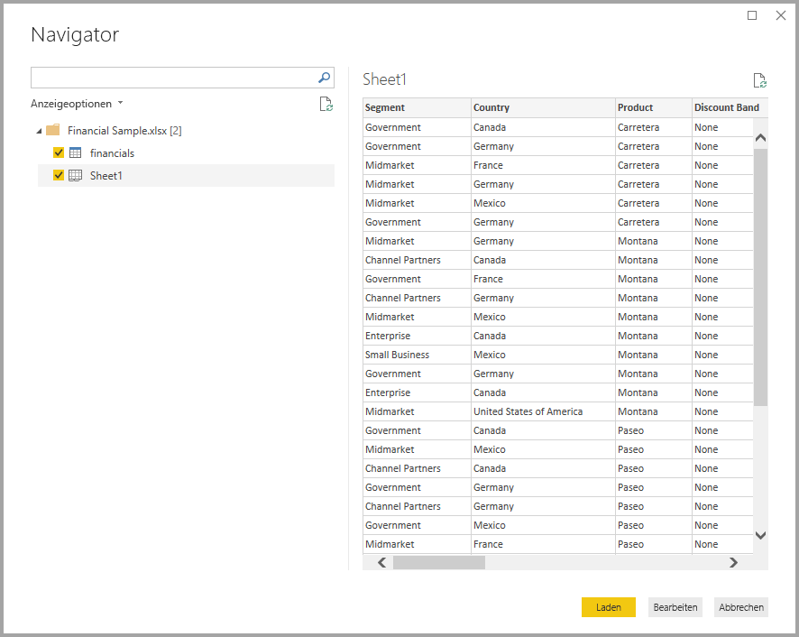
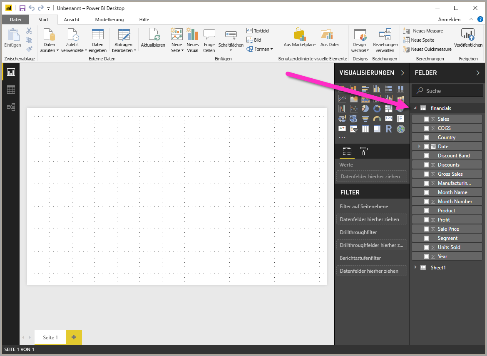

# Schnellstart: Verbinden mit Daten in Power BI Desktop

In dieser Schnellstartanleitung stellen Sie über Power BI Desktop eine Verbindung mit Daten her. Darin besteht der erste Schritt beim Erstellen von Datenmodellen und Berichten.

Wenn Sie noch nicht bei Power BI registriert sind, müssen Sie sich zuerst für eine [kostenlose Testversion registrieren](https://app.powerbi.com/signupredirect?pbi_source=web).

## Voraussetzungen

Zum Ausführen der Schritte in diesem Artikel benötigen Sie folgende Ressourcen:

* Laden Sie die kostenlose Anwendung Power BI Desktop auf Ihren lokalen Computer herunter, und installieren Sie diese. Sie können Power BI Desktop [direkt](https://powerbi.microsoft.com/desktop) oder über den [Microsoft Store](https://aka.ms/pbidesktopstore) herunterladen.
* [Laden Sie diese Excel-Beispielarbeitsmappe herunter](https://go.microsoft.com/fwlink/?LinkID=521962), und erstellen Sie den Ordner *C:\PBID-qs*, in dem Sie die Excel-Datei speichern können. Bei den späteren Schritten in dieser Schnellstartanleitung wird davon ausgegangen, dass die heruntergeladene Excel-Arbeitsmappe an diesem Speicherort gespeichert ist.
* Bei vielen Datenconnectors in Power BI Desktop muss Internet Explorer 10 oder höher für die Authentifizierung verwendet werden.

## Starten von Power BI Desktop

Nachdem Sie Power BI Desktop installiert haben, starten Sie die Anwendung, sodass sie auf Ihrem lokalen Computer ausgeführt wird. Ein Tutorial für Power BI wird angezeigt. Befolgen Sie das Tutorial, oder schließen Sie das Dialogfeld, um mit einer leeren Canvas zu beginnen. Auf der Canvas erstellen Sie Visuals und Berichte aus Ihren Daten.

## Verbinden mit Daten

Mit Power BI Desktop können Sie Verbindungen mit verschiedenen Arten von Daten herstellen. Diese umfassen Standarddatenquellen wie Microsoft Excel-Dateien. Sie können eine Verbindung mit Onlinediensten herstellen, die unterschiedlichste Datentypen enthalten, z. B. Salesforce, Microsoft Dynamics, Azure Blob Storage und viele weitere.

Wählen Sie zum Herstellen einer Verbindung mit Daten im Menüband **Start** den Eintrag **Daten abrufen** aus.

Das Fenster **Daten abrufen** wird geöffnet. In diesem können Sie aus den vielen verschiedenen Datenquellen auswählen können, mit denen Power BI Desktop eine Verbindung herstellen kann. In diesem Schnellstart verwenden Sie die Excel-Arbeitsmappe, die Sie unter [Voraussetzungen](#prerequisites) heruntergeladen haben.

Da es sich bei der Datenquelle um eine Excel-Datei handelt, wählen Sie im Fenster **Daten abrufen** die Option **Excel** aus und klicken dann auf **Verbinden**.

Power BI fordert Sie dazu auf, den Speicherort der Excel-Datei anzugeben, mit der Sie eine Verbindung herstellen möchten. Die heruntergeladene Datei heißt *Financial Sample*. Wählen Sie diese Datei aus, und klicken Sie auf **Öffnen**.

Power BI Desktop lädt die Arbeitsmappe, liest den Inhalt und zeigt im Fenster **Navigator** die in der Datei verfügbaren Daten an. In diesem Fenster können Sie die Daten auswählen, die in Power BI Desktop geladen werden sollen. Wählen Sie die Tabellen aus, indem Sie die Kontrollkästchen neben jeder Tabelle aktivieren, die Sie importieren möchten. Importieren Sie beide verfügbaren Tabellen.

Nachdem Sie Ihre Auswahl getroffen haben, klicken Sie auf **Laden**, um die Daten in Power BI Desktop zu importieren.

## Anzeigen von Daten im Bereich „Felder“

Nachdem Sie die Tabellen geladen haben, werden die Daten im Bereich **Felder** angezeigt. Sie können jede Tabelle erweitern, indem Sie auf den Pfeil neben dem Tabellennamen klicken. In der folgenden Abbildung ist die Tabelle *financials* erweitert, und jedes Feld wird angezeigt.

Und das ist auch schon alles! Sie haben in Power BI Desktop eine Verbindung mit Daten hergestellt, diese Daten geladen und können jetzt alle verfügbaren Felder in diesen Tabellen anzeigen.

## Nächste Schritte

In Power BI Desktop können Sie nach dem Herstellen einer Verbindung mit Daten verschiedene Aufgaben ausführen. Sie können beispielsweise Visuals und Berichte erstellen. Sehen Sie sich folgende Ressourcen an, um loszulegen:

* [Erste Schritte mit Power BI Desktop](desktop-getting-started.md)
