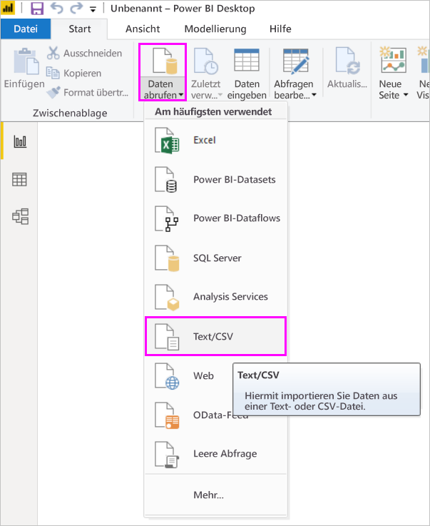

# <a name="use-r-in-query-editor"></a>Verwenden von R im Abfrage-Editor

[**R**](https://mran.microsoft.com/documents/what-is-r) ist eine leistungsfähige Programmiersprache, die von vielen Statistikern, Data Scientists und Data Analysts verwendet wird. Mit **R** können Sie im **Abfrage-Editor** von Power BI Desktop folgende Aufgaben durchführen:

* Vorbereiten von Datenmodellen

* Erstellen von Berichten

* Bereinigen von Daten, Strukturieren von Daten mit modernen Methoden und Analysieren von Datasets, was auch die Vervollständigung fehlender Daten, Vorhersagen, Clustering und vieles mehr einschließt  

## <a name="install-r"></a>Installieren von R

Sie können **R** kostenlos über die [Downloadseite von Revolution Open](https://mran.revolutionanalytics.com/download/) und aus dem [CRAN-Repository](https://cran.r-project.org/bin/windows/base/) herunterladen.

### <a name="install-mice"></a>Installieren von „mice“

Die [**mice**-Bibliothek](https://www.rdocumentation.org/packages/mice/versions/3.5.0/topics/mice) muss in Ihrer R-Umgebung installiert sein. Ohne **mice** wird der Code im Beispielskript nicht richtig ausgeführt. Im **mice**-Paket ist eine Methode zum Umgang mit fehlenden Daten implementiert.

So installieren Sie **mice**:

1. Starten Sie das Programm „R. exe“ (z. B. unter C:\Programme\Microsoft\R Open\R-3.5.3\bin\R.exe).  

2. Führen Sie den Installationsbefehl aus:

   ``` 
   >  install.packages('mice') 
   ```

## <a name="use-r-in-query-editor"></a>Verwenden von R im Abfrage-Editor

Im Folgenden wird demonstriert, wie Sie **R** im **Abfrage-Editor** verwenden können. Dazu nutzen Sie ein Beispieldataset, das sich in einer CSV-Datei befindet und Börsendaten enthält, und führen die folgenden Schritte aus:

1. [Laden Sie die Datei **EuStockMarkets_NA.csv** herunter](http://download.microsoft.com/download/F/8/A/F8AA9DC9-8545-4AAE-9305-27AD1D01DC03/EuStockMarkets_NA.csv). Merken Sie sich, wo Sie sie gespeichert haben.

1. Laden Sie die Datei in **Power BI Desktop**. Klicken Sie dazu im Menüband **Start** auf **Daten abrufen > Text/CSV**.

   

1. Wählen Sie die Datei aus, und klicken Sie dann auf **Öffnen**. Die CSV-Daten werden im Dialogfeld **Text/CSV file** (Text/CSV-Datei) angezeigt.

   

1. Nachdem die Daten geladen wurden, werden sie im Bereich **Felder** angezeigt.

   

1. Klicken Sie im Menüband **Start** auf **Abfragen bearbeiten**, um den **Abfrage-Editor** zu öffnen.

   

1. Klicken Sie im Menüband **Transformieren** auf **R-Skript ausführen**. Der Editor **R-Skript ausführen** wird angezeigt.  

   In den Zeilen 15 und 20 sowie in weiteren Zeilen, die nicht auf dem Screenshot zu sehen sind, fehlen Daten. Die unten aufgeführten Schritte verdeutlichen, wie R diese Zeilen automatisch vervollständigt.

   

1. Geben Sie für dieses Beispiel den unten stehenden Skriptcode ein. Ersetzen Sie „&lt;Your File Path&gt;“ durch den Pfad zu **EuStockMarkets_NA.csv** auf Ihrem lokalen Dateisystem. Dieser könnte z. B. wie folgt aussehen: C:/Benutzer/John Doe/Dokumente/Microsoft/EuStockMarkets_NA.csv.

    ```r
       dataset <- read.csv(file="<Your File Path>/EuStockMarkets_NA.csv", header=TRUE, sep=",")
       library(mice)
       tempData <- mice(dataset,m=1,maxit=50,meth='pmm',seed=100)
       completedData <- complete(tempData,1)
       output <- dataset
       output$completedValues <- completedData$"SMI missing values"
    ```

7. Nach dem Klicken auf **OK** wird im **Abfrage-Editor** ein Hinweis zum Datenschutz angezeigt.

   
8. Legen Sie für alle Datenquellen die Einstellung **Öffentlich** fest, damit R-Skripts im Power BI-Dienst richtig ausgeführt werden. Weitere Informationen zu den Datenschutzeinstellungen und deren Bedeutung finden Sie unter [Sicherheitsstufen](desktop-privacy-levels.md).

   

   Klicken Sie auf **Speichern**, um das Skript auszuführen. Im Bereich **Felder** wird eine neue Spalte mit dem Namen **completedValues** angezeigt. Beachten Sie, dass einige Datenelemente fehlen, z.B. in Zeile 15 und 18. Im nächsten Abschnitt sehen Sie, wie dies von R behandelt wird.

   Mit einigen wenigen Zeilen R-Skript konnte der **Abfrage-Editor** die fehlenden Werte anhand eines Vorhersagemodells einfügen.

## <a name="create-visuals-from-r-script-data"></a>Erstellen von Visuals aus Daten in R-Skripts

Wir können jetzt ein visuelles Element erstellen, um zu sehen, wie der R-Skript-Code mithilfe des Pakets **mice** die fehlenden Werte eingefügt hat, wie in der folgenden Abbildung dargestellt:


Sie können die vollständigen Visuals in einer **Power BI Desktop**-Datei im PBIX-Format speichern und das Datenmodell sowie die zugehörigen R-Skripts im Power BI-Dienst verwenden.

> [!NOTE]
> Sie können eine [PBIX-Datei herunterladen](http://download.microsoft.com/download/F/8/A/F8AA9DC9-8545-4AAE-9305-27AD1D01DC03/Complete%20Values%20with%20R%20in%20PQ.pbix), in der diese Schritte bereits ausgeführt wurden.

Nachdem Sie die PBIX-Datei in den Power BI-Dienst hochgeladen haben, müssen Sie zusätzliche Schritte ausführen, um die Aktualisierung der Dienstdaten und die aktualisierten Visuals zu aktivieren:  

* **Aktivieren geplanter Aktualisierungen für das Dataset:** Informationen zum Aktivieren geplanter Aktualisierungen für die Arbeitsmappe, die das Dataset mit R-Skripts enthält, finden Sie unter [Konfigurieren geplanter Aktualisierungen](refresh-scheduled-refresh.md). Dort finden Sie auch Informationen zu **persönlichen Gateways**.

* **Installieren des persönlichen Gateways:** Auf dem Computer, auf dem sich die Datei und **R** befinden, muss ein **persönliches Gateway** installiert sein. Der Power BI-Dienst greift auf diese Arbeitsmappe zu und rendert alle aktualisierten Visuals neu. Weitere Informationen finden Sie unter [Installieren und Konfigurieren von persönlichen Gateways](service-gateway-personal-mode.md).

## <a name="limitations"></a>Einschränkungen

Für Abfragen, die im **Abfrage-Editor** erstellte R-Skripts enthalten, gelten einige Einschränkungen:

* Für alle R-Datenquellen muss die Einstellung **Öffentlich** festgelegt werden. Dasselbe gilt auch für alle anderen Schritte einer Abfrage im **Abfrage-Editor**. Klicken Sie in **Power BI Desktop** auf **Datei > Optionen und Einstellungen > Datenquelleneinstellungen**.

  

  Wählen Sie im Dialogfeld **Datenquelleneinstellungen** die Datenquellen aus, und klicken Sie dann auf **Berechtigungen bearbeiten...** .  Legen Sie für **Sicherheitsstufe** die Einstellung **Öffentlich** fest.

      
* Wenn Sie geplante Aktualisierungen der R-Visuals oder des Datasets zulassen möchten, müssen Sie **Geplante Aktualisierung** aktivieren. Auf dem Computer, auf dem sich die Arbeitsmappe und die **R**-Installation befinden, muss außerdem ein **persönliches Gateway** installiert sein. Weitere Informationen zu beiden Features finden Sie im vorherigen Abschnitt dieses Artikels, der Links zu weiteren Informationen über jedes dieser Features enthält.

R und benutzerdefinierte Abfragen bieten Ihnen unzählige Möglichkeiten – Sie können Daten analysieren und genau so strukturieren, wie sie dargestellt werden sollen.

## <a name="next-steps"></a>Nächste Schritte

* [Einführung in R](https://mran.microsoft.com/documents/what-is-r) 

* [Ausführen von R-Skripts in Power BI Desktop](desktop-r-scripts.md) 

* [Verwenden einer externen R-IDE mit Power BI](desktop-r-ide.md) 

* [R-Pakete im Power BI-Dienst](service-r-packages-support.md)
