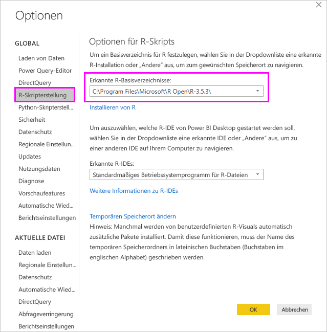
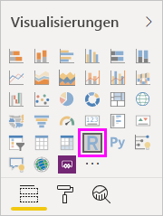
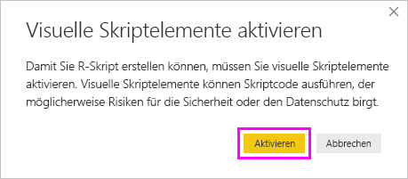

# <a name="create-power-bi-visuals-using-r"></a>Erstellen von Power BI-Visualisierungen mithilfe von R
Mit Power BI Desktop können Sie *R* zum Visualisieren Ihrer Daten verwenden. [R](https://mran.revolutionanalytics.com/documents/what-is-r) ist eine Sprache und Umgebung für statistische Berechnungen und Grafiken.

## <a name="install-r"></a>Installieren von R
Standardmäßig ist die R-Engine in Power BI Desktop nicht enthalten, und sie wird von Power BI Desktop nicht bereitgestellt oder installiert. Damit Sie R-Skripts in Power BI Desktop ausführen können, müssen Sie R eigens auf dem lokalen Computer installieren. R können Sie an vielen Stellen im Internet kostenlos herunterladen und installieren, u. a. von der [Revolution R Open](https://mran.revolutionanalytics.com/download/)-Downloadseite und aus dem [CRAN-Repository](https://cran.r-project.org/bin/windows/base/). Die aktuelle Version der R-Skripterstellung in Power BI Desktop unterstützt Unicode-Zeichen ebenso wie Leerzeichen (leere Zeichen) im Installationspfad.

## <a name="enable-r-visuals-in-power-bi-desktop"></a>Aktivieren von R-Visuals in Power BI Desktop
Nachdem Sie R installiert haben, wird es von Power BI Desktop automatisch aktiviert. Führen Sie die folgenden Schritte aus, um zu überprüfen, ob Power BI Desktop R am richtigen Speicherort aktiviert hat: 

1. Klicken Sie im Menü von Power BI Desktop auf **Datei** > **Optionen und Einstellungen** > **Optionen**. 

2. Wählen Sie links auf der Seite **Optionen** unter **Global** die Option **R-Skripterstellung** aus. 

3. Vergewissern Sie sich, dass unter **Optionen für R-Skripts** Ihre lokale R-Installation in **Erkannte R-Basisverzeichnisse** angegeben ist und der lokalen R-Installation entspricht, die Power BI Desktop verwenden soll. In der folgenden Abbildung lautet der Pfad der lokalen R-Installation **C:\Program Files\R Open\R-3.5.3\\** .
   
   

Nachdem Sie Ihre Installation von R überprüft haben, können Sie mit dem Erstellen von R-Visuals beginnen.

## <a name="create-r-visuals-in-power-bi-desktop"></a>Erstellen von R-Visuals in Power BI Desktop
1. Wählen Sie zum Hinzufügen eines visuellen R-Elements das Symbol **visuelle R-Elemente** im Bereich **Visualisierung**.
   
   

2. Klicken Sie im daraufhin angezeigten Fenster **Visuelle Skriptelemente aktivieren** auf **Aktivieren**.

   

   Wenn Sie einem Bericht ein visuelles R-Element hinzufügen, nimmt Power BI Desktop folgende Änderungen vor:
   
   - Im Berichtszeichenbereich wird ein Platzhalterbild für ein R-Visual angezeigt.
   
   - Am unteren Rand des mittleren Bereichs wird der **R-Skript-Editor** angezeigt.
   
   

3. Ziehen Sie wie bei jedem anderen Power BI Desktop-Visual im Abschnitt **Werte** des Bereichs **Visualisierung** Felder aus dem Bereich **Felder**, die Sie in Ihrem R-Skript verwenden möchten. Alternativ können Sie auch die Felder direkt im Bereich **Felder** auswählen.
    
    Für Ihr R-Skript sind nur Felder verfügbar, die dem Bereich **Werte** hinzugefügt wurden. Sie können im Bereich **Werte** neue Felder hinzufügen und nicht benötigte Felder entfernen, während Sie das R-Skript im **R-Skript-Editor** bearbeiten. Power BI Desktop erkennt automatisch, welche Felder hinzugefügt oder entfernt wurden.
   
   > [!NOTE]
   > Der Standardaggregationstyp für R-Visuals lautet *Nicht zusammenfassen*.
   > 
   > 
   
4. Jetzt können Sie die Daten verwenden, die Sie zum Erstellen einer Zeichnung ausgewählt haben: 

    - Während Sie Felder auswählen, generiert der **R-Skript-Editor** unterstützenden, gebundenen R-Skript-Code für diese Felder im grauen Abschnitt im oberen Bereich des Editors.
    - Wenn Sie ein Feld entfernen, entfernt der **R-Skript-Editor** den unterstützenden Code für dieses Feld automatisch.
   
   Im Beispiel in der folgenden Abbildung sind drei Felder ausgewählt: „hp“, „gear“ und „drat“. Aufgrund dieser Auswahl generiert der R-Skript-Editor Bindungscode, der wie folgt zusammengefasst wird:
   
   * Erstellen Sie einen Datenrahmen mit dem Namen **dataset**, der aus den vom Benutzer ausgewählten verschiedenen Feldern besteht.
   * Die Standardaggregation lautet *Nicht zusammenfassen*.
   * Ähnlich wie bei Tabellenvisualisierungen werden Felder gruppiert und doppelte Zeilen nur einmal angezeigt.
   
   
   
   > [!TIP]
   > In bestimmten Fällen sind Gruppierungen möglicherweise nicht erwünscht, oder es sollen alle Zeilen, einschließlich doppelter Zeilen, angezeigt werden. In diesem Fall fügen Sie dem Dataset ein Indexfeld hinzu, sodass alle Zeilen als eindeutig betrachtet werden und keine Gruppierung erfolgt.
   > 
   > 
   
   Der generierte Datensatz erhält den Namen **dataset**, und Sie können auf die ausgewählten Spalten über ihre Namen zugreifen. Greifen Sie beispielsweise auf das Feld „gear“ zu, indem Sie *dataset$gear* in Ihrem R-Skript hinzufügen. Verwenden Sie für Felder mit Leerzeichen oder Sonderzeichen einfache Anführungszeichen.

5. Mit dem Datenrahmen, der automatisch anhand der von Ihnen ausgewählten Felder generiert wurde, können Sie ein R-Skript schreiben, das von Power BI Desktop auf dem R-Standardgerät ausgegeben wird. Nachdem Sie das Skript fertig gestellt haben, wählen Sie **Skript ausführen** auf der rechten Seite der **R-Skript-Editor**-Titelleiste aus.
   
    Bei Auswahl von **Skript ausführen** identifiziert Power BI Desktop die Zeichnung und stellt sie im Zeichenbereich dar. Da der Vorgang in der lokalen R-Installation ausgeführt wird, stellen Sie sicher, dass die erforderlichen R-Pakete installiert sind.
   
   Power BI Desktop zeichnet die Visualisierung neu, wenn eines der folgenden Ereignisse eintritt:
   
   * Wählen Sie auf der Titelleiste des **R-Skript-Editors** **Ausführen** aus.
   * Durch Aktualisieren, Filtern oder Hervorheben von Daten wird eine Datenänderung ausgeführt.

     Die folgende Abbildung zeigt ein Beispiel für den Korrelationszeichnungscode, in dem die Korrelationen zwischen Attributen verschiedener Autotypen gezeichnet werden.

     

6. Um eine größere Ansicht der Visualisierungen zu erhalten, minimieren Sie den **R-Skript-Editor**. Sie können das Korrelationsdiagramm wie andere Visuals in Power BI Desktop kreuzfiltern, indem Sie im Ringdiagrammvisual (das runde Visual auf der rechten Seite) einen bestimmten Abschnitt (z. B. Sportwagen) auswählen.

    

7. Ändern Sie das R-Skript, um das Visual anzupassen, und nutzen Sie die Funktionsvielfalt von R, indem Sie dem Zeichenbefehl Parameter hinzufügen.

    Der ursprüngliche Zeichenbefehl lautet wie folgt:

    ```
    corrplot(M, method = "color",  tl.cex=0.6, tl.srt = 45, tl.col = "black")
    ```

    Ändern Sie das R-Skript so, dass der Zeichenbefehl wie folgt aussieht:

    ```
    corrplot(M, method = "circle", tl.cex=0.6, tl.srt = 45, tl.col = "black", type= "upper", order="hclust")
    ```

    Deshalb zeichnet jetzt das visuelle R-Element Kreise, berücksichtigt nur die obere Hälfte und ordnet die Matrix neu an, um korrelierte Attribute zu gruppieren.

    

    Wenn Sie ein R-Skript ausführen, das zu einem Fehler führt, wird anstelle des R-Visual-Diagramms eine Fehlermeldung im Zeichenbereich angezeigt. Um Informationen zu dem Fehler zu erhalten, wählen Sie in der Fehlermeldung des R-Visuals **Details anzeigen** aus.

    

## <a name="r-scripts-security"></a>Sicherheit der R-Skripts 
R-Visuals werden aus R-Skripts erstellt, die Code mit Sicherheits- oder Datenschutzrisiken enthalten können. Wenn ein Benutzer ein R-Visual zum ersten Mal aufruft oder damit interagiert, wird eine Sicherheitswarnmeldung angezeigt. Aktivieren Sie visuelle R-Elemente nur dann, wenn Sie dem Autor und der Quelle vertrauen, oder wenn Sie die zugehörigen Skripts überprüft und nachvollzogen haben.


## <a name="known-limitations"></a>Bekannte Einschränkungen
Für R-Visuals in Power BI Desktop gelten die folgenden Einschränkungen:

* Datengrößen: Die vom R-Visual zum Zeichnen verwendeten Daten sind auf 150.000 Zeilen beschränkt. Bei Auswahl von mehr als 150.000 Zeilen werden nur die oberen 150.000 Zeilen verwendet, und im Bild wird eine Meldung angezeigt.

* Auflösung: Alle visuellen R-Elemente werden mit 72 DPI angezeigt.

* Berechnungszeiten: Wenn die Berechnung eines R-Visuals fünf Minuten überschreitet, verursacht dies einen Timeoutfehler.

* Beziehungen: Wie bei anderen Power BI Desktop-Visuals tritt ein Fehler auf, wenn Datenfelder aus unterschiedlichen Tabellen ausgewählt werden, zwischen denen keine Beziehung definiert ist.

* Aktualisierungen: Visuelle R-Elemente werden aktualisiert, wenn Daten aktualisiert, gefiltert oder hervorgehoben werden. Das Bild selbst ist jedoch nicht interaktiv und kann nicht als Quelle für die Kreuzfilterung verwendet werden.

* Hervorhebungen: R-Visuals reagieren auf das Hervorheben anderer Visuals. Sie können jedoch keine Elemente im R-Visual auswählen, um eine Kreuzfilterung für andere Elemente durchzuführen.

* Anzeigegeräte: Nur auf dem R-Standardanzeigegerät erzeugte Zeichnungen werden im Zeichenbereich ordnungsgemäß angezeigt. Verwenden Sie nicht explizit ein anderes R-Anzeigegerät.

* RRO-Installationen: In diesem Release werden RRO-Installationen von der 32-Bit-Version von Power BI Desktop nicht automatisch erkannt. Daher müssen Sie den Pfad zum R-Installationsverzeichnis unter **Optionen und Einstellungen** > **Optionen** > **R-Skripterstellung** manuell angeben.

## <a name="next-steps"></a>Nächste Schritte
Weitere Informationen zu R in Power BI finden Sie in den folgenden Artikeln:

* [Ausführen von R-Skripts in Power BI Desktop](desktop-r-scripts.md)
* [Verwenden einer externen R-IDE mit Power BI](desktop-r-ide.md)

