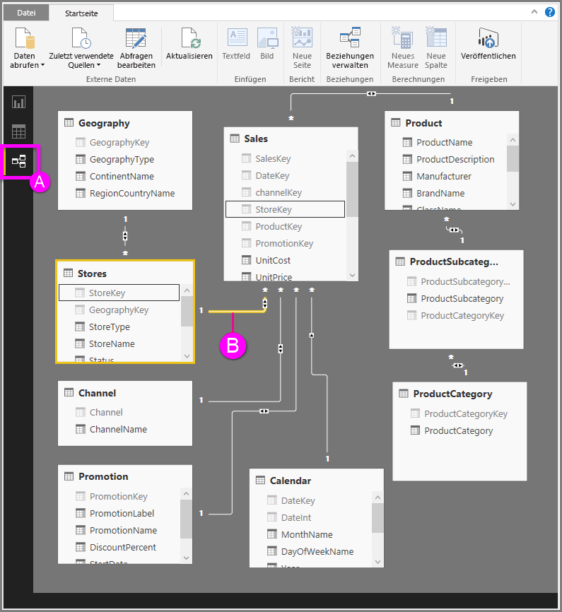

# Arbeiten mit der Beziehungsansicht in Power BI Desktop
Die **Beziehungsansicht** zeigt alle Tabellen, Spalten und Beziehungen in Ihrem Modell. Dies kann besonders hilfreich sein, wenn Ihr Modell über komplexe Beziehungen zwischen vielen Tabellen verfügt.

Schauen wir uns das mal an.

**A.**  Symbol „Beziehungsansicht“: Klicken Sie darauf, um das Modell in der Beziehungsansicht zu zeigen.

**B.** Beziehung: Sie können den Mauszeiger über eine Beziehung führen, um die verwendeten Spalten anzuzeigen. Doppelklicken Sie auf eine Beziehung, um sie im Dialogfeld **Beziehung bearbeiten** zu öffnen. 

In der obigen Abbildung sehen Sie, dass die Tabelle *Stores* über die Spalte *StoreKey* verfügt, die mit der Tabelle *Sales* verknüpft ist, die ebenfalls eine Spalte *StoreKey* besitzt. Wir sehen, dass dies eine *N zu Eins*-Beziehung (\*: 1) ist und dass das Symbol in der Mitte der Zeile den Kreuzfilter so anzeigt, dass die Richtung auf *Beide* festgelegt ist. Der Pfeil auf dem Symbol zeigt die Richtung des Filterkontextflows.

Weitere Informationen über Beziehungen finden Sie unter [Erstellen und Verwalten von Beziehungen in Power BI Desktop](desktop-create-and-manage-relationships.md).

