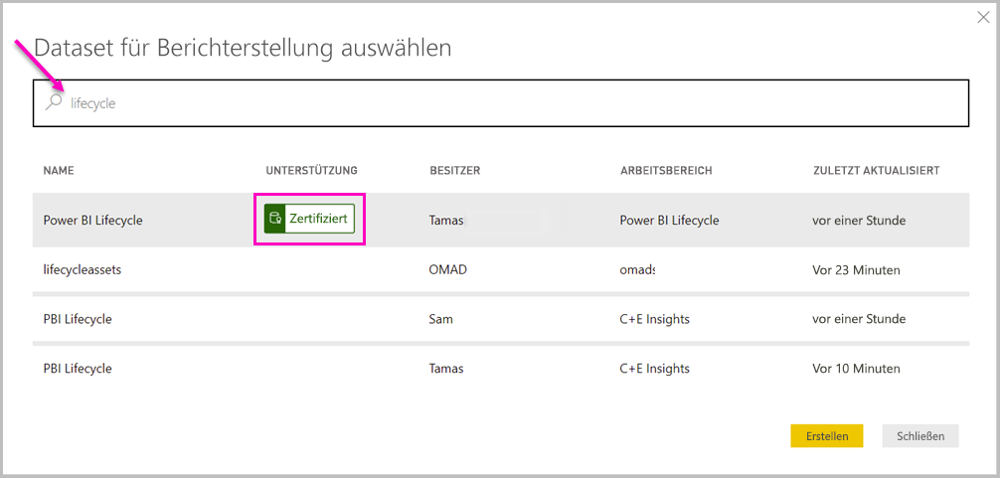

# Herstellen einer Verbindung mit Datasets im Power BI-Dienst über Power BI Desktop

Sie können eine Liveverbindung mit einem gemeinsam genutzten Dataset im *Power BI-Dienst* herstellen und auf Grundlage des gleichen Datasets viele verschiedene Berichte erstellen. Damit können Sie in Power BI Desktop Ihr perfektes Datenmodell erstellen und dieses im Power BI-Dienst veröffentlichen. Anschließend können Sie und andere Benutzer aus diesem gemeinsam verwendeten Datenmodell mehrere unterschiedliche Berichte (als separate *PBIX*-Dateien) erstellen und in unterschiedlichen Arbeitsbereichen speichern. Dieses Feature heißt *Liveverbindung mit Power BI-Dienst*.

Der vorliegende Artikel geht auf die zahlreichen Vorteile dieses Features sowie auf Best Practices ein. Es wird empfohlen, sich die [Einschränkungen und Überlegungen](#limitations-and-considerations) zu dieser Funktion anzusehen.

## Verwenden einer Liveverbindung mit dem Power BI-Dienst für die Verwaltung des Berichtslebenszyklus

Eine der Herausforderungen im Zusammenhang mit der Beliebtheit von Power BI liegt in der Verbreitung von Berichten, Dashboards und den jeweils zugrunde liegenden Datenmodellen. Sie können ganz einfach eindrucksvolle Berichte in Power BI Desktop erstellen, diese dann im Power BI-Dienst [veröffentlichen](desktop-upload-desktop-files.md) und anschließend auf der Grundlage dieser Datasets erstklassige Dashboards erstellen. Da viele Benutzer so vorgehen und dabei häufig dieselben (oder zumindest sehr ähnliche) Datasets verwendet werden, lässt sich häufig nicht mehr so einfach nachvollziehen, welcher Bericht denn nun auf welchem Dataset basiert – und wie aktuell das jeweilige Dataset ist. Das Feature „Liveverbindung mit Power BI-Dienst“ ist die Antwort auf dieses Problem und macht das Erstellen, Freigeben und Erweitern von Berichten und Dashboards mit einem gemeinsamen Dataset einfacher und konsistenter.

### Erstellen und Freigeben eines von allen nutzbaren Datasets

Ein Beispiel: Anna ist Business Analyst in Ihrem Team. Sie verfügt über die entsprechenden Kenntnisse, um sehr gute Datenmodelle (häufig als Datasets bezeichnet) zu erstellen. Anna kann ein Dataset und einen Bericht erstellen und diesen Bericht anschließend im Power BI-Dienst freigeben.

Alle sind von Annas Bericht und Dataset begeistert. Aber genau da beginnen die Probleme: Jeder in Annas Team versucht, eine *eigene Version* dieses Datasets zu erstellen und anschließend seine eigenen Berichte für das Team freizugeben. Plötzlich enthält der Arbeitsbereich Ihres Teams im Power BI-Dienst zahlreiche verschiedene Berichte, die jeweils auf unterschiedlichen Datasets basieren. Welches davon ist auf dem neuesten Stand? Waren die Datasets identisch, oder doch nur annähernd gleich? Wo lagen die Unterschiede? Mit dem Feature „Liveverbindung mit Power BI-Dienst“ lässt sich all das vermeiden. Im nächsten Abschnitt erfahren Sie, wie andere Benutzer das von Anna veröffentlichte Dataset für ihre eigenen Berichte in Ihren eigenen Arbeitsbereichen verwenden können und wie Sie es allen Benutzern ermöglichen, ihre individuellen Berichte auf der Grundlage des gleichen fundierten, geprüften und veröffentlichten Datasets zu erstellen.

### Herstellen einer Liveverbindung mit einem Dataset des Power BI-Diensts

Anna erstellt einen Bericht und das zugrunde liegende Dataset. Dann veröffentlicht sie den Bericht im Power BI-Dienst. Auf diese Weise wird der Bericht im Power BI-Dienst-Arbeitsbereich ihres Teams angezeigt. Wenn Anna den Bericht in einem *neuen Arbeitsbereich* speichert, kann sie die *Berechtigung „Erstellen“* festlegen, um den Bericht für jeden Benutzer innerhalb und außerhalb ihres Arbeitsbereichs verfügbar und nutzbar zu machen.

Weitere Informationen zu den neuen Arbeitsbereichen finden Sie unter [Arbeitsbereiche](service-new-workspaces.md).

Andere Mitglieder innerhalb und außerhalb von Annas Arbeitsbereich können nun mithilfe des Features „Liveverbindung mit Power BI-Dienst“ eine Liveverbindung mit dem von Anna freigegebenen Datenmodell herstellen. Sie können basierend auf dem *ursprünglichen Dataset* eigene Berichte *in eigenen neuen Arbeitsbereichen* erstellen.

In der folgenden Abbildung sehen Sie, wie Anna einen Power BI Desktop-Bericht erstellt und ihn (einschließlich des zugehörigen Datenmodells) im Power BI-Dienst veröffentlicht. Anschließend können andere Benutzer mithilfe des Features „Liveverbindung mit Power BI-Dienst“ eine Verbindung mit Annas Datenmodell herstellen und auf der Grundlage von Annas Dataset eigene Berichte in ihren eigenen Arbeitsbereichen erstellen.

> [!NOTE]
> Wenn Sie Ihr Dataset in einem [klassischen freigegebenen Arbeitsbereich](service-create-workspaces.md) speichern, können nur Mitglieder dieses Arbeitsbereichs Berichte basierend auf Ihrem Dataset erstellen. Wenn Sie eine Liveverbindung mit dem Power BI-Dienst herstellen möchten, muss sich das Dataset, mit dem Sie die Verbindung herstellen, in einem gemeinsam genutzten Arbeitsbereich befinden, dem Sie selbst angehören.
> 
> 

## Schrittanleitung zum Verwenden der Liveverbindung mit dem Power BI-Dienst

Nachdem Sie nun wissen, wie praktisch das Feature „Liveverbindung mit Power BI-Dienst“ ist und wie Sie es als Best Practice für die Verwaltung des Berichtslebenszyklus verwenden können, erfahren Sie als Nächstes, welche Schritte erforderlich sind, um von Annas Bericht (und Dataset) zu einem freigegebenen Dataset zu gelangen, das von ihren Teamkollegen in ihrem Power BI-Arbeitsbereich verwendet werden kann.

### Veröffentlichen eines Power BI-Berichts und eines Datasets

Für die Berichtslebenszyklusverwaltung mithilfe des Features „Liveverbindung mit Power BI-Dienst“ wird zunächst ein für die Teamkollegen interessanter Bericht (und ein Dataset) benötigt. Anna muss den Bericht also zunächst aus Power BI Desktop *veröffentlichen*. Wählen Sie in Power BI Desktop im Menüband **Start** den Befehl **Veröffentlichen** aus.

Falls Anna nicht bei ihrem Power BI-Dienstkonto angemeldet ist, wird sie von Power BI zur Anmeldung aufgefordert.

Hier kann Anna den gewünschten Zielarbeitsbereich für die Veröffentlichung des Berichts und des Datasets auswählen. Denken Sie daran: Wenn Anna das Dataset in einem neuen Arbeitsbereich speichert, kann jeder mit Berechtigung zum Erstellen auf das Dataset zugreifen. Erstellberechtigungen werden im Power BI-Dienst nach der Veröffentlichung festgelegt. Werden Arbeitsdaten in einem klassischen Arbeitsbereich gespeichert, können nur Mitglieder mit Zugriff auf den Arbeitsbereich, in dem ein Bericht veröffentlicht wird, über das Feature „Liveverbindung mit Power BI-Dienst“ auf das entsprechende Dataset zugreifen.

Der Vorgang zur Veröffentlichung beginnt und kann in Power BI Desktop nachverfolgt werden.

Nach Abschluss des Vorgangs werden in Power BI Desktop eine Erfolgsmeldung, einige Links zum eigentlichen Bericht im Power BI-Dienst sowie ein Link zu Schnelleinblicken für den Bericht angezeigt.

Nachdem der Bericht mit dem zugehörigen Dataset nun im Power BI-Dienst veröffentlicht wurde, können Sie ihn *bewerben*. Auf diese Weise können sie die Qualität und Zuverlässigkeit des Berichts bestätigen. Sie können zudem anfordern, dass er von zentralen Zertifizierungsstellen in Ihrem Power BI-Mandanten *zertifiziert* wird. Durch diese Empfehlungen wird Ihr Dataset immer oben in der Liste angezeigt, wenn Benutzer nach Datasets suchen. Weitere Informationen finden Sie im Artikel zum [Bewerben Ihres Datasets](service-datasets-promote.md).

Als letzten Schritt müssen Sie die Berechtigung „Erstellen“ für das Dataset festlegen, auf dem der Bericht basiert. Erstellberechtigungen legen fest, wer Ihr Dataset sehen und verwenden darf. Sie können die Berechtigungen entweder direkt im Arbeitsbereich oder beim Freigeben einer App im Arbeitsbereich festlegen. Weitere Informationen finden Sie unter [Berechtigung „Erstellen“ für freigegebene Datasets](service-datasets-build-permissions.md).

Als Nächstes erfahren Sie, wie Teamkollegen mit Zugriff auf den Arbeitsbereich, in dem der Bericht und das Dataset veröffentlichten wurden, eine Verbindung mit dem Dataset herstellen und eigene Berichte erstellen können.

### Herstellen einer Liveverbindung zwischen dem Power BI-Dienst und dem veröffentlichten Dataset

Wählen Sie in Power BI Desktop auf dem Menüband **Start** die Option **Daten abrufen** und anschließend im linken Bereich **Power Platform** und **Power BI-Datasets** aus, um eine Verbindung mit dem veröffentlichten Bericht herzustellen und einen eigenen Bericht auf der Grundlage des veröffentlichten Datasets zu erstellen.

Sofern Sie noch nicht angemeldet sind, werden Sie von Power BI zur Anmeldung aufgefordert. Nach der Anmeldung wird in Power BI angezeigt, in welchen Arbeitsbereichen Sie Mitglied sind. Sie können auswählen, welcher Arbeitsbereich das Dataset enthält, mit dem Sie eine Power BI-Liveverbindung herstellen möchten.

Die Datasets in der Liste sind alles freigegebene Datasets aller Arbeitsbereiche, für die Sie über Erstellberechtigungen verfügen. Sie können nach einem bestimmten Dataset suchen und dessen Namen, Besitzer und den entsprechenden Arbeitsbereich sowie die letzte Aktualisierung anzeigen. Außerdem werden oben in der Liste **EMPFEHLUNG** für Datasets angezeigt, die entweder zertifiziert oder beworben wurden.

Wenn Sie **Erstellen** auswählen, stellen Sie eine Liveverbindung mit dem ausgewählten Dataset her. Power BI Desktop lädt die angezeigten Felder und die zugehörigen Werte in Echtzeit in Power BI Desktop.

Nun können Sie und andere Benutzer auf der Grundlage desselben Datasets benutzerdefinierte Berichte erstellen und freigeben. Dieser Ansatz ist eine großartige Möglichkeit, eine sachkundige Person (wie z. B. Anna) einen wohlgeformten Datensatz erstellen zu lassen. Anschließend können die Teamkollegen dieses gemeinsame Dataset verwenden, um ihre eigenen Berichte zu erstellen.

## Einschränkungen und Überlegungen

Beim Verwendung des Features „Liveverbindung mit Power BI-Dienst“ müssen einige Einschränkungen und Überlegungen berücksichtigt werden.

* Nur Benutzer mit der Berechtigung „Erstellen“ für ein Dataset können mithilfe des Features „Liveverbindung mit Power BI-Dienst“ eine Verbindung mit einem veröffentlichten Dataset herstellen.
* Benutzer der kostenlosen Version sehen nur Datasets aus **Mein Arbeitsbereich** und aus Premium-Arbeitsbereichen.
* Da es sich um eine Liveverbindung handelt, sind der linke Navigationsbereich und die Modellierung deaktiviert. In jedem Bericht kann nur eine Verbindung mit einem Dataset hergestellt werden. Dieses Verhalten ähnelt dem bei der Verbindung mit *SQL Server Analysis Services*.
* Da es sich um eine Liveverbindung handelt, werden die Sicherheit auf Zeilenebene (Row Level Security, RLS) und andere Optionen für das Verbindungsverhalten erzwungen. Dies entspricht dem Verhalten bei der Verbindung mit SQL Server Analysis Services.
* Wenn der Besitzer die freigegebene *PBIX*-Originaldatei ändert, werden das Dataset und der im Power BI-Dienst freigegebene Bericht überschrieben. Berichte, die auf diesem Dataset basieren, werden nicht überschrieben. Änderungen des Datasets werden jedoch im Bericht widergespiegelt.
* Die Mitglieder eines Arbeitsbereichs können den ursprünglich freigegebenen Bericht nicht ersetzen. Wenn Sie es dennoch versuchen, wird eine Warnung angezeigt, in der Sie zum Umbenennen der Datei und Veröffentlichen des Berichts aufgefordert werden.
* Wenn Sie das freigegebene Dataset im Power BI-Dienst löschen, funktionieren andere Berichte, die darauf basieren, nicht mehr ordnungsgemäß oder zeigen die zugehörigen Visuals nicht mehr an.
* Bei Verwendung von Inhaltspaketen müssen Sie zunächst eine Kopie des Inhaltspakets erstellen, bevor Sie es als Grundlage für die Freigabe eines *PBIX*-Berichts und Datasets für den Power BI-Dienst verwenden.
* Wenn Inhaltspakete aus *Meine Organisation* kopiert wurden, können Sie den im Dienst erstellten Bericht und/oder einen Bericht, der beim Kopieren eines Inhaltspakets mit einer Liveverbindung erstellt wurde, nicht ersetzen. Wenn Sie es dennoch versuchen, wird eine Warnung angezeigt, in der Sie zum Umbenennen der Datei und Veröffentlichen des Berichts aufgefordert werden. In diesem Fall können Sie nur veröffentlichte Berichte mit Liveverbindung ersetzen.
* Nach dem Löschen eines freigegebenen Datasets im Power BI-Dienst kann niemand mehr über Power BI Desktop auf dieses Dataset zugreifen.
* Berichte, die ein Dataset im Power BI-Dienst freigeben, unterstützen keine automatisierten Bereitstellungen mithilfe der REST-API von Power BI.
