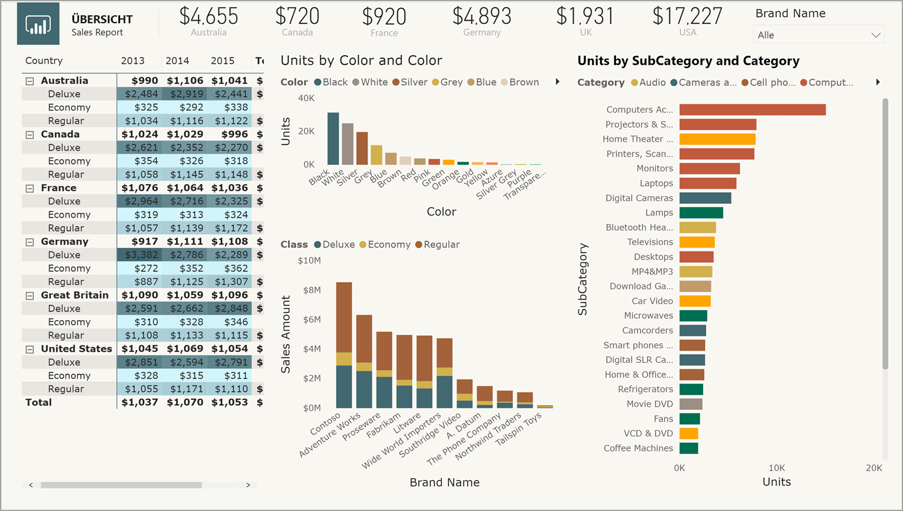
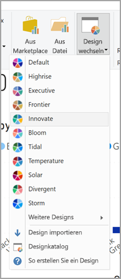
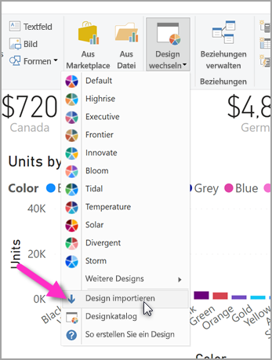

# <a name="use-report-themes-in-power-bi-desktop"></a>Verwenden von Berichtdesigns in Power BI Desktop
Mit **Berichtsdesigns** können Sie Entwurfsänderungen auf den gesamten Bericht anwenden, z. B. die Verwendung von Unternehmensfarben, das Ändern von Symbolsätzen oder das Anwenden der neuen Standardformatierung für Visuals. Wenn Sie ein **Berichtsdesign** anwenden, verwenden alle Visuals im Bericht Farben und Formatierung des ausgewählten Designs. Es gibt einige Ausnahmen, die später in diesem Artikel beschrieben werden.



Wenn Sie ein benutzerdefiniertes **Berichtsdesign** anwenden, benötigen Sie eine JSON-Datei mit einer Grundstruktur. Sie können diese JSON-Datei dann in Power BI Desktop importieren und auf Ihren Bericht anwenden.

Sie können auch nahezu alle Elemente, die im Bereich **Formatierung** angezeigt werden, direkt in Power BI Desktop oder mithilfe der JSON-Designdatei anpassen und standardisieren. Das Ziel besteht darin, Ihnen eine umfassende und genaue Kontrolle über das Erscheinungsbild Ihrer Berichte zu bieten.

## <a name="how-report-themes-work"></a>Funktionsweise von Berichtdesigns
Sie können ein Berichtsdesign auf einen Power BI Desktop-Bericht anwenden, indem Sie ein verfügbares integriertes Design auswählen oder ein benutzerdefiniertes Design erstellen oder importieren.

| Integriertes Berichtsdesign | Standardfarbsequenz    |
|------ |---------- |
| Standard   | |
| Hochhaus  | |
| Executive     | |
| Grenze  | |
| Innovativ    | |
| Blüte     | |
| Gezeiten | |
| Temperatur   | |
| Solar | |
| Divergent     | |
| Sturm     | |
| Klassisch   | |
| Stadtpark     | |
| Klassenzimmer     | |
| Geeignet bei Farbenblindheit   | |
| Elektrisch  | |
| Hoher Kontrast     | |
| Sonnenuntergang    | |
| Dämmerung  | |

Wenn Sie eines der verfügbaren integrierten Berichtsdesigns auswählen möchten, klicken Sie im Menüband **Start** auf die Schaltfläche **Design wechseln**, und wählen Sie eines der Designs aus dem Dropdownmenü aus.



Ihr Berichtsdesign wird auf den Bericht angewendet, und Sie sind startbereit.

### <a name="importing-report-themes"></a>Importieren von Berichtsdesigns

Wenn Sie ein benutzerdefiniertes Berichtsdesign importieren möchten, wählen Sie im Menüband **Start** die Schaltfläche **Design wechseln** aus. Wählen Sie dann im Dropdownmenü **Design importieren** aus.



Navigieren Sie im neu angezeigten Fenster zum Speicherort der JSON-Datei mit dem Design. Power BI Desktop sucht nach JSON-Dateien, da JSON der Dateityp für Power BI-Berichtsdesigns ist. In der folgenden Abbildung sehen Sie einige Dateien mit Feiertagsdesigns. Wir wählen ein Feiertagsdesign für März aus.


Wenn die Designdatei in Power BI Desktop erfolgreich geladen wurde, erhalten Sie eine Meldung.


Es gibt zwei Möglichkeiten, Designs in Power BI Desktop anzupassen. Sehen wir uns diese im Einzelnen genauer an.


## <a name="customize-report-themes-preview"></a>Anpassen von Berichtsdesigns (Vorschau)

Mit dem Release von **Power BI Desktop** vom Dezember 2019 wurden zwei neue Möglichkeiten zum Anpassen von Berichtsdesigns eingeführt:

* Erstellen und Anpassen eines Designs in Power BI Desktop (Vorschau)
* Erstellen und Anpassen einer benutzerdefinierten JSON-Berichtsdesigndatei

Sie können Designs direkt in Power BI Desktop anpassen, indem Sie zuerst auf **Datei > Optionen und Einstellungen > Optionen** klicken und dann wie in der folgenden Abbildung gezeigt im Abschnitt **Preview features** (Vorschaufeatures) das Kontrollkästchen für die Option **Aktuelles Design anpassen** aktivieren.


Möglicherweise werden Sie aufgefordert, Power BI Desktop neu zu starten, damit das Vorschaufeature aktiviert wird.

Nach dem Neustart können Sie damit beginnen, das aktuelle Design anzupassen, indem Sie erst auf das Menüband **Home** und dann auf **Design wechseln > Aktuelles Design anpassen** klicken. Dann wird ein Dialogfeld angezeigt, auf dem die verschiedenen Möglichkeiten zum Anpassen eines vorhandenen Designs aufgeführt sind.


Wenn Ihnen ein bereits vorhandenes Design gefällt und Sie nur einige Änderungen vornehmen möchten, können dieses auswählen und dann wie in der folgenden Abbildung gezeigt im Dialogfeld auf die Option **Aktuelles Design anpassen** klicken. 


> [!NOTE]
> Auf dem obigen Bild ist das Menüband aktiviert, das derzeit als Vorschau verfügbar ist. Sie können die Vorschauversion des neuen Menübands aktivieren, indem Sie erst auf **Datei > Optionen und Einstellungen > Optionen** und dann im Abschnitt **Preview features** (Vorschaufeatures) auf **New ribbon preview** (Vorschau des neuen Menübands) klicken.

In den folgenden Kategorien gibt es Einstellungen, die angepasst werden können. Diese finden Sie im Dialogfeld „Design anpassen“.

* Designname (Sie können das Design benennen, das Sie anpassen) und verschiedene Farbeinstellungen (Designfarben, Stimmungsfarben, Kontrastfarben usw.)
* Texteinstellungen, einschließlich Schriftfamilie, -größe und -farbe sowie Achsentitel, -farben, -karten, -KPIs und Registerkartentitel
* Visuelle Elemente, z. B. Hintergrund, Rahmen, Überschrift und QuickInfos
* Seitenelemente, z. B. Hintergrund
* Filterbereichseinstellungen, einschließlich Hintergrundfarbe, Transparenz, Schrift- und Symbolfarbe, Größe und Filterkarten

Sobald Sie Ihre Änderungen vorgenommen und auf die Schaltfläche **Anwenden und speichern** geklickt haben, wird Ihr Design gespeichert und kann im aktuellen Bericht verwendet und exportiert werden. 

Auf diese Weise können Sie den visuellen Teil des aktuellen Designs schnell und einfach anpassen. Einige Anpassungen an Designs können allerdings nur in begrenztem Umfang vorgenommen werden, für die wie im folgenden Abschnitt beschrieben die JSON-Datei des Designs geändert werden muss.

> [!TIP]
> Die meisten Designelemente können Sie über das Dialogfeld **Aktuelles Design anpassen** anpassen und anschließend die JSON-Datei exportieren, um an dieser direkt manuell detaillierte Änderungen vorzunehmen. Danach können Sie diese optimierte JSON-Datei umbenennen und importieren und somit alle gewünschten Änderungen vornehmen.


## <a name="structure-of-a-report-theme-json-file"></a>Struktur einer JSON-Berichtdesigndatei
 Beim Öffnen in einem Editor sieht die JSON-Basisdatei, die im vorherigen Abschnitt ausgewählt wurde (*St Patricks Day.json*), wie in diesem Screenshot aus:


Die JSON-Datei muss die folgenden Zeilen enthalten:

* **name**: Der Name des Designs ist die einzige Pflichtangabe.

* **dataColors**: Eine Liste von Farben (im Hexadezimalcode) für Daten in Power BI Desktop-Visuals. Die Liste kann beliebig viele oder wenige Farben umfassen.

* **background**, **foreground** und **tableAccent**: Mehrere Farbklassen. Weiter unten in diesem Artikel werden die Details der Farbklassen erläutert. Sie wissen jedoch, dass die Farbklassen Ihnen ermöglichen, viele Farben in Ihrem Bericht gleichzeitig festzulegen.

Das ist der Text der Datei *St Patricks Day.json*, mit dem Sie eine eigene JSON-Datei erstellen können:

```json
    {
        "name": "St Patricks Day",
        "dataColors": ["#568410", "#3A6108", "#70A322", "#915203", "#D79A12", "#bb7711", "#114400", "#aacc66"],
        "background":"#FFFFFF",
        "foreground": "#3A6108",
        "tableAccent": "#568410"
    }
```

Wenn Sie nur die grundlegenden Farben Ihres Berichts anpassen möchten, können Sie einfach den Namen und die hexadezimalen Codes dieser Datei ändern, um eine eigene persönliche JSON-Datei zum Importieren zu erhalten.

In der JSON-Datei definieren Sie nur die Formatierung, die Sie anpassen möchten. Für alle Formatierungselemente, die *nicht* in der JSON-Datei angegeben werden, werden die Standardeinstellungen von Power BI verwendet.

Das Erstellen einer JSON-Datei bietet viele Vorteile. Sie können beispielsweise festlegen, dass für alle Diagramme der Schriftgrad 12 oder für bestimmte Visuals eine bestimmte Schriftfamilie verwendet wird. Sie haben auch die Möglichkeit, Datenbeschriftungen für bestimmte Diagrammtypen zu deaktivieren.

Wenn Sie eine präzise JSON-Datei verwenden, können Sie eine Designdatei erstellen, die Ihre Diagramme und Berichte standardisiert. Dies verhilft Ihren Organisationsberichten zu einem einheitlichen Erscheinungsbild.

Informationen zum Format der detaillierten JSON-Datei finden Sie im Abschnitt **Format der JSON-Datei für Berichtsdesigns** später in diesem Artikel.

## <a name="how-report-theme-colors-stick-to-your-reports"></a>Darstellung von Berichtdesignfarben in Berichten
Wenn Sie Berichte im **Power BI-Dienst** veröffentlichen, bleiben die Berichtdesignfarben erhalten.

Der Abschnitt **Datenfarben** im Bereich **Format** spiegelt Ihr Berichtsdesign wider. Nachdem Sie beispielsweise die breite Palette von Grün- und Brauntönen für das Design **St Patricks Day** angewendet haben, wählen Sie ein Visual aus. Navigieren Sie dann zu **Format > Datenfarben**. Dort werden die folgenden Informationen angezeigt:


Also alles im grünen Bereich. Das liegt daran, dass diese Farben Teil des **Berichtsdesigns** sind, das Sie importiert und angewendet haben.

Farben in der Farbpalette sind auch relativ zum aktuellen Design. Wenn Sie also beispielsweise die dritte Farbe der obersten Zeile für einen Datenpunkt auswählen und später zu dem anderen Design wechseln, wird die Farbe des Datenpunkts automatisch auf die dritte Farbe der obersten Zeile im neuen Design aktualisiert – wie beim Ändern von Designs in Microsoft Office.

### <a name="situations-when-report-theme-colors-wont-stick-to-your-reports"></a>Situationen, in denen Berichtdesignfarben in Berichten nicht dargestellt werden
Angenommen, Sie wenden eine benutzerdefinierte Farbpalette (oder eine einzelne Farbe) unter Verwendung der Option „Benutzerdefinierte Farbe“ in der Farbauswahl auf einen bestimmten Datenpunkt in einem Visual an. Wenn Sie ein Berichtsdesign anwenden, überschreibt es *nicht* die angepasste Datenpunktfarbe.

Sie haben auch die Möglichkeit, die Farbe eines Datenpunkts im Abschnitt „Designfarben“ manuell festzulegen. Die Farben werden *nicht* aktualisiert, wenn Sie ein neues Berichtsdesign anwenden. Wenn Sie Farben auf ihre Standardwerte zurücksetzen möchten, damit sie bei Anwenden eines neuen Berichtsdesigns aktualisiert werden, wählen Sie **Auf Standardwert zurücksetzen** aus, oder wählen Sie in der Farbauswahl eine Farbe in der Palette **Designfarben** aus.


Auf viele **benutzerdefinierte Visuals** lassen sich keine Berichtsdesigns anwenden.

## <a name="report-theme-files-you-can-use-right-now"></a>Berichtdesigndateien zur sofortigen Verwendung
Möchten Sie gleich mit **Berichtdesigns** arbeiten? Hier sind einige vorgefertigte JSON-Dateien für Berichtsdesigns, die Sie herunterladen und in Ihren **Power BI Desktop**-Bericht importieren können. Außerdem sehen Sie ein Bild vom Berichtsdesign, das in diesem Artikel beispielhaft auf den Bericht angewendet wird.

* Dieses [Design](https://go.microsoft.com/fwlink/?linkid=843924) haben wir in dem [Blogbeitrag](https://powerbi.microsoft.com/blog/power-bi-desktop-march-feature-summary/) verwendet, mit dem wir **Berichtdesigns** angekündigt haben: [*waveform.json*](https://go.microsoft.com/fwlink/?linkid=843924).

  

* Dieses [Design ist für Sehbehinderte besser lesbar](https://go.microsoft.com/fwlink/?linkid=843923) als das Standardfarbdesign. Es heißt [*ColorblindSafe-Longer.json*](https://go.microsoft.com/fwlink/?linkid=843923).

  

* Diese Gruppe von [Power View-Designs](https://go.microsoft.com/fwlink/?linkid=843925) befindet sich in einer ZIP-Datei. Dazu gehört auch das hier angezeigte Design [*Apothecary.json*](https://go.microsoft.com/fwlink/?linkid=843925).

  

* Das ist schließlich das Design *Valentines Day*.

  

Anstelle eines Downloads stellen wir Ihnen den Code für die JSON-Datei „Valentines Day“ bereit:

```json
    {
        "name": "Valentine's Day",
        "dataColors": ["#990011", "#cc1144", "#ee7799", "#eebbcc", "#cc4477", "#cc5555", "#882222", "#A30E33"],
        "background":"#FFFFFF",
        "foreground": "#ee7799",
        "tableAccent": "#990011"
    }
```

Mit **Berichtdesigns** können Sie Berichten in Power BI Desktop eine persönliche Note verleihen, die Corporate Identity vertreten oder Feiertagsgrüße ausrichten. 

Hier sind einige weitere Berichtsdesigns, die Sie als Ausgangspunkt verwenden können:

* [Sunflower Twilight](https://community.powerbi.com/t5/Themes-Gallery/Sunflower-Twilight/m-p/140749) (Sonnenblumen in der Dämmerung)
* [Plum](https://community.powerbi.com/t5/Themes-Gallery/Plum/m-p/140711) (Pflaume)
* [Autumn](https://community.powerbi.com/t5/Themes-Gallery/Autumn/m-p/140746) (Herbst)
* [Color Blind Friendly](https://community.powerbi.com/t5/Themes-Gallery/Color-Blind-Friendly/m-p/140597) (Für Farbenblinde)

## <a name="report-theme-json-file-format"></a>Format der JSON-Datei für Berichtsdesigns
Auf der grundlegendsten Ebene benötigt die Design-JSON-Datei nur eine Zeile: den **Namen**. 

```json
    {
        "name": "Custom Theme",
    }
```

Alles andere als der *Name* ist optional. Dies bedeutet, dass Sie die Freiheit haben, nur die Eigenschaften hinzuzufügen, die Sie speziell für die Designdatei formatieren möchten, und für den Rest weiterhin die Standardwerte von Power BI verwenden können. 

Unter dem Namen können Sie einige grundlegende Eigenschaften von Datenfarben hinzufügen. 


* **dataColors**: Eine Liste von Farben (im Hexadezimalcode) für Daten in Power BI Desktop-Visuals. Die Liste kann beliebig viele oder wenige Farben umfassen. Wenn alle Farben aus dieser Liste verwendet worden sind und das Visual noch weitere Farben benötigt, erfolgt die Zurücksetzung auf die Verwendung der Standardfarbpalette von Power BI. 
* **good, neutral, bad**: Hiermit werden die vom Wasserfalldiagramm und dem KPI-Visual verwendeten Statusfarben festgelegt.
* **maximum, center, minimum, null**: Mit diesen Farben werden die verschiedenen Farbverlaufsfarben im Dialogfeld für die bedingte Formatierung festgelegt.  

Ein grundlegendes Design, das diese Farben definiert, würde wie folgt aussehen:

```json
    {
        "name": "Custom Theme",
          "dataColors": [
                "#118DFF",
                "#12239E", 
                "#E66C37", 
                "#6B007B", 
                "#E044A7",
                "#744EC2", 
                "#D9B300", 
                "#D64550",
                "#197278", 
                "#1AAB40"
    ],
        "good": "#1AAB40",
        "neutral": "#D9B300",
        "bad": "#D64554",
        "maximum": "#118DFF",
        "center": "#D9B300",
        "minimum": "#DEEFFF",
        "null": "#FF7F48"
    }
```

Als nächstes können Sie verschiedene Farbklassen hinzufügen. Mit Farbklassen können Sie im gesamten Bericht viele Farben in einer Zeile festlegen, indem Sie ähnliche visuelle Eigenschaften gruppieren, die in der Regel die gleiche Farbe aufweisen. 

Die sechs Farbklassen, die Sie in der folgenden Tabelle formatieren können, werden angezeigt.


|Farbklasse  |Formatiert Folgendes  |
|---------|---------|
|Vordergrund | Hintergrundfarbe für Beschriftungen (außerhalb von Datenpunkten) <br> Trendlinienfarbe <br>  Textfeld-Standardfarbe <br> Schriftfarbe für Tabellen- und Matrixwerte und Summen Datenbalken-Achsenfarbe <br> Kartendatenbeschriftungen <br> Farbe für Messgerätlegendenwert <br> KPI-Zielfarbe <br>  KPI-Textfarbe <br> Slicerelementfarbe (im Fokusmodus)  <br> Schriftfarbe für Slicerdropdownelement <br> Schriftfarbe für numerische Slicereingabe <br> Schriftfarbe für Slicerkopfzeile <br> Punktdiagramm-Verhältnislinienfarbe <br> Farbe für Liniendiagramm-Vorhersagelinie <br> Kartenführungslinien-Farbe <br> Farbe für Filterbereich und Kartentext|
|foregroundNeutralSecondary |Beschriftungsfarben  <br> Farbe für Legendenbeschriftungen <br> Farbe für Achsenbeschriftungen <br> Schriftfarbe für Tabellen- und Matrixkopfzeile <br> Farbe für Messgerätziel und Zielführungslinie <br>  KPI-Trendachsenfarbe <br> Farbe für Slicerschieberegler <br> Schriftfarbe für Slicerelement <br> Farbe für Slicerkontur <br> Farbe beim Zeigen auf Liniendiagramm <br> Titelfarbe für mehrzeilige Karte <br> Strichfarbe für Menübanddiagramm <br> Rahmenfarbe für Formenzuordnung <br> Schriftfarbe für Schaltflächentext <br> Linienfarbe für Schaltflächensymbol <br> Schaltflächen-Konturfarbe |
| foregroundNeutralTertiary | abgeblendete Legendenfarbe <br> Farbe für Kartenkategoriebeschriftung <br> Farbe für Kategoriebeschriftungen für mehrzeilige Karte <br> Balkenfarbe für mehrzeilige Karte <br> Strichfarbe für Trichterdiagramm-Konvertierungsrate 
| backgroundLight | Achsengitternetzlinien-Farbe <br> Tabellen- und Matrixrasterfarbe <br> Hintergrundfarbe für Slicerkopfzeile (im Fokusmodus)  <br> Konturfarbe für mehrzeilige Karte  <br> Formfüllfarbe <br> Hintergrundfarbe für Messgerätbogen <br> Hintergrundfarbe für angewendete Filterkarte <br> |
backgroundNeutral | Tabellen- und Matrixraster-Konturenfarbe <br> Standardfarbe für Formenzuordnung <br> Menübanddiagramm-Füllfarbe (wenn Option „Serienfarbe abgleichen“ deaktiviert ist) |
Hintergrund | Hintergrundfarbe für Beschriftungen (innerhalb von Datenpunkten) <br> Hintergrundfarbe für Slicerdropdownelemente  <br> Ringdiagramm-Strichfarbe <br> Treemapstrichfarbe <br> Hintergrundfarbe des Kombinationsdiagramms <br> Füllfarbe für Schaltflächen <br> Farbe für Filterbereich und Hintergrund verfügbarer Filterkarten |
tableAccent | Überschreibt die Tabellen- und Matrixraster-Konturfarbe, wenn vorhanden |


Hier sehen Sie das Beispiel einer Designeinstellung der Farbklassen:

```json
    {
        "name": "Custom Theme",
        "foreground": "#252423",
          "foregroundNeutralSecondary": "#605E5C",
          "foregroundNeutralTertiary": "#B3B0AD",
        "background": "#FFFFFF",
          "backgroundLight": "#F3F2F1",
          "backgroundNeutral": "#C8C6C4",
        "tableAccent": "#118DFF"
    }
```

Als nächstes können Sie Ihrer JSON-Datei Textklassen hinzufügen, die Farbklassen ähneln, aber so konzipiert sind, dass Sie Schriftgrad, Farbe und Familie für Textgruppen im gesamten Bericht aktualisieren können. Es gibt 12 Textklassen, aber Sie müssen eigentlich nur vier Klassen festlegen, die als *primäre Klassen* bezeichnet werden, um die gesamte Textformatierung im Bericht zu ändern. Andere Textklassen, die als *sekundäre Klassen* angesehen werden, erben ihre Eigenschaften automatisch von ihren zugeordneten primären Klassen oder leiten sie davon ab. Häufig leitet eine sekundäre Klasse einen im Vergleich zur primären Klasse helleren Ton der Textfarbe ab oder eine Textgröße, die um einen bestimmten Prozentsatz größer oder kleiner ist. 

Nehmen wir die Klasse *label* als Beispiel. Die Standardformatierung für die label-Klasse ist Segoe UI, 252423 (ein Dunkelgrau) und 12 Punkte, und diese Klasse wird verwendet, um die Werte in der Tabelle und der Matrix zu formatieren. In der Regel verfügen die Summen in einer Tabelle oder Matrix über eine ähnliche Formatierung, aber sie werden fett formatiert, sodass sie sich besser hervorheben, also wird für sie die Klasse für die fette Beschriftungsformatierung verwendet. Sie müssen dies jedoch nie selbst im Design-JSON-Code angeben. Power BI legt dies automatisch für Sie fest. Wenn Sie zu einem späteren Zeitpunkt entscheiden, dass die Beschriftungen in Ihrem Design in einer 14-Punkt-Schrift angezeigt werden sollen, müssen Sie nicht auch die Klasse für die fette Beschriftungsformatierung aktualisieren, da sie die gesamte Textformatierung von der label-Klasse erbt und einfach für die Schriftfamilie die Fettformatierung festgelegt wird. 

Die Tabellenliste zeigt Folgendes an:
* Die vier primären Textklassen, was sie formatieren, und die Standardeinstellungen
* Jede sekundäre Klasse, was sie formatiert, und ihre Standardeinstellung, die im Vergleich zur primären Klasse eindeutig ist


|Primäre Klasse  |Sekundäre Klasse  |Klassenname in JSON  |Einstellungen  |Zugeordnete visuelle Objekte  |
|---------|---------|---------|---------|---------|
| Legende   | N/V   | callout | DIN <br> 252423 <br> 45 pt |Kartendatenbeschriftungen <br> KPI-Indikatoren|
|Header|N/V|header|Segoe UI Semibold <br> 252423 <br> 12 pt |Kopfzeile für die wichtigsten Einflussfaktoren |
| Titel || title    |DIN <br> 252423 <br> 12 pt |Titel der Kategorieachse <br> Titel der Wertachse <br> Titel der mehrzeiligen Karte * <br> Slicerkopfzeile|
|-| Großer Titel | largeTitle    |14 pt   |Visualtitel |
|Beschriftung ||label |Segoe UI<br>252423<br>10 pt |Tabellen- und Matrixspalten-Kopfzeile <br> Matrixzeilen-Kopfzeile<br>Tabellen- und Matrixraster<br>Tabellen- und Matrixwerte |
|-|Halbfett |semiboldLabel| Segoe UI Semibold   | Profiltext für wichtige Einflussfaktoren
|-|Large    |largeLabel |12 pt   | Datenbeschriftungen für mehrzeilige Karte |
|-|Small    |smallLabel |9 pt    |Bezugslinienbeschriftungen * <br>Slicerdatumsbereichs-Beschriftungen<br> Textstil für numerische Slicereingabe<br>Slicersuchfeld<br>Text wichtiger Einflussfaktoren|
|-|Hell    |lightLabel |605E5C    |Legendentext<br>Schaltflächentext<br>Kategorieachsenbeschriftung<br>Trichterdiagramm-Datenbeschriftungen<br>Beschriftungen für Trichterdiagramm-Konvertierungsraten<br>Messgerätziel<br>Punktdiagramm-Kategoriebeschriftung<br>Slicerelemente|
|-|Fett |boldLabel  |Segoe UI Bold  |Matrixzwischensummen<br>Matrixgesamtsummen<br>Tabellensummen |
|-|Groß und dünn  |largeLightLabel    |605E5C<br>12 pt    |Kartenkategoriebeschriftungen<br>Messgerätbeschriftungen<br>Kategoriebeschriftungen für mehrzeilige Karte |
|-|Klein und dünn  |smallLightLabel    |605E5C<br>9 pt |Datenbeschriftungen<br>Wertachsenbeschriftungen|


Sie müssen die sekundären Klassen zwar nicht in der Designdatei festlegen, da sie von den primären Klassen erben, aber wenn Sie die Vererbungsregeln nicht mögen (weil Sie z. B. nicht möchten, dass Ihre Summenwerte in einer Tabelle fett formatiert sind), können Sie die sekundären Klassen explizit in der Designdatei formatieren, so wie Sie die primären Klassen formatieren können.

Im folgenden Beispieldesign werden nur die primären Textklassen festlegt: 

```json
    {
            "name": "Custom Theme",
          "textClasses": {
                "callout": {
                    "fontSize": 45,
                    "fontFace": "wf_standard-font",
                    "color": "#252423"
                },
                "title": {
                    "fontSize": 12,
                    "fontFace": "wf_standard-font",
                    "color": "#252423"
                },
                "header": {
                    "fontSize": 12,
                    "fontFace": "Segoe UI Semibold",
                    "color": "#252423"
                },
                "label": {
                    "fontSize": 10,
                    "fontFace": "Segoe UI",
                    "color": "#252423"
                }
        }    
    }
```

Um eine JSON-Datei in einem erweiterten Format zu erstellen, die eine detailliertere und präzisere Steuerung der gesamten Visualformatierung ermöglicht, können Sie der JSON-Datei schließlich den Abschnitt **visualStyles** hinzufügen. Die Formatierungsangaben im Abschnitt **visualStyles** müssen Sie schachteln. Der Abschnitt **visualStyles** hat etwa das folgende Format:

    visualStyles: {
        visualName: {
            styleName: {
                cardName: [{
                    propertyName: propertyValue
                }]
            }
        }
    }

Verwenden Sie für die Abschnitte **visualName** und **cardName** einen spezifischen Visual- und Kartennamen. Derzeit ist der **styleName** immer ein Sternchen („*“), aber in einem zukünftigen Release können Sie unterschiedliche Formatvorlagen für Ihre Visuals erstellen und Ihnen Namen geben (ähnlich wie beim Tabellen- und Matrixformatvorlagen-Feature). **propertyName** ist der Name der spezifischen Formatierungsoption, und unter **propertyValue** definieren Sie die Formatierungsoption.  

Für **visualName** und **cardName** können Sie ein Sternchen („\*“) statt eines spezifischen Visual- oder Kartennamens verwenden, wenn die Einstellung für alle Visuals oder Karten gelten soll, die eine Eigenschaft haben. Wenn Sie das Sternchen („\*“) sowohl für den Visual- als auch für den Kartennamen verwenden, wenden Sie eine Einstellung global in Ihrem Bericht an, z. B. einen Schriftgrad oder eine bestimmte Schriftfamilie für alle Texte aller Visuals.

Im folgenden Beispiel werden einige Eigenschaften für alle visuellen Stile festgelegt. 

```json
{  
   "name":"Custom Theme",
   "visualStyles":{  
      "*":{  
         "*":{  
            "*":[{  
                  "wordWrap":true
            }],
            "categoryAxis":[{
                  "gridlineStyle":"dotted"
            }],
            "filterCard":[{  
                  "$id":"Applied",
                  "foregroundColor":{"solid":{"color":"#252423"}}
               },
               {  
                  "$id":"Available",
                  "border":true
            }]
         }
      },
      "scatterChart":{  
         "*":{  
            "bubbles":[{  
                  "bubbleSize":-10
            }]
         }
      }
   }
}
```

Dieses Beispiel zeigt Folgendes:

* Aktivieren des Zeilenumbruchs überall
* Festlegen des Gitternetzlinien-Stils auf gepunktet für alle Visuals mit einer Kategorieachse
* Festlegen einiger Formatierungen für die verfügbaren und angewendeten Filterkarten (beachten Sie, dass „$id“ verwendet wird, um die verschiedenen Versionen der Filterkarten festzulegen)
* Festlegen der Blasengröße für Punktdiagramme auf-10.


> [!NOTE]
> Sie müssen nur die Formatierungselemente angeben, die Sie anpassen möchten. Für alle Formatierungselemente, die nicht in der JSON-Datei enthalten sind, werden die Standardwerte und -einstellungen verwendet.
> 
> 

### <a name="json-file-element-definitions"></a>Definitionen der Elemente in der JSON-Datei
In den Tabellen in diesem Abschnitt werden Visualnamen (*visualName*), Kartennamen (*cardName*) und die zum Erstellen der JSON-Datei erforderlichen Enumerationen definiert.

| **visualName** |
| --- |
| areaChart |
| barChart |
| basicShape |
| card |
| clusteredBarChart |
| clusteredColumnChart |
| columnChart |
| comboChart |
| donutChart |
| filledMap |
| Trichter |
| Tachometerdiagramm |
| hundredPercentStackedBarChart |
| hundredPercentStackedColumnChart |
| image |
| KPI |
| lineChart |
| lineClusteredColumnComboChart |
| lineStackedColumnComboChart |
| Karte |
| multiRowCard |
| pieChart |
| pivotTable |
| ribbonChart |
| scatterChart |
| shapeMap |
| Datenschnitt |
| stackedAreaChart |
| tableEx |
| Treemap |
| waterfallChart |

In der folgenden Tabelle sind die Werte von *cardName* definiert. Der erste Wert in jeder Zelle ist die Benennung der JSON-Datei. Der zweite Wert ist der Name der Karte, der in der Benutzeroberfläche von **Power BI Desktop** angezeigt wird.

| **cardName** |
| --- |
| axis: Messachse |
| breakdown: Aufschlüsselung |
| bubbles: Blasen |
| calloutValue: Beschriftungswert |
| card: Karte |
| cardTitle: Kartentitel |
| categoryAxis: X-Achse |
| categoryLabels: Kategoriebeschriftungen |
| columnFormatting: Feldformatierung |
| columnHeaders: Spaltenüberschriften |
| dataLabels: Datenbeschriftungen |
| fill: Füllung |
| fillPoint: Füllpunkt |
| forecast: Prognose- |
| general: Allgemein |
| goals: Ziele |
| grid: Raster |
| header: Header |
| imageScaling: Skalierung |
| indicator: Indikator |
| items: Elemente |
| labels: Datenbeschriftungen |
| legend: Legende |
| lineStyles: Formen |
| mapControls: Kartensteuerelemente |
| mapStyles: Kartenstile |
| numericInputStyle: Numerische Eingaben |
| percentBarLabel: Beschriftung für Konvertierungsrate |
| plotArea: Zeichnungsfläche |
| plotAreaShading: Symmetrieschattierung |
| ratioLine: Verhältnislinie |
| referenceLine: Bezugslinie |
| ribbonChart: Menübänder |
| rotation: Drehung |
| rowHeaders: Zeilenüberschriften |
| selection: Auswahlsteuerelemente |
| sentimentColors: Stimmungsfarben |
| shape: Formen |
| slider: Schieberegler |
| status: Farbcodierung |
| subTotals: Zwischensummen |
| target: Ziel |
| total: Gesamtsumme |
| trend: Trendlinie |
| trendline: Trendachse |
| valueAxis: Y-Achse |
| values: Werte |
| wordWrap: Zeilenumbruch |
| xAxisReferenceLine: Bezugslinie für X-Achse |
| y1AxisReferenceLine: Bezugslinie |
| zoom: Zoom |

### <a name="properties-within-each-card"></a>Eigenschaften in jeder Karte
Im folgenden Abschnitt werden die Eigenschaften in jeder Karte definiert. Auf den Kartennamen folgt jeder Eigenschaftsname. Für jede Eigenschaft der Name, der angezeigt wird, wenn der Formatierungsbereich angezeigt wird, eine Beschreibung der Funktionsweise der Formatierungsoption und der Typ der Formatierungsoption. Mit diesem Ansatz erfahren Sie, welche Art von Werten Sie in der Designdatei verwenden können. 

Wenn Sie **dateTime** verwenden, muss das Datum ein ISO-Datum in einfachen Anführungszeichen sein, dem „datetime“ vorangestellt ist. Beispiel:

    “datetime’2011-10-05T14:48:00.000Z’”

Boolesche Werte sind entweder „true“ oder „false“. Zeichenfolgen müssen in doppelte Anführungszeichen eingeschlossen werden, wie in "dies ist eine Zeichenfolge". Zahlen stehen für den Wert selbst, nicht in Anführungszeichen.

Für Farben sollte das folgende Format verwendet werden, wobei „FFFFFF“ im folgenden Beispiel den Platz Ihres benutzerdefinierten Hexadezimalcodes einnimmt.  

    { "solid": { "color": "#FFFFFF" } }

Für eine Enumeration, die am häufigsten für Dropdownformatierungsoptionen verwendet wird, kann jede der im Bereich angezeigten Optionen festgelegt werden, z. B. „RightCenter“ für die Legendenposition oder „Datenwert, Prozent des Gesamtwerts“ für die Kreisdiagramm-Datenbeschriftung. Die Enumerationsoptionen werden unterhalb der Eigenschaftenliste angezeigt.


```json
{
      "general":{ 
        "responsive": {
          "type": [
            "bool"
          ],
          "displayName": [
            "(Preview) Responsive"
          ],
          "description": [
            "The visual will adapt to size changes"
          ]
        },
        "legend": {
        "show": {
          "type": [
            "bool"
          ],
          "displayName": [
            "Show"
          ]
        },
        "position": {
          "type": [
            "enumeration"
          ],
          "displayName": [
            "Position"
          ],
          "description": [
            "Select the location for the legend"
          ]
        },
        "showTitle": {
          "type": [
            "bool"
          ],
          "displayName": [
            "Title"
          ],
          "description": [
            "Display a title for legend symbols"
          ]
        },
        "labelColor": {
          "type": [
            "fill"
          ],
          "displayName": [
            "Color"
          ]
        },
        "fontFamily": {
          "type": [
            "formatting"
          ],
          "displayName": [
            "Font family"
          ]
        },
        "fontSize": {
          "type": [
            "formatting"
          ],
          "displayName": [
            "Text Size"
          ]
        }
      },
      "categoryAxis": {
        "show": {
          "type": [
            "bool"
          ],
          "displayName": [
            "Show"
          ]
        },
        "axisScale": {
          "type": [
            "enumeration"
          ],
          "displayName": [
            "Scale type"
          ]
        },
        "start": {
          "type": [
            "numeric",
            "dateTime"
          ],
          "displayName": [
            "Start"
          ],
          "description": [
            "Enter a starting value (optional)"
          ]
        },
        "end": {
          "type": [
            "numeric",
            "dateTime"
          ],
          "displayName": [
            "End"
          ],
          "description": [
            "Enter an ending value (optional)"
          ]
        },
        "axisType": {
          "type": [
            "enumeration"
          ],
          "displayName": [
            "Type"
          ]
        },
        "showAxisTitle": {
          "type": [
            "bool"
          ],
          "displayName": [
            "Title"
          ],
          "description": [
            "Title for the X-axis",
            "Title for the Y-axis"
          ]
        },
        "axisStyle": {
          "type": [
            "enumeration"
          ],
          "displayName": [
            "Style"
          ]
        },
        "labelColor": {
          "type": [
            "fill"
          ],
          "displayName": [
            "Color"
          ]
        },
        "fontFamily": {
          "type": [
            "formatting"
          ],
          "displayName": [
            "Font family"
          ]
        },
        "fontSize": {
          "type": [
            "formatting"
          ],
          "displayName": [
            "Text Size"
          ]
        },
        "labelDisplayUnits": {
          "type": [
            "formatting"
          ],
          "displayName": [
            "Display units"
          ],
          "description": [
            "Select the units (millions, billions, etc.)"
          ]
        },
        "labelPrecision": {
          "type": [
            "numeric"
          ],
          "displayName": [
            "Value decimal places"
          ],
          "description": [
            "Select the number of decimal places to display for the values"
          ]
        },
        "concatenateLabels": {
          "type": [
            "bool"
          ],
          "displayName": [
            "Concatenate labels"
          ],
          "description": [
            "Always concatenate levels of the hierarchy instead of drawing the hierarchy."
          ]
        },
        "preferredCategoryWidth": {
          "type": [
            "numeric"
          ],
          "displayName": [
            "Minimum category width"
          ]
        },
        "titleColor": {
          "type": [
            "fill"
          ],
          "displayName": [
            "Title color"
          ]
        },
        "titleFontFamily": {
          "type": [
            "formatting"
          ],
          "displayName": [
            "Font family"
          ]
        },
        "titleFontSize": {
          "type": [
            "formatting"
          ],
          "displayName": [
            "Title text size"
          ]
        },
        "position": {
          "type": [
            "enumeration"
          ],
          "displayName": [
            "Position"
          ],
          "description": [
            "Select left or right"
          ]
        },
        "color": {
          "type": [
            "fill"
          ],
          "displayName": [
            "Color"
          ],
          "description": [
            "Select color for data labels"
          ]
        },
        "duration": {
          "type": [
            "numeric"
          ]
        }
      },
      "valueAxis": {
        "show": {
          "type": [
            "bool"
          ],
          "displayName": [
            "Show"
          ]
        },
        "position": {
          "type": [
            "enumeration"
          ],
          "displayName": [
            "Position"
          ],
          "description": [
            "Select left or right"
          ]
        },
        "axisScale": {
          "type": [
            "enumeration"
          ],
          "displayName": [
            "Scale type"
          ]
        },
        "start": {
          "type": [
            "numeric",
            "dateTime"
          ],
          "displayName": [
            "Start"
          ],
          "description": [
            "Enter a starting value (optional)"
          ]
        },
        "end": {
          "type": [
            "numeric",
            "dateTime"
          ],
          "displayName": [
            "End"
          ],
          "description": [
            "Enter an ending value (optional)"
          ]
        },
        "showAxisTitle": {
          "type": [
            "bool"
          ],
          "displayName": [
            "Title"
          ],
          "description": [
            "Title for the Y-axis",
            "Title for the X-axis"
          ]
        },
        "axisStyle": {
          "type": [
            "enumeration"
          ],
          "displayName": [
            "Style"
          ]
        },
        "labelColor": {
          "type": [
            "fill"
          ],
          "displayName": [
            "Color"
          ]
        },
        "fontFamily": {
          "type": [
            "formatting"
          ],
          "displayName": [
            "Font family"
          ]
        },
        "fontSize": {
          "type": [
            "formatting"
          ],
          "displayName": [
            "Text Size"
          ]
        },
        "labelDisplayUnits": {
          "type": [
            "formatting"
          ],
          "displayName": [
            "Display units"
          ],
          "description": [
            "Select the units (millions, billions, etc.)"
          ]
        },
        "labelPrecision": {
          "type": [
            "numeric"
          ],
          "displayName": [
            "Value decimal places"
          ],
          "description": [
            "Select the number of decimal places to display for the values"
          ]
        },
        "titleColor": {
          "type": [
            "fill"
          ],
          "displayName": [
            "Title color"
          ]
        },
        "titleFontFamily": {
          "type": [
            "formatting"
          ],
          "displayName": [
            "Font family"
          ]
        },
        "titleFontSize": {
          "type": [
            "formatting"
          ],
          "displayName": [
            "Title text size"
          ]
        },
        "axisLabel": {
          "type": [
            "none"
          ],
          "displayName": [
            "Y-Axis (Column)"
          ]
        },
        "secShow": {
          "type": [
            "bool"
          ],
          "displayName": [
            "Show secondary"
          ]
        },
        "alignZeros": {
          "type": [
            "bool"
          ],
          "displayName": [
            "Align zeros"
          ],
          "description": [
            "Align the zero tick marks for both value axes"
          ]
        },
        "secAxisLabel": {
          "type": [
            "none"
          ],
          "displayName": [
            "Y-Axis (Line)"
          ]
        },
        "secPosition": {
          "type": [
            "enumeration"
          ],
          "displayName": [
            "Position"
          ],
          "description": [
            "Select left or right"
          ]
        },
        "secAxisScale": {
          "type": [
            "enumeration"
          ],
          "displayName": [
            "Scale type"
          ]
        },
        "secStart": {
          "type": [
            "numeric"
          ],
          "displayName": [
            "Start"
          ],
          "description": [
            "Enter a starting value (optional)"
          ]
        },
        "secEnd": {
          "type": [
            "numeric"
          ],
          "displayName": [
            "End"
          ],
          "description": [
            "Enter an ending value (optional)"
          ]
        },
        "secShowAxisTitle": {
          "type": [
            "bool"
          ],
          "displayName": [
            "Title"
          ],
          "description": [
            "Title for the Y-axis"
          ]
        },
        "secAxisStyle": {
          "type": [
            "enumeration"
          ],
          "displayName": [
            "Style"
          ]
        },
        "secLabelColor": {
          "type": [
            "fill"
          ],
          "displayName": [
            "Color"
          ]
        },
        "secFontFamily": {
          "type": [
            "formatting"
          ],
          "displayName": [
            "Font family"
          ]
        },
        "secFontSize": {
          "type": [
            "formatting"
          ],
          "displayName": [
            "Text Size"
          ]
        },
        "secLabelDisplayUnits": {
          "type": [
            "formatting"
          ],
          "displayName": [
            "Display units"
          ],
          "description": [
            "Select the units (millions, billions, etc.)"
          ]
        },
        "secLabelPrecision": {
          "type": [
            "numeric"
          ],
          "displayName": [
            "Value decimal places"
          ],
          "description": [
            "Select the number of decimal places to display for the values"
          ]
        },
        "secTitleColor": {
          "type": [
            "fill"
          ],
          "displayName": [
            "Title color"
          ]
        },
        "secTitleFontFamily": {
          "type": [
            "formatting"
          ],
          "displayName": [
            "Font family"
          ]
        },
        "secTitleFontSize": {
          "type": [
            "formatting"
          ],
          "displayName": [
            "Title text size"
          ]
        }
      },
      "dataPoint": {
        "defaultColor": {
          "type": [
            "fill"
          ],
          "displayName": [
            "Default color",
            "Default Column Color"
          ]
        },
        "fill": {
          "type": [
            "fill"
          ],
          "displayName": [
            "Fill"
          ]
        },
        "defaultCategoryColor": {
          "type": [
            "fill"
          ],
          "displayName": [
            "Default color",
            "Default Column Color"
          ]
        },
        "showAllDataPoints": {
          "type": [
            "bool"
          ],
          "displayName": [
            "Show all"
          ]
        }
      },
      "labels": {
        "show": {
          "type": [
            "bool"
          ],
          "displayName": [
            "Show"
          ]
        },
        "showSeries": {
          "type": [
            "bool"
          ],
          "displayName": [
            "Show"
          ]
        },
        "color": {
          "type": [
            "fill"
          ],
          "displayName": [
            "Color"
          ],
          "description": [
            "Select color for data labels"
          ]
        },
        "labelDisplayUnits": {
          "type": [
            "formatting"
          ],
          "displayName": [
            "Display units"
          ],
          "description": [
            "Select the units (millions, billions, etc.)"
          ]
        },
        "labelPrecision": {
          "type": [
            "numeric"
          ],
          "displayName": [
            "Value decimal places"
          ],
          "description": [
            "Select the number of decimal places to display for the values"
          ]
        },
        "showAll": {
          "type": [
            "bool"
          ],
          "displayName": [
            "Customize series"
          ]
        },
        "fontSize": {
          "type": [
            "formatting"
          ],
          "displayName": [
            "Text Size"
          ]
        },
        "fontFamily": {
          "type": [
            "formatting"
          ],
          "displayName": [
            "Font family"
          ]
        },
        "labelDensity": {
          "type": [
            "formatting"
          ],
          "displayName": [
            "Label density"
          ]
        },
        "labelOrientation": {
          "type": [
            "enumeration"
          ],
          "displayName": [
            "Orientation"
          ]
        },
        "labelPosition": {
          "type": [
            "enumeration"
          ],
          "displayName": [
            "Position"
          ]
        },
        "percentageLabelPrecision": {
          "type": [
            "numeric"
          ],
          "displayName": [
            "% decimal places"
          ],
          "description": [
            "Select the number of decimal places to display for the percentages"
          ]
        },
        "labelStyle": {
          "type": [
            "enumeration"
          ],
          "displayName": [
            "Label style"
          ]
        }
      },
      "lineStyles": {
        "strokeWidth": {
          "type": [
            "numeric"
          ],
          "displayName": [
            "Stroke width"
          ]
        },
        "strokeLineJoin": {
          "type": [
            "enumeration"
          ],
          "displayName": [
            "Join type"
          ]
        },
        "lineStyle": {
          "type": [
            "enumeration"
          ],
          "displayName": [
            "Line style"
          ]
        },
        "showMarker": {
          "type": [
            "bool"
          ],
          "displayName": [
            "Show marker"
          ]
        },
        "markerShape": {
          "type": [
            "enumeration"
          ],
          "displayName": [
            "Marker shape"
          ]
        },
        "markerSize": {
          "type": [
            "numeric"
          ],
          "displayName": [
            "Marker size"
          ]
        },
        "markerColor": {
          "type": [
            "fill"
          ],
          "displayName": [
            "Marker color"
          ]
        },
        "showSeries": {
          "type": [
            "bool"
          ],
          "displayName": [
            "Customize series",
            "Show"
          ]
        },
        "shadeArea": {
          "type": [
            "bool"
          ],
          "displayName": [
            "Shade area"
          ]
        }
      },
      "plotArea": {
        "transparency": {
          "type": [
            "numeric"
          ],
          "displayName": [
            "Transparency"
          ],
          "description": [
            "Set transparency for background color"
          ]
        }
      },
      "trend": {
        "show": {
          "type": [
            "bool"
          ],
          "displayName": [
            "Show"
          ]
        },
        "displayName": {
          "type": [
            "text"
          ],
          "displayName": [
            "Name"
          ],
          "description": [
            "Set trend line name"
          ]
        },
        "lineColor": {
          "type": [
            "fill"
          ],
          "displayName": [
            "Color"
          ],
          "description": [
            "Set trend line color"
          ]
        },
        "transparency": {
          "type": [
            "numeric"
          ],
          "displayName": [
            "Transparency"
          ],
          "description": [
            "Set transparency for trend line color"
          ]
        },
        "style": {
          "type": [
            "enumeration"
          ],
          "displayName": [
            "Style"
          ],
          "description": [
            "Set trend line style"
          ]
        },
        "combineSeries": {
          "type": [
            "bool"
          ],
          "displayName": [
            "Combine Series"
          ],
          "description": [
            "Show one trend line per series or combine"
          ]
        }
      },
      "y1AxisReferenceLine": {
        "show": {
          "type": [
            "bool"
          ],
          "displayName": [
            "Show"
          ]
        },
        "value": {
          "type": [
            "numeric"
          ],
          "displayName": [
            "Value"
          ],
          "description": [
            "Set reference line numeric value"
          ]
        },
        "lineColor": {
          "type": [
            "fill"
          ],
          "displayName": [
            "Color"
          ],
          "description": [
            "Set reference line color"
          ]
        },
        "transparency": {
          "type": [
            "numeric"
          ],
          "displayName": [
            "Transparency"
          ],
          "description": [
            "Set transparency for reference line color"
          ]
        },
        "style": {
          "type": [
            "enumeration"
          ],
          "displayName": [
            "Line style"
          ]
        },
        "position": {
          "type": [
            "enumeration"
          ],
          "displayName": [
            "Position"
          ],
          "description": [
            "Arrange relative to chart data points"
          ]
        },
        "dataLabelShow": {
          "type": [
            "bool"
          ],
          "displayName": [
            "Data label"
          ],
          "description": [
            "Display a data label for the reference line"
          ]
        },
        "dataLabelColor": {
          "type": [
            "fill"
          ],
          "displayName": [
            "Color"
          ],
          "description": [
            "Set the reference line data label color"
          ]
        },
        "dataLabelDecimalPoints": {
          "type": [
            "numeric"
          ],
          "displayName": [
            "Decimal Places"
          ]
        },
        "dataLabelHorizontalPosition": {
          "type": [
            "enumeration"
          ],
          "displayName": [
            "Horizontal Position"
          ],
          "description": [
            "Set the horizontal position for the reference line data label"
          ]
        },
        "dataLabelVerticalPosition": {
          "type": [
            "enumeration"
          ],
          "displayName": [
            "Vertical Position"
          ],
          "description": [
            "Set the vertical position for the reference line data label"
          ]
        },
        "dataLabelDisplayUnits": {
          "type": [
            "formatting"
          ],
          "displayName": [
            "Display units"
          ],
          "description": [
            "Select the units (millions, billions, etc.)"
          ]
        }
      },
      "referenceLine": {
        "show": {
          "type": [
            "bool"
          ],
          "displayName": [
            "Show"
          ]
        },
        "displayName": {
          "type": [
            "text"
          ],
          "displayName": [
            "Name"
          ],
          "description": [
            "Set reference line name"
          ]
        },
        "value": {
          "type": [
            "numeric"
          ],
          "displayName": [
            "Value"
          ],
          "description": [
            "Set reference line numeric value"
          ]
        },
        "lineColor": {
          "type": [
            "fill"
          ],
          "displayName": [
            "Color"
          ],
          "description": [
            "Set reference line color"
          ]
        },
        "transparency": {
          "type": [
            "numeric"
          ],
          "displayName": [
            "Transparency"
          ],
          "description": [
            "Set transparency for reference line color"
          ]
        },
        "style": {
          "type": [
            "enumeration"
          ],
          "displayName": [
            "Line style"
          ]
        },
        "position": {
          "type": [
            "enumeration"
          ],
          "displayName": [
            "Position"
          ],
          "description": [
            "Arrange relative to chart data points"
          ]
        },
        "dataLabelShow": {
          "type": [
            "bool"
          ],
          "displayName": [
            "Data label"
          ],
          "description": [
            "Display a data label for the reference line"
          ]
        },
        "dataLabelColor": {
          "type": [
            "fill"
          ],
          "displayName": [
            "Color"
          ],
          "description": [
            "Set the reference line data label color"
          ]
        },
        "dataLabelDecimalPoints": {
          "type": [
            "numeric"
          ],
          "displayName": [
            "Decimal Places"
          ]
        },
        "dataLabelHorizontalPosition": {
          "type": [
            "enumeration"
          ],
          "displayName": [
            "Horizontal Position"
          ],
          "description": [
            "Set the horizontal position for the reference line data label"
          ]
        },
        "dataLabelVerticalPosition": {
          "type": [
            "enumeration"
          ],
          "displayName": [
            "Vertical Position"
          ],
          "description": [
            "Set the vertical position for the reference line data label"
          ]
        },
        "dataLabelDisplayUnits": {
          "type": [
            "formatting"
          ],
          "displayName": [
            "Display units"
          ],
          "description": [
            "Select the units (millions, billions, etc.)"
          ]
        }
      },
      "line": {
        "lineColor": {
          "type": [
            "fill"
          ],
          "displayName": [
            "Line color"
          ]
        },
        "transparency": {
          "type": [
            "numeric"
          ],
          "displayName": [
            "Transparency"
          ],
          "description": [
            "Set transparency for background color"
          ]
        },
        "weight": {
          "type": [
            "numeric"
          ],
          "displayName": [
            "Weight"
          ]
        },
        "roundEdge": {
          "type": [
            "numeric"
          ],
          "displayName": [
            "Round edges"
          ]
        }
      },
      "fill": {
        "show": {
          "type": [
            "bool"
          ],
          "displayName": [
            "Show"
          ]
        },
        "fillColor": {
          "type": [
            "fill"
          ],
          "displayName": [
            "Fill color"
          ]
        },
        "transparency": {
          "type": [
            "numeric"
          ],
          "displayName": [
            "Transparency"
          ],
          "description": [
            "Set transparency for background color"
          ]
        }
      },
      "rotation": {
        "angle": {
          "type": [
            "numeric"
          ],
          "displayName": [
            "Rotation"
          ]
        }
      },
      "categoryLabels": {
        "show": {
          "type": [
            "bool"
          ],
          "displayName": [
            "Show"
          ]
        },
        "color": {
          "type": [
            "fill"
          ],
          "displayName": [
            "Color"
          ],
          "description": [
            "Select color for data labels"
          ]
        },
        "fontSize": {
          "type": [
            "formatting"
          ],
          "displayName": [
            "Text Size"
          ]
        },
        "fontFamily": {
          "type": [
            "formatting"
          ],
          "displayName": [
            "Font family"
          ]
        }
      },
      "wordWrap": {
        "show": {
          "type": [
            "bool"
          ],
          "displayName": [
            "Show"
          ]
        }
      },
      "dataLabels": {
        "color": {
          "type": [
            "fill"
          ],
          "displayName": [
            "Color"
          ],
          "description": [
            "Select color for data labels"
          ]
        },
        "fontSize": {
          "type": [
            "formatting"
          ],
          "displayName": [
            "Text Size"
          ]
        },
        "fontFamily": {
          "type": [
            "formatting"
          ],
          "displayName": [
            "Font family"
          ]
        }
      },
      "cardTitle": {
        "color": {
          "type": [
            "fill"
          ],
          "displayName": [
            "Color"
          ],
          "description": [
            "Select color for data labels"
          ]
        },
        "fontSize": {
          "type": [
            "formatting"
          ],
          "displayName": [
            "Text Size"
          ]
        },
        "fontFamily": {
          "type": [
            "formatting"
          ],
          "displayName": [
            "Font family"
          ]
        }
      },
      "card": {
        "outline": {
          "type": [
            "enumeration"
          ],
          "displayName": [
            "Outline"
          ]
        },
        "outlineColor": {
          "type": [
            "fill"
          ],
          "displayName": [
            "Outline color"
          ],
          "description": [
            "Color of the outline"
          ]
        },
        "outlineWeight": {
          "type": [
            "numeric"
          ],
          "displayName": [
            "Outline weight"
          ],
          "description": [
            "Thickness of the outline in pixels"
          ]
        },
        "barShow": {
          "type": [
            "bool"
          ],
          "displayName": [
            "Show bar"
          ],
          "description": [
            "Display a bar to the left side of the card as an accent"
          ]
        },
        "barColor": {
          "type": [
            "fill"
          ],
          "displayName": [
            "Bar color"
          ]
        },
        "barWeight": {
          "type": [
            "numeric"
          ],
          "displayName": [
            "Bar thickness"
          ],
          "description": [
            "Thickness of the bar in pixels"
          ]
        },
        "cardPadding": {
          "type": [
            "numeric"
          ],
          "displayName": [
            "Padding"
          ],
          "description": [
            "Background"
          ]
        },
        "cardBackground": {
          "type": [
            "fill"
          ],
          "displayName": [
            "Background"
          ]
        }
      },
      "percentBarLabel": {
        "show": {
          "type": [
            "bool"
          ],
          "displayName": [
            "Show"
          ]
        },
        "color": {
          "type": [
            "fill"
          ],
          "displayName": [
            "Color"
          ],
          "description": [
            "Select color for data labels"
          ]
        },
        "fontSize": {
          "type": [
            "formatting"
          ],
          "displayName": [
            "Text Size"
          ]
        },
        "fontFamily": {
          "type": [
            "formatting"
          ],
          "displayName": [
            "Font family"
          ]
        }
      },
      "axis": {
        "min": {
          "type": [
            "numeric"
          ],
          "displayName": [
            "Min"
          ]
        },
        "max": {
          "type": [
            "numeric"
          ],
          "displayName": [
            "Max"
          ]
        },
        "target": {
          "type": [
            "numeric"
          ],
          "displayName": [
            "Target"
          ]
        }
      },
      "target": {
        "show": {
          "type": [
            "bool"
          ],
          "displayName": [
            "Show"
          ]
        },
        "color": {
          "type": [
            "fill"
          ],
          "displayName": [
            "Color"
          ],
          "description": [
            "Select color for data labels"
          ]
        },
        "labelDisplayUnits": {
          "type": [
            "formatting"
          ],
          "displayName": [
            "Display units"
          ],
          "description": [
            "Select the units (millions, billions, etc.)"
          ]
        },
        "labelPrecision": {
          "type": [
            "numeric"
          ],
          "displayName": [
            "Value decimal places"
          ],
          "description": [
            "Select the number of decimal places to display for the values"
          ]
        },
        "fontSize": {
          "type": [
            "formatting"
          ],
          "displayName": [
            "Text Size"
          ]
        },
        "fontFamily": {
          "type": [
            "formatting"
          ],
          "displayName": [
            "Font family"
          ]
        }
      },
      "calloutValue": {
        "show": {
          "type": [
            "bool"
          ],
          "displayName": [
            "Show"
          ]
        },
        "color": {
          "type": [
            "fill"
          ],
          "displayName": [
            "Color"
          ],
          "description": [
            "Select color for data labels"
          ]
        },
        "labelDisplayUnits": {
          "type": [
            "formatting"
          ],
          "displayName": [
            "Display units"
          ],
          "description": [
            "Select the units (millions, billions, etc.)"
          ]
        },
        "labelPrecision": {
          "type": [
            "numeric"
          ],
          "displayName": [
            "Value decimal places"
          ],
          "description": [
            "Select the number of decimal places to display for the values"
          ]
        }
      },
      "forecast": {
        "show": {
          "type": [
            "bool"
          ],
          "displayName": [
            "Show"
          ]
        },
        "displayName": {
          "type": [
            "text"
          ],
          "displayName": [
            "Name"
          ],
          "description": [
            "Set forecast name"
          ]
        },
        "confidenceBandStyle": {
          "type": [
            "enumeration"
          ],
          "displayName": [
            "Confidence band style"
          ],
          "description": [
            "Set forecast confidence band style"
          ]
        },
        "lineColor": {
          "type": [
            "fill"
          ],
          "displayName": [
            "Color"
          ],
          "description": [
            "Set forecast line color"
          ]
        },
        "transparency": {
          "type": [
            "numeric"
          ],
          "displayName": [
            "Transparency"
          ],
          "description": [
            "Set transparency for background color"
          ]
        },
        "style": {
          "type": [
            "enumeration"
          ],
          "displayName": [
            "Line style"
          ]
        },
        "transform": {
          "type": [
            "queryTransform"
          ]
        }
      },
      "bubbles": {
        "bubbleSize": {
          "type": [
            "formatting"
          ],
          "displayName": [
            "Size"
          ]
        }
      },
      "mapControls": {
        "autoZoom": {
          "type": [
            "bool"
          ],
          "displayName": [
            "Auto zoom"
          ]
        },
        "zoomLevel": {
          "type": [
            "numeric"
          ]
        },
        "centerLatitude": {
          "type": [
            "numeric"
          ]
        },
        "centerLongitude": {
          "type": [
            "numeric"
          ]
        }
      },
      "mapStyles": {
        "mapTheme": {
          "type": [
            "enumeration"
          ],
          "displayName": [
            "Theme"
          ]
        }
      },
      "shape": {
        "map": {
          "type": [
            "geoJson"
          ]
        },
        "projectionEnum": {
          "type": [
            "enumeration"
          ],
          "displayName": [
            "Projection"
          ],
          "description": [
            "Projection"
          ]
        }
      },
      "zoom": {
        "autoZoom": {
          "type": [
            "bool"
          ],
          "displayName": [
            "Auto zoom"
          ],
          "description": [
            "Zoom in on shapes with available data"
          ]
        },
        "selectionZoom": {
          "type": [
            "bool"
          ],
          "displayName": [
            "Selection zoom"
          ],
          "description": [
            "Zoom in on selected shapes"
          ]
        },
        "manualZoom": {
          "type": [
            "bool"
          ],
          "displayName": [
            "Manual zoom"
          ],
          "description": [
            "Allow user to zoom and pan"
          ]
        }
      },
      "xAxisReferenceLine": {
        "show": {
          "type": [
            "bool"
          ],
          "displayName": [
            "Show"
          ]
        },
        "value": {
          "type": [
            "numeric"
          ],
          "displayName": [
            "Value"
          ],
          "description": [
            "Set reference line numeric value"
          ]
        },
        "lineColor": {
          "type": [
            "fill"
          ],
          "displayName": [
            "Color"
          ],
          "description": [
            "Set reference line color"
          ]
        },
        "transparency": {
          "type": [
            "numeric"
          ],
          "displayName": [
            "Transparency"
          ],
          "description": [
            "Set transparency for reference line color"
          ]
        },
        "style": {
          "type": [
            "enumeration"
          ],
          "displayName": [
            "Line style"
          ]
        },
        "position": {
          "type": [
            "enumeration"
          ],
          "displayName": [
            "Position"
          ],
          "description": [
            "Arrange relative to chart data points"
          ]
        },
        "dataLabelShow": {
          "type": [
            "bool"
          ],
          "displayName": [
            "Data label"
          ],
          "description": [
            "Display a data label for the reference line"
          ]
        },
        "dataLabelColor": {
          "type": [
            "fill"
          ],
          "displayName": [
            "Color"
          ],
          "description": [
            "Set the reference line data label color"
          ]
        },
        "dataLabelDecimalPoints": {
          "type": [
            "numeric"
          ],
          "displayName": [
            "Decimal Places"
          ]
        },
        "dataLabelHorizontalPosition": {
          "type": [
            "enumeration"
          ],
          "displayName": [
            "Horizontal Position"
          ],
          "description": [
            "Set the horizontal position for the reference line data label"
          ]
        },
        "dataLabelVerticalPosition": {
          "type": [
            "enumeration"
          ],
          "displayName": [
            "Vertical Position"
          ],
          "description": [
            "Set the vertical position for the reference line data label"
          ]
        },
        "dataLabelDisplayUnits": {
          "type": [
            "formatting"
          ],
          "displayName": [
            "Display units"
          ],
          "description": [
            "Select the units (millions, billions, etc.)"
          ]
        }
      },
      "fillPoint": {
        "show": {
          "type": [
            "bool"
          ],
          "displayName": [
            "Show"
          ]
        }
      },
      "colorByCategory": {
        "show": {
          "type": [
            "bool"
          ],
          "displayName": [
            "Show"
          ]
        }
      },
      "plotAreaShading": {
        "show": {
          "type": [
            "bool"
          ],
          "displayName": [
            "Show"
          ]
        },
        "upperShadingColor": {
          "type": [
            "fill"
          ],
          "displayName": [
            "Upper shading"
          ],
          "description": [
            "Shading color of the upper region"
          ]
        },
        "lowerShadingColor": {
          "type": [
            "fill"
          ],
          "displayName": [
            "Lower shading"
          ],
          "description": [
            "Shading color of the lower region"
          ]
        },
        "transparency": {
          "type": [
            "numeric"
          ],
          "displayName": [
            "Transparency"
          ],
          "description": [
            "Set transparency for background color"
          ]
        }
      },
      "ratioLine": {
        "show": {
          "type": [
            "bool"
          ],
          "displayName": [
            "Show"
          ]
        },
        "lineColor": {
          "type": [
            "fill"
          ],
          "displayName": [
            "Color"
          ],
          "description": [
            "Set reference line color"
          ]
        },
        "transparency": {
          "type": [
            "numeric"
          ],
          "displayName": [
            "Transparency"
          ],
          "description": [
            "Set transparency for line color"
          ]
        },
        "style": {
          "type": [
            "enumeration"
          ],
          "displayName": [
            "Line style"
          ]
        }
      },
      "grid": {
        "outlineColor": {
          "type": [
            "fill"
          ],
          "displayName": [
            "Outline color"
          ],
          "description": [
            "Color of the outline"
          ]
        },
        "outlineWeight": {
          "type": [
            "numeric"
          ],
          "displayName": [
            "Outline weight"
          ],
          "description": [
            "Thickness of the outline in pixels"
          ]
        },
        "gridVertical": {
          "type": [
            "bool"
          ],
          "displayName": [
            "Vert grid"
          ],
          "description": [
            "Show/Hide the vertical gridlines"
          ]
        },
        "gridVerticalColor": {
          "type": [
            "fill"
          ],
          "displayName": [
            "Vert grid color"
          ],
          "description": [
            "Color for the vertical gridlines"
          ]
        },
        "gridVerticalWeight": {
          "type": [
            "numeric"
          ],
          "displayName": [
            "Vert grid thickness"
          ],
          "description": [
            "Thickness of the vertical gridlines in pixels"
          ]
        },
        "gridHorizontal": {
          "type": [
            "bool"
          ],
          "displayName": [
            "Horiz grid"
          ],
          "description": [
            "Show/Hide the horizontal gridlines"
          ]
        },
        "gridHorizontalColor": {
          "type": [
            "fill"
          ],
          "displayName": [
            "Horiz grid color"
          ],
          "description": [
            "Color for the horizontal gridlines"
          ]
        },
        "gridHorizontalWeight": {
          "type": [
            "numeric"
          ],
          "displayName": [
            "Horiz grid thickness"
          ],
          "description": [
            "Thickness of the horizontal gridlines in pixels"
          ]
        },
        "rowPadding": {
          "type": [
            "numeric"
          ],
          "displayName": [
            "Row padding"
          ],
          "description": [
            "Padding in pixels applied to top and bottom of every row"
          ]
        },
        "imageHeight": {
          "type": [
            "numeric"
          ],
          "displayName": [
            "Image height"
          ],
          "description": [
            "The height of images in pixels"
          ]
        },
        "textSize": {
          "type": [
            "numeric"
          ],
          "displayName": [
            "Text Size"
          ]
        }
      },
      "columnHeaders": {
        "outline": {
          "type": [
            "enumeration"
          ],
          "displayName": [
            "Outline"
          ]
        },
        "fontColor": {
          "type": [
            "fill"
          ],
          "displayName": [
            "Font color"
          ],
          "description": [
            "Font color of the cells"
          ]
        },
        "backColor": {
          "type": [
            "fill"
          ],
          "displayName": [
            "Background color"
          ],
          "description": [
            "Background color of the cells"
          ]
        },
        "wordWrap": {
          "type": [
            "bool"
          ],
          "displayName": [
            "Word wrap"
          ]
        },
        "fontFamily": {
          "type": [
            "formatting"
          ],
          "displayName": [
            "Font family"
          ]
        },
        "fontSize": {
          "type": [
            "formatting"
          ],
          "displayName": [
            "Text Size"
          ]
        },
        "autoSizeColumnWidth": {
          "type": [
            "bool"
          ],
          "displayName": [
            "Auto-size column width"
          ]
        },
        "urlIcon": {
          "type": [
            "bool"
          ],
          "displayName": [
            "URL icon"
          ],
          "description": [
            "Show an icon instead of the full URL"
          ]
        }
      },
      "values": {
        "outline": {
          "type": [
            "enumeration"
          ],
          "displayName": [
            "Outline"
          ]
        },
        "backColor": {
          "type": [
            "fill"
          ],
          "displayName": [
            "Color scales"
          ]
        },
        "fontColorPrimary": {
          "type": [
            "fill"
          ],
          "displayName": [
            "Font color"
          ],
          "description": [
            "Font color of the odd rows"
          ]
        },
        "backColorPrimary": {
          "type": [
            "fill"
          ],
          "displayName": [
            "Background color"
          ],
          "description": [
            "Background color of the odd rows"
          ]
        },
        "fontColorSecondary": {
          "type": [
            "fill"
          ],
          "displayName": [
            "Alternate font color"
          ],
          "description": [
            "Font color of the even rows"
          ]
        },
        "backColorSecondary": {
          "type": [
            "fill"
          ],
          "displayName": [
            "Alternate background color"
          ],
          "description": [
            "Background color of the even rows"
          ]
        },
        "urlIcon": {
          "type": [
            "bool"
          ],
          "displayName": [
            "URL icon"
          ],
          "description": [
            "Show an icon instead of the full URL"
          ]
        },
        "fontFamily": {
          "type": [
            "formatting"
          ],
          "displayName": [
            "Font family"
          ]
        },
        "fontSize": {
          "type": [
            "formatting"
          ],
          "displayName": [
            "Text Size"
          ]
        },
        "wordWrap": {
          "type": [
            "bool"
          ],
          "displayName": [
            "Word wrap"
          ]
        },
        "bandedRowHeaders": {
          "type": [
            "bool"
          ],
          "displayName": [
            "Banded row style"
          ],
          "description": [
            "Apply banded row style to the last level of the row group headers, using the colors of the values."
          ]
        },
        "valuesOnRow": {
          "type": [
            "bool"
          ],
          "displayName": [
            "Show on rows"
          ],
          "description": [
            "Show values in row groups rather than columns"
          ]
        }
      },
      "total": {
        "outline": {
          "type": [
            "enumeration"
          ],
          "displayName": [
            "Outline"
          ]
        },
        "fontColor": {
          "type": [
            "fill"
          ],
          "displayName": [
            "Font color"
          ],
          "description": [
            "Font color of the cells"
          ]
        },
        "backColor": {
          "type": [
            "fill"
          ],
          "displayName": [
            "Background color"
          ],
          "description": [
            "Background color of the cells"
          ]
        },
        "applyToHeaders": {
          "type": [
            "bool"
          ],
          "displayName": [
            "Apply to labels"
          ]
        },
        "totals": {
          "type": [
            "bool"
          ],
          "displayName": [
            "Totals"
          ]
        },
        "fontFamily": {
          "type": [
            "formatting"
          ],
          "displayName": [
            "Font family"
          ]
        },
        "fontSize": {
          "type": [
            "formatting"
          ],
          "displayName": [
            "Text Size"
          ]
        }
      },
      "columnFormatting": {
        "fontColor": {
          "type": [
            "fill"
          ],
          "displayName": [
            "Font color"
          ],
          "description": [
            "Font color of the cells"
          ]
        },
        "backColor": {
          "type": [
            "fill"
          ],
          "displayName": [
            "Background color"
          ],
          "description": [
            "Background color of the cells"
          ]
        },
        "styleHeader": {
          "type": [
            "bool"
          ],
          "displayName": [
            "Color header"
          ]
        },
        "styleValues": {
          "type": [
            "bool"
          ],
          "displayName": [
            "Color values"
          ]
        },
        "styleTotal": {
          "type": [
            "bool"
          ],
          "displayName": [
            "Color total"
          ]
        },
        "styleSubtotals": {
          "type": [
            "bool"
          ],
          "displayName": [
            "Color subtotals"
          ]
        }
      },
      "rowHeaders": {
        "outline": {
          "type": [
            "enumeration"
          ],
          "displayName": [
            "Outline"
          ]
        },
        "fontColor": {
          "type": [
            "fill"
          ],
          "displayName": [
            "Font color"
          ],
          "description": [
            "Font color of the cells"
          ]
        },
        "backColor": {
          "type": [
            "fill"
          ],
          "displayName": [
            "Background color"
          ],
          "description": [
            "Background color of the cells"
          ]
        },
        "wordWrap": {
          "type": [
            "bool"
          ],
          "displayName": [
            "Word wrap"
          ]
        },
        "fontFamily": {
          "type": [
            "formatting"
          ],
          "displayName": [
            "Font family"
          ]
        },
        "fontSize": {
          "type": [
            "formatting"
          ],
          "displayName": [
            "Text Size"
          ]
        },
        "stepped": {
          "type": [
            "bool"
          ],
          "displayName": [
            "Stepped layout"
          ],
          "description": [
            "Render row headers with stepped layout"
          ]
        },
        "steppedLayoutIndentation": {
          "type": [
            "numeric"
          ],
          "displayName": [
            "Stepped layout indentation"
          ],
          "description": [
            "Set the indentation, in pixels, applied to row headers"
          ]
        },
        "urlIcon": {
          "type": [
            "bool"
          ],
          "displayName": [
            "URL icon"
          ],
          "description": [
            "Show an icon instead of the full URL"
          ]
        }
      },
      "subTotals": {
        "outline": {
          "type": [
            "enumeration"
          ],
          "displayName": [
            "Outline"
          ]
        },
        "fontColor": {
          "type": [
            "fill"
          ],
          "displayName": [
            "Font color"
          ],
          "description": [
            "Font color of the cells"
          ]
        },
        "backColor": {
          "type": [
            "fill"
          ],
          "displayName": [
            "Background color"
          ],
          "description": [
            "Background color of the cells"
          ]
        },
        "fontFamily": {
          "type": [
            "formatting"
          ],
          "displayName": [
            "Font family"
          ]
        },
        "fontSize": {
          "type": [
            "formatting"
          ],
          "displayName": [
            "Text Size"
          ]
        },
        "rowSubtotals": {
          "type": [
            "bool"
          ],
          "displayName": [
            "Total row"
          ]
        },
        "columnSubtotals": {
          "type": [
            "bool"
          ],
          "displayName": [
            "Total column"
          ]
        },
        "applyToHeaders": {
          "type": [
            "bool"
          ],
          "displayName": [
            "Apply to labels"
          ]
        }
      },
      "selection": {
        "selectAllCheckboxEnabled": {
          "type": [
            "bool"
          ],
          "displayName": [
            "Select All"
          ]
        },
        "singleSelect": {
          "type": [
            "bool"
          ],
          "displayName": [
            "Single Select"
          ]
        }
      },
      "header": {
        "show": {
          "type": [
            "bool"
          ],
          "displayName": [
            "Show"
          ]
        },
        "fontColor": {
          "type": [
            "fill"
          ],
          "displayName": [
            "Font color"
          ],
          "description": [
            "Font color of the cells"
          ]
        },
        "background": {
          "type": [
            "fill"
          ],
          "displayName": [
            "Background"
          ]
        },
        "outline": {
          "type": [
            "enumeration"
          ],
          "displayName": [
            "Outline"
          ]
        },
        "textSize": {
          "type": [
            "numeric"
          ],
          "displayName": [
            "Text Size"
          ]
        },
        "fontFamily": {
          "type": [
            "formatting"
          ],
          "displayName": [
            "Font family"
          ]
        }
      },
      "items": {
        "fontColor": {
          "type": [
            "fill"
          ],
          "displayName": [
            "Font color"
          ],
          "description": [
            "Font color of the cells"
          ]
        },
        "background": {
          "type": [
            "fill"
          ],
          "displayName": [
            "Background"
          ]
        },
        "outline": {
          "type": [
            "enumeration"
          ],
          "displayName": [
            "Outline"
          ]
        },
        "textSize": {
          "type": [
            "numeric"
          ],
          "displayName": [
            "Text Size"
          ]
        },
        "fontFamily": {
          "type": [
            "formatting"
          ],
          "displayName": [
            "Font family"
          ]
        }
      },
      "numericInputStyle": {
        "fontColor": {
          "type": [
            "fill"
          ],
          "displayName": [
            "Font color"
          ],
          "description": [
            "Font color of the cells"
          ]
        },
        "textSize": {
          "type": [
            "numeric"
          ],
          "displayName": [
            "Text Size"
          ]
        },
        "fontFamily": {
          "type": [
            "formatting"
          ],
          "displayName": [
            "Font family"
          ]
        },
        "background": {
          "type": [
            "fill"
          ],
          "displayName": [
            "Background"
          ]
        }
      },
      "slider": {
        "show": {
          "type": [
            "bool"
          ],
          "displayName": [
            "Show"
          ]
        },
        "color": {
          "type": [
            "fill"
          ],
          "displayName": [
            "Color"
          ]
        }
      },
      "dateRange": {
        "includeToday": {
          "type": [
            "bool"
          ],
          "displayName": [
            "Include today"
          ]
        }
      },
      "sentimentColors": {
        "increaseFill": {
          "type": [
            "fill"
          ],
          "displayName": [
            "Increase"
          ]
        },
        "decreaseFill": {
          "type": [
            "fill"
          ],
          "displayName": [
            "Decrease"
          ]
        },
        "totalFill": {
          "type": [
            "fill"
          ],
          "displayName": [
            "Total"
          ]
        },
        "otherFill": {
          "type": [
            "fill"
          ],
          "displayName": [
            "Other"
          ]
        }
      },
      "breakdown": {
        "maxBreakdowns": {
          "type": [
            "integer"
          ],
          "displayName": [
            "Max breakdowns"
          ],
          "description": [
            "The number of individual breakdowns to show (rest grouped into Other)"
          ]
        }
      },
      "indicator": {
        "indicatorDisplayUnits": {
          "type": [
            "formatting"
          ],
          "displayName": [
            "Display units"
          ],
          "description": [
            "Select the units (millions, billions, etc.)"
          ]
        },
        "indicatorPrecision": {
          "type": [
            "numeric"
          ],
          "displayName": [
            "Value decimal places"
          ],
          "description": [
            "Select the number of decimal places to display for the values"
          ]
        },
        "kpiFormat": {
          "type": [
            "text"
          ],
          "displayName": [
            "Format"
          ]
        }
      },
      "trendline": {
        "show": {
          "type": [
            "bool"
          ],
          "displayName": [
            "Show"
          ]
        }
      },
      "goals": {
        "showGoal": {
          "type": [
            "bool"
          ],
          "displayName": [
            "Goal"
          ]
        },
        "showDistance": {
          "type": [
            "bool"
          ],
          "displayName": [
            "Distance"
          ]
        }
      },
      "status": {
        "direction": {
          "type": [
            "enumeration"
          ],
          "displayName": [
            "Direction"
          ]
        },
        "goodColor": {
          "type": [
            "fill"
          ],
          "displayName": [
            "Good Color"
          ]
        },
        "neutralColor": {
          "type": [
            "fill"
          ],
          "displayName": [
            "Neutral Color"
          ]
        },
        "badColor": {
          "type": [
            "fill"
          ],
          "displayName": [
            "Bad Color"
          ]
        }
      }
```


### <a name="enumerations-in-the-json-file"></a>Enumerationen in der JSON-Datei
Im folgenden Abschnitt werden die Enumerationen definiert, die Sie in der JSON-Datei verwenden können.

```json
    {
        "legend": {
            "position": [
                {
                    "value": "Top",
                    "displayName": "Top"
                },
                {
                    "value": "Bottom",
                    "displayName": "Bottom"
                },
                {
                    "value": "Left",
                    "displayName": "Left"
                },
                {
                    "value": "Right",
                    "displayName": "Right"
                },
                {
                    "value": "TopCenter",
                    "displayName": "Top Center"
                },
                {
                    "value": "BottomCenter",
                    "displayName": "Bottom Center"
                },
                {
                    "value": "LeftCenter",
                    "displayName": "Left Center"
                },
                {
                    "value": "RightCenter",
                    "displayName": "Right center"
                }
            ],
            "legendMarkerRendering": [
                {
                    "value": "markerOnly",
                    "displayName": "Markers only"
                },
                {
                    "value": "lineAndMarker",
                    "displayName": "Line and markers"
                },
                {
                    "value": "lineOnly",
                    "displayName": "Line only"
                }
            ]
        },
        "categoryAxis": {
            "axisScale": [
                {
                    "value": "linear",
                    "displayName": "Linear"
                },
                {
                    "value": "log",
                    "displayName": "Log"
                }
            ],
            "axisType": [
                {
                    "value": "Scalar",
                    "displayName": "Continuous"
                },
                {
                    "value": "Categorical",
                    "displayName": "Categorical"
                }
            ],
            "axisStyle": [
                {
                    "value": "showTitleOnly",
                    "displayName": "Show title only"
                },
                {
                    "value": "showUnitOnly",
                    "displayName": "Show unit only"
                },
                {
                    "value": "showBoth",
                    "displayName": "Show both"
                }
            ],
            "gridlineStyle": [
                {
                    "value": "dashed",
                    "displayName": "Dashed"
                },
                {
                    "value": "solid",
                    "displayName": "Solid"
                },
                {
                    "value": "dotted",
                    "displayName": "Dotted"
                }
            ],
            "position": [
                {
                    "value": "Left",
                    "displayName": "Left"
                },
                {
                    "value": "Right",
                    "displayName": "Right"
                }
            ]
        },
        "valueAxis": {
            "position": [
                {
                    "value": "Left",
                    "displayName": "Left"
                },
                {
                    "value": "Right",
                    "displayName": "Right"
                }
            ],
            "axisScale": [
                {
                    "value": "linear",
                    "displayName": "Linear"
                },
                {
                    "value": "log",
                    "displayName": "Log"
                }
            ],
            "axisStyle": [
                {
                    "value": "showTitleOnly",
                    "displayName": "Show title only"
                },
                {
                    "value": "showUnitOnly",
                    "displayName": "Show unit only"
                },
                {
                    "value": "showBoth",
                    "displayName": "Show both"
                }
            ],
            "gridlineStyle": [
                {
                    "value": "dashed",
                    "displayName": "Dashed"
                },
                {
                    "value": "solid",
                    "displayName": "Solid"
                },
                {
                    "value": "dotted",
                    "displayName": "Dotted"
                }
            ],
            "secPosition": [
                {
                    "value": "Left",
                    "displayName": "Left"
                },
                {
                    "value": "Right",
                    "displayName": "Right"
                }
            ],
            "secAxisScale": [
                {
                    "value": "linear",
                    "displayName": "Linear"
                },
                {
                    "value": "log",
                    "displayName": "Log"
                }
            ],
            "secAxisStyle": [
                {
                    "value": "showTitleOnly",
                    "displayName": "Show title only"
                },
                {
                    "value": "showUnitOnly",
                    "displayName": "Show unit only"
                },
                {
                    "value": "showBoth",
                    "displayName": "Show both"
                }
            ]
        },
        "lineStyles": {
            "strokeLineJoin": [
                {
                    "value": "miter",
                    "displayName": "Miter"
                },
                {
                    "value": "round",
                    "displayName": "Round"
                },
                {
                    "value": "bevel",
                    "displayName": "Bevel"
                }
            ],
            "lineStyle": [
                {
                    "value": "dashed",
                    "displayName": "Dashed"
                },
                {
                    "value": "solid",
                    "displayName": "Solid"
                },
                {
                    "value": "dotted",
                    "displayName": "Dotted"
                }
            ],
            "markerShape": [
                {
                    "value": "circle",
                    "displayName": "●"
                },
                {
                    "value": "square",
                    "displayName": "■"
                },
                {
                    "value": "diamond",
                    "displayName": "◆"
                },
                {
                    "value": "triangle",
                    "displayName": "▲"
                },
                {
                    "value": "x",
                    "displayName": "☓"
                },
                {
                    "value": "shortDash",
                    "displayName": " -"
                },
                {
                    "value": "longDash",
                    "displayName": "—"
                },
                {
                    "value": "plus",
                    "displayName": "+"
                }
            ]
        },
        "trend": {
            "style": [
                {
                    "value": "dashed",
                    "displayName": "Dashed"
                },
                {
                    "value": "solid",
                    "displayName": "Solid"
                },
                {
                    "value": "dotted",
                    "displayName": "Dotted"
            }
        ]
    },
    "y1AxisReferenceLine": {
        "style": [
            {
                "value": "dashed",
                "displayName": "Dashed"
            },
            {
                "value": "solid",
                "displayName": "Solid"
            },
            {
                "value": "dotted",
                "displayName": "Dotted"
            }
        ],
        "position": [
            {
                "value": "back",
                "displayName": "Behind"
            },
            {
                "value": "front",
                "displayName": "In Front"
            }
        ],
        "dataLabelText": [
            {
                "value": "Value",
                "displayName": "Value"
            },
            {
                "value": "Name",
                "displayName": "Name"
            },
            {
                "value": "ValueAndName",
                "displayName": "Name and Value"
            }
        ],
        "dataLabelHorizontalPosition": [
            {
                "value": "left",
                "displayName": "Left"
            },
            {
                "value": "right",
                "displayName": "Right"
            }
        ],
        "dataLabelVerticalPosition": [
            {
                "value": "above",
                "displayName": "Above"
            },
            {
                "value": "under",
                "displayName": "Under"
            }
        ]
    },
    "referenceLine": {
        "style": [
            {
                "value": "dashed",
                "displayName": "Dashed"
            },
            {
                "value": "solid",
                "displayName": "Solid"
            },
            {
                "value": "dotted",
                "displayName": "Dotted"
            }
        ],
        "position": [
            {
                "value": "back",
                "displayName": "Behind"
            },
            {
                "value": "front",
                "displayName": "In Front"
            }
        ],
        "dataLabelText": [
      {
        "value": "Value",
        "displayName": "Value"
      },
      {
        "value": "Name",
        "displayName": "Name"
      },
      {
        "value": "ValueAndName",
        "displayName": "Name and Value"
      }
    ],
    "dataLabelHorizontalPosition": [
      {
        "value": "left",
        "displayName": "Left"
      },
      {
        "value": "right",
        "displayName": "Right"
      }
    ],
    "dataLabelVerticalPosition": [
      {
        "value": "above",
        "displayName": "Above"
      },
      {
        "value": "under",
        "displayName": "Under"
      }
    ]
    },
    "labels": {
    "labelOrientation": [
      {
        "value": "vertical",
        "displayName": "Vertical"
      },
      {
        "value": "horizontal",
        "displayName": "Horizontal"
      }
    ],
    "labelPosition": [
      {
        "value": "Auto",
        "displayName": "Auto"
      },
      {
        "value": "InsideEnd",
        "displayName": "Inside End"
      },
      {
        "value": "OutsideEnd",
        "displayName": "Outside End"
      },
      {
        "value": "InsideCenter",
        "displayName": "Inside Center"
      },
      {
        "value": "InsideBase",
        "displayName": "Inside Base"
      }
    ],
    "labelStyle": [
      {
        "value": "Category",
        "displayName": "Category"
      },
      {
        "value": "Data",
        "displayName": "Data value"
      },
      {
        "value": "Percent of total",
        "displayName": "Percent of total"
      },
      {
        "value": "Both",
        "displayName": "Category, data value"
      },
      {
        "value": "Category, percent of total",
        "displayName": "Category, percent of total"
      },
      {
        "value": "Data value, percent of total",
        "displayName": "Data value, percent of total"
      },
      {
        "value": "Category, data value, percent of total",
        "displayName": "All detail labels"
      }
     ]
    },
    "card": {
        "outline": [
          {
            "value": "None",
            "displayName": "None"
          },
          {
            "value": "BottomOnly",
            "displayName": "Bottom only"
          },
          {
            "value": "TopOnly",
            "displayName": "Top only"
          },
          {
            "value": "LeftOnly",
            "displayName": "Left only"
          },
          {
            "value": "RightOnly",
            "displayName": "Right only"
          },
          {
            "value": "TopBottom",
            "displayName": "Top + bottom"
          },
          {
            "value": "LeftRight",
            "displayName": "Left + right"
          },
          {
            "value": "Frame",
            "displayName": "Frame"
          }
         ]
    },
    "imageScaling": {
        "imageScalingType": [
          {
            "value": "Normal",
            "displayName": "Normal"
          },
          {
            "value": "Fit",
            "displayName": "Fit"
          },
          {
            "value": "Fill",
            "displayName": "Fill"
          }
        ]
    },
    "forecast": {
        "confidenceBandStyle": [
          {
            "value": "fill",
            "displayName": "Fill"
          },
          {
            "value": "line",
            "displayName": "Line"
          },
          {
            "value": "none",
            "displayName": "None"
          }
        ],
        "style": [
          {
            "value": "dashed",
            "displayName": "Dashed"
          },
          {
            "value": "solid",
            "displayName": "Solid"
          },
          {
            "value": "dotted",
            "displayName": "Dotted"
          }
        ]
        },
        "mapStyles": {
        "mapTheme": [
          {
            "value": "aerial",
            "displayName": "Aerial"
          },
          {
            "value": "canvasDark",
            "displayName": "Dark"
          },
          {
            "value": "canvasLight",
            "displayName": "Light"
          },
          {
            "value": "grayscale",
            "displayName": "Grayscale"
          },
          {
            "value": "road",
            "displayName": "Road"
          }
        ]
    },
    "shape": {
        "projectionEnum": [
          {
            "value": "albersUsa",
            "displayName": "Albers USA"
          },
          {
            "value": "equirectangular",
            "displayName": "Equirectangular"
          },
          {
            "value": "mercator",
            "displayName": "Mercator"
          },
          {
            "value": "orthographic",
            "displayName": "Orthographic"
          }
        ]
        },
        "xAxisReferenceLine": {
        "style": [
          {
            "value": "dashed",
            "displayName": "Dashed"
          },
          {
            "value": "solid",
            "displayName": "Solid"
          },
          {
            "value": "dotted",
            "displayName": "Dotted"
          }
        ],
        "position": [
          {
            "value": "back",
            "displayName": "Behind"
          },
          {
            "value": "front",
            "displayName": "In Front"
          }
        ],
        "dataLabelText": [
          {
            "value": "Value",
            "displayName": "Value"
          },
          {
            "value": "Name",
            "displayName": "Name"
          },
          {
            "value": "ValueAndName",
            "displayName": "Name and Value"
          }
        ],
        "dataLabelHorizontalPosition": [
          {
            "value": "left",
            "displayName": "Left"
          },
          {
            "value": "right",
            "displayName": "Right"
          }
        ],
        "dataLabelVerticalPosition": [
          {
            "value": "above",
            "displayName": "Above"
          },
          {
            "value": "under",
            "displayName": "Under"
          }
        ]
        },
        "ratioLine": {
        "style": [
          {
            "value": "dashed",
            "displayName": "Dashed"
          },
          {
            "value": "solid",
            "displayName": "Solid"
          },
          {
            "value": "dotted",
            "displayName": "Dotted"
          }
        ]
        },
        "columnHeaders": {
        "outline": [
          {
            "value": "None",
            "displayName": "None"
          },
          {
            "value": "BottomOnly",
            "displayName": "Bottom only"
          },
          {
            "value": "TopOnly",
            "displayName": "Top only"
          },
          {
            "value": "LeftOnly",
            "displayName": "Left only"
          },
          {
            "value": "RightOnly",
            "displayName": "Right only"
          },
          {
            "value": "TopBottom",
            "displayName": "Top + bottom"
          },
          {
            "value": "LeftRight",
            "displayName": "Left + right"
          },
          {
            "value": "Frame",
            "displayName": "Frame"
          }
        ]
        },
        "values": {
        "outline": [
          {
            "value": "None",
            "displayName": "None"
          },
          {
            "value": "BottomOnly",
            "displayName": "Bottom only"
          },
          {
            "value": "TopOnly",
            "displayName": "Top only"
          },
          {
            "value": "LeftOnly",
            "displayName": "Left only"
          },
          {
            "value": "RightOnly",
            "displayName": "Right only"
          },
          {
            "value": "TopBottom",
            "displayName": "Top + bottom"
          },
          {
            "value": "LeftRight",
            "displayName": "Left + right"
          },
          {
            "value": "Frame",
            "displayName": "Frame"
          }
        ]
        },
        "total": {
        "outline": [
          {
            "value": "None",
            "displayName": "None"
          },
          {
            "value": "BottomOnly",
            "displayName": "Bottom only"
          },
          {
            "value": "TopOnly",
            "displayName": "Top only"
          },
          {
            "value": "LeftOnly",
            "displayName": "Left only"
          },
          {
            "value": "RightOnly",
            "displayName": "Right only"
          },
          {
            "value": "TopBottom",
            "displayName": "Top + bottom"
          },
          {
            "value": "LeftRight",
            "displayName": "Left + right"
          },
          {
            "value": "Frame",
            "displayName": "Frame"
          }
        ]
        },
        "rowHeaders": {
        "outline": [
          {
            "value": "None",
            "displayName": "None"
          },
          {
            "value": "BottomOnly",
            "displayName": "Bottom only"
          },
          {
            "value": "TopOnly",
            "displayName": "Top only"
          },
          {
            "value": "LeftOnly",
            "displayName": "Left only"
          },
          {
            "value": "RightOnly",
            "displayName": "Right only"
          },
          {
            "value": "TopBottom",
            "displayName": "Top + bottom"
          },
          {
            "value": "LeftRight",
            "displayName": "Left + right"
          },
          {
            "value": "Frame",
            "displayName": "Frame"
          }
        ]
        },
        "subTotals": {
        "outline": [
          {
            "value": "None",
            "displayName": "None"
          },
          {
            "value": "BottomOnly",
            "displayName": "Bottom only"
          },
          {
            "value": "TopOnly",
            "displayName": "Top only"
          },
          {
            "value": "LeftOnly",
            "displayName": "Left only"
          },
          {
            "value": "RightOnly",
            "displayName": "Right only"
          },
          {
            "value": "TopBottom",
            "displayName": "Top + bottom"
          },
          {
            "value": "LeftRight",
            "displayName": "Left + right"
          },
          {
            "value": "Frame",
            "displayName": "Frame"
          }
        ],
        "rowSubtotalsPosition": [
          {
            "value": "Top",
            "displayName": "Top"
          },
          {
            "value": "Bottom",
            "displayName": "Bottom"
          }
        ]
        },
        "general": {
        "orientation": [
          {
            "value": "vertical",
            "displayName": "Vertical"
          },
          {
            "value": "horizontal",
            "displayName": "Horizontal"
          }
        ]
        },
        "data": {
        "relativeRange": [
          {
            "value": "Last",
            "displayName": "Last"
          },
          {
            "value": "Next",
            "displayName": "Next"
          },
          {
            "value": "This",
            "displayName": "This"
          }
        ],
        "relativePeriod": [
          {
            "value": "None",
            "displayName": "Select"
          },
          {
            "value": "Days",
            "displayName": "Days"
          },
          {
            "value": "Weeks",
            "displayName": "Weeks"
          },
          {
            "value": "Calendar Weeks",
            "displayName": "Weeks (Calendar)"
          },
          {
            "value": "Months",
            "displayName": "Months"
          },
          {
            "value": "Calendar Months",
            "displayName": "Months (Calendar)"
          },
          {
            "value": "Years",
            "displayName": "Years"
          },
          {
            "value": "Calendar Years",
            "displayName": "Years (Calendar)"
          }
        ],
        "mode": [
          {
            "value": "Between",
            "displayName": "Between"
          },
          {
            "value": "Before",
            "displayName": "Before"
          },
          {
            "value": "After",
            "displayName": "After"
          },
          {
            "value": "Basic",
            "displayName": "List"
          },
          {
            "value": "Dropdown",
            "displayName": "Dropdown"
          },
          {
            "value": "Relative",
            "displayName": "Relative"
          },
          {
            "value": "Single",
            "displayName": "Single Value"
          }
        ]
        },
        "header": {
        "outline": [
          {
            "value": "None",
            "displayName": "None"
          },
          {
            "value": "BottomOnly",
            "displayName": "Bottom only"
          },
          {
            "value": "TopOnly",
            "displayName": "Top only"
          },
          {
            "value": "LeftOnly",
            "displayName": "Left only"
          },
          {
            "value": "RightOnly",
            "displayName": "Right only"
          },
          {
            "value": "TopBottom",
            "displayName": "Top + bottom"
          },
          {
            "value": "LeftRight",
            "displayName": "Left + right"
          },
          {
            "value": "Frame",
            "displayName": "Frame"
          }
        ]
        },
        "items": {
        "outline": [
          {
            "value": "None",
            "displayName": "None"
          },
          {
            "value": "BottomOnly",
            "displayName": "Bottom only"
          },
          {
            "value": "TopOnly",
            "displayName": "Top only"
          },
          {
            "value": "LeftOnly",
            "displayName": "Left only"
          },
          {
            "value": "RightOnly",
            "displayName": "Right only"
          },
          {
            "value": "TopBottom",
            "displayName": "Top + bottom"
          },
          {
            "value": "LeftRight",
            "displayName": "Left + right"
          },
          {
            "value": "Frame",
            "displayName": "Frame"
          }
        ]
        },
        "status": {
        "direction": [
          {
            "value": "Positive",
            "displayName": "High is good"
          },
          {
            "value": "Negative",
            "displayName": "Low is good"
          }
         ]
       }
    }
  }
}
```
