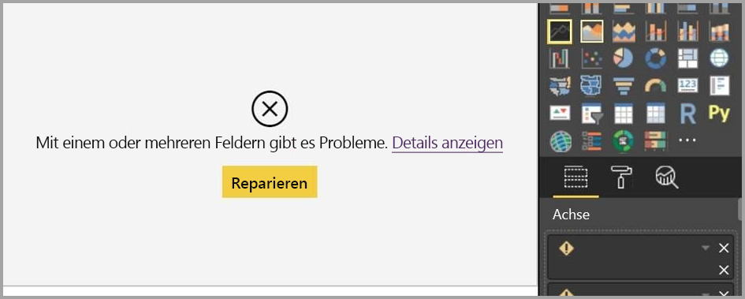

# Arbeiten mit der Berichtsansicht in Power BI Desktop

Wenn Sie bereits mit Power BI gearbeitet haben, wissen Sie, wie einfach Berichte erstellt werden können, die dynamische Perspektiven und Erkenntnisse zu Ihren Daten liefern. Power BI verfügt in Power BI Desktop zudem über weitere komplexe Funktionen. Mit Power BI Desktop können Sie komplexe Abfragen erstellen, Daten aus mehreren Quellen kombinieren, Beziehungen zwischen Tabellen erstellen und vieles mehr.

Power BI Desktop umfasst die *Berichtsansicht*, in der sich beliebig viele Berichtseiten mit Visualisierungen erstellen lassen. Die Berichtsansicht in Power BI Desktop bietet eine ähnliche Benutzererfahrung wie die Bearbeitungsansicht für Berichte im *Power BI-Dienst*. Sie können Visualisierungen verschieben, kopieren, einfügen, zusammenführen usw.

Der Unterschied besteht darin, dass Sie in Power BI Desktop mit Ihren Abfragen und Ihrem Modell arbeiten können, sodass Ihre Daten optimale Einblicke in Ihre Berichte ermöglichen. Sie können die Power BI Desktop-Datei dann jederzeit entweder auf dem lokalen Laufwerk oder in der Cloud speichern.

## Schauen wir uns das mal an!

Wenn Sie zum ersten Mal Daten in Power BI Desktop laden, wird die Berichtsansicht mit einer leeren Canvas angezeigt.

Sie können mithilfe der Symbole in der linken Navigationsleiste zwischen der **Berichtsansicht**, der **Datenansicht** und der **Beziehungsansicht** wechseln:

Nachdem Sie einige Daten hinzugefügt haben, können Sie Felder zu einer neuen Visualisierung in der Canvas hinzufügen.

Um den Typ der Visualisierung zu ändern, markieren Sie sie in der Canvas und wählen in **Visualisierungen** einen neuen Typ aus.

> [!TIP]
> Experimentieren Sie mit den verschiedenen Visualisierungstypen, um einen Eindruck zu erhalten. Es ist wichtig, dass die Visualisierungen die in Ihren Daten enthaltenen Informationen klar zum Ausdruck bringen.

Ein Bericht verfügt zu Beginn über mindestens eine leere Seite. Die Seiten werden im Navigationsbereich direkt links neben dem Zeichenbereich angezeigt. Sie können einer Seite beliebige Arten von Visualisierungen hinzufügen, aber es ist wichtig, dies nicht zu übertreiben. Durch zu viele Visualisierungen auf einer Seite wirkt diese überladen und wird unübersichtlich, sodass die richtigen Informationen schwer zu finden sind. Sie können Ihrem Bericht neue Seiten hinzufügen. Klicken Sie im Menüband einfach auf **Neue Seite**.

Klicken Sie am unteren Rand der Berichtsansicht auf das **X** auf der Registerkarte der Seite, um eine Seite zu löschen.

> [!NOTE]
> Berichte und Visualisierungen können nicht aus Power BI Desktop an ein Dashboard angeheftet werden. Dazu müssen Sie die Berichte und Visualisierungen auf Ihrer Power BI-Website veröffentlichen. Weitere Informationen finden Sie unter [Veröffentlichen von Datasets und Berichten aus Power BI Desktop](desktop-upload-desktop-files.md).

## Kopieren und Einfügen zwischen Berichten

Sie können ein Visual aus einem Power BI Desktop-Bericht problemlos kopieren und in einen anderen Bericht einfügen. Verwenden Sie einfach die Tastenkombination STRG+C, um Ihr Berichtsvisual zu kopieren. Im Power BI Desktop-Zielbericht verwenden Sie dann STRG+V, um das Visual in den anderen Bericht einzufügen. Sie können in einem Arbeitsschritt jeweils nur ein Visual oder alle Visuals auf einer Seite zum Kopieren auswählen und die Visuals anschließend in den Power BI Desktop-Zielbericht einfügen.

Die Möglichkeit zum Kopieren und Einfügen ist nützlich für Benutzer, die häufig mehrere Berichte erstellen und aktualisieren müssen. Bei Kopiervorgängen zwischen Dateien werden alle explizit im Formatierungsbereich festgelegten Einstellungen und Formatierungen für das Ziel übernommen. Visuelle Elemente hingegen, die auf einem Design oder den Standardeinstellungen basieren, werden automatisch an das Thema des Zielberichts angepasst. Wenn Sie also über ein Visual verfügen, dass in Formatierung und Aussehen genau Ihren Anforderungen entspricht, können Sie dieses Visual einfach kopieren und in neue Berichte einfügen. Die gesamte Formatierungsarbeit bleibt erhalten.

Wenn sich die Felder in Ihrem Modell unterscheiden, wird ein Fehler zum Visual angezeigt, und Sie werden in einer Warnung darüber informiert, welche Felder nicht vorhanden sind. Der Fehler ähnelt der Meldung, die beim Löschen eines Felds im Modell für ein Visual angezeigt wird.

Um den Fehler zu beheben, ersetzen Sie einfach die fehlerhaften Felder durch Felder aus dem Modell des Berichts, in den Sie das Visual eingefügt haben. Wenn Sie ein benutzerdefiniertes Visual verwenden, müssen Sie auch dieses benutzerdefinierte Visual in den Zielbericht importieren.

## Ausblenden von Berichtsseiten

Wenn Sie einen Bericht erstellen, können Sie Seiten aus diesem verbergen. Dieser Ansatz kann nützlich sein, wenn Sie zugrunde liegende Daten oder Visuals in einem Bericht erstellen müssen, diese Seiten jedoch nicht für Dritte sichtbar sein sollen, also wenn Sie z. B. Tabellen oder unterstützende Visuals erstellen, die auf anderen Berichtsseiten verwendet werden. Es gibt viele weitere kreative Gründe dafür, eine Berichtsseite zunächst zu erstellen und dann aus einem Bericht auszublenden, den Sie veröffentlichen möchten.

Das Ausblenden einer Berichtsseite ist einfach. Klicken Sie einfach mit der rechten Maustaste auf die Registerkarte „Berichtsseite“, und klicken Sie im angezeigten Menü auf **Ausblenden**.

Sie sollten Folgendes bedenken, wenn Sie eine Berichtsseite ausblenden:

* Eine ausgeblendete Berichtsansicht wird in Power BI Desktop weiterhin angezeigt. Der Titel der Seite wird allerdings abgeblendet dargestellt. In der folgenden Abbildung ist Seite 4 ausgeblendet.

    

* Eine ausgeblendete Berichtsseite wird Ihnen *nicht* angezeigt, wenn Sie den Bericht im Power BI-Dienst anzeigen.

* Beim Ausblenden einer Berichtsseite handelt es sich *nicht* um eine Sicherheitsmaßnahme. Benutzer können weiterhin auf die Seite zugreifen, und Inhalt ist weiterhin über Drillthroughs und andere Methoden verfügbar.

* Wenn eine Seite im Ansichtsmodus ausgeblendet ist, werden keine Navigationspfeile für den Ansichtsmodus angezeigt.
