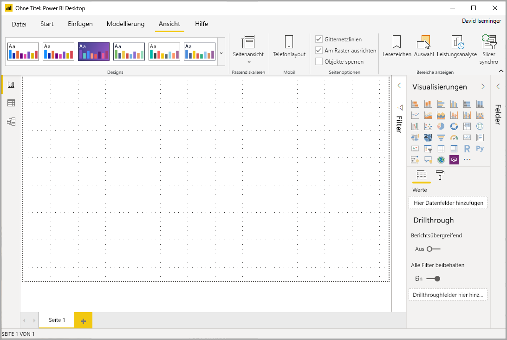
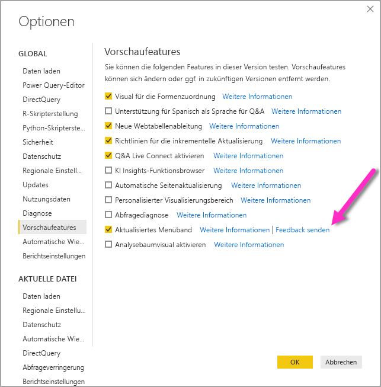
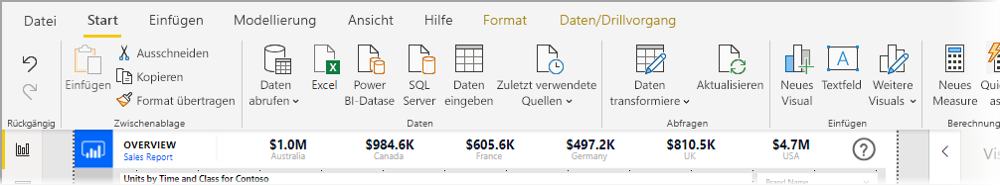
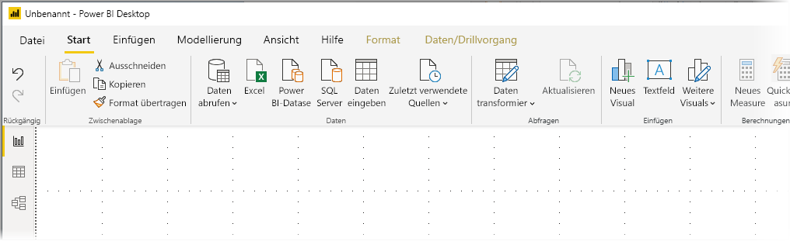
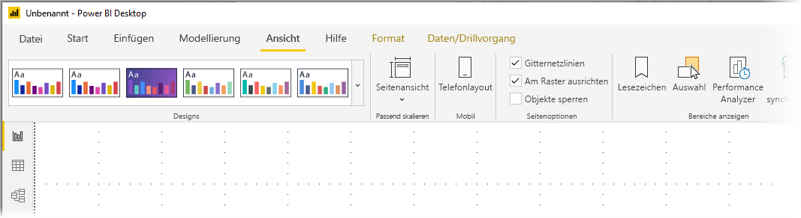
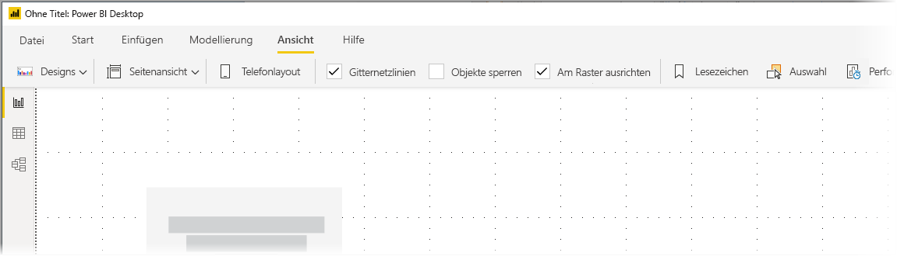

# Verwenden der aktualisierten Schleife in Power BI Desktop (Vorschau)

Ab dem Update vom November 2019 wird in Power BI Desktop das Menüband überarbeitet, um dessen Darstellung und Benutzererfahrung besser an andere Microsoft-Produkte wie z. B. Microsoft Office anzupassen.

Das aktualisiert Menüband befindet sich in der Vorschau, wir können also Feedback von Benutzern und Kunden sammeln und so sicherstellen, dass die Benutzererfahrung besonders gut ist. Bevor das aktualisierte Power BI Desktop-Menüband für die allgemeine Verfügbarkeit veröffentlicht wird, sind noch einige Monate für die Vorschau, das Feedback und Verbesserungen geplant. 

## Aktivieren des aktualisierten Menübands

Das aktualisierte Menüband ist eine Previewfunktion in Power BI und muss aktiviert werden. Klicken Sie auf **Datei > Optionen und Einstellungen > Optionen**, und klicken Sie dann in der linken Spalte auf **Previewfunktionen**, um sie zu aktivieren. Im rechten Bereich befindet sich die Auswahloption **Aktualisiertes Menüband**. Aktivieren Sie das Kontrollkästchen neben **Aktualisiertes Menüband**, um die Previewfunktion zu aktivieren. Sie müssen Power BI Desktop neu starten, damit die Änderung für die Previewfunktion wirksam wird.

## Features des neuen Menübands

Das Menübandupdate soll die Benutzererfahrung für Power BI Desktop und andere Microsoft-Produkte einfach und vertraut machen. 

Diese Vorteile können in folgende Kategorien unterteilt werden:

* **Verbesserte Darstellung, Handhabung und Organisation:** Symbole und Funktionen auf dem aktualisieren Power BI Desktop-Menüband sind an die Darstellung, Handhabung und Organisation der Menübandelemente von Office-Anwendungen ausgerichtet.

    

* **Ein intuitiver Katalog für Designs:** Der Katalog für Designs, der auf dem Menüband **Ansicht** zu finden ist, besitzt die vertraute Darstellung und Handhabung des Designs-Katalogs in PowerPoint. Daher zeigen Ihnen die Bilder auf dem Menüband, wie die Designänderungen aussehen werden, wenn sie auf Ihren Bericht angewendet werden, z. B. Farbkombinationen und Schriftarten. 

    

* **Dynamischer Menübandinhalt basierend auf Ihrer Ansicht:** Auf dem vorhandenen Menüband für Power BI Desktop wurden Symbole oder Befehle, die nicht verfügbar waren, einfach ausgegraut, wodurch die Benutzererfahrung alles andere als optimal war. Auf dem aktualisierten Menüband werden Symbole dynamisch angezeigt und angeordnet, damit Sie immer wissen, welche Optionen Ihnen im Kontext zur Verfügung stehen.

* **Ein Menüband mit einer Zeile, das Platz spart, wenn es reduziert wird:** Ein weiterer Vorteil des aktualisierten Menübands ist, dass es auf nur eine Zeile reduziert werden kann und dann nur die Menübandelemente basierend auf Ihrem Kontext angezeigt werden. 

    

Zusätzlich zu diesen sichtbaren Änderungen können wir mit dem aktualisierten Menüband auch zukünftige Updates an Power BI Desktop und dessen Menüband vornehmen:

* Erstellen flexibler und intuitiver Steuerelemente auf dem Menüband, z. B. den Designs-Katalog
* Hinzufügen der Office-Designs *schwarz* und *grau* für Power BI Desktop
* Verbesserung der Barrierefreiheit

## Nächste Schritte
Sie können mithilfe von Power BI Desktop eine Verbindung mit Daten jeglicher Art herstellen. Weitere Informationen zu Datenquellen finden Sie in folgenden Ressourcen:

* [Was ist Power BI Desktop?](desktop-what-is-desktop.md)
* [Datenquellen in Power BI Desktop](desktop-data-sources.md)
* [Strukturieren und Kombinieren von Daten mit Power BI Desktop](desktop-shape-and-combine-data.md)
* [Verbinden mit Excel in Power BI Desktop](desktop-connect-excel.md)   
* [Eingeben von Daten direkt in Power BI Desktop](desktop-enter-data-directly-into-desktop.md)   

