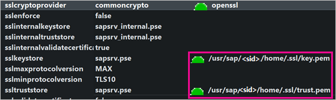
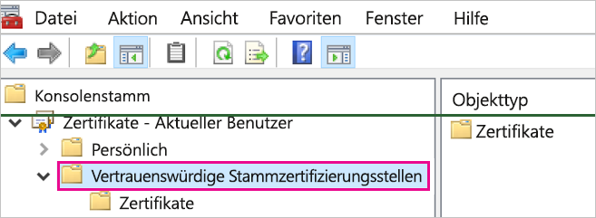
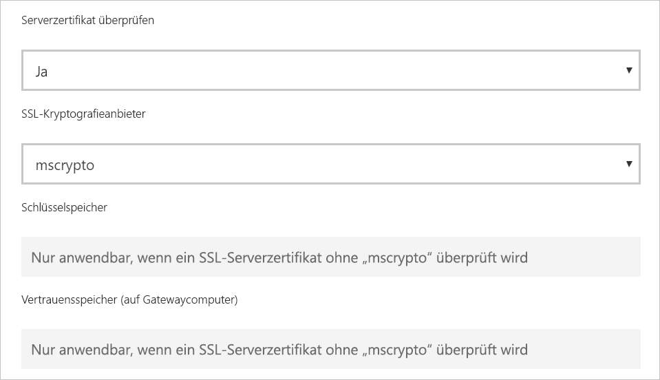

# <a name="enable-encryption-for-sap-hana"></a>Aktivieren der Verschlüsselung für SAP HANA

Es wird empfohlen, dass Sie Verbindungen mit einem SAP HANA-Server aus Power BI Desktop und dem Power BI-Dienst verschlüsseln. Sie können HANA-Verschlüsselung sowohl über OpenSSL als auch über SAPs proprietäre Bibliothek „CommonCryptoLib“ (früher unter dem Namen „sapcrypto“ bekannt) aktivieren. SAP empfiehlt die Verwendung von „CommonCryptoLib“, aber die grundlegenden Verschlüsselungsfunktionen sind über beide Bibliotheken verfügbar.

Dieser Artikel bietet eine Übersicht über das Aktivieren der Verschlüsselung mit OpenSSL und verweist auf einige bestimmte Bereiche der SAP-Dokumentation. Wir aktualisieren den Inhalt und Links in regelmäßigen Abständen, aber für eine umfassende Anleitung und Unterstützung sollten Sie immer auf die offizielle SAP-Dokumentation zurückgreifen. Wenn Sie die Verschlüsselung über „CommonCryptoLib“ statt über OpenSSL einrichten möchten, lesen Sie [How to Configure TLS/SSL in SAP HANA 2.0?](https://blogs.sap.com/2018/11/13/how-to-configure-tlsssl-in-sap-hana-2.0/). Die Schritte zum Migrieren von OpenSSL zu „CommonCryptoLib“ finden Sie im [SAP-Hinweis 2093286](https://launchpad.support.sap.com/#/notes/2093286) (S-user erforderlich).

> [!NOTE]
> Die in diesem Artikel beschriebenen Einrichtungsschritte für Verschlüsselung überschneiden sich mit den Einrichtungs- und Konfigurationsschritten für SAML-SSO. Unabhängig davon, ob Sie OpenSSL oder „CommonCryptoLib“ als Verschlüsselungsanbieter Ihres HANA-Servers wählen, müssen Sie darauf achten, dass Ihre Wahl über SAML- und Verschlüsselungskonfigurationen hinweg konsistent ist.

Es gibt vier Phasen, um Verschlüsselung für SAP HANA über OpenSSL zu aktivieren. Diese Phasen werden als nächstes beschrieben.  Weitere Informationen finden unter [Securing the Communication between SAP HANA Studio and SAP HANA Server through SSL](https://blogs.sap.com/2015/09/28/securing-the-communication-between-sap-hana-studio-and-sap-hana-server-through-ssl/).

## <a name="use-openssl"></a>Verwenden von OpenSSL

Stellen Sie sicher, dass Ihr HANA-Server so konfiguriert ist, dass er OpenSSL als seinen Kryptografieanbieter verwendet. Ersetzen Sie die nachstehend fehlenden Pfadinformationen durch die Server-ID (sid) Ihres HANA-Servers.



## <a name="create-a-certificate-signing-request"></a>Erstellen einer Zertifikatsignieranforderung

Erstellen Sie eine X509-Zertifikatsignieranforderung für den HANA-Server.

1. Stellen Sie über SSH als \<sid\>adm eine Verbindung mit dem Linux-Computer her, auf dem der HANA-Server ausgeführt wird.

1. Navigieren Sie zum Basisverzeichnis _/__usr/sap/\<sid\>/home_.

1. Erstellen Sie ein ausgeblendetes Verzeichnis namens _.__ssl_, sofern es noch nicht vorhanden ist.

1. Führen Sie den folgenden Befehl aus:

    ```
    openssl req -newkey rsa:2048 -days 365 -sha256 -keyout Server\_Key.pem -out Server\_Req.pem -nodes
    ```

Dieser Befehl erstellt eine Zertifikatsignieranforderung und einen privaten Schlüssel. Sobald das Zertifikat signiert wurde, ist es für ein Jahr gültig (siehe Parameter „-days“). Wenn Sie zur Eingabe des allgemeinen Namens (Common Name, CN) aufgefordert werden, geben Sie den vollqualifizierten Domänennamen (FQDN) des Computers ein, auf dem der HANA-Server installiert ist.

## <a name="get-the-certificate-signed"></a>Signierenlassen des Zertifikats

Lassen Sie das Zertifikat von einer Zertifizierungsstelle (Certificate Authority, CA) signieren, der die Clients vertrauen, mit denen Sie Verbindungen mit dem HANA-Server herstellen.

1. Wenn Sie bereits eine vertrauenswürdige Unternehmenszertifizierungsstelle haben (dargestellt durch „CA\_Cert.pem“ und „CA\_Key.pem“ im folgenden Beispiel), signieren Sie die Zertifikatanforderung, indem Sie den folgenden Befehl ausführen:

    ```
    openssl x509 -req -days 365 -in Server\_Req.pem -sha256 -extfile /etc/ssl/openssl.cnf -extensions usr\_cert -CA CA\_Cert.pem -CAkey CA\_Key.pem -CAcreateserial -out Server\_Cert.pem
    ```

    Wenn Sie noch keine Zertifizierungsstelle haben, die Sie verwenden können, können Sie selbst eine Stammzertifizierungsstelle (Root-CA) erstellen, indem Sie die Schritte ausführen, die unter [Securing the Communication between SAP HANA Studio and SAP HANA Server through SSL](https://blogs.sap.com/2015/09/28/securing-the-communication-between-sap-hana-studio-and-sap-hana-server-through-ssl/) aufgeführt sind.

1. Erstellen Sie die HANA-Serverzertifikatkette, indem Sie das Serverzertifikat, den Schlüssel und das Zertifikat der Zertifizierungsstelle (CA) kombinieren (der Name „key.pem“ entspricht der Konvention für SAP HANA):

    ```
    cat Server\_Cert.pem Server\_Key.pem CA\_Cert.pem \> key.pem
    ```

1. Erstellen Sie eine Kopie von „CA\_Cert.pem“ unter dem Namen „trust.pem“ (der Name „trust.pem“ entspricht der Konvention für SAP HANA):

    ```
    cp CA\_Cert.pem trust.pem
    ```

1. Starten Sie den HANA-Server neu.

1. Überprüfen Sie die Vertrauensstellung zwischen einem Client und der Zertifizierungsstelle, die Sie zum Signieren des Zertifikats des SAP HANA-Servers verwendet haben.

    Der Client muss der Zertifizierungsstelle vertrauen, die verwendet wurde, um das X509-Zertifikat des HANA-Servers zu signieren. Nur in diesem Fall kann eine verschlüsselte Verbindung vom Clientcomputer mit dem HANA-Server hergestellt werden.

    Es gibt verschiedene Möglichkeiten, über Microsoft Management Console (mmc) oder eine Befehlszeile zu prüfen, ob diese Vertrauensstellung vorhanden ist. Sie können das X509-Zertifikat der Zertifizierungsstelle (trust.pem) in den **Vertrauenswürdige Stammzertifizierungsstellen**-Ordner des Benutzers importieren, von dem die Verbindung hergestellt wird, oder in den gleichen Ordner für den Clientcomputer selbst, wenn dies wünschenswert ist.

    

    Sie müssen „trust.pem“ zunächst in eine CRT-Datei konvertieren, bevor Sie das Zertifikat in den Ordner „Vertrauenswürdige Stammzertifizierungsstellen“ importieren können. Führen Sie dazu beispielsweise den folgenden OpenSSL-Befehl aus:

    ```
    openssl x509 -outform der -in your-cert.pem -out your-cert.crt
    ```
    
    Weitere Informationen zum Verwenden von OpenSSL für die Konvertierung finden Sie in der [OpenSSL-Dokumentation](https://www.openssl.org/docs/manmaster/man1/x509.html).

## <a name="test-the-connection"></a>Testen der Verbindung

Testen Sie die Verbindung in Power BI Desktop oder im Power BI-Dienst.

1. In Power BI Desktop oder auf der **Gateways verwalten**-Seite des Power BI-Diensts muss **Serverzertifikat überprüfen** aktiviert sein, bevor versucht wird, eine Verbindung mit dem SAP HANA-Server herzustellen. Wählen Sie für **SSL-Kryptografieanbieter** die Option „mscrypto“ aus, wenn Sie die Schritte zum Einrichten von OpenSSL ausgeführt haben, und wählen Sie „commoncrypto“ aus, wenn Sie diese Bibliothek als Ihren Kryptografieanbieter konfiguriert haben. Belassen Sie die Felder „SSL-Schlüsselspeicher“ und „SSL-Vertrauensspeicher“ leer.

    - Power BI Desktop

        

    - Power BI-Dienst

        

1. Vergewissern Sie sich, dass Sie mit aktivierter Option **Serverzertifikat überprüfen** erfolgreich eine verschlüsselte Verbindung mit dem Server herstellen können. Laden Sie dazu Daten in Power BI Desktop, oder aktualisieren Sie einen veröffentlichten Bericht im Power BI-Dienst.
