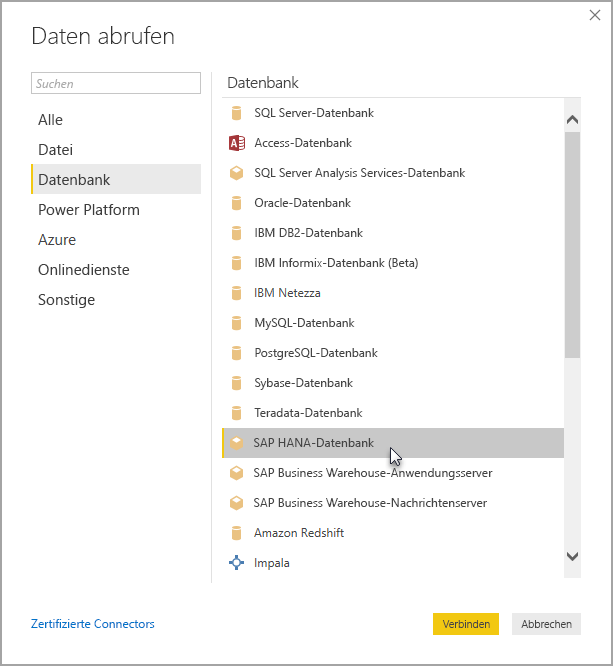

# Verwenden von SAP HANA in Power BI Desktop
Sie haben nun die Möglichkeit, mit Power BI Desktop auf **SAP HANA** -Datenbanken zuzugreifen. Für die Verwendung von **SAP HANA**muss der SAP HANA-ODBC-Treiber auf dem lokalen Clientcomputer installiert sein, damit die Datenverbindung von Power BI Desktop zu **SAP HANA** ordnungsgemäß funktioniert. Sie können den SAP HANA-ODBC-Treiber aus dem [SAP Software Download Center](https://support.sap.com/swdc) herunterladen. Suchen Sie dort nach dem SAP HANA CLIENT für Windows-Computer. Da die Struktur des **SAP Software Download Center** regelmäßig überarbeitet wird, können wir keine genaueren Angaben zu dieser Website machen.

Zum Herstellen einer Verbindung mit einer **SAP HANA**-Datenbank klicken Sie wie in der folgenden Abbildung dargestellt auf **Daten abrufen > Datenbank > SAP HANA-Datenbank**.

Geben Sie beim Herstellen einer Verbindung mit einer SAP HANA-Datenbank den Servernamen an. Geben Sie dann im Dropdown- und Eingabefeld den Port an.

In diesem Release wird **SAP HANA** im [DirectQuery](desktop-directquery-sap-hana.md)-Modus in Power BI Desktop und dem Power BI-Dienst unterstützt, und Sie können Berichte, die **SAP HANA** im DirectQuery-Modus verwenden, im Power BI-Dienst veröffentlichen und hochladen. Darüber hinaus können Sie Berichte im Power BI-Dienst veröffentlichen und hochladen, wenn **SAP HANA** nicht im DirectQuery-Modus verwendet wird.

## Unterstützte Funktionen für SAP HANA
Diese Version enthält viele Funktionen für **SAP HANA**. Diese sind in der folgenden Liste aufgeführt:

* Der Power BI-Connector für **SAP HANA** verwendet zur benutzerfreundlichen Anwendung den SAP-ODBC-Treiber.
* **SAP HANA** unterstützt sowohl DirectQuery als auch Importoptionen
* Power BI unterstützt HANA-Informationsmodelle (z. B. Analytik- und Berechnungsansichten) und bietet optimierte Navigation.
* Mit **SAP HANA** lässt sich auch die direkte SQL-Funktion zur Verbindung mit Zeilen- und Spaltentabellen nutzen.
* Mit optimierter Navigation für HANA-Modelle
* Power BI unterstützt **SAP HANA** -Variablen und -Eingangsparameter
* Auf HDI-Containern basierende Berechnungsansichten
  * Die Unterstützung für auf HDI-Containern basierende Berechnungsansichten ist ab dem Power BI Desktop-Release von August 2019 in der öffentlichen Vorschau. Stellen Sie sicher, dass der oder die HANA-Datenbankbenutzer für Power BI über Berechtigungen für den Zugriff auf den HDI-Laufzeitcontainer verfügen, der die Ansichten enthält, auf die Sie zugreifen möchten, um auf Ihre auf HDI-Container basierten Berechnungsansichten in Power BI zuzugreifen. Zum Gewähren dieses Zugriffs müssen Sie eine Rolle erstellen, die den Zugriff auf Ihren HDI-Container ermöglicht, und die Rolle dem HANA-Datenbankbenutzer für Power BI zuweisen (dieser Benutzer muss wie üblich auch über Leseberechtigungen für die Systemtabelle im \_SYS\_BI-Schema verfügen). Ausführliche Anweisungen zum Erstellen und Zuweisen von Datenbankrollen finden Sie in der offiziellen SAP-Dokumentation. [Dieser SAP-Blogbeitrag](https://nam06.safelinks.protection.outlook.com/?url=https%3A%2F%2Fblogs.sap.com%2F2018%2F01%2F24%2Fthe-easy-way-to-make-your-hdi-container-accessible-to-a-classic-database-user%2F&data=02%7C01%7Cv-adbold%40microsoft.com%7Cf7e0a405fe334598ba0608d7096ef5b4%7C72f988bf86f141af91ab2d7cd011db47%7C1%7C0%7C636988244476739316&sdata=PuRu61GPRYp34mLuGbQk6gdbRikdgbxfqo8q1RBQtm0%3D&reserved=0) bietet einen guten Ausgangspunkt.
  * Beachten Sie, dass derzeit einige Einschränkungen für HANA-Variablen vorliegen, die an HDI-basierte Berechnungsansichten angefügt sind. Diese Einschränkungen bestehen aufgrund von Fehlern bei HANA, die in einem zukünftigen Release von SAP HANA behoben werden. Erstens ist es nicht möglich, eine HANA-Variable auf eine freigegebene Spalte einer HDI-Container-basierten Berechnungsansicht anzuwenden. Diese Einschränkung kann mithilfe eines Upgrades auf HANA 2 Version 37.02, HANA 2 Version 42 oder höher behoben werden. Zweitens werden Standardwerte mit mehreren Einträgen für Variablen und Parameter derzeit nicht in der Power BI-Benutzeroberfläche angezeigt. Auch hierfür liegt der Grund bei einem Fehler in SAP HANA, jedoch wurde noch keine Fehlerbehebung angekündigt.

## Einschränkungen für SAP HANA
Es gibt auch einige Einschränkungen bei der Verwendung von **SAP HANA**, wie unten gezeigt.

* NVARCHAR-Zeichenfolgen werden auf maximal 4000 Unicode-Zeichen gekürzt.
* SMALLDECIMAL wird nicht unterstützt.
* VARBINARY wird nicht unterstützt.
* Gültige Datumsangaben liegen zwischen 1899/12/30 und 9999/12/31.

## Nächste Schritte
Weitere Informationen über DirectQuery und SAP HANA finden Sie in den folgenden Ressourcen:

* [DirectQuery und SAP HANA](desktop-directquery-sap-hana.md)
* [DirectQuery in Power BI](desktop-directquery-about.md)
* [Data Sources supported by DirectQuery (Von DirectQuery unterstützte Datenquellen)](desktop-directquery-data-sources.md)
* [Aktivieren der Verschlüsselung für SAP HANA](desktop-sap-hana-encryption.md)

