# <a name="tutorial-shape-and-combine-data-in-power-bi-desktop"></a>Tutorial: Strukturieren und Kombinieren von Daten in Power BI Desktop

Mit Power BI Desktop können Sie verschiedenste Arten von Datenquellen verknüpfen und die Daten dann basierend auf Ihren Anforderungen strukturieren. So können Sie visuelle Berichte erstellen und mit anderen Benutzern gemeinsam nutzen. Das *Strukturieren* von Daten ist mit einem Transformieren der Daten gleichzusetzen. Sie können beispielsweise Spalten oder Tabellen umbenennen, Text in Zahlen umwandeln, Zeilen entfernen, die erste Zeile als Überschrift festlegen usw. Beim *Kombinieren* von Daten werden mehrere Datenquellen verknüpft, gemäß Anforderungen strukturiert und dann in einer sinnvollen Abfrage konsolidiert.

In diesem Tutorial lernen Sie Folgendes:

* Strukturieren von Daten mit dem Abfrage-Editor
* Verbindungsherstellung mit verschiedenen Datenquellen
* Kombinieren dieser Datenquellen und Erstellen eines Datenmodells zur Verwendung in Berichten

Dieses Tutorial veranschaulicht, wie Sie eine Abfrage mit Power BI Desktop strukturieren können. Hierbei werden insbesondere die gängigsten Aufgaben hervorgehoben. Die hier verwendete Abfrage (und auch der gesamte Erstellungsvorgang) ist im Handbuch [Erste Schritte mit Power BI-Desktop](desktop-getting-started.md) ausführlicher beschrieben.

Im Abfrage-Editor von Power BI Desktop kommen neben den im Menüband **Transformieren** verfügbaren Optionen häufig Kontextmenüs (Rechtsklick) zum Einsatz. Die meisten der Optionen, die im Menüband verfügbar sind, können auch durch einen Rechtsklick auf ein Element (z. B. eine Spalte) und Auswahl einer Option aus dem daraufhin angezeigten Menü aufgerufen werden.

## <a name="shape-data"></a>Strukturieren von Daten
Beim Strukturieren von Daten im Abfrage-Editor geben Sie Schrittanweisungen vor (die der Abfrage-Editor dann für Sie ausführt), um das Laden von Daten und deren Darstellung im Abfrage-Editor anzupassen. Die ursprüngliche Datenquelle bleibt davon unberührt. Angepasst bzw. *strukturiert* wird nur diese spezifische Ansicht der Daten.

Die Schritte, die Sie angeben (z. B. Umbenennen einer Tabelle, Transformieren eines Datentyps oder Löschen einer Spalte), werden vom Abfrage-Editor aufgezeichnet. Bei jeder Verbindung dieser Abfrage mit der Datenquelle werden die Daten dann stets in der gewünschten strukturierten Ansicht angezeigt. Dieser Vorgang wird immer dann ausgeführt, wenn Sie den Abfrage-Editor in Power BI Desktop verwenden, oder wenn ein Benutzer auf die freigegebene Abfrage zugreift (z. B. im Power BI-Dienst). Diese Schritte werden der Reihe nach im Bereich **Abfrageeinstellungen** unter **Angewendete Schritte** aufgezeichnet. In den nächsten Abschnitten werden diese Schritte im Einzelnen erläutert.

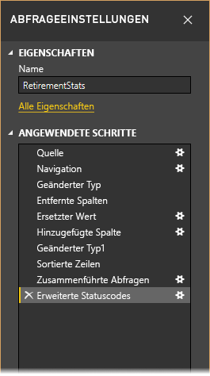

Wir verwenden die Daten zu den bevorzugten Wohnorten für Pensionäre aus [Erste Schritte mit Power BI Desktop](desktop-getting-started.md), die wir über die Verbindung mit einer Webdatenquelle abgerufen haben. Wir werden die Daten so strukturieren, dass sie unseren Anforderungen entsprechen. Wir fügen eine benutzerdefinierte Spalte hinzu, um den Rang basierend auf allen Daten als gleichwertige Faktoren zu berechnen, und diese mit der vorhandenen Spalte **Rang** zu vergleichen.  

1. Wählen Sie im Menüband **Spalte hinzufügen** die Option **Benutzerdefinierte Spalte** aus, über die Sie eine benutzerdefinierte Spalte hinzufügen können.

    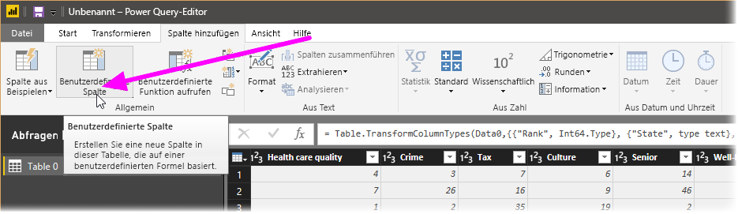

1. Geben Sie im Fenster **Benutzerdefinierte Spalte** in **Name der neuen Spalte** den Wert _Neuer Rang_ ein. Geben Sie in **Benutzerdefinierte Spaltenformel** die folgenden Daten ein:

    ```
    ([Cost of living] + [Weather] + [Health care quality] + [Crime] + [Tax] + [Culture] + [Senior] + [#"Well-being"]) / 8
    ```
 
1. Vergewissern Sie sich, dass die Statusmeldung *Es wurden keine Syntaxfehler erkannt.* angezeigt wird, und klicken Sie auf **OK**.

    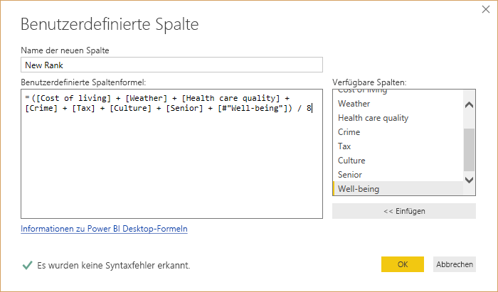

1. Um die Konsistenz der Spaltendaten sicherzustellen, transformieren Sie die neuen Spaltenwerte in ganze Zahlen. Klicken Sie hierzu mit der rechten Maustaste auf die Spaltenüberschrift, und wählen Sie **Typ ändern \> Ganze Zahl** aus. 

    Wenn Sie mehr als eine Spalte auswählen müssen, wählen Sie zuerst eine Spalte aus, halten Sie die **UMSCHALTTASTE** gedrückt, und wählen Sie dann weitere angrenzende Spalten aus. Klicken Sie anschließend mit der rechten Maustaste auf eine Spaltenüberschrift. Sie können auch die **STRG-TASTE** verwenden, um nicht angrenzende Spalten auszuwählen.

    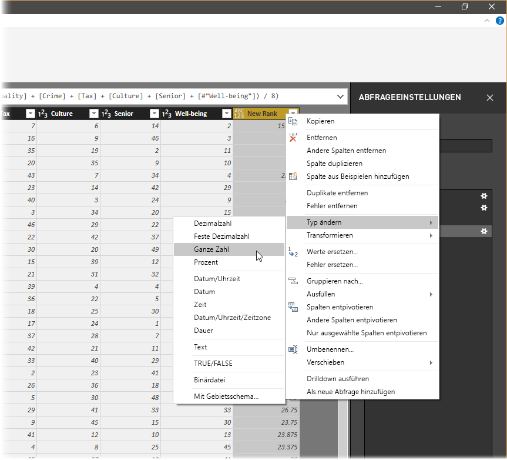

1. Um Spaltendatentypen zu *transformieren*, also den aktuellen Datentyp in einen anderen umzuwandeln, wählen Sie im Menüband **Transformieren** die Option **Datentyp: Text** aus. 

   

1. In **Abfrageeinstellungen** werden in der Liste **Angewendete Schritte** alle Schritte aufgeführt, die zum Strukturieren auf die Daten angewendet werden. Wenn Sie einen Schritt aus dem Strukturierungsprozess entfernen möchten, klicken Sie einfach auf das **X** links neben dem jeweiligen Schritt. 

    Im Screenshot unten zeigt die Liste **Angewendete Schritte** die bisher hinzugefügten Schritte an: 
     - **Quelle**: Herstellen einer Verbindung mit der Website
     - **Navigation**: Auswählen der Tabelle 
     - **Geänderter Typ**: Ändern der textbasierten Zahlenspalten von *Text* in *Ganze Zahl* 
     - **Hinzugefügte benutzerdefiniert Spalte**: Hinzufügen einer benutzerdefinierten Spalte
     - **Geänderter Typ1**: Der letzte angewendete Schritt

       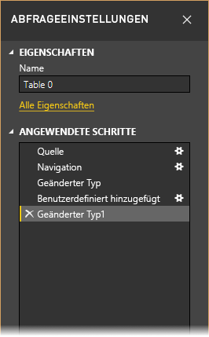

## <a name="adjust-data"></a>Anpassen von Daten

Bevor wir mit dieser Abfrage arbeiten können, müssen wir einige Änderungen vornehmen, um die zugehörigen Daten anzupassen:

   - Anpassen der Rangfolgen durch Entfernen einer Spalte

       Wir sind zu dem Schluss gekommen, dass die **Lebenshaltungskosten** kein Faktor in unseren Ergebnissen sind. Nach dem Entfernen dieser Spalte bleiben die Daten unverändert. 

   - Beheben einiger Fehler

       Da wir eine Spalte entfernt haben, müssen wir unsere Berechnungen in der Spalte **Neuer Rang** neu anpassen und hierzu eine Formel ändern.

   - Sortieren der Daten

       Wir sortieren Daten basierend auf den Spalten **Neuer Rang** und **Rang**.
 
   - Ersetzen der Daten

       Wir zeigen, wie ein bestimmter Wert ersetzt wird und dabei ein Schritt unter **Angewendete Schritte** einzufügen ist.

   - Ändern des Tabellennamens 

       **Tabelle 0** ist kein sinnvoller Deskriptor, deshalb ändern wird den Tabellennamen.

1. Um die Spalte **Lebenshaltungskosten** zu entfernen, wählen Sie die Spalte und dann im Menüband die Registerkarte **Start** aus. Klicken Sie anschließend auf **Spalten entfernen**.

    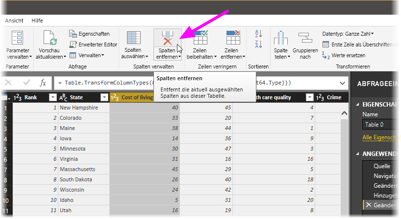

   Beachten Sie, dass die Werte **Neuer Rang** sich nicht geändert haben. Dies liegt an der Reihenfolge der Schritte. Der Abfrage-Editor zeichnet die Schritte zwar nacheinander, aber unabhängig voneinander auf. Deshalb können Sie unter **Angewendete Schritte** die Schritte in der Reihenfolge nach oben oder unten verschieben. 

1. Klicken Sie mit der rechten Maustaste auf einen Schritt. Der Abfrage-Editor stellt ein Kontextmenü mit folgenden Optionen bereit: 
   - **Umbenennen**: Benennen Sie den Schritt um.
   - **Löschen**: Löschen Sie den Schritt.
   - **Bis** **zum Ende löschen**: Entfernen Sie den aktuellen Schritt und alle nachfolgenden Schritte.
   - **Nach oben**: Verschieben Sie den Schritt in der Liste nach oben.
   - **Nach unten**: Verschieben Sie den Schritt in der Liste nach unten.

1. Verschieben Sie den letzten Schritt **Entfernte Spalten** an die Stelle direkt über den Schritt **Hinzugefügte benutzerdefiniert Spalte**.

   

1. Wählen Sie den Schritt **Hinzugefügte benutzerdefiniert Spalte** aus. 

   Beachten Sie, dass für die Daten nun ein _Fehler_ angezeigt wird, den wir beheben müssen.

   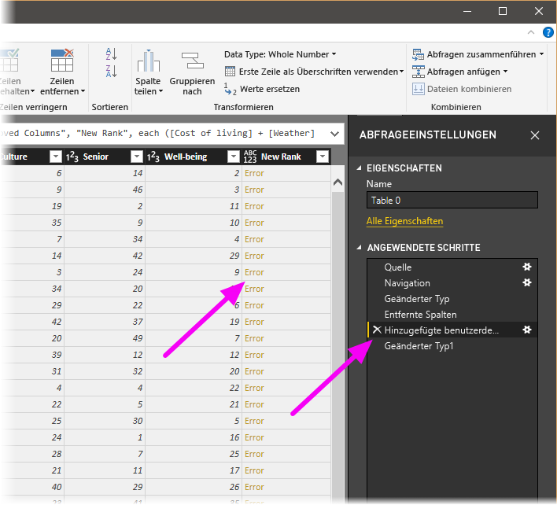

   Es gibt verschiedene Möglichkeiten, weitere Informationen zu den einzelnen Fehlern zu erhalten. Wenn Sie die Zelle auswählen, ohne auf das Wort *Fehler* zu klicken, zeigt der Abfrage-Editor die Fehlerinformationen im unteren Fensterbereich an.

   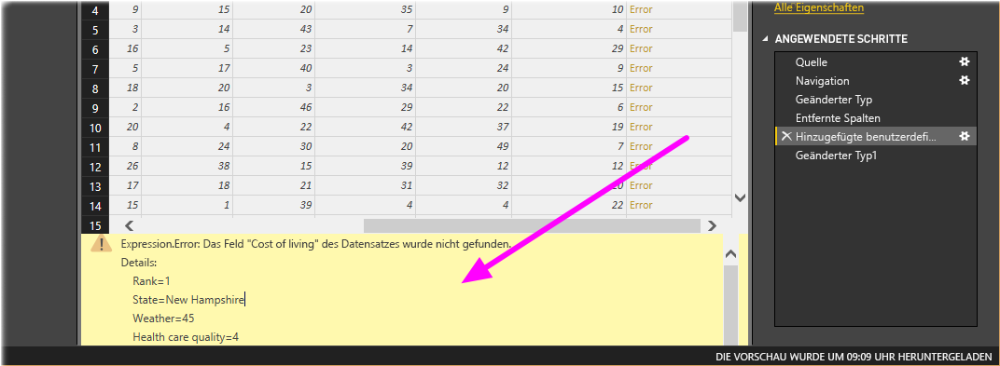

   Wenn Sie das Wort *Fehler* direkt auswählen, erstellt der Abfrage-Editor im Bereich **Abfrageeinstellungen** unter **Angewendete Schritte** einen weiteren Schritt und zeigt die Informationen zu dem Fehler an. 

1. Wir müssen keine Informationen zum Fehler anzeigen, klicken Sie deshalb auf **Abbrechen**.

1. Wählen Sie zur Behebung des Fehlers die Spalte **Neuer Rang** aus, und zeigen Sie dann die Datenbearbeitungsleiste der Spalte an, indem Sie auf der Registerkarte **Ansicht** das Kontrollkästchen **Bearbeitungsleiste** aktivieren. 

   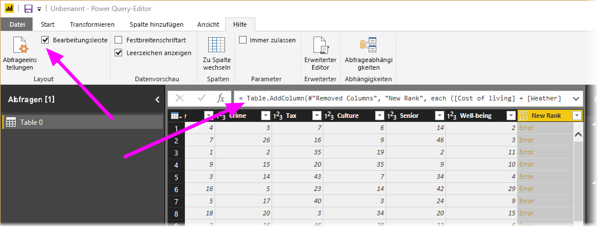

1. Entfernen Sie den Parameter _Lebenshaltungskosten_ und den Divisor, indem Sie die Formel wie folgt ändern: 
   ```
    Table.AddColumn(#"Removed Columns", "New Rank", each ([Weather] + [Health care quality] + [Crime] + [Tax] + [Culture] + [Senior] + [#"Well-being"]) / 7)
   ```

1. Aktivieren Sie das grüne Häkchen links neben dem Formelfeld, oder drücken Sie die **EINGABETASTE**.

  Der Abfrage-Editor ersetzt die Daten durch die überarbeiteten Werte, und der Schritt **Hinzugefügte benutzerdefiniert Spalte** wird ohne Fehler abgeschlossen.

   > [!NOTE]
   > Sie können auch die Option **Fehler entfernen** (im Menüband oder Kontextmenü) auswählen, mit der alle fehlerhafte Zeilen entfernt werden. Im Rahmen dieses Tutorials möchten wir die Daten aber in der Tabelle beibehalten und führen diesen Schritt deshalb nicht aus.

1. Sortieren Sie die Daten basierend auf der Spalte **Neuer Rang**. Wählen Sie zunächst den zuletzt angewendeten Schritt **Geänderter Typ1** aus, um die neuesten Daten abzurufen. Wählen Sie anschließend über die Dropdownliste neben der Spaltenüberschrift **Neuer Rang** die Option **Aufsteigend sortieren** aus.

   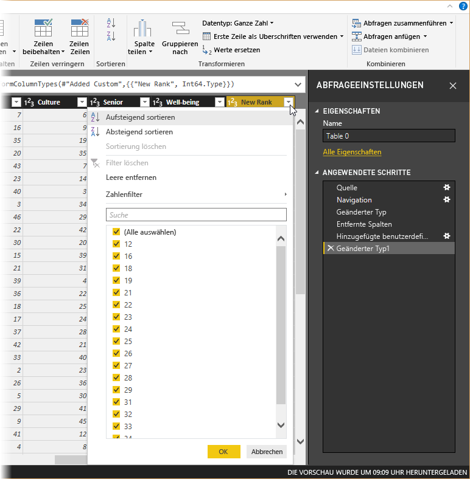

   Die Daten sind nun nach **Neuer Rang** sortiert. Wenn Sie sich jedoch die Spalte **Rang** ansehen, wird Ihnen auffallen, dass die Daten in Fällen, in denen der Wert **Neuer Rang** gleichwertig ist, nicht ordnungsgemäß sortiert wurden. Dies werden wir im nächsten Schritt korrigieren.

1. Wählen Sie zur Behebung dieses Sortierungsproblems die Spalte **Neuer Rang** aus, und ändern Sie die Formel in der **Bearbeitungsleiste** folgendermaßen ab:

   ```
    = Table.Sort(#"Changed Type1",{{"New Rank", Order.Ascending},{"Rank", Order.Ascending}})
   ```

1. Aktivieren Sie das grüne Häkchen links neben dem Formelfeld, oder drücken Sie die **EINGABETASTE**. 

   Die Zeilen werden jetzt gemäß den beiden Spalten **Neuer Rang** und **Rang** sortiert. Außerdem können Sie unter **Angewendete Schritte** einen beliebigen Schritt in der Liste auswählen und die Strukturierung der Daten an diesem Punkt der Reihenfolge fortsetzen. Der Abfrage-Editor fügt unter **Angewendete Schritte**nach dem aktuell ausgewählten Schritt automatisch einen neuen Schritt ein. 

1. Wählen Sie in **Angewendeter Schritt** den Schritt aus, der der benutzerdefinierten Spalte vorangeht, also **Entfernte Spalten**. An dieser Stelle wird der Wert der Rangfolge **Wetter** in Arizona ersetzt. Klicken Sie mit der rechten Maustaste auf die Zelle, die die Rangfolge **Wetter** für Arizona enthält, und wählen Sie **Werte ersetzen** aus. Beachten Sie auch die aktuelle Auswahl in **Angewendeter Schritt**.

   

1. Wählen Sie **Einfügen** aus.

    Da wir einen Schritt einfügen, warnt uns der Abfrage-Editor vor möglichen Konsequenzen – die nachfolgenden Schritte könnten u. U. beeinträchtigt und die Abfrage unbrauchbar werden. 

    

1. Ändern Sie den Datenwert in _51_. 

   Der Abfrage-Editor ersetzt die Daten für Arizona. Wenn Sie in **Angewendeter Schritt** einen neuen Schritt erstellen, benennt ihn der Abfrage-Editor nach der jeweiligen Aktion, in diesem Fall **Ersetzter Wert**. Falls die Abfrage mehrere Schritte gleichen Namens enthält, versieht der Abfrage-Editor unter **Angewendete Schritte** jeden Folgeschritt zur Unterscheidung mit einer Nummer (in der entsprechenden Reihenfolge).

1. Wählen Sie nun den letzten Schritt **Sortierte Zeilen** unter **Angewendete Schritte** aus. 

   Beachten Sie, dass die Daten im Hinblick auf die neue Rangfolge von Arizona geändert wurden. Dies ist darauf zurückzuführen, dass wir den Schritt **Ersetzter Wert** an der richtigen Stelle eingefügt haben, nämlich vor dem Schritt **Hinzugefügte benutzerdefiniert Spalte**.

1. Zum Schluss möchten wir noch den Namen der Tabelle in einen aussagekräftigeren Namen ändern. Geben Sie im Bereich **Abfrageeinstellungen** unter **Eigenschaften** den neuen Namen der Tabelle ein, und drücken Sie dann auf die **EINGABETASTE**. Wir nennen diese Tabelle *RetirementStats*.

   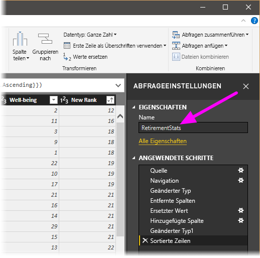

   Bei der späteren Erstellung von Berichten sind aussagekräftige Tabellennamen wichtig – insbesondere dann, wenn Sie Verbindungen mit mehreren Datenquellen herstellen und alle im Bereich **Felder** der **Berichtsansicht** aufgelistet sind.

   Die Daten sind nun so strukturiert, dass sie unseren Anforderungen entsprechen. Jetzt stellen wir eine Verbindung zu einer anderen Datenquelle her und kombinieren die Daten.

## <a name="combine-data"></a>Kombinieren von Daten
Die Daten zu verschiedenen Bundesstaaten sind interessant und nützlich für die Erstellung weiterer Analysen und Abfragen. Es gibt allerdings ein Problem: Bei den meisten Daten wird ein zweistelliges Länderkürzel als Code für den Bundesstaat und nicht dessen voller Name verwendet. Wir müssen die Namen der Bundesstaaten in irgendeiner Weise mit den Kürzeln verknüpfen.

Glücklicherweise gibt es eine weitere öffentliche Datenquelle, die genau diesen Zweck erfüllt. Die Daten müssen jedoch noch entsprechend strukturiert werden, bevor wir sie mit unserer Tabelle mit bevorzugten Wohnorten für Pensionäre verbinden können. Führen Sie zum Strukturieren der Daten die folgenden Schritte aus:

1. Wählen Sie im Abfrage-Editor über das Menüband **Start** den Befehl **Neue Quelle \> Web** aus. 

2. Geben Sie die Adresse der Website für Abkürzungen von Bundesstaaten ein ( *https://en.wikipedia.org/wiki/List_of_U.S._state_abbreviations* ), und klicken Sie dann auf **Verbinden**.

   Der Navigator zeigt die Inhalte der Website an.

    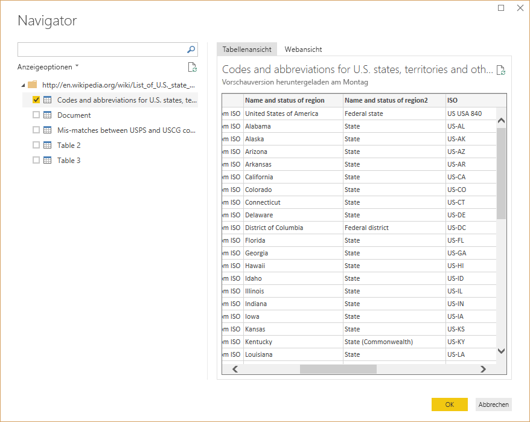

1. Wählen Sie **Codes and abbreviations** (Codes und Abkürzungen) aus. 

   > [!TIP]
   > Es erfordert einigen Aufwand, diese Tabelle so zu strukturieren, dass sie nur die benötigten Daten enthält. Gibt es einen schnelleren oder einfacheren Weg, die nachstehenden Schritte auszuführen? Ja, Sie könnten eine *Beziehung* zwischen den beiden Tabellen erstellen und die Daten basierend auf dieser Beziehung strukturieren. Die folgenden Schritte sind zwar als Einstieg in die Arbeit mit Tabellen geeignet, mithilfe von Beziehungen können Sie jedoch schnell Daten aus mehreren Tabellen nutzen.
> 
> 

Führen Sie zum Strukturieren der Daten diese Schritte aus:

1. Entfernen Sie die oberste Zeile. Diese ist ein Ergebnis der Tabellenerstellung aus der Webseite und wird nicht gebraucht. Wählen Sie im Menüband auf der Registerkarte **Start** die Optionen **Zeilen verringern \> Zeilen entfernen \> Erste Zeilen entfernen** aus.

    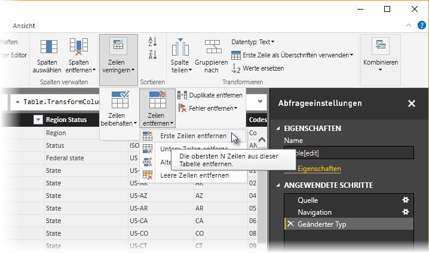

    Das Fenster **Erste Zeilen entfernen** wird angezeigt, in dem Sie angeben können, wie viele Zeilen Sie entfernen möchten.

    > [!NOTE]
    > Wenn Power BI die Tabellenüberschriften versehentlich als Zeile in der Datentabelle importiert, können Sie zur Korrektur der Tabelle auf der Registerkarte **Start** oder der Registerkarte **Transformieren** im Menüband **Erste Zeile als Überschrift verwenden** auswählen.

1. Entfernen Sie die unteren 26 Zeilen. Diese Zeilen sind US-Gebiete, die nicht einbezogen werden müssen. Wählen Sie im Menüband auf der Registerkarte **Start** die Optionen **Zeilen verringern \> Zeilen entfernen \> Letzte Zeilen entfernen** aus.

    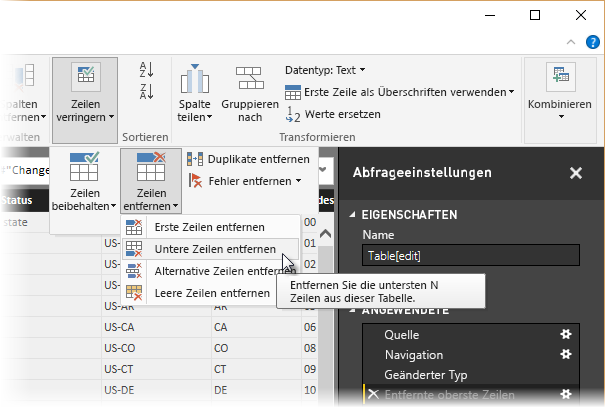

1. Da die Tabelle „RetirementStats“ keine Informationen für Washington, D.C., enthält, müssen wir Washington, D.C., aus der Liste herausfiltern. Wählen Sie die Dropdownliste **Region Status** aus, und deaktivieren Sie das Kontrollkästchen neben **Federal District**.

    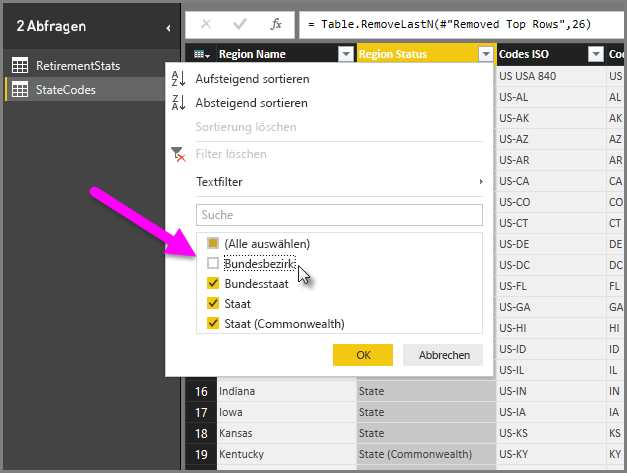

1. Entfernen Sie einige überflüssige Spalten. Wir benötigen nur die Zuordnung der Bundesstaaten zu den offiziellen zweistelligen Länderkürzeln. Aus diesem Grund können wir die folgenden Spalten entfernen: **Column1**, **Column3**, **Column4** und **Column6** bis **Column11**. Wählen Sie zuerst **Column1** aus, und wählen Sie dann mit gedrückter **STRG**-TASTE die übrigen zu entfernenden Spalten aus. Wählen Sie im Menüband auf der Registerkarte **Start** die Optionen **Spalten entfernen \> Spalten entfernen** aus.

   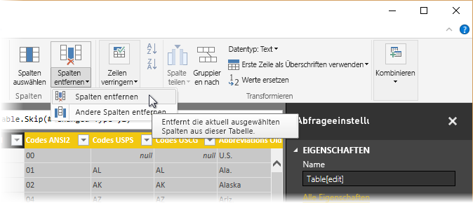

   > [!NOTE]
   > An dieser Stelle sei darauf hingewiesen, dass die *Reihenfolge* der im Abfrage-Editor angewendeten Schritte wichtig ist und sich auf die Strukturierung der Daten auswirken kann. Berücksichtigt werden muss auch, wie sich ein Schritt auf einen anderen, nachfolgenden Schritt auswirkt. Wenn Sie also aus "Angewendete Schritte" einen Schritt entfernen, verhalten sich die nachfolgenden Schritte aufgrund des Einflusses der Schrittreihenfolge der Abfrage möglicherweise nicht mehr so, wie es ursprünglich beabsichtigt war.

   > [!NOTE]
   > Wenn Sie die Breite des Abfrage-Editorfensters verringern, werden einige Elemente des Menübands gestaucht, um den angezeigten Raum optimal zu nutzen. Wenn Sie das Fenster des Abfrage-Editors verbreitern, werden die Elemente des Menübands gedehnt, um die größere Fläche des Menübands zu nutzen.

1. Benennen Sie die Spalten und die Tabelle um. Zum Umbenennen einer Spalte gibt es verschiedene Möglichkeiten: Wählen Sie zunächst die Spalte aus, und klicken Sie dann entweder auf der Registerkarte **Transformieren** auf **Umbenennen**, oder klicken Sie mit der rechten Maustaste, und wählen Sie **Umbenennen** aus. In der folgenden Abbildung weisen Pfeile auf diese beiden Optionen; sie brauchen nur eine davon auszuwählen.

   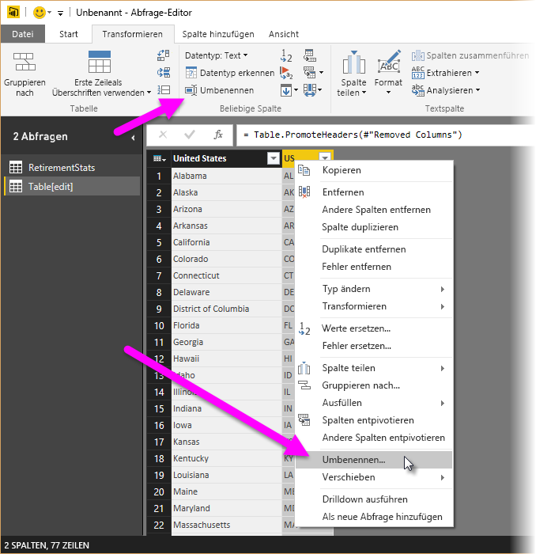

1. Benennen Sie die Spalten in *State Name* und *State Code* um. Um die Tabelle umzubenennen, geben Sie im Bereich **Abfrageeinstellungen** einen Wert für **Name** ein. Nennen Sie diese Tabelle *StateCodes*.

## <a name="combine-queries"></a>Kombinieren von Abfragen

Nachdem wir die Tabelle „StateCodes“ wie gewünscht strukturiert haben, können wir diese zwei Tabellen (oder Abfragen) zu einer Tabelle kombinieren. Da die jetzt vorliegenden Tabellen das Ergebnis der Abfragen sind, die wir auf die Daten angewendet haben, werden sie häufig als *Abfragen* bezeichnet.

Zum Kombinieren von Daten gibt es zwei bevorzugte Möglichkeiten: *Zusammenführen* und *Anhängen*.

- Wenn eine oder mehrere Spalten zu einer anderen Abfrage hinzugefügt werden sollen, werden die Abfragen *zusammengeführt* . 
- Wenn einer vorhandenen Abfrage zusätzliche Datenzeilen hinzugefügt werden sollen, wird die Abfrage *angehangen* .

Im vorliegenden Fall sollen die Abfragen zusammengeführt werden. Führen Sie hierfür die folgenden Schritte aus:
 
1. Wählen Sie im linken Bereich des Abfrage-Editors die Abfrage aus, *in der* beide Abfragen zusammengeführt werden sollen. In unserem Fall ist dies **RetirementStats**. 

1. Wählen Sie im Menüband auf der Registerkarte **Start** die Option **Kombinieren \> Abfragen zusammenführen** aus.

   

   Möglicherweise werden Sie aufgefordert, die Datenschutzebenen festzulegen. So wird beim Kombinieren der Daten sichergestellt, dass keine Daten einbezogen oder übertragen werden, die nicht übertragen werden sollen.

   Das Fenster **Zusammenführen** wird geöffnet. Sie werden aufgefordert, die Tabelle auszuwählen, die mit der ausgewählten Tabelle zusammengeführt werden soll. Anschließend müssen Sie die entsprechenden Spalten angeben, die für die Zusammenführung verwendet werden sollen. 

1. Wählen Sie in der Tabelle „RetirementStats“ zunächst **State** und dann die Abfrage **StateCodes** aus. 

   Wenn Sie die passenden Spalten auswählen, wird die Schaltfläche **OK** aktiviert.

   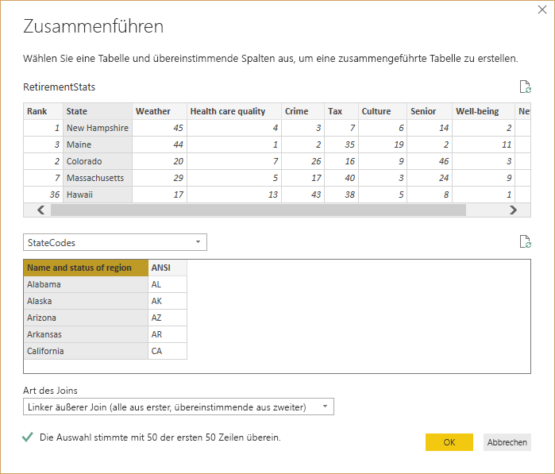

1. Wählen Sie **OK**aus.

   Der Abfrage-Editor erstellt am Ende der Abfrage eine neue Spalte namens **NewColumn**, die den Inhalt der Tabelle (Abfrage) umfasst, die mit der vorhandenen Abfrage zusammengeführt wurde. Alle Spalten der zusammengeführten Abfrage werden auf die neue Spalte **NewColumn** reduziert. Sie können die Tabelle jedoch **erweitern** und die gewünschten Spalten einbeziehen.

   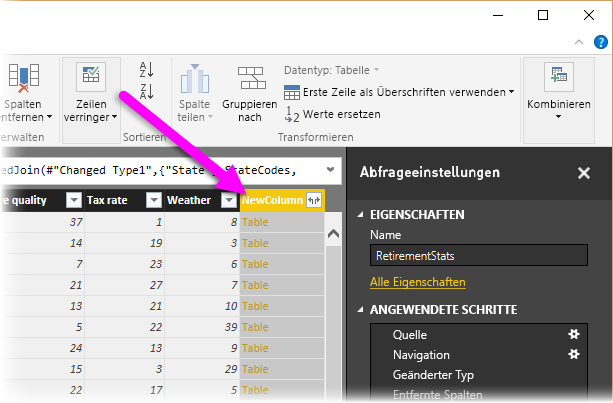

1. Um die zusammengeführte Tabelle zu erweitern und auszuwählen, welche Spalten einbezogen werden sollen, klicken Sie auf das Erweiterungssymbol (). 

   Das Fenster **Erweitern** wird geöffnet.

   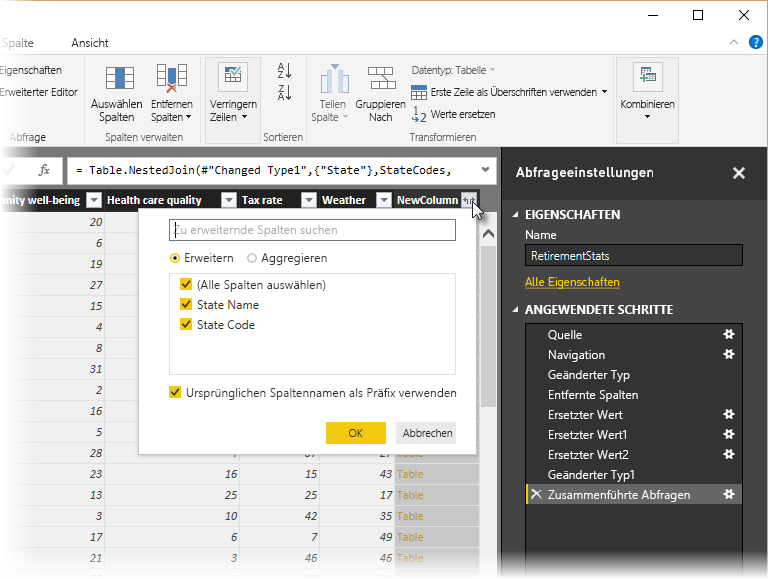

1. In unserem Fall wird nur die Spalte **State Code** benötigt. Wählen Sie diese Spalte aus, deaktivieren Sie **Ursprünglichen Spaltennamen als Präfix verwenden**, und klicken Sie dann auf **OK**.

   Wenn Sie das Kontrollkästchen **Ursprünglichen Spaltennamen als Präfix verwenden** aktiviert lassen, würde der Name der zusammengeführten Spalte **NewColumn.State Code** lauten.

   > [!NOTE]
   > Möchten Sie ein wenig mit dem Einfügen der Tabelle „NewColumn“ experimentieren? Sie können ein wenig ausprobieren. Wenn Ihnen die Ergebnisse nicht gefallen, löschen Sie diesen Schritt einfach in der Liste **Angewendete Schritte** im Bereich **Abfrageeinstellungen**. Ihre Abfrage wird dann wieder in den Zustand vor Anwenden des Schritts **Erweitern** versetzt. Sie können beliebig oft und solange experimentieren, bis die Erweiterung Ihren Vorstellungen entspricht.

   Wir verfügen jetzt über eine einzelne Abfrage (Tabelle), in der zwei entsprechend den Anforderungen strukturierte Datenquellen miteinander kombiniert sind. Diese Abfrage kann als Grundlage für viele weitere interessante Datenverbindungen dienen, z. B. für Statistiken zu Wohnkosten, demografischen Daten oder Beschäftigungsmöglichkeiten in den einzelnen Bundesstaaten.

1. Um Ihre Änderungen zu übernehmen und den Abfrage-Editor zu schließen, wählen Sie auf der Registerkarte **Start** des Menübands die Option **Schließen und Anwenden** aus. 

   Das transformierte Dataset wird in Power BI Desktop angezeigt und kann zum Erstellen von Berichten verwendet werden.

   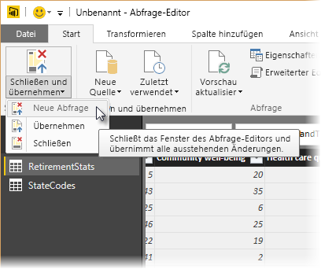

## <a name="next-steps"></a>Nächste Schritte
Weitere Informationen zu Power BI Desktop und seinen Funktionen finden Sie in den folgenden Ressourcen:

* [Was ist Power BI Desktop?](desktop-what-is-desktop.md)
* [Abfrageübersicht in Power BI Desktop](desktop-query-overview.md)
* [Datenquellen in Power BI Desktop](desktop-data-sources.md)
* [Verbinden mit Daten in Power BI Desktop](desktop-connect-to-data.md)
* [Allgemeine Abfrageaufgaben in Power BI Desktop](desktop-common-query-tasks.md)   

