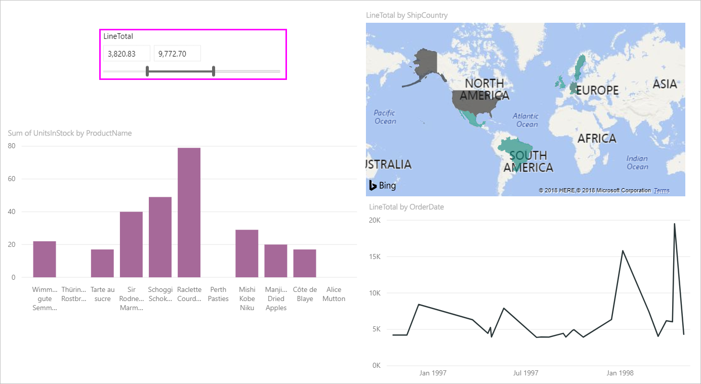
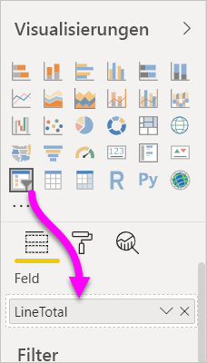
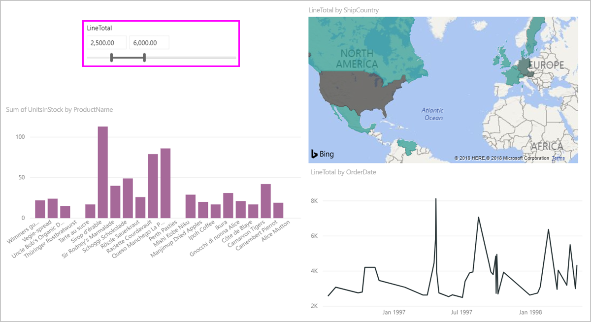
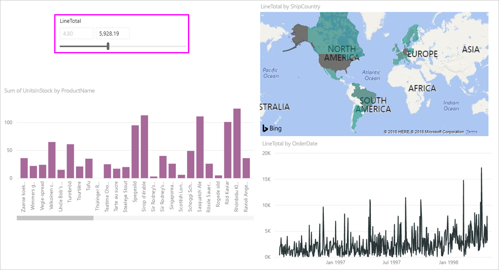
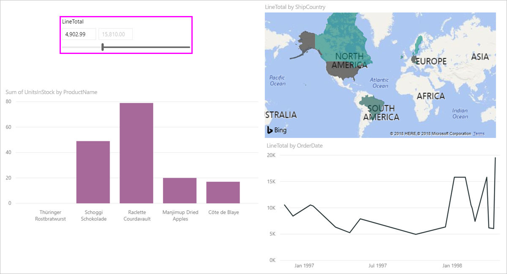

# Verwenden der Funktion „Datenschnitt für numerischen Bereich“ in Power BI Desktop
Mit dem Feature „Datenschnitt für numerischen Bereich“ können Sie numerischen Spalten eine Reihe an Filtern zuweisen. Sie haben drei Optionen zum Filtern von numerischen Daten: Daten, die zwischen Zahlen liegen oder deren Wert kleiner als oder gleich oder größer als oder gleich eine Zahl ist. Das mag einfach klingen, ist aber eine effiziente Möglichkeit, Ihre Daten zu filtern.

## Verwenden der Funktion „Datenschnitt für numerischen Bereich“
Der Datenschnitt für numerische Bereiche funktioniert wie jeder andere Datenschnitt. Erstellen Sie einfach eine **Datenschnitt**-Visualisierung für einen Bericht, und legen Sie dann für **Feld** einen Wert fest. In der folgenden Abbildung ist das Feld **LineTotal** ausgewählt.

Wählen Sie rechts oben im **Datenschnitt für numerischen Bereich** die Verknüpfung mit dem Pfeil nach unten aus. Ein Menü wird angezeigt.

Für den numerischen Bereich können Sie eine der folgenden drei Optionen auswählen:

* **Zwischen**
* **Kleiner als oder gleich**
* **Größer als oder gleich**

Wenn Sie im Menü **Zwischen** auswählen, wird ein Schieberegler angezeigt. Mit dem Schieberegler können Sie numerische Werte auswählen, die zwischen den Zahlen liegen. Manchmal ist es aufgrund der Granularität beim Bewegen der Datenschnittleiste schwierig, genau diese Zahl zu treffen. Sie können auch den Schieberegler verwenden und ein beliebiges Feld auswählen, um die gewünschten Werte einzugeben. Diese Option ist praktisch, wenn Sie den Datenschnitt für bestimmte Zahlen ausführen möchten. 

In der folgenden Abbildung wird die Berichtsseite nach Werten zwischen 2500,00 und 6000,00 in der Spalte **LineTotal** gefiltert.

Wenn Sie **Kleiner als oder gleich** auswählen, verschwindet der linke Ziehpunkt des Schiebereglers (für den niedrigeren Wert), und nur der Ziehpunkt für den höheren Wert kann eingestellt werden. In der folgenden Abbildung wurde der Schieberegler auf den Maximalwert von 5928,19 festgelegt.

Wenn Sie schließlich **Größer als oder gleich** auswählen, wird der rechte Schieberegler (höherer Wert) ausgeblendet. Anschließend können Sie den niedrigeren Wert anpassen, wie in der folgenden Abbildung dargestellt. Jetzt werden nur Elemente mit einem **LineTotal** größer als oder gleich 4902,99 in den Visuals auf der Berichtsseite angezeigt.

## Ausrichten an ganzen Zahlen mit dem Datenschnitt für numerische Bereiche

Ein Datenschnitt für den numerischen Bereich richtet sich an ganzen Zahlen aus, wenn der Datentyp des zugrunde liegenden Felds **Ganze Zahl** ist. Durch dieses Feature kann der Datenschnitt ordnungsgemäß an ganzen Zahlen ausgerichtet werden. In Feldern vom Typ **Dezimalzahl** können Sie Bruchzahlen eingeben oder diese darin auswählen. Die im Textfeld angewendete Formatierung entspricht der im Feld festgelegten Formatierung, auch wenn Sie genauere Zahlen eingeben oder auswählen können.

## Anzeigen der Formatierung mit dem Datenschnitt für den Datumsbereich

Wenn Sie einen Datenschnitt verwenden, um einen Datumsbereich anzuzeigen oder einzustellen, werden die Daten im Format **Kurzes Datum** angezeigt. Das Datumsformat wird durch den Browser oder das Gebietsschema des Betriebssystems des Benutzers festgelegt. Somit ist es das Anzeigeformat, unabhängig davon, welche Einstellungen der Datentyp für die zugrunde liegenden Daten oder das Modell vorgenommen hat. 

Sie könnten z.B. ein langes Datumsformat für den zugrunde liegenden Datentyp verwenden. In diesem Fall würde ein Datumsformat wie *dddddd, MMMM d, yyyyy* ein Datum in anderen Grafiken oder Umständen wie *Mittwoch, 14. März 2001* formatieren. Im Datenschnitt für Datumsbereiche wird dieses Datum im Datenschnitt als *03/14/2001* angezeigt.

Durch das Anzeigen des Formats **Kurzes Datum** im Datenschnitt wird sichergestellt, dass die Länge der Zeichenfolge innerhalb des Datenschnitts konsistent und kompakt bleibt. 

## Einschränkungen und Überlegungen
Die folgenden Überlegungen und Einschränkungen betreffen das Feature **Datenschnitt für numerischen Bereich**:

* Die Funktion **Datenschnitt für numerischen Bereich** filtert jede zugrunde liegende Zeile in den Daten, keine aggregierten Werte. Nehmen wir beispielsweise an, Sie verwenden das Feld *Betrag der Verkäufe*. Der Datenschnitt filtert dann jede Transaktion basierend auf dem Betrag der Verkäufe, nicht nach der Summe des Verkaufsbetrags für jeden Datenpunkt eines Visuals.
* Das Feature funktioniert derzeit nicht bei Measures.
* Sie können eine beliebige Zahl in die Textfelder eines numerischen Datenschnitts eingeben, auch wenn sie außerhalb des Wertebereichs der zugrunde liegenden Spalte liegt. Mit dieser Option können Sie Filter einrichten, wenn Sie wissen, dass sich die Daten in Zukunft ändern können.
