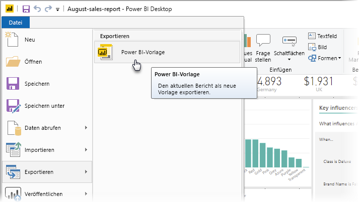
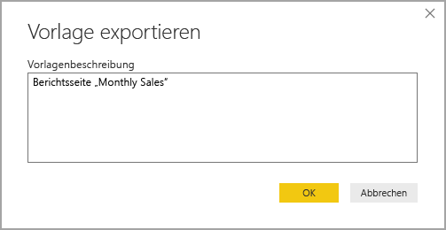
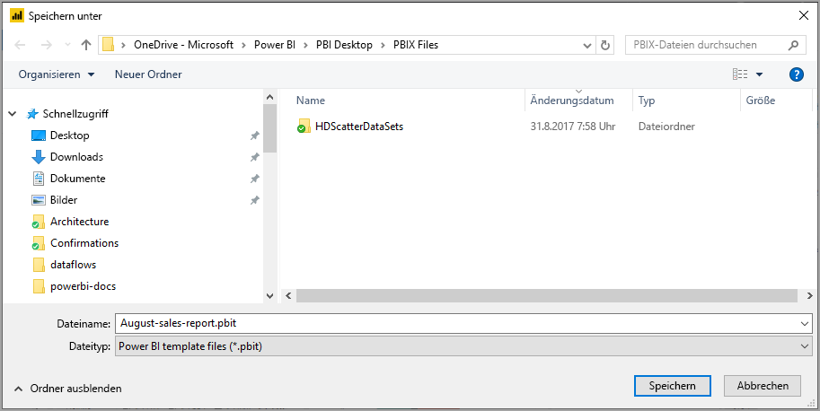
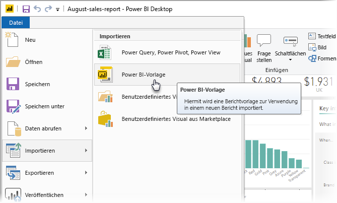
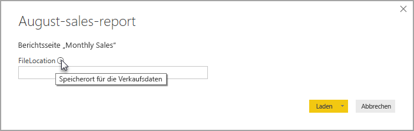

# Verwenden von Vorlagen in Power BI Desktop

Mithilfe von **Power BI Desktop** können Sie ansprechende Berichte erstellen, die Einblicke in Ihre gesamte Organisation geben. Mithilfe von **Vorlagen** für Power BI Desktop können Sie Ihre Arbeit optimieren, indem Sie basierend auf einer vorhandenen Vorlage eine Berichtsvorlage erstellen, die Sie oder andere Benutzer in Ihrer Organisation als Ausgangspunkt für das Layout, das Datenmodell und die Abfragen eines neuen Berichts verwenden können. Vorlagen in **Power BI Desktop** helfen Ihnen dabei, die Berichterstellung zu beschleunigen und zu standardisieren.

## Erstellen von Vorlagen

Berichtsvorlagen für Power BI enthalten die folgenden Informationen aus dem Bericht, aus dem sie generiert wurden:

* **Seiten**, Visuals und andere visuelle Elemente aus dem Bericht
* Die **Datenmodelldefinition**, einschließlich Schema, Beziehungen, Measures und anderen Modelldefinitionsartefakten
* Alle **Abfragedefinitionen**, z. B. Abfragen, Abfrageparameter und andere Abfrageelemente

Die Daten des Berichts sind allerdings *nicht* in den Vorlagen enthalten. 

Für Berichtsvorlagen wird die Dateierweiterung „.pbit“ verwendet (mit Power BI Desktop-Berichten vergleichen, die die Erweiterung „.pbix“ verwenden). 

Sie können eine Berichtsvorlage erstellen, indem Sie im Menü zu **Datei > Exportieren > Power BI-Vorlage** navigieren. Dann wird das folgende Fenster angezeigt, in dem Sie aufgefordert werden, eine Beschreibung für die Vorlage einzugeben. In diesem Beispiel lautet die Beschreibung für die Vorlage *Monthly sales report template* (Berichtsvorlage für die monatliche Verkäufe).

Klicken Sie auf **OK**. Dann werden Sie aufgefordert, einen Speicherort für die PBIT-Dateivorlage anzugeben.

Das war’s: Jetzt haben Sie einen Power BI-Berichtsvorlage an dem von Ihnen angegebenen Dateispeicherort mit der Erweiterung „.pbit“ erstellt.

> [!NOTE]
> Power BI-Berichtsvorlagendateien sind in der Regel viel kleiner als ein Power BI Desktop-Bericht, da Vorlagen keine Daten enthalten, sondern nur die Berichtsdefinitionen. 

## Verwenden von Vorlagen

Sie können Power BI-Berichtsvorlagen verwenden, indem Sie sie einfach in Power BI Desktop öffnen. Es gibt zwei Möglichkeiten, Power BI-Berichtsvorlagen zu öffnen:

* Doppelklicken Sie auf eine beliebig PBIT-Datei, um Power BI Desktop automatisch zu starten und die Vorlage zu laden.
* Navigieren Sie in Power BI Desktop zu **Datei > Importieren > Power BI-Vorlage**.

Wenn Sie eine Berichtsvorlage öffnen, werden in einem Dialogfeld Werte für alle Parameter angezeigt, die in dem Bericht definiert sind, auf dem die Vorlage basiert. Wenn beispielsweise ein Bericht Kunden auf der Grundlage von Ländern oder Regionen analysiert und einen *Country*-Parameter zum Angeben des Kundenbestands enthält, wird eine Eingabeaufforderung angezeigt, in der Sie einen Wert für das *Land* aus der Liste der Werte auswählen können, die beim Definieren des Parameters angegeben wurden. 

Sobald Sie alle erforderlichen Parameter angegeben haben, werden Sie aufgefordert, den Speicherort der dem Bericht zugrunde liegenden Daten anzugeben. Der aktuelle Berichtersteller kann dann auf der Grundlage seiner Anmeldeinformationen eine Verbindung mit Daten herstellen.

Sobald Parameter und Daten angegeben wurden, wird ein Bericht erstellt, der alle Seiten, Visuals, Datenmodellartefakte und Abfragen enthält, die Teil des Berichts sind, auf dem die Vorlage basiert. 

Fertig! Es ist ganz einfach,Berichtsvorlagen in Power BI Desktop zu erstellen und zu verwenden, sodass Sie problemlos überzeugende Layouts und andere Berichtsaspekte reproduzieren und für andere Benutzer freigeben können.

## Nächste Schritte
Lernen Sie beispielsweise mehr über **Abfrageparameter**:
* [Verwenden von Abfrageparametern in Power BI Desktop](https://docs.microsoft.com/power-query/power-query-query-parameters)

Darüber hinaus gibt es noch viele weitere Anwendungsmöglichkeiten für Power BI Desktop. Weitere Informationen zu den Funktionen und Möglichkeiten finden Sie in den folgenden Ressourcen:

* [Was ist Power BI Desktop?](desktop-what-is-desktop.md)
* [Übersicht zu Abfragen mit Power BI Desktop](desktop-query-overview.md)
* [Datentypen in Power BI Desktop](desktop-data-types.md)
* [Strukturieren und Kombinieren von Daten mit Power BI Desktop](desktop-shape-and-combine-data.md)
* [Allgemeine Abfrageaufgaben in Power BI Desktop](desktop-common-query-tasks.md)    
