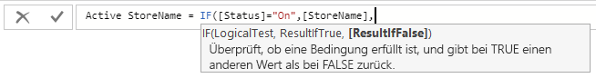

# Tutorial: Erstellen von berechneten Spalten in Power BI Desktop

Manchmal enthalten die Daten, die Sie analysieren, nicht ein bestimmtes Feld, das Sie für die gewünschten Ergebnisse benötigen. Hier bieten sich *berechnete Spalten* an. Berechnete Spalten verwenden DAX-Formeln (Data Analysis Expressions), um die Werte einer Spalte zu definieren. Diese reichen von zusammengesetzten Textwerten aus mehreren verschiedenen Spalten bis zu einem berechneten numerischen Wert aus anderen Werten. Angenommen, Ihre Daten weisen die Felder **Stadt** und **Bundesstaat** auf, Sie möchten aber ein einzelnes Feld für **Standort** verwenden, das beide Werte in einem enthält, wie etwa „Miami, FL“. Das ist genau der richtige Einsatzzweck für berechnete Spalten.

Berechnete Spalten ähneln [Measures](desktop-tutorial-create-measures.md) dahingehend, dass beide auf DAX-Formeln aufbauen. Sie unterscheiden sich jedoch in ihrer Verwendung. Measures werden häufig im **Werte**-Bereich einer Visualisierung verwendet, um die Ergebnisse auf Grundlage anderer Felder zu berechnen. Berechnete Spalten werden als neue **Felder** in den Bereichen „Zeile“, „Achse“, „Legende“ und „Gruppe“ einer Visualisierung verwendet.

Dieses Tutorial stellt Ihnen das Konzept vor und gibt schrittweise Anweisungen für das Erstellen von berechneten Spalten und deren Verwendung in Berichtsvisualisierungen in Power BI Desktop.

## Voraussetzungen

- Dieses Tutorial richtet sich an Power BI-Benutzer, die mit der Verwendung von Power BI Desktop zum Erstellen etwas fortgeschrittener Modelle bereits vertraut sind. Sie sollten bereits mit der Verwendung von „Daten abrufen“, des Power Query-Editors zum Importieren von Daten, dem Arbeiten mit mehreren verknüpften Tabellen und dem Hinzufügen von Feldern zur Canvas für den Bericht vertraut sein. Wenn Sie noch nicht mit Power BI Desktop vertraut sind, sollten Sie [Erste Schritte mit Power BI Desktop](desktop-getting-started.md) lesen.
  
- Für das Tutorial wird das Beispiel [Contoso Sales Sample for Power BI Desktop](https://download.microsoft.com/download/4/6/A/46AB5E74-50F6-4761-8EDB-5AE077FD603C/Contoso%20Sales%20Sample%20for%20Power%20BI%20Desktop.zip) verwendet, das auch im Tutorial [Erstellen eigener Measures in Power BI Desktop](desktop-tutorial-create-measures.md) Anwendung findet. Diese Verkaufsdaten des fiktiven Unternehmens Contoso, Inc. wurden aus einer Datenbank importiert. Daher können Sie keine Verbindung mit der Datenquelle herstellen oder die Daten im Power Query-Editor anzeigen. Laden Sie die Datei herunter, entpacken Sie sie auf Ihrem Computer, und öffnen Sie sie dann in Power BI Desktop.

## Erstellen einer berechneten Spalte mit Werten aus verknüpften Tabellen

Angenommen, Sie möchten im Verkaufsbericht Produktkategorien und Unterkategorien als einzelne Werte anzeigen, etwa als „Mobiltelefone: Zubehör“, „Mobiltelefone: Smartphones und PDAs“ usw. In der Liste **Felder** gibt es kein Feld mit diesen Daten. Allerdings gibt es in den entsprechenden Tabellen jeweils die Felder **ProductCategory** und **ProductSubcategory**. Sie können hier nun eine berechnete Spalte erstellen, die Werte aus diesen beiden Spalten miteinander kombiniert. DAX-Formeln können die Leistungsfähigkeit des bereits vorhandenen Modells in vollem Umfang nutzen, einschließlich der Beziehungen zwischen verschiedenen bereits bestehenden Tabellen.

 

1. Sie können eine neue Spalte in der Tabelle **ProductSubcategory** erstellen, indem Sie mit der rechten Maustaste klicken oder auf die Auslassungspunkte ( **...** ) neben **ProductSubcategory** im Bereich **Felder** klicken und im Menü **Neue Spalte** auswählen.

   

   Wenn Sie **Neue Spalte** auswählen, wird die **Bearbeitungsleiste** oben in der Canvas für den Bericht angezeigt, wo Sie die Spalte benennen und eine DAX-Formel eingeben können.

   

2. Standardmäßig wird eine neue berechnete Spalte einfach **Spalte** benannt. Wenn Sie diese nicht umbenennen, werden weitere neue Spalten **Spalte 2**, **Spalte 3** usw. benannt. Wenn Sie die Spalte eindeutiger bezeichnen möchten, geben Sie für die bereits markierte **Spalte** in der Bearbeitungsleiste den Namen **ProductFullCategory** und anschließend ein Gleichheitszeichen ( **=** ) ein.

3. Die Werte in der neuen Spalte sollen mit dem Namen im Feld **ProductCategory** beginnen. Da sich diese Spalte in einer anderen, aber verknüpften Tabelle befindet, können Sie die Funktion [RELATED](https://msdn.microsoft.com/library/ee634202.aspx) zum Abrufen der Spalte verwenden.

   Geben Sie hinter dem Gleichheitszeichen ein **R** ein. In einer Dropdown-Vorschlagsliste werden alle DAX-Funktionen angezeigt, die mit dem Buchstaben „R“ beginnen. Wenn Sie eine Funktion auswählen, wird jeweils die Beschreibung ihrer Auswirkungen angezeigt. Während der Eingabe wird die Skalierung der Vorschlagsliste immer genauer an die von Ihnen gewünschte Funktion angepasst. Klicken Sie auf **RELATED**, und drücken Sie dann die **EINGABETASTE**.

   

   Es werden eine öffnende Klammer sowie eine weitere Vorschlagsliste mit den verknüpften Spalten angezeigt, die einschließlich Beschreibungen und Informationen zu den erwarteten Parametern an die RELATED-Funktion übergeben werden können.

   

4. Sie möchten nur die Spalte **ProductCategory** in der Tabelle **ProductCategory**. Klicken Sie auf **ProductCategory[ProductCategory]** , drücken Sie die **EINGABETASTE**, und geben Sie dann eine schließende Klammer ein.

    > [!TIP]
    > Syntaxfehler werden meistens durch eine fehlende oder falsch platzierte schließende Klammer verursacht. In manchen Fällen wird sie jedoch auch von Power BI Desktop hinzugefügt.

5. Damit in den neuen Werten **ProductCategories** und **ProductSubcategories** durch Bindestriche und Leerzeichen voneinander getrennt werden, geben Sie hinter der schließenden Klammer des ersten Ausdrucks ein Leerzeichen, ein kaufmännisches Und-Zeichen ( **&** ), ein doppeltes Anführungszeichen ( **"** ), ein weiteres Leerzeichen, einen Bindestrich ( **-** ), ein weiteres Leerzeichen, ein weiteres doppeltes Anführungszeichen sowie ein weiteres kaufmännisches Und-Zeichen ein. Die Formel sollte nun wie folgt aussehen:

    `ProductFullCategory = RELATED(ProductCategory[ProductCategory]) & " - " &`

    > [!TIP]
    > Klicken Sie für mehr Platz auf der rechten Seite der Bearbeitungsleiste auf das Erweiterungssymbol (den nach unten gerichteten Winkel), um den Formel-Editor zu erweitern. Drücken Sie im Editor auf **ALT+EINGABETASTE**, um eine Zeile nach unten zu springen, und die **TAB-TASTE** zum Verschieben.

6. Geben Sie eine öffnende eckige Klammer ( **[** ) ein, und wählen Sie dann die Spalte **[ProductSubcategory]** aus, um die Formel fertigzustellen. 

    

    Zum Aufrufen der Tabelle **ProductSubcategory** im zweiten Ausdruck musste keine weitere RELATED-Funktion verwendet werden, da die berechnete Spalte in dieser Tabelle erstellt wird. Sie können **[ProductSubcategory]** mit dem Präfix für den Tabellennamen (vollqualifiziert) oder ohne (nicht qualifiziert) eingeben.

7. Stellen Sie die Formel fertig, indem Sie die **EINGABETASTE** drücken oder in der Bearbeitungsleiste auf das Häkchen klicken. Die Formel ist gültig, und der Spaltenname **ProductFullCategory** wird in der Tabelle **ProductSubcategory** im Bereich **Felder** angezeigt.

   

    >[!NOTE]
    >Berechnete Spalten erhalten in Power BI Desktop im Bereich **Felder** ein eigenes Symbol, das angibt, dass sie Formeln enthalten. Im Power BI-Dienst (Ihre Power BI-Website) ist es nicht möglich, eine Formel zu ändern. Daher verfügen berechnete Spalten hier über kein Symbol.

## Verwenden der neuen Spalte in einem Bericht

Jetzt können Sie die neue Spalte **ProductFullCategory** verwenden, um **SalesAmount** nach **ProductFullCategory** geordnet anzuzeigen.

1. Wählen Sie die Spalte **ProductFullCategory** aus, oder ziehen Sie sie aus der Tabelle **ProductSubcategory** in den Zeichenbereich für den Bericht. So wird eine Tabelle mit allen **ProductFullCategory**-Namen erstellt.

   

2. Wählen Sie das Feld **SalesAmount** aus, oder ziehen Sie es aus der Tabelle **Sales** in die Tabelle. So wird der **SalesAmount**-Wert für jedes **ProductFullCategory**-Feld angezeigt.

   

## Erstellen einer berechneten Spalte, die eine IF-Funktion verwendet

Das Beispiel „Contoso Sales Sample“ enthält Verkaufsdaten für aktive und inaktive Geschäfte. Stellen Sie sicher, dass in Ihrem Bericht der Umsatz von aktiven und inaktiven Geschäften deutlich voneinander getrennt dargestellt wird. Erstellen Sie hierfür das Feld **Active StoreName**. In der neuen berechneten Spalte **Active StoreName** wird jedes aktive Geschäft mit vollständigem Namen angezeigt, während alle inaktiven Geschäfte zusammen unter der Position **Inactive** gruppiert werden.

Die Tabelle **Stores** besitzt glücklicherweise eine Spalte namens **Status** mit den Werten „On“ für aktive Geschäfte und „Off“ für inaktive Geschäfte. Verwenden Sie diese Werte, um Werte für die neue **Active StoreName**-Spalte zu erstellen. Die DAX-Formel verwendet die logische Funktion [IF](https://msdn.microsoft.com/library/ee634824.aspx), um den **Status** jedes Geschäfts zu überprüfen und je nach Ergebnis einen bestimmten Wert zurückzugeben. Wenn der **Status** eines Geschäfts „On“ ist, gibt die Formel den Namen des Geschäfts zurück. Ist der Status „Off“, weist die Formel für **Active StoreName** den Wert „Inactive“ zu.

1. Erstellen Sie in der Tabelle **Stores** eine neue berechnete Spalte, und benennen Sie sie in der Bearbeitungsleiste **Active StoreName**.

2. Beginnen Sie hinter dem Gleichheitszeichen **=** mit der Eingabe von **IF**. Die Vorschlagsliste zeigt an, was Sie hinzufügen können. Wählen Sie **IF**aus.

    

3. Das erste Argument für **IF** ist ein logischer Test, bei dem überprüft wird, ob der **Status** eines Geschäfts „On“ ist. Geben Sie eine öffnende eckige Klammer **[** ein, durch die Spalten aus der Tabelle **Stores** angezeigt werden. Wählen Sie **[Status]** aus.

    

4. Geben Sie direkt hinter **[Status]** den Wert **="On"** ein. Geben Sie anschließend zum Beenden des Arguments ein Komma ( **,** ) ein. In der QuickInfo wird vorgeschlagen, dass Sie nun einen Wert hinzufügen, der für das Ergebnis „TRUE“ zurückgibt.

    

5. Wenn der Status des Geschäfts „On“ lautet, soll der Name des Geschäfts angezeigt werden. Geben Sie eine öffnende eckige Klammer ( **[** ) ein, wählen Sie die Spalte **[StoreName]** aus, und geben Sie dann ein weiteres Komma ein. In der QuickInfo wird nun vorgeschlagen, dass Sie einen Wert hinzufügen, der für das Ergebnis „FALSE“ zurückgegeben wird.

    

6. Wenn Sie möchten, dass der Wert „Inactive“ lautet, geben Sie **"Inactive"** ein. Stellen Sie die Formel fertig, indem Sie die **EINGABETASTE** drücken oder in der Bearbeitungsleiste auf das Häkchen klicken. Die Formel ist wird auf Gültigkeit geprüft, und der neue Spaltenname wird im Bereich **Felder** in der Tabelle **Stores** angezeigt.

    

7. Sie können die neue Spalte **Active StoreName** in Visualisierungen genau wie jedes andere Feld verwenden. Klicken Sie zum Anzeigen von **SalesAmounts** nach **Active StoreName** geordnet auf das Feld **Active StoreName**, oder ziehen Sie es in die Canvas für den Bericht. Klicken Sie anschließend auf das Feld **SalesAmount**, oder ziehen Sie es in die Tabelle. In dieser Tabelle werde aktive Geschäfte einzeln nach Namen geordnet angezeigt. Inaktive Geschäfte werden hingegen am Ende zusammen unter **Inactive** gruppiert.

    

## Was Sie gelernt haben

Berechnete Spalten können Ihre Daten bereichern und Einsichten leichter zugänglich machen. Sie haben gelernt, wie berechnete Spalten im Bereich **Felder** und über die Bearbeitungsleiste erstellt werden, wie Vorschlagslisten und QuickInfos beim Erstellen von Formeln helfen, wie die DAX-Funktionen „RELATED“ und „IF“ mit den entsprechenden Argumenten aufgerufen werden und wie berechnete Spalten in Berichtsvisualisierungen verwendet werden.

## Nächste Schritte

Ausführlichere Information zu DAX-Formeln und der Erstellung von berechneten Spalten unter Verwendung von komplexeren Formeln finden Sie unter [DAX-Grundlagen in Power BI Desktop](desktop-quickstart-learn-dax-basics.md). Dieser Artikel konzentriert sich auf grundlegende Konzepte in DAX, wie etwa Syntax, Funktionen und ein tiefer gehendes Verständnis von Kontext.

Denken Sie daran, die [DAX-Referenz (Data Analysis Expressions)](https://msdn.microsoft.com/library/gg413422.aspx) zu Ihren Favoriten hinzuzufügen. Dort finden Sie detaillierte Informationen zur DAX-Syntax, Operatoren und über 200 DAX-Funktionen.
