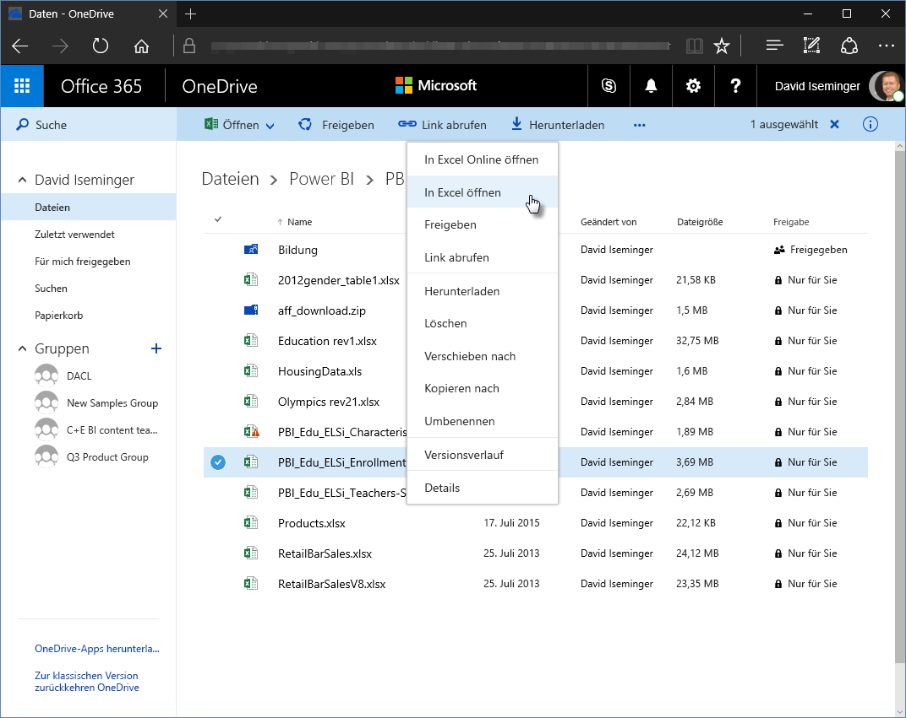
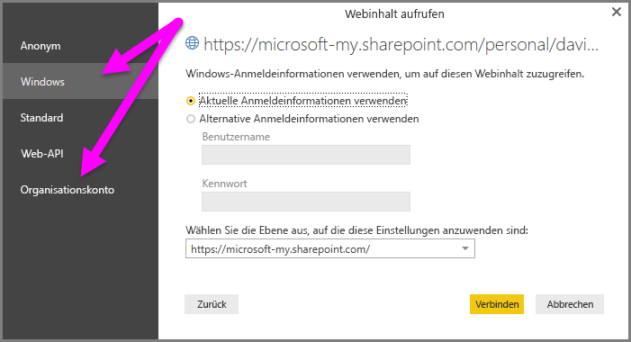

# Verwenden von OneDrive for Business-Links in Power BI Desktop
Viele Anwender haben in OneDrive for Business Excel-Arbeitsmappen gespeichert, die sich gut für Power BI Desktop eignen. Mit Power BI Desktop können Sie Onlinelinks für in OneDrive for Business gespeicherte Excel-Dateien verwenden, um Berichte und visuelle Elemente zu erstellen. Sie können ein OneDrive for Business-Gruppenkonto oder Ihr persönliches OneDrive for Business-Konto verwenden.

Um einen Onlinelink aus OneDrive for Business abzurufen, sind einige zusätzliche Schritte erforderlich. In den folgenden Abschnitten werden diese Schritte beschrieben, mithilfe derer Sie den Dateilink zwischen Gruppen, verschiedenen Computern und mit Ihren Kollegen gemeinsam nutzen können.

## Link aus Excel abrufen
1. Navigieren Sie mit einem Browser zu dem gewünschten OneDrive for Business-Speicherort. Klicken Sie mit der rechten Maustaste auf die Datei, die Sie verwenden möchten, und wählen Sie **In Excel öffnen** aus.
   
   > [!NOTE]
   > Ihre Browseroberfläche sieht möglicherweise nicht genau so aus, wie im folgenden Bild. Die OneDrive for Business-Benutzeroberfläche im Browser bietet Ihnen verschiedene Möglichkeiten, für eine Datei die Aktion **In Excel öffnen** auszuwählen. Sie können hierzu jede Option nutzen, mit der Sie die Datei in Excel öffnen können.
   > 
   > 
   
   
2. Wählen Sie in Excel **Datei** > **Informationen** aus, und klicken Sie dann oberhalb von **Arbeitsmappe schützen** auf **Pfad kopieren**.
   
   

## Verwenden des Links in Power BI Desktop
Sie können den Link, den Sie gerade in die Zwischenablage kopiert haben, in Power BI Desktop verwenden. Führen Sie hierzu die folgenden Schritte aus:

1. Wählen Sie in Power BI Desktop **Daten abrufen** > **Web** aus.
   
   
2. Behalten Sie die Option **Standard** bei, und fügen Sie den Link in das Dialogfeld **Aus dem Web** ein.
3. Entfernen Sie die Zeichenfolge *?web=1* am Ende des Links, damit Power BI Desktop den Pfad zu Ihrer Datei korrekt öffnen kann, und klicken Sie anschließend auf **OK**.
   
     
4. Wenn Power BI Desktop Anmeldeinformationen anfordert, wählen Sie entweder **Windows** (für lokale SharePoint-Websites) oder **Organisationskonto** (für Office 365- oder OneDrive for Business-Websites) aus.
   
   

   Ein **Navigator**-Fenster wird angezeigt. Hier können Sie aus der Liste der Tabellen, Arbeitsblätter und Bereiche in der Excel-Arbeitsmappe auswählen. Nun können Sie die OneDrive for Business-Datei wie jede andere Excel-Datei verwenden. Sie können Berichte erstellen und die Datei wie jede andere Datenquelle in Datasets verwenden.

> [!NOTE]
> Um eine OneDrive for Business-Datei im Power BI-Dienst als Datenquelle zu verwenden, muss für diese Datei **Dienst aktualisieren** aktiviert sein, und Sie müssen **OAuth2** als **Authentifizierungsmethode** auswählen, wenn Sie die Aktualisierungseinstellungen konfigurieren. Andernfalls kann beim Verbindungs oder Aktualisierungsversuch ein Fehler auftreten (wie *Failed to update data source credentials* (Fehler beim Aktualisieren der Datenquellenanmeldeinformationen)). Durch Auswahl der Authentifizierungsmethode **OAuth2** wird das Auftreten dieses Anmeldeinformationsfehlers vermieden.
> 
> 

