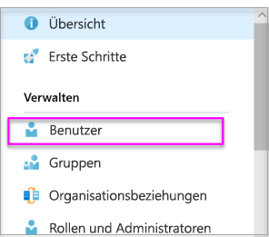
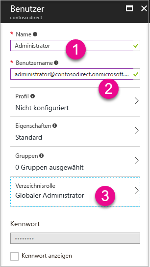

# Erstellen eines Azure Active Directory-Mandanten für Power BI

Erfahren Sie, wie Sie einen neuen Azure Active Directory-Mandanten (Azure AD) für eine benutzerdefinierte Anwendung erstellen können, die [Power BI-REST-APIs](rest-api-reference.md) aufruft.

Ein Mandant steht für eine Organisation in Azure Active Directory. Er stellt eine dedizierte Azure AD-Instanz dar. Eine Organisation erhält und besitzt ihn, wenn sie sich für einen Microsoft-Clouddienst wie Azure, Microsoft Intune oder Office 365 registriert. Jeder Azure AD-Mandant ist eigenständig und von anderen Azure AD-Mandanten getrennt.

Wenn Sie sich im Besitz eines Azure AD-Mandanten befinden, können Sie eine Anwendung definieren und ihr Berechtigungen zuweisen, mit denen sie die [Power BI-REST-APIs](rest-api-reference.md) aufrufen kann.

Möglicherweise verfügt Ihre Organisation bereits über einen Azure AD-Mandanten, den Sie für Ihre Anwendung nutzen können. Sie können auch einen neuen Mandanten speziell für Ihre Anwendung erstellen. Dieser Artikel befasst sich mit dem Erstellen eines neuen Mandanten.

## Erstellen eines Azure Active Directory-Mandanten

Sie müssen eine Anwendung innerhalb von Azure AD definieren, um Power BI in Ihre benutzerdefinierte Anwendung integrieren zu können. Dafür ist ein Azure AD-Verzeichnis erforderlich. Das Verzeichnis ist ihr *Mandant*. Wenn Ihre Organisation noch keinen Mandanten besitzt, weil sie Power BI oder Office 365 nicht verwendet, [müssen Sie eine Entwicklungsumgebung einrichten](https://docs.microsoft.com/azure/active-directory/develop/active-directory-howto-tenant). Möglicherweise müssen Sie einen Mandanten auch dann erstellen, wenn Sie Ihrer Anwendung vom Mandanten Ihrer Organisation separat halten möchten. Es kann auch sinnvoll sein, einen Mandanten für Testzwecke zu erstellen.

Gehen Sie wie folgt vor, um einen neuen Azure AD-Mandanten zu erstellen:

1. Navigieren Sie zum [Azure-Portal](https://portal.azure.com), und melden Sie sich mit einem Konto an, das über ein Azure-Abonnement verfügt.

2. Wählen Sie das **Pluszeichen (+)** aus, und suchen Sie nach **Azure Active Directory**.

    

3. Wählen Sie in den Suchergebnissen **Azure Active Directory** aus.

    

4. Wählen Sie **Erstellen** aus.

5. Geben Sie einen **Organisationsnamen** und einen **Namen der Anfangsdomäne** an. Wählen Sie dann **Erstellen** aus. Ihr Verzeichnis wurde erstellt.

    

   > [!NOTE]
   > Ihre Anfangsdomäne ist ein Teil von onmicrosoft.com. Sie können später weitere Domänennamen hinzufügen. Dem Verzeichnis eines Mandanten können mehrere Domänen zugeordnet sein.

6. Wählen Sie nach dem Abschluss der Erstellung Ihrer Domäne das Informationsfeld aus, um Ihr neues Verzeichnis zu verwalten.

Fügen Sie als Nächstes Mandantenbenutzer hinzu.

## Erstellen eines Azure Active Directory-Mandantenbenutzers

Sie verfügen nun über ein Verzeichnis. Also erstellen wir jetzt mindestens zwei Benutzer. Der eine ist ein globaler Administrator des Mandanten und der andere ein Hauptbenutzer zum Einbetten. Den zweiten können Sie als Dienstkonto behandeln.

1. Stellen Sie im Azure-Portal sicher, dass Sie sich auf der Azure Active Directory-Seitenleiste befinden.

    

    Wenn dies nicht der Fall ist, wählen Sie in der linken Leiste mit Diensten das Azure Active Directory-Symbol aus.

    

2. Wählen Sie unter **Verwalten** das Element **Benutzer** aus.

    

3. Wählen Sie **Alle Benutzer** und dann **+ Neuer Benutzer** aus.

4. Geben Sie einen **Namen** und **Benutzernamen** für den globalen Administrator des Mandanten an. Ändern Sie die **Verzeichnisrolle** in **Globaler Administrator**. Darüber hinaus können Sie das temporäre Kennwort anzeigen. Wenn Sie fertig sind, wählen Sie  **Erstellen** aus.

    

5. Führen Sie die gleichen Schritte für den normalen Mandantenbenutzer durch. Sie können dieses Konto als Haupteinbettungskonto nutzen. Belassen Sie die Einstellung für die **Verzeichnisrolle** diesmal auf **Benutzer**. Geben Sie das Kennwort ein, und klicken Sie auf **Next** (Weiter).

    

6. Registrieren Sie sich für Power BI mit dem Benutzerkonto, das Sie in Schritt 5 erstellt haben. Navigieren Sie zu [powerbi.com](https://powerbi.microsoft.com/get-started/), und wählen Sie unter **Power BI** die Schaltfläche **Kostenloser Einstieg** aus.

    

    Bei der Registrierung werden Sie aufgefordert, Power BI Pro 60 Tage lang kostenlos auszuprobieren. Wenn Sie ein Pro-Benutzer werden möchten, können Sie sich dazu entscheiden. Dann können Sie [eine eingebettete Lösung entwickeln](embedding-content.md).

   > [!NOTE]
   > Achten Sie darauf, sich mit der E-Mail-Adresse zu registrieren, die Sie für das Benutzerkonto angegeben haben.

## Nächste Schritte

Nachdem Sie nun über einen Azure AD-Mandanten verfügen, können Sie mit diesem Mandanten Elemente in Power BI testen. Zudem können Sie Power BI-Dashboards und -Berichte in Ihre Anwendung einbetten. Weitere Informationen finden Sie im Artikel zum [Einbetten von Power BI-Dashboards, -Berichten und -Kacheln](embedding-content.md).

[Was ist Azure Active Directory?](https://docs.microsoft.com/azure/active-directory/active-directory-whatis) 
 
[Schnellstart: Einrichten einer Entwicklungsumgebung](https://docs.microsoft.com/azure/active-directory/develop/active-directory-howto-tenant)  

Weitere Fragen? [Stellen Sie Ihre Frage in der Power BI-Community.](http://community.powerbi.com/)
