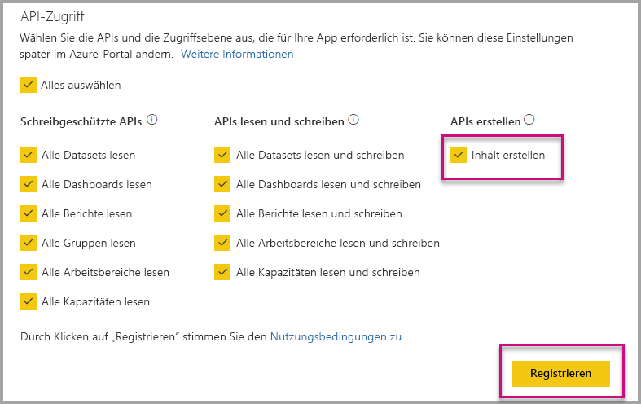

# Automatisches Installieren von Power BI-Apps bei der Einbettung für Ihre Organisation

Wenn Inhalte aus einer App eingebettet werden sollen, muss der Benutzer, der die Einbettung vornimmt, [Zugriff auf die App](../service-create-distribute-apps.md) haben. Wenn die App für den Benutzer installiert ist, funktioniert das Einbetten reibungslos. Weitere Informationen finden Sie unter [Einbetten von Berichten oder Dashboards aus Apps](embed-from-apps.md). Unter PowerBI.com lässt sich festlegen, dass alle Apps [automatisch installiert](https://powerbi.microsoft.com/blog/automatically-install-apps/) werden können. Diese Aktion erfolgt jedoch auf Mandantenebene und gilt für alle Apps.

## Automatisches Installieren einer App bei der Einbettung

Wenn ein Benutzer Zugriff auf eine App hat, die App jedoch nicht installiert ist, schlägt die Einbettung fehl. Dies können Sie jedoch bei der Einbettung von Inhalten aus einer App umgehen. Bei der Einbettung können Sie das automatische Installieren der App erlauben. Diese Aktion bedeutet, dass die App automatisch installiert wird, wenn der Benutzer versucht, eine App einzubetten, die nicht installiert ist. Die gewünschten Inhalte werden also sofort eingebettet, was zu einem reibungslosen Prozess für den Benutzer führt.

## Einbettungen für Power BI-Benutzer (Benutzer ist Besitzer der Daten)

Damit Apps für Ihre Benutzer automatisch installiert werden können, müssen Sie Ihrer Anwendung die Berechtigung zum Erstellen von Inhalten erteilen, wenn Sie [Ihre Anwendung registrieren](register-app.md#register-with-the-power-bi-application-registration-tool) oder hinzufügen, wenn Sie Ihre App bereits registriert haben.

Als nächsten Schritt müssen Sie die App-ID in der Einbettungs-URL bereitstellen. Damit die App-ID bereitgestellt werden kann, muss der App-Ersteller zuerst die App installieren und dann eine der unterstützten [Power BI REST-API-Aufrufe](https://docs.microsoft.com/rest/api/power-bi/) verwenden: [Berichte abrufen](https://docs.microsoft.com/rest/api/power-bi/reports/getreports) oder [Dashboards abrufen](https://docs.microsoft.com/rest/api/power-bi/dashboards/getdashboards). Der App-Ersteller muss dann die Einbettungs-URL aus der REST-API-Antwort abrufen. Die App-ID wird in der URL angezeigt, wenn der Inhalt aus einer App stammt.  Nachdem Sie die Einbettungs-URL abgerufen haben, können Sie sie regelmäßig verwenden.

## Secure embed

Wenn die automatische Installation von Apps verwendet werden soll, muss der App-Ersteller zunächst die App installieren, dann die App unter PowerBI.com aufrufen, zum Bericht navigieren und den Link auf gewohnte Weise abrufen. Alle anderen Benutzer mit Zugriff auf die App, die den Link verwenden können, können den Bericht einbetten.

## Überlegungen und Einschränkungen

* In diesem Szenario lassen sich nur Berichte und Dashboards einbetten.

* Dieses Feature wird momentan nicht für Szenarios unterstützt, in denen die App Besitzer der Daten ist, und für SharePoint-Einbettungsszenarios.