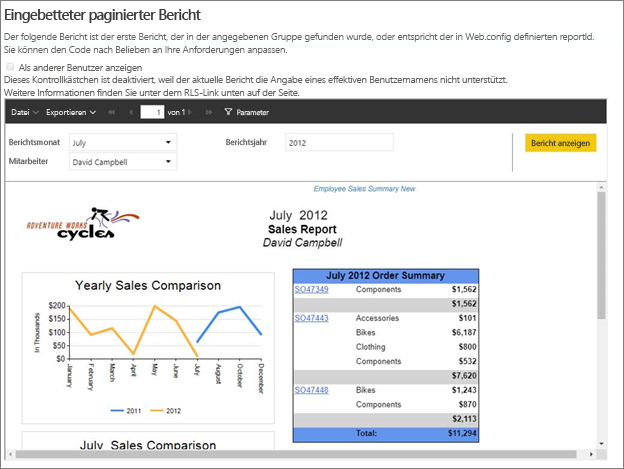
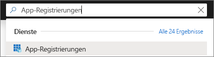
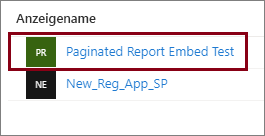
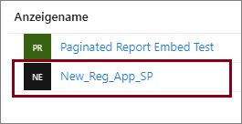

# <a name="tutorial-embed-power-bi-paginated-reports-into-an-application-for-your-customers-preview"></a>Tutorial: Einbetten von paginierten Power BI-Berichten in eine Anwendung für Kunden (Vorschauversion)

Mit **Power BI Embedded in Azure** oder der **Power BI-Einbettung in Office** können Sie mit App Owns Data (App ist Besitzer der Daten) paginierte Berichte in eine Anwendung einbetten. Bei **App Owns Data** verwendet eine Anwendung Power BI als eingebettete Analyseplattform. **Unabhängige Softwarehersteller (ISV)** und **Entwickler** können Power BI-Inhalte erstellen, die paginierte Berichte in einer vollständig integrierten und interaktiven Anwendung anzeigen, ohne dass die Benutzer über eine Power BI-Lizenz verfügen müssen. In diesem Tutorial wird veranschaulicht, wie Sie mithilfe des .NET SDK von Power BI mit der Power BI-JavaScript-API einen paginierten Bericht in eine Anwendung integrieren.



In diesem Tutorial erhalten Sie Informationen zu den folgenden Vorgängen:
> [!div class="checklist"]
> * Registrieren einer Anwendung in Azure
> * Einbetten eines paginierten Power BI-Berichts in eine Anwendung

## <a name="prerequisites"></a>Voraussetzungen

Sie benötigen Folgendes, um direkt mit dem Tutorial loslegen zu können:

* [Dienstprinzipal (Token nur für Anwendungen)](embed-service-principal.md)
* [Microsoft Azure](https://azure.microsoft.com/)-Abonnement
* individuell eingerichtetes [Azure Active Directory-Mandantensetup](create-an-azure-active-directory-tenant.md)
* mindestens A4- oder P1-[Kapazität](#create-a-dedicated-capacity) mit aktivierter Workload für [paginierte Berichte](../service-admin-premium-workloads.md#paginated-reports)

Wenn Sie kein Azure-Abonnement besitzen, erstellen Sie ein [kostenloses Konto](https://azure.microsoft.com/free/?WT.mc_id=A261C142F), bevor Sie beginnen.

> [!IMPORTANT]
> * Sie müssen einen **Dienstprinzipal** verwenden. Hauptbenutzer werden nicht unterstützt.
> * Datenquellen, die Single Sign-on (SSO) erfordern, werden nicht unterstützt.
> * Power BI-DataSet wird als [Datenquelle](../service-get-data.md) nicht unterstützt.

## <a name="set-up-your-power-bi-environment"></a>Einrichten der Power BI-Umgebung

Sie müssen einer dedizierten Kapazität einen Arbeitsbereich zuweisen und den Bericht in den Arbeitsbereich hochladen, um einen paginierten Bericht einzubetten.

### <a name="create-an-app-workspace"></a>Erstellen eines App-Arbeitsbereichs

Da Sie einen [Dienstprinzipal](embed-service-principal.md) für die Anmeldung bei Ihrer Anwendung nutzen, müssen Sie [neue Arbeitsbereiche](../service-create-the-new-workspaces.md) verwenden. Als *Dienstprinzipal* müssen Sie außerdem Administrator oder Mitglied des App-Arbeitsbereichs sein, der im Zusammenhang mit Ihrer App steht.

### <a name="create-a-dedicated-capacity"></a>Erstellen einer dedizierten Kapazität

Bevor Sie einen einzubettenden paginierten Bericht importieren oder hochladen, muss der Arbeitsbereich, der den Bericht enthält, mindestens der A4- oder P1-Kapazität zugewiesen werden. Sie können zwei Arten von Kapazität auswählen:
* **Power BI Premium:** Für das Einbetten eines paginierten Berichts ist eine *P*-SKU-Kapazität erforderlich. Beim Einbetten von Power BI-Inhalten wird diese Lösung als *Power BI-Einbettung* bezeichnet. Weitere Informationen zu diesem Abonnement finden Sie unter [Was ist Power BI Premium?](../service-premium-what-is.md).
* **Azure Power BI Embedded:** Sie können eine dedizierte Kapazität im [Microsoft Azure-Portal](https://portal.azure.com) erwerben. Dieses Abonnement verwendet die *A*-SKUs. Sie benötigen mindestens ein *A4*-Abonnement, um paginierte Berichte einzubetten. Weitere Informationen zum Erstellen einer Power BI Embedded-Kapazität finden Sie unter [Erstellen einer Power BI Embedded-Kapazität im Azure-Portal](azure-pbie-create-capacity.md).

In der Tabelle unten sind die Ressourcen und Grenzen der einzelnen SKUs beschrieben. Um zu bestimmen, welche Kapazität sich optimal für Ihre Anforderungen eignet, lesen Sie die Tabelle [Welche SKU soll ich für mein Szenario erwerben](https://docs.microsoft.com/power-bi/developer/embedded-faq#power-bi-now-offers-three-skus-for-embedding-a-skus-em-skus-and-p-skus-which-one-should-i-purchase-for-my-scenario).

| Kapazitätsknoten | Gesamtzahl an V-Kernen | Back-End-V-Kerne | RAM (GB) | Front-End-V-Kerne | 
| --- | --- | --- | --- | --- |
| P1/A4 | 8 | 4 | 25 | 4 |
| P2/A5 | 16 | 8 | 50 | 8 |
| P3/A6 | 32 | 16 | 100 | 16 |
| | | | | |

### <a name="assign-an-app-workspace-to-a-dedicated-capacity"></a>Zuweisen eines App-Arbeitsbereichs zu einer dedizierten Kapazität

Wenn Sie eine dedizierte Kapazität erstellt haben, können Sie ihr Ihren App-Arbeitsbereich zuweisen.

Mithilfe der [Power BI-REST-API](https://docs.microsoft.com/rest/api/power-bi/capacities/groups_assigntocapacity) können Sie einem Arbeitsbereich über einen [Dienstprinzipal](embed-service-principal.md) eine dedizierte Kapazität zuzuweisen. Wenn Sie die Power BI-REST-APIs einsetzen, müssen Sie die [Dienstprinzipalobjekt-ID](embed-service-principal.md#how-to-get-the-service-principal-object-id) verwenden.

### <a name="create-and-upload-your-paginated-reports"></a>Erstellen und Hochladen von paginierten Berichten

Sie können paginierte Berichte mithilfe des [Power BI-Berichts-Generators](../paginated-reports-report-builder-power-bi.md#create-reports-in-power-bi-report-builder) erstellen und dann [den Bericht in den Dienst hochladen](../paginated-reports-quickstart-aw.md#upload-the-report-to-the-service).

Sie können paginierte Berichte mithilfe von [Power BI-REST-APIs](https://docs.microsoft.com/rest/api/power-bi/imports/postimportingroup) in die neuen Arbeitsbereiche importieren.

## <a name="embed-content-using-the-sample-application"></a>Einbetten von Inhalt mit der Beispielanwendung

Dieses Beispiel ist zur besseren Anschaulichkeit bewusst einfach gestaltet. Es liegt bei Ihnen oder Ihren Entwicklern, das Anwendungsgeheimnis zu schützen.

Führen Sie die folgenden Schritte durch, um Ihren Inhalt in eine Beispielanwendung zu implementieren:

1. Installieren Sie [Visual Studio](https://www.visualstudio.com/) (Version 2013 oder höher). Laden Sie das neueste [NuGet-Paket](https://www.nuget.org/profiles/powerbi) herunter.

2. Laden Sie das [App Owns Data](https://github.com/Microsoft/PowerBI-Developer-Samples)-Beispiel aus GitHub herunter, um zu beginnen.

    

3. Öffnen Sie die Datei **Web.config** in der Beispielanwendung. Damit die Anwendung ausgeführt werden kann, müssen Sie verschiedene Felder ausfüllen. Wählen Sie für **AuthenticationType** die Option **ServicePrincipal** aus.

    Füllen Sie die folgenden Felder aus:
    * [applicationId](#application-id)
    * [workspaceId](#workspace-id)
    * [reportId](#report-id)
    * [applicationsecret](#application-secret)
    * [tenant](#tenant)

    > [!Note]
    > Der Standardwert für **AuthenticationType** in diesem Beispiel ist „MasterUser“. Stellen Sie sicher, dass Sie ihn zu **ServicePrincipal** ändern. 


    

### <a name="application-id"></a>Anwendungs-ID

Geben Sie für **applicationId** die **Anwendungs-ID** aus **Azure** an. Die Anwendung identifiziert sich mithilfe der **applicationId** bei den Benutzern, von denen Sie Berechtigungen anfordern.

Führen Sie die folgenden Schritte aus, um **applicationId** abzurufen:

1. Melden Sie sich beim [Azure-Portal](https://portal.azure.com) an.

2. Klicken Sie im Navigationsbereich auf der linken Seite auf **Alle Dienste**, und suchen Sie nach **App-Registrierungen**.

    

3. Wählen Sie die Anwendung aus, für die **applicationID** benötigt wird.

    

4. Es gibt eine **Anwendungs-ID**, die als GUID aufgeführt ist. Verwenden Sie diese **Anwendungs-ID** als **applicationId** für die Anwendung.

    

### <a name="workspace-id"></a>Arbeitsbereichs-ID

Geben Sie für **workspaceId** die Anwendungsarbeitsbereichs-GUID (Gruppen-GUID) aus Power BI an. Die benötigten Informationen erhalten Sie entweder aus der URL, wenn Sie im Power BI-Dienst angemeldet sind, oder über PowerShell.

URL <br>


PowerShell <br>

```powershell
Get-PowerBIworkspace -name "Paginated Report Embed"
```

   

### <a name="report-id"></a>Berichts-ID

Geben Sie als **reportId** die Berichts-GUID aus Power BI an. Die benötigten Informationen erhalten Sie entweder aus der URL, wenn Sie im Power BI-Dienst angemeldet sind, oder über PowerShell.

URL<br>


PowerShell <br>

```powershell
Get-PowerBIworkspace -name "Paginated Report Embed" | Get-PowerBIReport
```


### <a name="application-secret"></a>Anwendungsgeheimnis

Geben Sie für **ApplicationSecret** die Informationen aus dem Abschnitt **Schlüssel** Ihres Abschnitts für **App-Registrierungen** in **Azure** ein.

Führen Sie die folgenden Schritte aus, um **ApplicationSecret** abzurufen:

1. Melden Sie sich beim [Azure-Portal](https://portal.azure.com) an.

2. Klicken Sie im Navigationsbereich auf der linken Seite auf **Alle Dienste**, und suchen Sie nach **App-Registrierungen**.

    

3. Wählen Sie die Anwendung aus, die **ApplicationSecret** verwenden muss.

    

4. Wählen Sie **Certificates and secrets** (Zertifikate und Geheimnisse) unter **Verwalten** aus.

5. Wählen Sie **New client secrets** (Neue geheime Clientschlüssel) aus.

6. Geben Sie in das Feld **Beschreibung** einen Namen ein, und wählen Sie eine Dauer aus. Klicken Sie anschließend auf **Speichern**, um den **Wert** für Ihre Anwendung abzurufen. Wenn Sie den Bereich **Schlüssel** nach dem Speichern des Schlüsselwerts schließen, wird das Wertfeld nur als ausgeblendet angezeigt. An diesem Punkt können Sie den Schlüsselwert nicht abrufen. Wenn Sie den Schlüsselwert verlieren, müssen Sie im Azure-Portal einen neuen erstellen.

    

### <a name="tenant"></a>Mandant

Geben Sie für **tenant** die ID Ihres Azure-Mandanten an. Die benötigten Informationen erhalten Sie entweder aus dem [Azure AD-Admin Center](/onedrive/find-your-office-365-tenant-id), wenn Sie im Power BI-Dienst angemeldet sind, oder über PowerShell.

### <a name="run-the-application"></a>Ausführen der Anwendung

1. Wählen Sie in **Visual Studio** die Option **Ausführen** aus.

    

2. Wählen Sie dann **Bericht einbetten** aus.

    

3. Jetzt können Sie den Bericht in der Beispielanwendung anzeigen.

    

## <a name="embed-power-bi-paginated-reports-within-your-application"></a>Einbetten von paginierten Power BI-Berichten in Ihre Anwendung

Obwohl bei den Schritten zum Einbetten Ihrer paginierten Power BI-Berichte die [Power BI-REST-APIs](https://docs.microsoft.com/rest/api/power-bi/) verwendet werden, werden die in diesem Artikel beschriebenen Beispielcodes mit dem **.NET SDK** erstellt.

Wenn Sie paginierte Power BI-Berichte für Kunden in Ihre Anwendung einbetten möchten, benötigen Sie einen **Azure AD**-[Dienstprinzipal](embed-service-principal.md) und ein [Azure AD-Zugriffstoken](get-azuread-access-token.md#access-token-for-non-power-bi-users-app-owns-data) für Ihre Power BI-Anwendung, bevor Sie die [Power BI-Rest-APIs](https://docs.microsoft.com/rest/api/power-bi/) aufrufen.

Erstellen Sie ein Power BI-Clientobjekt, durch das Sie mit den [Power BI-REST-APIs](https://docs.microsoft.com/rest/api/power-bi/) interagieren können, um den Power BI-Client mit Ihrem **Zugriffstoken** zu erstellen. Sie erstellen das Power BI-Clientobjekt durch Einschließen des **Zugriffstokens** in ein ***Microsoft.Rest.TokenCredentials***-Objekt.

```csharp
using Microsoft.IdentityModel.Clients.ActiveDirectory;
using Microsoft.Rest;
using Microsoft.PowerBI.Api.V2;

var tokenCredentials = new TokenCredentials(authenticationResult.AccessToken, "Bearer");

// Create a Power BI Client object. it's used to call Power BI APIs.
using (var client = new PowerBIClient(new Uri(ApiUrl), tokenCredentials))
{
    // Your code to embed items.
}
```

### <a name="get-the-paginated-report-you-want-to-embed"></a>Abrufen des paginierten Berichts, der eingebettet werden soll

Sie können mit dem Power BI-Clientobjekt einen Verweis auf das Element abrufen, das eingebettet werden soll.

Im folgenden Codebeispiel wird veranschaulicht, wie Sie den ersten Bericht aus einem bestimmten Arbeitsbereich abrufen.

*In der Datei „Services\EmbedService.cs“ in der [Beispielanwendung](https://github.com/Microsoft/PowerBI-Developer-Samples) finden Sie ein Beispiel zum Abrufen eines Inhaltselements (Bericht, Dashboard oder Kachel), das Sie einbetten möchten.*

```csharp
using Microsoft.PowerBI.Api.V2;
using Microsoft.PowerBI.Api.V2.Models;

// You need to provide the workspaceId where the dashboard resides.
ODataResponseListReport reports = await client.Reports.GetReportsInGroupAsync(workspaceId);

// Get the first report in the group.
Report report = reports.Value.FirstOrDefault();
```

### <a name="create-the-embed-token"></a>Erstellen des Einbettungstokens

Generieren Sie ein Einbettungstoken, das aus der JavaScript-API verwendet werden kann. Verwenden Sie die [Reports GenerateTokenForCreateInGroup](https://docs.microsoft.com/rest/api/power-bi/embedtoken/reports_generatetokenforcreateingroup)-API, um ein Einbettungstoken zum Einbetten von paginierten Power BI-Berichten zu erstellen.

Ein Beispiel zum Erstellen eines Einbettungstokens finden Sie in der Datei  *Services\EmbedService.cs* in der [Beispielanwendung](https://github.com/Microsoft/PowerBI-Developer-Samples).

```csharp
using Microsoft.PowerBI.Api.V2;
using Microsoft.PowerBI.Api.V2.Models;

// Generate Embed Token.
var generateTokenRequestParameters = new GenerateTokenRequest(accessLevel: "view");
EmbedToken tokenResponse = client.Reports.GenerateTokenInGroup(workspaceId, report.Id, generateTokenRequestParameters);

// Generate Embed Configuration.
var embedConfig = new EmbedConfig()
{
    EmbedToken = tokenResponse,
    EmbedUrl = report.EmbedUrl,
    Id = report.Id
};
```

### <a name="load-an-item-using-javascript"></a>Laden eines Elements mit JavaScript

Sie können mithilfe von JavaScript einen paginierten Bericht in ein div-Element auf Ihrer Webseite laden.

Ein komplettes Beispiel für die Verwendung der JavaScript-API ist im [Playground-Tool](https://microsoft.github.io/PowerBI-JavaScript/demo) verfügbar. Das Playground-Tool ist eine Möglichkeit, schnell verschiedene Arten von Power BI Embedded-Beispielen auszuprobieren. Weitere Informationen zur JavaScript-API finden Sie auch auf der [Power BI-JavaScript-Wikiseite](https://github.com/Microsoft/powerbi-javascript/wiki).

## <a name="next-steps"></a>Nächste Schritte

In diesem Tutorial haben Sie gelernt, wie Sie paginierte Power BI-Berichte für Ihre Kunden in eine Anwendung einbetten. Sie können auch versuchen, Power BI-Inhalte für Ihre Organisation einzubetten.

Weitere Fragen? [Stellen Sie Ihre Frage in der Power BI-Community.](https://community.powerbi.com/)
