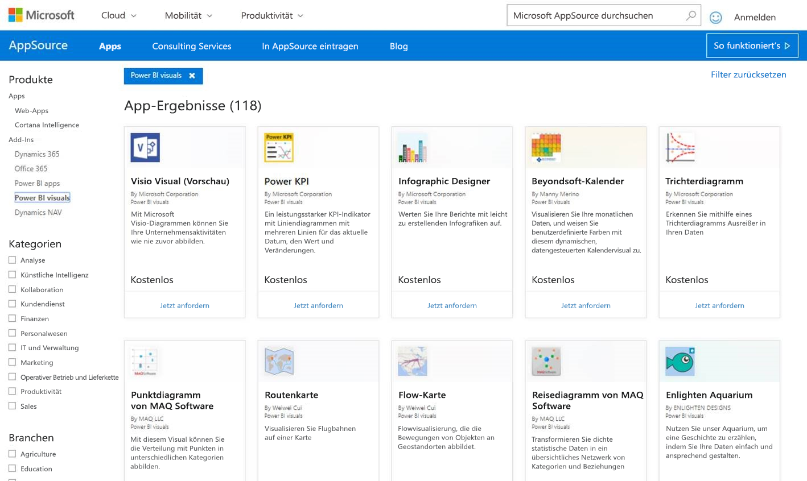

# Veröffentlichen von Power BI-Visuals in Partner Center

Nachdem Sie ein Power BI-Visual erstellt haben, sollten Sie es in AppSource veröffentlichen, damit es von anderen Personen gefunden und verwendet werden kann. Weitere Informationen zum Erstellen eines Power BI-Visuals finden Sie unter [Entwickeln eines Power BI-Visuals](visuals/custom-visual-develop-tutorial.md).

## Was ist AppSource?

[AppSource](https://appsource.microsoft.com/marketplace/apps?product=power-bi-visuals) ist der Ort, an dem Benutzer SaaS-Apps und Add-Ins für Ihre Microsoft-Produkte und -Dienste finden.

## Vorbereiten der Übermittlung Ihres Power BI-Visuals

Bevor Sie ein Power BI-Visual an AppSource übermitteln, lesen Sie die [Richtlinien für Power BI-Visuals](guidelines-powerbi-visuals.md), und stellen Sie sicher, dass Ihr [benutzerdefiniertes Visual getestet wurde](https://github.com/Microsoft/PowerBI-visuals/blob/master/Tutorial/SubmissionTesting.md).

Wenn Sie dazu bereit sind, Ihr Power BI-Visual zu übermitteln, überprüfen Sie, ob Ihr Visual alle unten aufgeführten Anforderungen erfüllt.

| Artikel | Erforderlich | Beschreibung |
| --- | --- | --- |
| PBIVIZ-Paket |Ja |Packen Sie Ihr Power BI-Visual in ein PBIVIZ-Paket, das alle erforderlichen Metadaten enthält. Name der Visualisierung Anzeigename GUID Version Beschreibung Name und E-Mail-Adresse des Autors |
| PBIX-Beispielberichtsdatei |Ja |Bei der Präsentation Ihres Visuals geht es darum, dass die Benutzer Ihr Visual kennenlernen. Heben Sie den Nutzen des Visuals für die Benutzer hervor, und bieten Sie Beispiele für Verwendung und Formatierungsoptionen. Sie können auch am Ende eine Seite mit *Hinweisen* hinzufügen, die Tipps und Tricks enthält und Fehler auflistet, die Benutzer vermeiden sollten. Die PBIX-Beispielberichtsdatei muss offline ohne externe Verbindung funktionieren. |
| Symbol |Ja |Sie sollten das Logo der benutzerdefinierten Visualisierung einschließen, das in der digitalen Ladenzeile angezeigt wird. Dabei kann es sich um eine PNG-, JPG-, JPEG- oder GIF-Datei handeln. Die Abmessung muss genau 300 px (Breite) × 300 px (Höhe) betragen. **Wichtig:** Lesen Sie den [Leitfaden zu Bildern im AppSource-Store](https://docs.microsoft.com/office/dev/store/craft-effective-appsource-store-images) sorgfältig durch, bevor Sie das Symbol übermitteln. |
| Screenshots |Ja |Stellen Sie mindestens einen Screenshot bereit. Dabei kann es sich um eine PNG-, JPG-, JPEG- oder GIF-Datei handeln. Die Abmessungen müssen exakt 1366 px (Breite) mal 768 px (Höhe) betragen. Die Datei darf nicht größer als 1024 KB sein. Um den Nutzen der Screenshots zu erhöhen, fügen Sie Textblasen hinzu, mit denen Sie den Wertbeitrag wichtiger Features erläutern, die in den einzelnen Screenshots gezeigt werden. |
| Support-Downloadlink |Ja |Stellen Sie eine Support-URL für Ihre Kunden bereit. Dieser Link ist Bestandteil Ihres Listings auf dem Verkäuferdashboard und wird Benutzern angezeigt, wenn sie auf das Listing Ihres Visuals in AppSource zugreifen. Das Format der URL muss „https://“ oder „http://“ enthalten. |
| Link zum Datenschutzdokument |Ja |Stellen Sie einen Link zur gültigen Datenschutzrichtlinie für das Visual bereit. Dieser Link ist Bestandteil Ihres Listings auf dem Verkäuferdashboard und wird Benutzern angezeigt, wenn sie auf das Listing Ihres Visuals in AppSource zugreifen. Das Format des Links muss „https://“ oder „http://“ enthalten. |
| Lizenzbedingungen |Ja |Sie müssen eine Datei mit Lizenzbedingungen hochladen. Dabei kann es sich um Ihre eigenen Lizenzbedingungen oder die Standardlizenzbedingungen im Office Store für Power BI-Visuals handeln. Um die Standardlizenzbedingungen zu verwenden, fügen Sie die folgende URL in das Dialogfeld zum Hochladen der Datei mit Lizenzbedingungen im Verkäuferdashboard ein. [https://visuals.azureedge.net/app-store/Power BI – Default Custom Visual EULA.pdf](https://visuals.azureedge.net/app-store/Power%20BI%20-%20Default%20Custom%20Visual%20EULA.pdf). |
| Videolink |Nein |Um das Interesse der Benutzer an Ihrem benutzerdefinierten Visual zu steigern, stellen Sie einen Link zu einem Video über Ihr Visual bereit. Das Format der URL muss „https://“ oder „http://“ enthalten. |
| GitHub-Repository |Nein |Geben Sie einen öffentlichen Link zu einem [GitHub](https://www.github.com)-Repository mit den Quellen Ihres Power BI-Visuals sowie Beispieldaten an. So können andere Entwickler Ihnen Feedback geben und Verbesserungen für Ihren Code vorschlagen. |

## Erhalten einer XML-Datei für das App-Paket

Um ein Power BI-Visual zu übermitteln, benötigen Sie eine XML-Datei für das App-Paket vom Power BI-Team. Um die XML-Datei für Ihr App-Paket zu erhalten, senden Sie eine E-Mail an das für die Übermittlung von Power BI-Visuals zuständige Team ([pbivizsubmit@microsoft.com](mailto:pbivizsubmit@microsoft.com)).

Bevor Sie das **PBIVIZ**-Paket erstellen, müssen Sie folgende Felder in der Datei **pbiviz.json** ausfüllen:
* Beschreibung
* supportUrl
* author
* NAME
* E-mail

Fügen Sie die **PBIVIZ-Datei** und die **PBIX-Beispielberichtsdatei** an Ihre E-Mail an. Das Power BI-Team sendet Ihnen eine Antwort mit Anweisungen und eine App-Paketdatei (XML) für den Upload. Dieses XML-App-Paket ist erforderlich, um Ihr Visual über das Office Developer Center zu übermitteln.

> [!NOTE]
> Um die Qualität zu verbessern und zu verhindern, dass vorhandene Berichte beschädigt werden, dauert es nach der Genehmigung im Store weitere zwei Wochen, bis Aktualisierungen vorhandener Visuals die Produktionsumgebung erreichen.

## Senden von Inhalten an AppSource

Um Ihr Power BI-Visual an AppSource zu übermitteln, müssen Sie ein App-Paket vom Power BI-Team anfordern und dieses in Partner Center übermitteln. 

### Erhalten des App-Pakets

Vor der Übermittlung an AppSource müssen Sie eine E-Mail mit der **PBIVIZ**-Datei und der **PBIX**-Datei an das Power BI-Team senden. Dies ist erforderlich, damit das Power BI-Team die Dateien auf den Server für die öffentliche Freigabe hochladen kann. Andernfalls kann der Store die Dateien nicht abrufen. 

Das Power BI-Team muss die Dateien bei Übermittlungen neuer Power BI-Visuals, bei Aktualisierungen vorhandener Power BI-Visuals und bei Korrekturen abgelehnter Visuals überprüfen.

### Übermittlung an Partner Center

Um Ihr Power BI-Visual an Partner Center übermitteln zu können, müssen Sie bei Partner Center registriert sein. Wenn Sie noch nicht registriert sind, [erstellen Sie ein Entwicklerkonto in Partner Center](https://docs.microsoft.com/office/dev/store/open-a-developer-account).

Führen Sie die unten genannten Schritte aus, um Ihr Power BI-Visual an Partner Center zu übermitteln. Weitere Informationen zum Übermittlungsprozess finden Sie unter [Übermitteln Ihrer Office-Lösung an AppSource über Partner Center](https://docs.microsoft.com/office/dev/store/use-partner-center-to-submit-to-appsource).

>[!NOTE]
> Wenn Sie sich gerade mitten im Übermittlungsprozess für ein Power BI-Visual befinden und das [Verkäuferdashboard](https://docs.microsoft.com/office/dev/store/use-the-seller-dashboard-to-submit-to-the-office-store) (das alte Verwaltungstool) verwenden müssen, lesen Sie die Anweisungen für den [Übermitteln eines Power BI-Visuals an AppSource über das Verkäuferdashboard](seller-dashboard.md).

1. Melden Sie sich bei **Partner Center** an.

2. Wählen Sie im linken Bereich **OFFICE STORE** aus.

3. Wählen Sie **Übersicht** aus.

4. Klicken Sie auf **Neu erstellen**, und wählen Sie aus dem Dropdownmenü den Eintrag **Power BI-Visual** aus.

    

5. Geben Sie im Fenster **Neues Power BI-Visual erstellen** einen Namen für Ihr Power BI-Visual ein, und klicken Sie auf **Erstellen**.

6. Wählen Sie **Pakete** aus, und laden Sie das XML-App-Paket für Ihr Power BI-Visual hoch.

7. Wählen Sie **Eigenschaften** aus, und geben Sie die erforderlichen Informationen an.

8. Wenn für Ihr Produkt zusätzliche Komponenten erworben werden müssen, wählen Sie **Produkteinrichtung** aus, und aktivieren Sie das Kontrollkästchen **Erwerb des zugehörigen Diensts**.

9. (Optional) Wenn Sie Ihr Visual [zertifizieren](power-bi-custom-visuals-certified.md) lassen möchten, wählen Sie **Produkteinrichtung** aus, und aktivieren Sie das Kontrollkästchen **Power BI-Zertifizierung**.
    >[!TIP]
    >Der Zertifizierungsprozess für ein Power BI-Visual kann einige Zeit in Anspruch nehmen. Wenn Sie ein neues Power BI-Visual erstellen, empfiehlt es sich, dieses über Partner Center zu veröffentlichen, bevor Sie eine Power BI-Zertifizierung anfordern. Damit wird sichergestellt, dass sich die Veröffentlichung Ihres Visuals nicht verzögert.

10. Wählen Sie **Produkteinrichtung** aus, und klicken Sie auf **Überprüfen und veröffentlichen**.

## Nachverfolgen des Übermittlungsstatus und der Verwendung

Sie können sich mit den [Überprüfungsrichtlinien](https://dev.office.com/officestore/docs/validation-policies#13-power-bi-custom-visuals) vertraut machen.

Nach der Übermittlung können Sie im [App-Dashboard](https://sellerdashboard.microsoft.com/Application/Summary/) den Übermittlungsstatus anzeigen.

## Zertifizieren Ihrer Visualisierung

Sobald Ihr Visual erstellt wurde, können Sie es [zertifizieren](../developer/power-bi-custom-visuals-certified.md) lassen, wenn Sie möchten.

## Nächste Schritte

[Entwickeln eines benutzerdefinierten Visuals für Power BI](visuals/custom-visual-develop-tutorial.md)  
[Visualisierungen in Power BI](../visuals/power-bi-report-visualizations.md)  
[Benutzerdefinierte Visualisierungen in Power BI](../developer/power-bi-custom-visuals.md)  
[So lassen Sie sich ein Power BI-Visual zertifizieren](../developer/power-bi-custom-visuals-certified.md)

Weitere Fragen? [Stellen Sie Ihre Frage in der Power BI-Community.](https://community.powerbi.com/)
