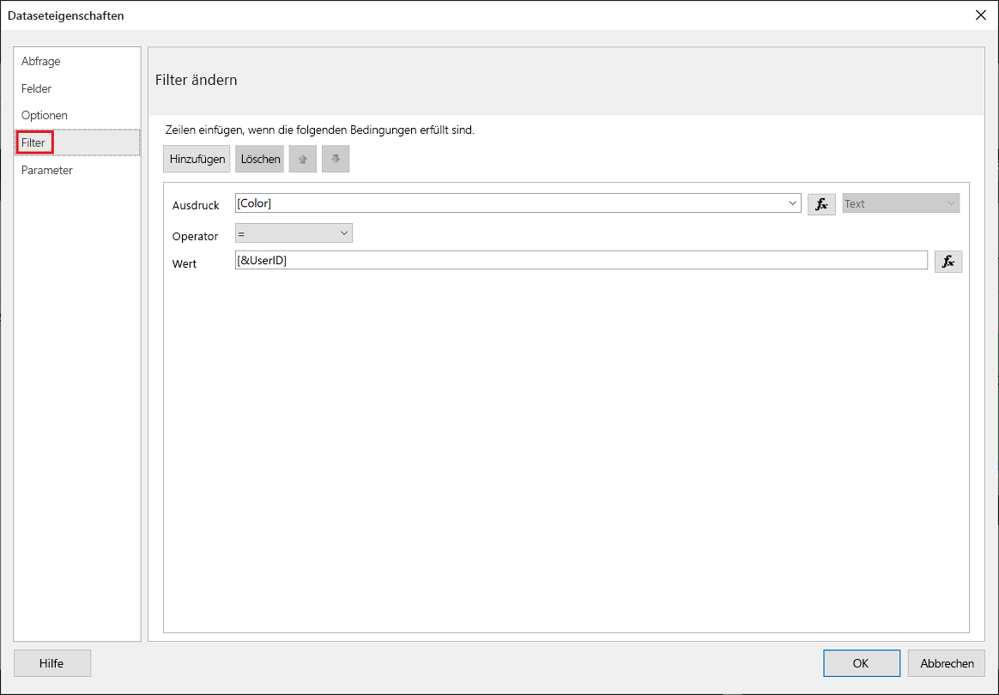
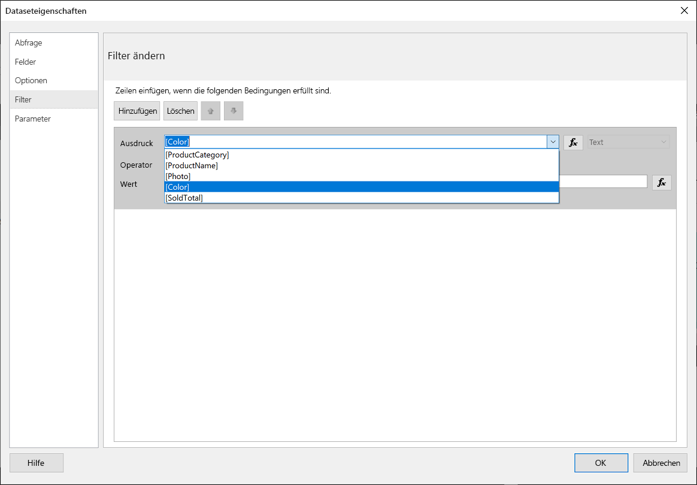
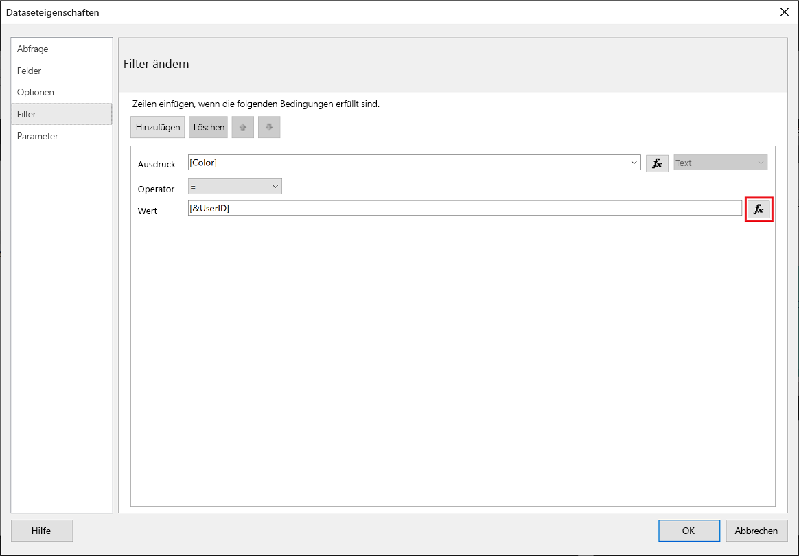
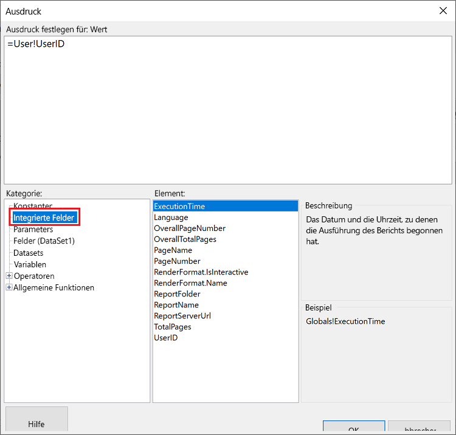
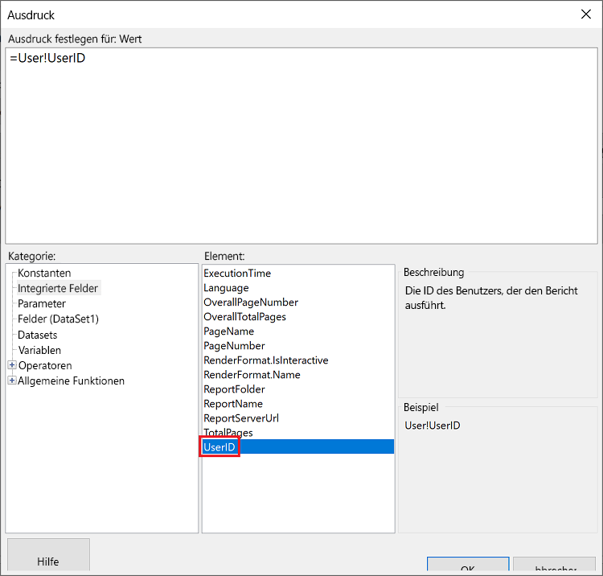
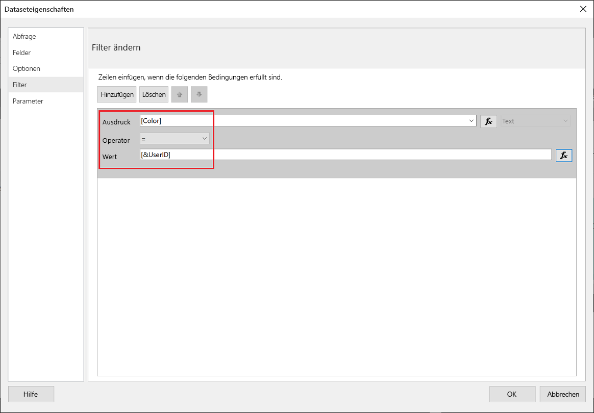
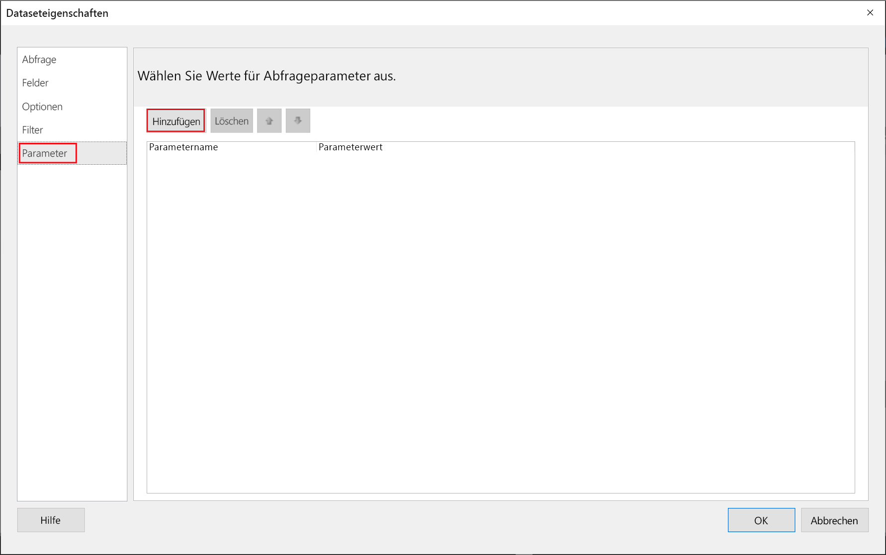
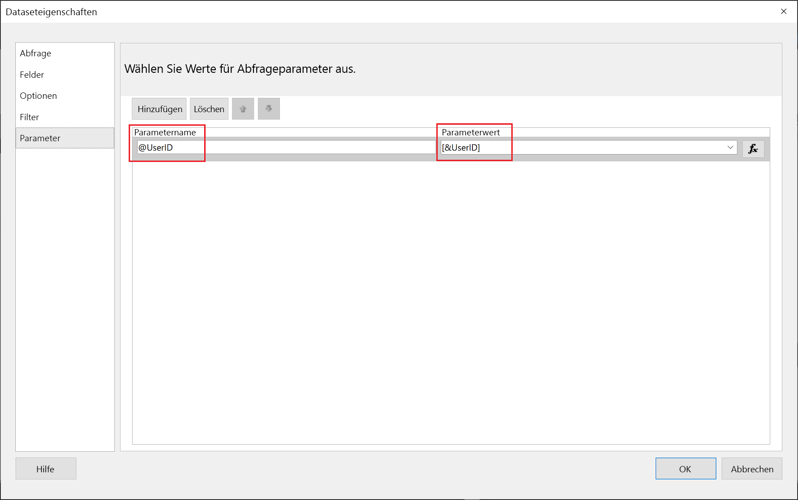
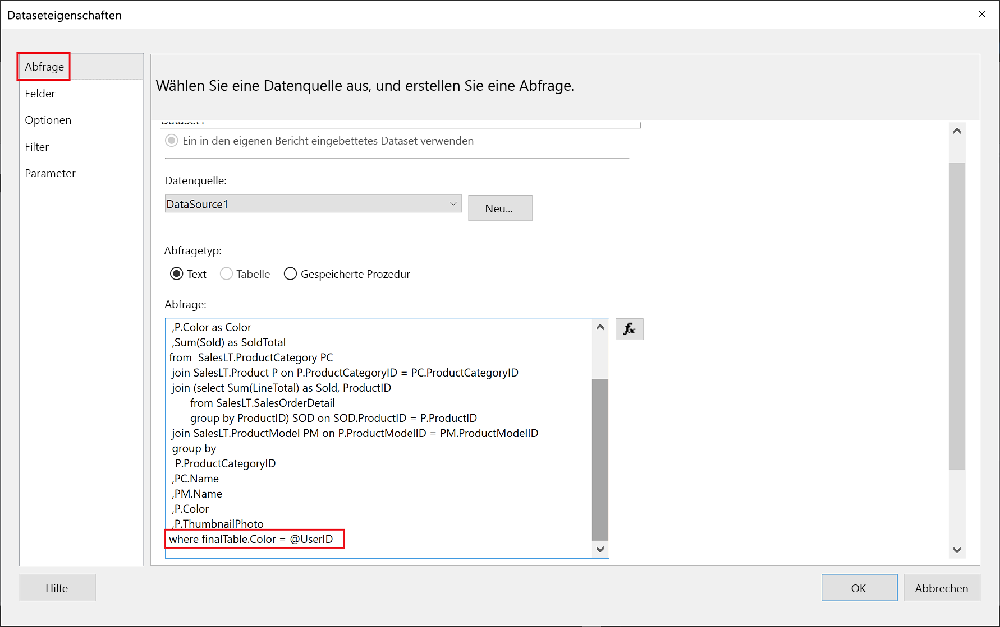

# <a name="implementing-row-level-security-in-embedded-paginated-reports-preview"></a>Implementieren der Sicherheit auf Zeilenebene in eingebetteten paginierten Berichten (Vorschau)

Wenn Sie einen paginierten Bericht einbetten, können Sie steuern, welche Daten angezeigt werden. Dadurch können die angezeigten Informationen auf den jeweiligen Benutzer zugeschnitten werden. Wenn Sie z. B. über einen paginierten Power BI-Bericht verfügen, der globale Verkaufsergebnisse enthält, können Sie ihn so einbetten, dass nur die Verkaufsergebnisse aus einer bestimmten Region verfügbar sind.

Diese Funktion ermöglicht das sichere Anzeigen einer Teilmenge von Daten, ohne die restlichen Daten zu beeinträchtigen. Sie ähnelt der Funktion [Sicherheit auf Zeilenebene (RLS)](embedded-row-level-security.md), mit der Daten in (nicht paginierten) Power BI-Berichten, Dashboards, Kacheln und Datasets sicher angezeigt werden können.  

> [!Note]
> Diese Funktion funktioniert auch im Zusammenhang mit dem Einbetten von paginierten Berichten für Kunden.

## <a name="configuring-a-parameter-to-filter-the-dataset"></a>Konfigurieren eines Parameters zum Filtern des Datasets

Beim Anwenden der Sicherheit auf Zeilenebene auf einen paginierten Power BI-Bericht müssen Sie dem **UserID**-Attribut einen [Parameter](../report-builder-parameters.md) zuweisen. Dieser Parameter schränkt die Daten ein, die aus dem Dataset abgerufen werden, bevor der Bericht eingebettet wird.

Verwenden Sie nach dem Zuweisen des Parameter zum **UserID**-Attribut die API [Reports GenerateTokenForCreateInGroup](https://docs.microsoft.com/rest/api/power-bi/embedtoken/reports_generatetokenforcreateingroup), um das Token für die Einbettung zu erhalten.

## <a name="use-userid-as-a-filter-at-report-or-query-level"></a>Verwenden von UserID als Filter auf Berichts- oder Abfrageebene

Sie können **UserID** als *Filter* oder in einer *Abfrage* für die Datenquelle im [Power BI-Berichts-Generator für paginierte Berichte](../report-builder-power-bi.md) verwenden.

### <a name="using-the-filter"></a>Verwenden des Filters

1. Wählen Sie im Fenster **Dataseteigenschaften** im linken Bereich die Option **Filter** aus.

    

2. Wählen Sie im Dropdownmenü **Ausdruck** den Parameter aus, den Sie zum Filtern der Daten verwenden möchten.

     

3. Klicken Sie auf die Funktionsschaltfläche **Wert**. 

    

4. Wählen Sie im Fenster **Ausdruck** in der Liste **Kategorie** die Option **Integrierte Felder** aus.

    

5. Wählen Sie in der Liste **Element** **UserID** aus, und klicken Sie auf **OK**.

    

6. Vergewissern Sie sich, dass im Fenster **Dataseteigenschaften** der Ausdruck *Ihr ausgewählter Parameter = UserID* ist, und klicken Sie auf **OK**.

    

### <a name="using-a-query"></a>Verwenden einer Abfrage

1. Wählen Sie im Fenster **Dataseteigenschaften** im linken Bereich **Parameter** aus, und klicken Sie auf **Hinzufügen**.

    

2. Geben Sie im Feld **Parametername** **\@UserID** ein, und fügen Sie im Feld **Parameterwert** **[&UserID]** hinzu.

     

3. Wählen Sie im linken Bereich **Abfrage** aus, fügen Sie in der Abfrage den Parameter **UserID** als Teil der Abfrage hinzu, und klicken Sie auf **OK**.
    > [!NOTE]
    > Im folgenden Screenshot wird der Farbparameter als Beispiel verwendet (whereFinalTable.Color = @UserID). Bei Bedarf ist es möglich, eine komplexere Abfrage zu erstellen.

    

## <a name="passing-the-configured-parameter-using-the-embed-token"></a>Übergeben des konfigurierten Parameters mit dem Einbettungstoken

Wenn Sie einen paginierten Bericht für Ihre Kunden einbetten, wird die API [Reports GenerateTokenForCreateInGroup](https://docs.microsoft.com/rest/api/power-bi/embedtoken/reports_generatetokenforcreateingroup) verwendet, um das Einbettungstoken abzurufen. Dieses Token kann auch verwendet werden, um einige der Daten zu filtern, die aus dem paginierten-Bericht abgerufen werden.

Um nur einige der Daten verfügbar zu machen, weisen Sie das Feld `username` den Informationen zu, die Sie anzeigen möchten. Wenn Sie z. B. in einem paginierten-Bericht mit einem Farbparameter *grün* in das Feld `username` eingeben, werden die eingebetteten Daten durch das Einbettungstoken so eingeschränkt, dass nur die Daten angezeigt werden, die in der Farbspalte einen *grünen* Wert aufweisen.

```JSON
{
    "accessLevel": "View",
    "reportId": "cfafbeb1-8037-4d0c-896e-a46fb27ff229",
    "identities": [
            {
                    // Replace the 'username' with a paginated report parameter
                    "username":     "...",
                    "reports: [
                        "cfafbeb1-8037-4d0c-896e-a46fb27ff229"
                    ]
            }
    ]
}
```
