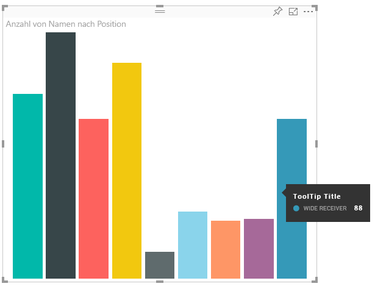

# <a name="power-bi-visuals-tooltips"></a>QuickInfos in Power BI-Visuals

Jetzt profitieren auch Visuals von der QuickInfo-Unterstützung in Power BI. Interaktionen für QuickInfos in Power BI:

Anzeigen einer QuickInfo
Ausblenden einer QuickInfo
Verschieben einer QuickInfo

Eine QuickInfo kann als Textelement mit einem Titel, einem Wert für eine bestimmte Farbe und Deckkraft und einer Gruppe von Koordinaten angezeigt werden. Die Daten werden für die API bereitgestellt. Anschließend werden sie vom Power BI-Host auf dieselbe Weise gerendert wie QuickInfos für native Visuals.

Ein Beispiel dafür ist die QuickInfo im folgenden BarChart-Beispiel.



In der oben dargestellten QuickInfo werden eine Kategorie und ein Wert für einen einzelnen Balken angezeigt. Die Anzeige kann erweitert werden, um mehrere Werte innerhalb einer QuickInfo zu sehen.

## <a name="handling-tooltips"></a>Arbeiten mit QuickInfos

Die Schnittstelle für die Verwaltung von QuickInfos heißt ITooltipService. Über diese Schnittstelle wird der Host darüber benachrichtigt, dass eine QuickInfo angezeigt, entfernt oder verschoben werden muss.

```typescript
    interface ITooltipService {
        enabled(): boolean;
        show(options: TooltipShowOptions): void;
        move(options: TooltipMoveOptions): void;
        hide(options: TooltipHideOptions): void;
    }
```

Das Visual muss die eigenen Mausereignisse überwachen und bei Bedarf den Delegaten `show()`, `move()` oder `hide()` mit dem Inhalt aufrufen, der in den `Tooltip****Options`-Objekten enthalten ist.
Durch `TooltipShowOptions` und `TooltipHideOptions` wird wiederum definiert, was bei Auftreten dieser Ereignisse angezeigt wird und wie sich die QuickInfo verhält.
Da beim Aufrufen dieser Methoden auch Benutzerereignisse wie Mausbewegungen oder Touchereignisse eine Rolle spielen, empfiehlt es sich, Listener für diese Ereignisse zu erstellen. Dadurch werden dann die `TooltipService`-Elemente aufgerufen.
In unserem Beispiel werden Daten in der `TooltipServiceWrapper`-Klasse aggregiert.

### <a name="tooltipservicewrapper-class"></a>TooltipServiceWrapper-Klasse

Die Grundidee dieser Klasse ist, dass sie die Instanz von `TooltipService` enthält, D3-Mausereignisse in relevanten Elementen überwacht und dann bei Bedarf `show()` oder `hide()` aufruft.
Die Klasse enthält und verwaltet relevante Zustands- und Logikinformationen für diese Ereignisse, die hauptsächlich auf die Verknüpfung mit dem zugrunde liegenden D3-Code ausgerichtet sind. Die Verknüpfung und Konvertierung von D3-Code wird in diesem Dokument nicht behandelt.

Den vollständigen Beispielcode finden Sie im [SampleBarChart-Visualrepository](https://github.com/Microsoft/PowerBI-visuals-sampleBarChart/commit/981b021612d7b333adffe9f723ab27783c76fb14).

### <a name="creating-tooltipservicewrapper"></a>Erstellen von TooltipServiceWrapper

Der BarChart-Konstruktor verfügt jetzt über ein `tooltipServiceWrapper`-Element, das im Konstruktor mit der `tooltipService`-Hostinstanz instanziiert wird.

```typescript
        private tooltipServiceWrapper: ITooltipServiceWrapper;

        this.tooltipServiceWrapper = createTooltipServiceWrapper(this.host.tooltipService, options.element);
```

Die `TooltipServiceWrapper`-Klasse enthält die `tooltipService`-Instanz zusätzlich zum D3-Stammelement der Visual- und Touchparameter.

```typescript
    class TooltipServiceWrapper implements ITooltipServiceWrapper {
        private handleTouchTimeoutId: number;
        private visualHostTooltipService: ITooltipService;
        private rootElement: Element;
        private handleTouchDelay: number;

        constructor(tooltipService: ITooltipService, rootElement: Element, handleTouchDelay: number) {
            this.visualHostTooltipService = tooltipService;
            this.handleTouchDelay = handleTouchDelay;
            this.rootElement = rootElement;
        }
        .
        .
        .
    }
```

Der einzige Einstiegspunkt, über den diese Klasse Ereignislistener registrieren kann, ist die `addTooltip`-Methode.

### <a name="addtooltip-method"></a>addTooltip-Methode

```typescript
        public addTooltip<T>(
            selection: d3.Selection<Element>,
            getTooltipInfoDelegate: (args: TooltipEventArgs<T>) => VisualTooltipDataItem[],
            getDataPointIdentity: (args: TooltipEventArgs<T>) => ISelectionId,
            reloadTooltipDataOnMouseMove?: boolean): void {

            if (!selection || !this.visualHostTooltipService.enabled()) {
                return;
            }
        ...
        ...
        }
```

* **selection: d3.Selection<Element>**
* Die D3-Elemente, über die QuickInfos verarbeitet werden
* **getTooltipInfoDelegate: (args: TooltipEventArgs<T>) => VisualTooltipDataItem[]**
* Der Delegat zum Auffüllen des QuickInfo-Inhalts (was angezeigt werden soll) pro Kontext
* **getDataPointIdentity: (args: TooltipEventArgs<T>) => ISelectionId**
* Der Delegat zum Abrufen der Datenpunkt-ID (in diesem Beispiel nicht verwendet) 
* **reloadTooltipDataOnMouseMove?: boolean**
* Ein boolescher Wert, der angibt, ob die QuickInfo-Daten während eines mouseMove-Ereignisses aktualisiert werden (in diesem Beispiel nicht verwendet)

Wie Sie sehen, wird `addTooltip` ohne Aktion beendet, wenn `tooltipService` deaktiviert ist oder keine wirkliche Auswahl vorliegt.

### <a name="call-of-show-method-to-display-a-tooltip"></a>Aufrufen der show-Methode zum Anzeigen einer QuickInfo

`addTooltip` überwacht als Nächstes das `mouseover`-Ereignis im D3-Code.

```typescript
        ...
        ...
        selection.on("mouseover.tooltip", () => {
            // Ignore mouseover while handling touch events
            if (!this.canDisplayTooltip(d3.event))
                return;

            let tooltipEventArgs = this.makeTooltipEventArgs<T>(rootNode, true, false);
            if (!tooltipEventArgs)
                return;

            let tooltipInfo = getTooltipInfoDelegate(tooltipEventArgs);
            if (tooltipInfo == null)
                return;

            let selectionId = getDataPointIdentity(tooltipEventArgs);

            this.visualHostTooltipService.show({
                coordinates: tooltipEventArgs.coordinates,
                isTouchEvent: false,
                dataItems: tooltipInfo,
                identities: selectionId ? [selectionId] : [],
            });
        });
```

* **makeTooltipEventArgs**
* Extrahiert den Kontext aus den ausgewählten D3-Elementen in tooltipEventArg. Dadurch werden auch die Koordinaten berechnet.
* **getTooltipInfoDelegate**
* Anschließend wird der QuickInfo-Inhalt auf der Basis von tooltipEventArgs erstellt. Dies ist ein Rückruf an die BarChart-Klasse, da es sich hier um die Logikinformationen des Visuals handelt. Daraufhin wird der tatsächliche Textinhalt in der QuickInfo angezeigt.
* **getDataPointIdentity**
* In diesem Beispiel nicht verwendet
* **this.visualHostTooltipService.show**
* Der Aufruf zur Anzeige der QuickInfo  

Weitere praktische Informationen finden Sie in den Beispielen für das `mouseout`-Ereignis und das `mousemove`-Ereignis.

Weitere Informationen finden Sie im [SampleBarChart-Visualrepository](https://github.com/Microsoft/PowerBI-visuals-sampleBarChart/commit/981b021612d7b333adffe9f723ab27783c76fb14).

### <a name="populating-the-tooltip-content-by-gettooltipdata-method"></a>Auffüllen des QuickInfo-Inhalts durch die getTooltipData-Methode

`BarChart` wurde mit einem `getTooltipData`-Element hinzugefügt, durch das die Kategorie, der Wert und die Farbe des Datenpunkts einfach in ein VisualTooltipDataItem[]-Element extrahiert wird.

```typescript
        private static getTooltipData(value: any): VisualTooltipDataItem[] {
            return [{
                displayName: value.category,
                value: value.value.toString(),
                color: value.color,
                header: 'ToolTip Title'
            }];
        }
```

In der vorangehenden Implementierung ist das `header`-Element konstant. Es kann jedoch auch für komplexere Implementierungen verwendet werden, die dynamische Werte erfordern. Sie können `VisualTooltipDataItem[]` mit mehreren Elementen auffüllen, um der QuickInfo mehrere Zeilen hinzuzufügen. Dies kann in Visuals wie gestapelten Balkendiagrammen nützlich sein, in denen QuickInfos Daten aus mehreren Datenpunkten enthalten können.

### <a name="calling-addtooltip-method"></a>Aufrufen der addTooltip-Methode

Als letzter Schritt wird `addTooltip` aufgerufen, wenn sich Daten tatsächlich ändern. Dieser Aufruf erfolgt in der `BarChart.update()`-Methode. Durch den Aufruf wird die Auswahl aller bar-Elemente überwacht und wie oben erwähnt nur `BarChart.getTooltipData()` übergeben.

```typescript
        this.tooltipServiceWrapper.addTooltip(this.barContainer.selectAll('.bar'),
            (tooltipEvent: TooltipEventArgs<number>) => BarChart.getTooltipData(tooltipEvent.data),
            (tooltipEvent: TooltipEventArgs<number>) => null);
```

## <a name="adding-report-page-tooltips"></a>Hinzufügen von QuickInfos zur Berichtsseite

Um QuickInfo-Unterstützung für Berichtsseiten hinzuzufügen, nehmen Sie vorwiegend Änderungen in der Datei „capabilities.json“ vor.

Ein Beispielschema:

```json
{
    "tooltips": {
        "supportedTypes": {
            "default": true,
            "canvas": true
        },
        "roles": [
            "tooltips"
        ]
    }
}
```

QuickInfos für Berichtsseiten können im Formatbereich definiert werden.


`supportedTypes` ist die QuickInfo-Konfiguration, die vom Visual unterstützt und auch in das Feld übernommen wird. `default` gibt an, ob die „automatische“ Bindung von QuickInfos über das Datenfeld unterstützt wird. „canvas“ gibt an, ob QuickInfos für Berichtsseiten unterstützt werden.

`roles` ist optional. Nach der Definition gibt dieses Element vor, welche Datenrollen an die ausgewählte QuickInfo-Option gebunden werden (auch in Feldern).

Weitere Informationen finden Sie in den Nutzungsrichtlinien, die sich auf QuickInfos für Berichtsseiten beziehen: [QuickInfos für Berichtsseiten](https://powerbi.microsoft.com/blog/power-bi-desktop-march-2018-feature-summary/#tooltips).

Um die QuickInfo für Berichtsseiten anzuzeigen, verwendet der Power BI-Host beim Aufruf von `ITooltipService.Show(options: TooltipShowOptions)` oder `ITooltipService.Move(options: TooltipMoveOptions)` die selectionId (`identities`-Eigenschaft des oben erwähnten `options`-Arguments). Die SelectionId stellt die ausgewählten Daten (Kategorie, Reihe usw.) des Elements (auf das Sie oben gezeigt haben) dar, die von der QuickInfo abgerufen werden sollen.

Das Beispiel zeigt, wie selectionId an Aufrufe zum Anzeigen einer QuickInfo gesendet wird:

```typescript
    this.tooltipServiceWrapper.addTooltip(this.barContainer.selectAll('.bar'),
        (tooltipEvent: TooltipEventArgs<number>) => BarChart.getTooltipData(tooltipEvent.data),
        (tooltipEvent: TooltipEventArgs<number>) => tooltipEvent.data.selectionID);
```
