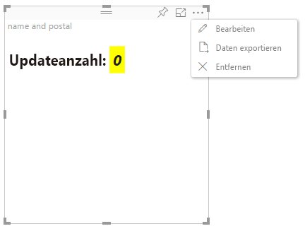

# Modus „Erweiterte Bearbeitung“

Für Visuals, die erweiterte UI-Steuerelemente erfordern, kann die Unterstützung des Modus „Erweiterte Bearbeitung“ deklariert werden.
Sofern unterstützt, wird im Berichtsbearbeitungsmodus im Menü des Visuals eine Schaltfläche „`Edit`“ angezeigt.
Beim Klicken auf die Schaltfläche „`Edit`“ wird EditMode auf `Advanced` festgelegt.
Das Visual kann anhand des EditMode-Flags bestimmen, ob diese UI-Steuerelemente anzeigt werden sollen.

Der Modus „Erweiterte Bearbeitung“ wird vom Visual standardmäßig nicht unterstützt.
Falls ein anderes Verhalten gewünscht ist, sollten Sie dieses in der Datei „`capabilities.json`“ des Visuals explizit angeben, indem Sie die `advancedEditModeSupport`-Eigenschaft festlegen.

Mögliche Werte:

- 0: NotSupported

- 1: SupportedNoAction

- 2: SupportedInFocus

## Aktivieren des Modus „Erweiterte Bearbeitung“

Die Schaltfläche „`Edit`“ wird unter folgenden Voraussetzungen angezeigt:

 1\. Die `advancedEditModeSupport`-Eigenschaft wurde in „capabilities.json“ entweder auf `SupportedNoAction` oder `SupportedInFocus` festgelegt.

 2\. Das Visual wird im Berichtsbearbeitungsmodus angezeigt.

Wenn die `advancedEditModeSupport`-Eigenschaft in „capabilities.json“ fehlt oder auf `NotSupported` festgelegt ist, wird die Schaltfläche „Edit“ ausgeblendet.

Wenn der Benutzer auf `Edit` klickt, empfängt das Visual einen update()-Aufruf, bei dem EditMode auf `Advanced` festgelegt ist.
Gemäß dem in den Funktionen festgelegten Wert werden folgende Aktionen ausgeführt:

* `SupportedNoAction`: Keine weitere Aktion durch den Host.
* `SupportedInFocus`: Der Host öffnet das Visual im Fokusmodus.

## Beenden des Modus „Erweiterte Bearbeitung“

Die Schaltfläche „`Back to report`“ wird unter folgenden Voraussetzungen angezeigt:

1\. Die `advancedEditModeSupport`-Eigenschaft wurde in „capabilities.json“ auf `SupportedInFocus` festgelegt.
