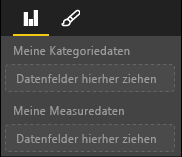

# <a name="power-bi-visual-capabilities"></a>Funktionen von Power BI-Visuals

Funktionen stellen dem Host Informationen zum Visual zur Verfügung. Alle Eigenschaften im Funktionsmodell sind `optional`.

Stammobjekte der Visualfunktionen sind `dataRoles`, `dataViewMappings` usw.

```json
{
    "dataRoles": [ ... ],
    "dataViewMappings": [ ... ],
    "objects":  { ... },
    "supportsHighlight": true|false,
    "advancedEditModeSupport": 0|1|2,
    "sorting": { ... }
}

```

## <a name="define-the-data-fields-your-visual-expects---dataroles"></a>Definieren der vom Visual erwarteten Datenfelder – `dataRoles`

Wir verwenden `dataRoles`, um Felder zu definieren, die an Daten gebunden werden können. Die Funktion verwendet ein Array von `DataViewRole`-Objekten, das alle erforderlichen Eigenschaften definiert.

### <a name="properties"></a>Eigenschaften

* **name**: Der interne Name dieses Datenfelds (muss eindeutig sein)
* **kind**: Die Art des Felds –
    * `Grouping`: Diskrete Werte für das Gruppieren von Measurefeldern
    * `Measure`: Numerische Datenwerte
    * `GroupingOrMeasure`: Kann als Gruppierung oder Measure verwendet werden
* **displayName**: Der Name, den der Benutzer im Eigenschaftenbereich sieht.
* **description**: Eine kurze Beschreibung des Felds (optional)
* **requiredTypes**: Der für diese Datenrolle erforderliche Datentyp Alle nicht übereinstimmenden Werte werden auf „null“ festgelegt (optional).
* **preferredTypes**: Der bevorzugte Datentyp für diese Datenrolle (optional)

### <a name="valid-data-types-in-requiredtypes-and-preferredtypes"></a>Gültige Datentypen in requiredTypes und preferredTypes

* **bool**: Ein boolescher Wert
* **integer**: Ein Wert in Form einer ganzen Zahl
* **numeric**: Ein numerischer Wert
* **text**: Ein Textwert
* **geography**: Geografische Daten

### <a name="example"></a>Beispiel

```json
"dataRoles": [
    {
        "displayName": "My Category Data",
        "name": "myCategory",
        "kind": "Grouping",
        "requiredTypes": [
            {
                "text": true
            },
            {
                "numeric": true
            },
            {
                "integer": true
            }
        ],
        "preferredTypes": [
            {
                "text": true
            }
        ]
    },
    {
        "displayName": "My Measure Data",
        "name": "myMeasure",
        "kind": "Measure",
        "requiredTypes": [
            {
                "integer": true
            },
            {
                "numeric": true
            }
        ],
        "preferredTypes": [
            {
                "integer": true
            }
        ]
    },
    {
        "displayNameKey": "Visual_Location",
        "name": "Locations",
        "kind": "Measure",
        "displayName": "Locations",
        "requiredTypes": [
            {
                "geography": {
                    "address": true
                }
            },
            {
                "geography": {
                    "city": true
                }
            },
            {
                "geography": {
                    "continent": true
                }
            },
            {
                "geography": {
                    "country": true
                }
            },
            {
                "geography": {
                    "county": true
                }
            },
            {
                "geography": {
                    "place": true
                }
            },
            {
                "geography": {
                    "postalCode": true
                }
            },
            {
                "geography": {
                    "region": true
                }
            },
            {
                "geography": {
                    "stateOrProvince": true
                }
            }
        ]
    }
]
```

Durch die oben genannten Datenrollen würden die folgenden Felder erstellt:



## <a name="define-how-you-want-the-data-mapped---dataviewmappings"></a>Definieren, wie die Daten zugeordnet werden sollen – `dataViewMappings`

DataViewMapping beschreibt die Beziehung zwischen den Datenrollen und ermöglicht es Ihnen, bedingte Anforderungen dafür festzulegen.

Die meisten Visuals verfügen über eine einzelne Zuordnung. Sie können aber auch mehrere dataViewMappings angeben. Durch jede gültige Zuordnung wird eine DataView erzeugt. 

```json
"dataViewMappings": [
    {
        "conditions": [ ... ],
        "categorical": { ... },
        "table": { ... },
        "single": { ... },
        "matrix": { ... }
    }
]
```

[Weitere Informationen zu DataViewMappings](dataview-mappings.md)

## <a name="define-property-pane-options---objects"></a>Definieren von Optionen für den Eigenschaftenbereich – `objects`

Objekte beschreiben anpassbare Eigenschaften, die dem Visual zugeordnet sind.
Jedes Objekt kann über mehrere Eigenschaften verfügen, und jeder Eigenschaft ist ein Typ zugeordnet.
Mit Typen wird die Eigenschaft näher bestimmt. Weitere Informationen zu Typen finden Sie unten.

```json
"objects": {
    "myCustomObject": {
        "displayName": "My Object Name",
        "properties": { ... }
    }
}
```

[Weitere Informationen zu Objekten](objects-properties.md)

## <a name="handle-partial-highlighting---supportshighlight"></a>Behandeln teilweiser Hervorhebungen – `supportsHighlight`

Dieser Wert ist standardmäßig auf „false“ festgelegt. Das bedeutet, dass Ihre „Werte“ automatisch gefiltert werden, wenn auf der Seite etwas ausgewählt wird. Gleichzeitig wird das Visual aktualisiert, damit nur der ausgewählte Wert angezeigt wird. Wenn Sie die vollständigen Daten anzeigen möchten, aber nur die ausgewählten Elemente hervorheben, müssen Sie `supportsHighlight` in „capabilities.json“ auf „true“ festlegen.

[Weitere Informationen zur Hervorhebung](highlight.md)

## <a name="handle-advanced-edit-mode---advancededitmodesupport"></a>Behandeln des Modus „Erweiterte Bearbeitung“ – `advancedEditModeSupport`

Für ein Visual kann deklariert werden, dass es den Modus „Erweiterte Bearbeitung“ unterstützt.
Ein Visual bietet standardmäßig keine Unterstützung für den Modus „Erweiterte Bearbeitung“, es sei denn, dies wurde in „capabilities.json“ explizit angegeben.

[Weitere Informationen zu advancedEditModeSupport](advanced-edit-mode.md)

## <a name="data-sorting-options-for-visual---sorting"></a>Datensortieroptionen für Visuals – `sorting`

Das Sortierverhalten eines Visuals kann in dessen Funktionen definiert werden.
Die Änderung der Sortierreihenfolge wird von einem Visual standardmäßig nicht unterstützt, es sei denn, dies wurde in „capabilities.json“ explizit angegeben.

[Weitere Informationen zur Sortierung](sort-options.md)
