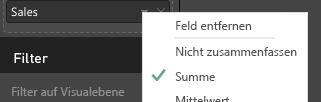
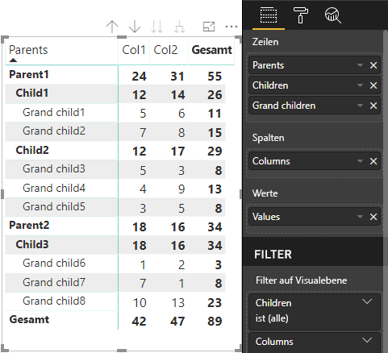

# <a name="data-view-mappings-in-power-bi-visuals"></a>Zuordnungen von Datenansichten in Power BI-Visuals

`dataViewMappings` beschreibt die Beziehung zwischen den Datenrollen und ermöglicht es Ihnen, bedingte Anforderungen dafür festzulegen.
Jede der einzelnen `dataMappings` wird in einem eigenen Abschnitt erläutert.

Jede gültige Zuordnung erzeugt eine `DataView`. Derzeit wird jedoch nur die Ausführung einer Abfrage pro Visual unterstützt. Daher erhalten Sie in den meisten Fällen nur eine `DataView`. Allerdings können Sie mehrere Datenzuordnungen mit unterschiedlichen Bedingungen bereitstellen, die folgende Möglichkeiten bieten:

```json
"dataViewMappings": [
    {
        "conditions": [ ... ],
        "categorical": { ... },
        "single": { ... },
        "table": { ... },
        "matrix": { ... }
    }
]
```

> [!NOTE]
> Wichtig: Power BI erstellt ausschließlich eine Zuordnung zu einer DataView, wenn die gültige Zuordnung in `dataViewMappings` angegeben ist.

Anders ausgedrückt: Wenn `categorical` in `dataViewMappings` definiert ist, andere Zuordnungen wie `table`, `single` usw. aber nicht, wie im folgenden Beispiel,
```json
"dataViewMappings": [
    {
        "categorical": { ... }
    }
]
```

erzeugt Power BI eine `DataView` mit einer einzelnen `categorical`-Zuordnung (wobei `table` und andere Zuordnungen `undefined` sind):
```javascript
{
    "categorical": {
        "categories": [ ... ],
        "values": [ ... ]
    },
    "metadata": { ... }
}
```

## <a name="conditions"></a>„conditions“

Beschreibt Bedingungen für eine bestimmte Datenzuordnung. Sie können mehrere Gruppen von Bedingungen bereitstellen. Wenn die Daten mit einer der beschriebenen Bedingungsgruppen übereinstimmen, werden die Daten vom Visual als gültig akzeptiert.

Derzeit können Sie für jedes Feld einen minimalen und maximalen Wert angeben. Er stellt die Anzahl von Feldern dar, die an die Datenrolle gebunden werden können. 

> [!NOTE]
> Wenn eine Datenrolle in der Bedingung ausgelassen wird, kann sie über eine beliebige Anzahl von Feldern verfügen.

### <a name="example-1"></a>Beispiel 1

Sie können mehrere Felder in jede Datenrolle ziehen. In diesem Beispiel beschränken wir die Kategorie auf ein Datenfeld und das Measure auf zwei Datenfelder.

```json
"conditions": [
    { "category": { "max": 1 }, "y": { "max": 2 } },
]
```

### <a name="example-2"></a>Beispiel 2

In diesem Beispiel ist eine von zwei Bedingungen erforderlich. Entweder genau ein Kategoriedatenfeld und genau zwei Measures oder genau zwei Kategorien und genau ein Measure.

```json
"conditions": [
    { "category": { "min": 1, "max": 1 }, "measure": { "min": 2, "max": 2 } },
    { "category": { "min": 2, "max": 2 }, "measure": { "min": 1, "max": 1 } }
]
```

## <a name="single-data-mapping"></a>Einzelne Datenzuordnung

Die einzelne Datenzuordnung ist die einfachste Form der Datenzuordnung. Sie akzeptiert ein einzelnes Measurefeld und gibt die Summe zurück. Bei einem numerischen Feld erhalten Sie die Summe. Andernfalls erhalten Sie die Anzahl der eindeutigen Werte.

Wenn Sie eine einzelne Datenzuordnung verwenden möchten, müssen Sie den Namen der Datenrolle definieren, die Sie zuordnen möchten. Diese Zuordnung funktioniert nur mit einem einzelnen Measurefeld. Wenn ein zweites Feld zugewiesen ist, wird keine Datenansicht generiert. Daher empfiehlt es sich auch, eine Bedingung zu verwenden, durch die die Daten auf ein einzelnes Feld beschränkt werden.

> [!NOTE]
> Diese Datenzuordnung kann nicht in Verbindung mit einer anderen Datenzuordnung verwendet werden. Sie soll Daten auf einen einzelnen numerischen Wert reduzieren.

### <a name="example-3"></a>Beispiel 3

```json
"dataViewMappings": {
    "conditions": [
        { "Y": { "max": 1 } }
    ],
    "single": {
        "role": "Y"
    }
}  
```

Die resultierende Datenansicht enthält immer noch die anderen Typen („table“, „categorical“ usw.), allerdings enthält jede Zuordnung nur den einzelnen Wert. Die bewährte Vorgehensweise besteht darin, nur auf den Wert in „single“ zuzugreifen.

```JSON
{
    "dataView": [
        {
            "metadata": null,
            "categorical": null,
            "matrix": null,
            "table": null,
            "tree": null,
            "single": {
                "value": 94163140.3560001
            }
        }
    ]
}
```

## <a name="categorical-data-mapping"></a>Kategorische Datenzuordnung

Die kategorische Datenzuordnung wird verwendet, um eine oder zwei unabhängige Datengruppierungen zu erhalten.

### <a name="example-4"></a>Beispiel 4

Hier ist die Definition aus dem vorherigen Beispiel zu DataRoles.

```json
"dataRole":[
    {
        "displayName": "Category",
        "name": "category",
        "kind": "Grouping"
    },
    {
        "displayName": "Y Axis",
        "name": "measure",
        "kind": "Measure"
    }
]
```

Jetzt zur Zuordnung:

```json
"dataViewMappings": {
    "categorical": {
        "categories": {
            "for": { "in": "category" }
        },
        "values": {
            "select": [
                { "bind": { "to": "measure" } }
            ]
        }
    }
}
```

Es ist ein einfaches Beispiel und bedeutet im Klartext: „Ordne meine `category`-DataRole zu, damit die Daten jedes Felds, das ich in `category` ziehe, `categorical.categories` zugeordnet werden. Ordne auch meine `measure`-DataRole `categorical.values` zu.“

* **for...in**: Fügt alle Elemente in dieser Datenrolle in die Datenabfrage ein.
* **bind...to**: Erzeugt dasselbe Ergebnis wie „for...in“, erwartet jedoch, dass die DataRole über eine Bedingung verfügt, die sie auf ein einzelnes Feld beschränkt.

### <a name="example-5"></a>Beispiel 5

In diesem Beispiel verwenden wir die ersten beiden DataRoles aus dem vorherigen Beispiel und definieren zusätzlich `grouping` und `measure2`.

```json
"dataRole":[
    {
        "displayName": "Category",
        "name": "category",
        "kind": "Grouping"
    },
    {
        "displayName": "Y Axis",
        "name": "measure",
        "kind": "Measure"
    },
    {
        "displayName": "Grouping with",
        "name": "grouping",
        "kind": "Grouping"
    },
    {
        "displayName": "X Axis",
        "name": "measure2",
        "kind": "Grouping"
    }
]
```

Jetzt zur Zuordnung:

```json
"dataViewMappings":{
    "categorical": {
        "categories": {
            "for": { "in": "category" }
        },
        "values": {
            "group": {
                "by": "grouping",
                "select":[
                    { "bind": { "to": "measure" } },
                    { "bind": { "to": "measure2" } }
                ]
            }
        }
    }
}
```

Hier liegt der Unterschied in der Zuordnung von „categorical.values“. Hier sollen die `measure`-Datenrolle und `measure2`-Datenrolle zugeordnet und von der `grouping`-Datenrolle gruppiert werden.

### <a name="example-6"></a>Beispiel 6

Hier sind die dataRoles.

```json
"dataRoles": [
    {
        "displayName": "Categories",
        "name": "category",
        "kind": "Grouping"
    },
    {
        "displayName": "Measures",
        "name": "measure",
        "kind": "Measure"
    },
    {
        "displayName": "Series",
        "name": "series",
        "kind": "Measure"
    }
]
```

Hier ist die dataViewMapping.

```json
"dataViewMappings": [
    {
        "categorical": {
            "categories": {
                "for": {
                    "in": "category"
                }
            },
            "values": {
                "group": {
                    "by": "series",
                    "select": [{
                            "for": {
                                "in": "measure"
                            }
                        }
                    ]
                }
            }
        }
    }
]
```

Die kategorische `dataview` könnte wie folgt visualisiert werden:

| Kategorisch |  |  | | | |
|-----|-----|------|------|------|------|
| | Jahr | 2013 | 2014 | 2015 | 2016 |
| Land | | |
| USA | | x | x | 125 | 100 |
| Kanada | | x | 50 | 200 | x |
| Mexiko | | 300 | x | x | x |
| Vereinigtes Königreich | | x | x | 75 | x |

Power BI erzeugt diese als kategorische Datenansicht. Dabei handelt es sich um die Gruppe von Kategorien.

```JSON
{
    "categorical": {
        "categories": [
            {
                "source": {...},
                "values": [
                    "Canada",
                    "Mexico",
                    "UK",
                    "USA"
                ],
                "identity": [...],
                "identityFields": [...],
            }
        ]
    }
}
```

Jede Kategorie wird auch einer Gruppe von Werten zugeordnet. Jeder dieser Werte ist nach einer Reihe gruppiert, d. h. nach Jahren.

Beispielsweise belaufen sich die Verkaufszahlen in Kanada im Jahr 2013 auf 0 und im Jahr 2014 auf 50.

```JSON
{
    "values": [
        {
            "source": {...},
            "values": [
                null,
                300,
                null,
                null
            ],
            "identity": [...],
        },
        {
            "source": {...},
            "values": [
                50,
                null,
                150,
                null
            ],
            "identity": [...],
        },
        {
            "source": {...},
            "values": [
                200,
                null,
                null,
                125
            ],
            "identity": [...],
        },
        {
            "source": {...},
            "values": [
                null,
                null,
                null,
                100
            ],
            "identity": [...],
        }
    ]
}
```

## <a name="table-data-mapping"></a>Tabellendatenzuordnung

Die Tabellendatenansicht ist eine einfache Datenzuordnung. Im Wesentlichen handelt es sich um eine Liste von Datenpunkten, in der numerische Datenpunkte aggregiert werden können.

### <a name="example-7"></a>Beispiel 7

Mit den angegebenen Funktionen

```json
"dataRoles": [
    {
        "displayName": "Values",
        "name": "values",
        "kind": "Measure"
    }
]
```

```json
"dataViewMappings": [
    {
        "table": {
            "rows": {
                "for": {
                    "in": "values"
                }
            }
        }
    }
]
```

könnte die Tabellen-`dataview` wie folgt visualisiert werden:  

| Land| Jahr | Verkauf |
|-----|-----|------|
| USA | 2016 | 100 |
| USA | 2015 | 50 |
| Kanada | 2015 | 200 |
| Kanada | 2015 | 50 |
| Mexiko | 2013 | 300 |
| Vereinigtes Königreich | 2014 | 150 |
| USA | 2015 | 75 |

Power BI erzeugt diese als Tabellendatenansicht. Sie sollten nicht von einer Reihenfolge ausgehen.

```JSON
{
    "table" : {
        "columns": [...],
        "rows": [
            [
                "Canada",
                2014,
                50
            ],
            [
                "Canada",
                2015,
                200
            ],
            [
                "Mexico",
                2013,
                300
            ],
            [
                "UK",
                2014,
                150
            ],
            [
                "USA",
                2015,
                100
            ],
            [
                "USA",
                2015,
                75
            ],
            [
                "USA",
                2016,
                100
            ]
        ]
    }
}
```

Die Daten können aggregiert werden, indem Sie das gewünschte Feld auswählen und auf „Summe“ klicken.  



## <a name="matrix-data-mapping"></a>Matrixdatenzuordnung

Die Matrixdatenzuordnung ist mit der Tabellendatenzuordnung vergleichbar, allerdings werden Zeilen hierarchisch dargestellt. Außerdem kann einer der `dataRole`-Werte als Spaltenüberschrift verwendet werden.

```json
{
    "dataRoles": [
        {
            "name": "Category",
            "displayName": "Category",
            "displayNameKey": "Visual_Category",
            "kind": "Grouping"
        },
        {
            "name": "Column",
            "displayName": "Column",
            "displayNameKey": "Visual_Column",
            "kind": "Grouping"
        },
        {
            "name": "Measure",
            "displayName": "Measure",
            "displayNameKey": "Visual_Values",
            "kind": "Measure"
        }
    ],
    "dataViewMappings": [
        {
            "matrix": {
                "rows": {
                    "for": {
                        "in": "Category"
                    }
                },
                "columns": {
                    "for": {
                        "in": "Column"
                    }
                },
                "values": {
                    "select": [
                        {
                            "for": {
                                "in": "Measure"
                            }
                        }
                    ]
                }
            }
        }
    ]
}
```

Power BI erzeugt eine hierarchische Datenstruktur. Der Strukturstamm umfasst die Daten aus der ersten Spalte der `Category`-Datenrolle mit untergeordneten Elementen aus der zweiten Spalte der Datenrolle.

Dataset:

| Übergeordnete Elemente | Untergeordnete Elemente | Zwei Ebenen untergeordnete Elemente | Spalten | Werte |
|-----|-----|------|-------|-------|
| Parent1 | Child1 | Grand child1 | Col1 | 5 |
| Parent1 | Child1 | Grand child1 | Col2 | 6 |
| Parent1 | Child1 | Grand child2 | Col1 | 7 |
| Parent1 | Child1 | Grand child2 | Col2 | 8 |
| Parent1 | Child2 | Grand child3 | Col1 | 5 |
| Parent1 | Child2 | Grand child3 | Col2 | 3 |
| Parent1 | Child2 | Grand child4 | Col1 | 4 |
| Parent1 | Child2 | Grand child4 | Col2 | 9 |
| Parent1 | Child2 | Grand child5 | Col1 | 3 |
| Parent1 | Child2 | Grand child5 | Col2 | 5 |
| Parent2 | Child3 | Grand child6 | Col1 | 1 |
| Parent2 | Child3 | Grand child6 | Col2 | 2 |
| Parent2 | Child3 | Grand child7 | Col1 | 7 |
| Parent2 | Child3 | Grand child7 | Col2 | 1 |
| Parent2 | Child3 | Grand child8 | Col1 | 10 |
| Parent2 | Child3 | Grand child8 | Col2 | 13 |

Im Hauptmatrixvisual von Power BI werden die Daten als Tabelle gerendert.



Das Visual ruft die Datenstruktur wie nachfolgend beschrieben ab (es werden nur die ersten beiden Zeilen dargestellt):

```json
{
    "metadata": {...},
    "matrix": {
        "rows": {
            "levels": [...],
            "root": {
                "childIdentityFields": [...],
                "children": [
                    {
                        "level": 0,
                        "levelValues": [...],
                        "value": "Parent1",
                        "identity": {...},
                        "childIdentityFields": [...],
                        "children": [
                            {
                                "level": 1,
                                "levelValues": [...],
                                "value": "Child1",
                                "identity": {...},
                                "childIdentityFields": [...],
                                "children": [
                                    {
                                        "level": 2,
                                        "levelValues": [...],
                                        "value": "Grand child1",
                                        "identity": {...},
                                        "values": {
                                            "0": {
                                                "value": 5 // value for Col1
                                            },
                                            "1": {
                                                "value": 6 // value for Col2
                                            }
                                        }
                                    },
                                    ...
                                ]
                            },
                            ...
                        ]
                    },
                    ...
                ]
            }
        },
        "columns": {
            "levels": [...],
            "root": {
                "childIdentityFields": [...],
                "children": [
                    {
                        "level": 0,
                        "levelValues": [...],
                        "value": "Col1",
                        "identity": {...}
                    },
                    {
                        "level": 0,
                        "levelValues": [...],
                        "value": "Col2",
                        "identity": {...}
                    },
                    ...
                ]
            }
        },
        "valueSources": [...]
    }
}
```

## <a name="data-reduction-algorithm"></a>Datenverringerungsalgorithmus

Ein `DataReductionAlgorithm` kann angewendet werden, wenn Sie die von der DataView empfangene Datenmenge kontrollieren möchten.

Auf alle benutzerdefinierten Visuals wird standardmäßig der DataReductionAlgorithm „top“ angewendet, wobei „count“ auf 1.000 DataPoints festgelegt ist. Das Festlegen der folgenden Eigenschaften in „capabilities.json“ hat dieselben Auswirkungen:

```json
"dataReductionAlgorithm": {
    "top": {
        "count": 1000
    }
}
```

Sie können den Wert für „count“ in einen beliebigen ganzzahligen Wert bis 30.000 ändern. R-basierte benutzerdefinierte Visuals können bis zu 150.000 Zeilen unterstützen.

## <a name="data-reduction-algorithm-types"></a>Typen von Datenverringerungsalgorithmen

Es gibt vier Typen von `DataReductionAlgorithm`-Einstellungen:

* `top`: Wenn Sie die Daten auf Werte beschränken möchten, die vom Anfang des Datasets abgerufen wurden. Die ersten „count“-Werte werden aus dem Dataset entnommen.
* `bottom`: Wenn Sie die Daten auf Werte beschränken möchten, die vom Ende des Datasets abgerufen wurden. Die letzten „count“-Werte werden aus dem Dataset entnommen.
* `sample`: Reduziert das Dataset durch einen einfachen Algorithmus für die Stichprobenentnahme auf eine durch „count“ vorgegebene Anzahl von Elementen. Dies bedeutet, dass das erste und das letzte Element einbezogen werden und dass zwischen einer durch „count“ vorgegebenen Anzahl von Elementen dieselben Intervalle bestehen.
Wenn Sie beispielsweise über das Dataset [0, 1, 2, ... 100] verfügen und `count: 9` lautet, erhalten Sie die folgenden Werte [0, 10, 20 ... 100]
* `window`: Lädt jeweils ein Fenster („window“) von Datenpunkten mit der durch „count“ angegebenen Anzahl von Elementen. `top` und `window` sind derzeit gleichwertig. Derzeit wird an der vollständigen Unterstützung einer Windowingeinstellung gearbeitet.

## <a name="data-reduction-algorithm-usage"></a>Syntax des Datenverringerungsalgorithmus

`DataReductionAlgorithm` kann in `dataview`-Zuordnungen des Typs „categorical“, „table“ oder „matrix“ verwendet werden.

Für die kategorische Datenzuordnung kann er in `categories` und/oder im group-Abschnitt von `values` festgelegt werden.

### <a name="example-8"></a>Beispiel 8

```json
"dataViewMappings": {
    "categorical": {
        "categories": {
            "for": { "in": "category" },
            "dataReductionAlgorithm": {
                "window": {
                    "count": 300
                }
            }  
        },
        "values": {
            "group": {
                "by": "series",
                "select": [{
                        "for": {
                            "in": "measure"
                        }
                    }
                ],
                "dataReductionAlgorithm": {
                    "top": {
                        "count": 100
                    }
                }  
            }
        }
    }
}
```

Der Datenverringerungsalgorithmus kann auf den `rows`-Abschnitt der `dataview`-Tabellenzuordnung angewendet werden.

### <a name="example-9"></a>Beispiel 9

```json
"dataViewMappings": [
    {
        "table": {
            "rows": {
                "for": {
                    "in": "values"
                },
                "dataReductionAlgorithm": {
                    "top": {
                        "count": 2000
                    }
                } 
            }
        }
    }
]
```

Der Datenverringerungsalgorithmus kann auf den `rows`- und/oder `columns`-Abschnitt der `matrix` `dataview`-Zuordnung angewendet werden.
