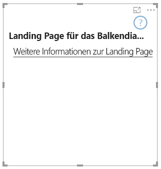

# <a name="landing-page"></a>Landing Page

Mit API 2.3.0 können Sie dem Visual eine Landing Page hinzufügen. Dazu fügen Sie den Funktionen `supportsLandingPage` hinzu und legen dafür „true“ fest. Dadurch wird das Visual sogar initialisiert und aktualisiert, bevor Sie ihm Daten hinzufügen (d. h., es wird kein Wasserzeichen mehr angezeigt). So können Sie Ihre eigene Landing Page entwerfen und im Visual anzeigen lassen, solange es keine Daten enthält.

```typescript
export class BarChart implements IVisual {
    //...
    private element: HTMLElement;
    private isLandingPageOn: boolean;
    private LandingPageRemoved: boolean;
    private LandingPage: d3.Selection<any>;

    constructor(options: VisualConstructorOptions) {
            //...
            this.element = options.element;
            //...
    }

    public update(options: VisualUpdateOptions) {
    //...
        this.HandleLandingPage(options);
    }

    private HandleLandingPage(options: VisualUpdateOptions) {
        if(!options.dataViews || !options.dataViews.length) {
            if(!this.isLandingPageOn) {
                this.isLandingPageOn = true;
                const SampleLandingPage: Element = this.createSampleLandingPage(); //create a landing page
                this.element.appendChild(SampleLandingPage);
                this.LandingPage = d3.select(SampleLandingPage);
            }

        } else {
                if(this.isLandingPageOn && !this.LandingPageRemoved){
                    this.LandingPageRemoved = true;
                    this.LandingPage.remove();
                }
        }
    }
```

Beispiel


