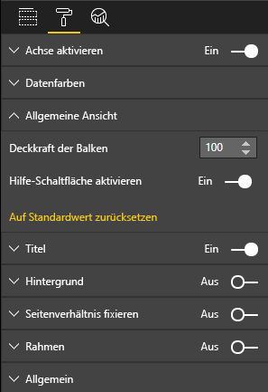

# <a name="launch-url"></a>Start-URL

Mit der Start-URL können Sie eine neue Browserregisterkarte (oder ein Fenster) öffnen, indem Sie tatsächliche Arbeit an Power BI delegieren.

## <a name="sample"></a>Beispiel

```typescript
   this.host.launchUrl('https://powerbi.microsoft.com');
```

## <a name="usage"></a>Verwendung

Verwenden Sie den API-Aufruf `host.launchUrl()`, wobei Sie Ihre Ziel-URL als Zeichenfolgenargument übergeben:

```typescript
this.host.launchUrl('http://some.link.net');
```

## <a name="restrictions"></a>Einschränkungen

* Verwenden Sie nur absolute, aber keine relativen Pfade. `http://some.link.net/subfolder/page.html` ist ein korrekter Pfad, während `/page.html` nicht geöffnet wird.
* Derzeit werden nur das `http`-Protokoll und das `https`-Protokoll unterstützt. Vermeiden Sie `ftp`, `mailto` usw.

## <a name="best-practices"></a>Bewährte Methoden

1. In den meisten Fällen empfiehlt es sich, einen Link nur als Reaktion auf die explizite Aktion eines Benutzers zu öffnen. Für den Benutzer sollte leicht erkennbar sein, dass durch das Klicken auf den Link oder die Schaltfläche eine neue Registerkarte geöffnet wird. Wenn ein `launchUrl()`-Aufruf ohne Benutzeraktion oder als Nebeneffekt einer anderen Aktion ausgelöst wird, kann dies verwirrend oder frustrierend für den Benutzer sein.
2. Wenn der Link für die ordnungsgemäße Funktionsweise des Visuals nicht wichtig ist, wird empfohlen, dem Berichtsautor eine Möglichkeit zum Deaktivieren und Ausblenden des Links anzubieten. Dies gilt besonders für bestimmte Power BI-Anwendungsfälle wie das Einbetten eines Berichts in eine Drittanbieteranwendung oder dessen Veröffentlichung im Web.
3. Vermeiden Sie es, einen `launchUrl()`-Aufruf aus einer Schleife, der `update`-Funktion des Visuals oder sonstigem häufig wiederkehrenden Code heraus aufzurufen.

## <a name="step-by-step-example"></a>Schritt-für-Schritt-Beispiel

### <a name="adding-a-link-launching-element"></a>Hinzufügen eines „Start-Link“-Elements

Die folgenden Zeilen wurden der `constructor`-Funktion des Visuals hinzugefügt:

```typescript
    this.helpLinkElement = this.createHelpLinkElement();
    options.element.appendChild(this.helpLinkElement);
```

Außerdem wurde eine private Funktion zum Erstellen und Anfügen des Anchor-Elements hinzugefügt:

```typescript
private createHelpLinkElement(): Element {
    let linkElement = document.createElement("a");
    linkElement.textContent = "?";
    linkElement.setAttribute("title", "Open documentation");
    linkElement.setAttribute("class", "helpLink");
    linkElement.addEventListener("click", () => {
        this.host.launchUrl("https://docs.microsoft.com/power-bi/developer/custom-visual-develop-tutorial");
    });
    return linkElement;
};
```

Zuletzt wird der Stil des Link-Elements durch einen Eintrag in der Datei „visual.less“ definiert:

```less
.helpLink {
    position: absolute;
    top: 0px;
    right: 12px;
    display: block;
    width: 20px;
    height: 20px;
    border: 2px solid #80B0E0;
    border-radius: 20px;
    color: #80B0E0;
    text-align: center;
    font-size: 16px;
    line-height: 20px;
    background-color: #FFFFFF;
    transition: all 900ms ease;

    &:hover {
        background-color: #DDEEFF;
        color: #5080B0;
        border-color: #5080B0;
        transition: all 250ms ease;
    }

    &.hidden {
        display: none;
    }
}
```

### <a name="adding-a-toggling-mechanism"></a>Hinzufügen eines Mechanismus zum Ein-/Ausblenden

Zu diesem Zweck muss ein statisches Objekt (siehe das [Tutorial für statische Objekte](https://microsoft.github.io/PowerBI-visuals/docs/concepts/objects-and-properties)) hinzugefügt werden, damit der Berichtsautor die Sichtbarkeit des Link-Elements ein- bzw. ausschalten kann (standardmäßig ist das Element ausgeblendet).
Ein `showHelpLink` statisches Bool-Objekt wurde dem `capabilities.json`-Objekteintrag hinzugefügt:

```typescript
"objects": {
    "generalView": {
            "displayName": "General View",
            "properties":
                "showHelpLink": {
                    "displayName": "Show Help Button",
                    "type": {
                        "bool": true
                    }
                }
            }
        }
    }
```



Außerdem wurden der `update`-Funktion des Visuals die folgenden Zeilen hinzugefügt:

```typescript
if (settings.generalView.showHelpLink) {
    this.helpLinkElement.classList.remove("hidden");
} else {
    this.helpLinkElement.classList.add("hidden");
}
```

Die `hidden`-Klasse wurde in „visual.less“ definiert, um die Anzeige des Elements zu steuern.
