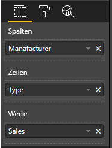

# <a name="add-interactivity-into-visual-by-power-bi-visuals-selections"></a>Hinzufügen von Interaktivität zu Visuals mithilfe von Auswahlmöglichkeiten für Power BI-Visuals

Power BI bietet zwei Möglichkeiten der Interaktion mit Visuals: Auswahl und Filterung. Im folgenden Beispiel wird veranschaulicht, wie Sie beliebige Elemente in einem Visual auswählen und andere Visuals im Bericht über den neuen Auswahlzustand informieren.

Das `Selection`-Objekt entspricht der folgenden Schnittstelle:

```typescript
export interface ISelectionId {
    equals(other: ISelectionId): boolean;
    includes(other: ISelectionId, ignoreHighlight?: boolean): boolean;
    getKey(): string;
    getSelector(): Selector;
    getSelectorsByColumn(): SelectorsByColumn;
    hasIdentity(): boolean;
}
```

## <a name="how-to-use-selectionmanager-to-select-data-points"></a>Verwenden von SelectionManager zum Auswählen von Datenpunkten

Das Visual-Hostobjekt stellt eine Methode zum Erstellen einer Instanz des Auswahl-Managers bereit. Der Auswahl-Manager ist für die Auswahl, die Aufhebung der Auswahl, die Darstellung des Kontextmenüs, das Speichern der Inhaltsauswahl und das Prüfen des Auswahlstatus zuständig. Der Auswahl-Manager verfügt über die entsprechenden Methoden für diese Aktionen.

### <a name="create-an-instance-of-the-selection-manager"></a>Erstellen einer Instanz des Auswahl-Managers

Um den Auswahl-Manager zu verwenden, müssen Sie eine Instanz des Auswahl-Managers erstellen. Normalerweise erstellen Visuals eine Instanz des Auswahl-Managers im `constructor` des Visual-Objekts.

```typescript
export class Visual implements IVisual {
    private target: HTMLElement;
    private host: IVisualHost;
    private selectionManager: ISelectionManager;
    // ...
    constructor(options: VisualConstructorOptions) {
        this.host = options.host;
        // ...
        this.selectionManager = this.host.createSelectionManager();
    }
    // ...
}
```

### <a name="create-an-instance-of-the-selection-builder"></a>Erstellen einer Instanz des Auswahlgenerators

Nachdem die Instanz des Auswahl-Managers erstellt wurde, müssen Sie für jeden Datenpunkt im Visual `selections` erstellen. Das Visual-Hostobjekt stellt die `createSelectionIdBuilder`-Methode zum Erstellen der Auswahl für jeden Datenpunkt zur Verfügung. Diese Methode gibt eine Instanz des Objekts mit der-Schnittstelle `powerbi.visuals.ISelectionIdBuilder` zurück:

```typescript
export interface ISelectionIdBuilder {
    withCategory(categoryColumn: DataViewCategoryColumn, index: number): this;
    withSeries(seriesColumn: DataViewValueColumns, valueColumn: DataViewValueColumn | DataViewValueColumnGroup): this;
    withMeasure(measureId: string): this;
    withMatrixNode(matrixNode: DataViewMatrixNode, levels: DataViewHierarchyLevel[]): this;
    withTable(table: DataViewTable, rowIndex: number): this;
    createSelectionId(): ISelectionId;
}
```

Dieses Objekt verfügt über entsprechende Methoden zum Erstellen von `selections` für verschiedenen Zuordnungstypen der Datenansicht.

> [!NOTE]
> Die Methoden `withTable` und `withMatrixNode` wurden mit der API 2.5.0 der Power BI-Visuals eingeführt.
> Wenn Sie Auswahloptionen für Tabellen- oder Matrixzuordnungen der Datenansicht verwenden müssen, müssen Sie ein Update auf die API-Version 2.5.0 oder höher vornehmen.

### <a name="create-selections-for-categorical-data-view-mapping"></a>Erstellen von Auswahlmöglichkeiten für Kategoriezuordnungen der Datenansicht

Sehen wir uns an, wie Auswahloptionen in der Kategoriezuordnung der Datenansicht für ein Beispieldataset dargestellt werden:

| Hersteller | type | value |
| - | - | - |
| Chrysler | Kfz aus Inlandsfertigung | 28883 |
| Chrysler | LKW aus Inlandsfertigung | 117131 |
| Chrysler | Import-Kfz | 0 |
| Chrysler | Import-LKW | 6362 |
| Ford | Kfz aus Inlandsfertigung | 50032 |
| Ford | LKW aus Inlandsfertigung | 122446 |
| Ford | Import-Kfz | 0 |
| Ford | Import-LKW | 0 |
| GM | Kfz aus Inlandsfertigung | 65426 |
| GM | LKW aus Inlandsfertigung | 138122 |
| GM | Import-Kfz | 197 |
| GM | Import-LKW | 0 |
| Honda | Kfz aus Inlandsfertigung | 51450 |
| Honda | LKW aus Inlandsfertigung | 46115 |
| Honda | Import-Kfz | 2932 |
| Honda | Import-LKW | 0 |
| Nissan | Kfz aus Inlandsfertigung | 51476 |
| Nissan | LKW aus Inlandsfertigung | 47343 |
| Nissan | Import-Kfz | 5485 |
| Nissan | Import-LKW | 1430 |
| Toyota | Kfz aus Inlandsfertigung | 55643 |
| Toyota | LKW aus Inlandsfertigung | 61227 |
| Toyota | Import-Kfz | 20799 |
| Toyota | Import-LKW | 23614 |

Und das Visual verwendet die folgende Zuordnung der Datenansicht:

```json
{
    "dataRoles": [
        {
            "displayName": "Columns",
            "name": "columns",
            "kind": "Grouping"
        },
        {
            "displayName": "Rows",
            "name": "rows",
            "kind": "Grouping"
        },
        {
            "displayName": "Values",
            "name": "values",
            "kind": "Measure"
        }
    ],
    "dataViewMappings": [
        {
            "categorical": {
                "categories": {
                    "for": {
                        "in": "columns"
                    }
                },
                "values": {
                    "group": {
                        "by": "rows",
                        "select": [
                            {
                                "for": {
                                    "in": "values"
                                }
                            }
                        ]
                    }
                }
            }
        }
    ]
}
```

Im Beispiel ist `Manufacturer``columns` und `Type``rows` zugeordnet. Es gibt eine Datenreihe, die durch Gruppieren von Werten nach `rows` (`Type`) erstellt wird.

Und ein Visual sollte auch in der Lage sein, einen Datenschnitt für `Manufacturer` und `Type` auszuführen.

Wenn der Benutzer beispielsweise `Chrysler` als `Manufacturer` auswählt, sollten die anderen Visuals folgende Daten anzeigen:

| Hersteller | type | value |
| - | - | - |
| **Chrysler** | Kfz aus Inlandsfertigung | 28883 |
| **Chrysler** | LKW aus Inlandsfertigung | 117131 |
| **Chrysler** | Import-Kfz | 0 |
| **Chrysler** | Import-LKW | 6362 |

Wenn der Benutzer `Import Car` nach `Type` (wählt Daten nach Reihe aus) auswählt, sollten die anderen Visuals folgende Daten anzeigen:

| Hersteller | type | value |
| - | - | - |
| Chrysler | **Import-Kfz** | 0 |
| Ford | **Import-Kfz** | 0 |
| GM | **Import-Kfz** | 197 |
| Honda | **Import-Kfz** | 2932 |
| Nissan | **Import-Kfz** | 5485 |
| Toyota | **Import-Kfz** | 20799 |


Die Data Baskets des Visuals müssen gefüllt werden.



Es gibt `Manufacturer` als Kategorie (Spalten), `Type` als Datenreihe (Zeilen) und `Value` als `Values` für Datenreihen.

> [!NOTE]
> Die `Values` sind für Datenreihen erforderlich, da das Visual gemäß der Datenzuordnung erwartet, dass `Values` nach `Rows`-Daten gruppiert sind.

#### <a name="create-selections-for-categories"></a>Erstellen von Auswahlen für Kategorien

```typescript
// categories
const categories = dataView.categorical.categories;

// create label for 'Manufacturer' column
const p = document.createElement("p") as HTMLParagraphElement;
p.innerText = categories[0].source.displayName.toString();
this.target.appendChild(p);

// get count of category elements
const categoriesCount = categories[0].values.length;

// iterate all categories to generate selection and create button elements to use selections
for (let categoryIndex = 0; categoryIndex < categoriesCount; categoryIndex++) {
    const categoryValue: powerbi.PrimitiveValue = categories[0].values[categoryIndex];

    const categorySelectionId = this.host.createSelectionIdBuilder()
        .withCategory(categories[0], categoryIndex) // we have only one category (only one `Manufacturer` column)
        .createSelectionId();
    this.dataPoints.push({
        value: categoryValue,
        selection: categorySelectionId
    });
    console.log(categorySelectionId);

    // create button element to apply selection on click
    const button = document.createElement("button") as HTMLButtonElement;
    button.value = categoryValue.toString();
    button.innerText = categoryValue.toString();
    button.addEventListener("click", () => {
        // handle click event to apply correspond selection
        this.selectionManager.select(categorySelectionId);
    });
    this.target.appendChild(button);
}
```

Im Beispielcode können Sie sehen, dass alle Kategorien durchlaufen werden. Bei jedem Durchgang wird `createSelectionIdBuilder` aufgerufen, um die nächste Auswahl für jede Kategorie zu erstellen, indem die `withCategory`-Methode des Auswahlgenerators aufgerufen wird. Die Methode `createSelectionId` wird als abschließende Methode zur Rückgabe des generierten `selection`-Objekts verwendet.

In der `withCategory`-Methode übergeben wir die Spalte der `category`; in diesem Beispiel sind das `Manufacturer` und der Index des Kategorieelements.

#### <a name="create-selections-for-series"></a>Erstellen von Auswahlen für Datenreihen

```typescript
// get groupped values for series
const series: powerbi.DataViewValueColumnGroup[] = dataView.categorical.values.grouped();

// create label for 'Type' column
const p2 = document.createElement("p") as HTMLParagraphElement;
p2.innerText = dataView.categorical.values.source.displayName;
this.target.appendChild(p2);

// iterate all series to generate selection and create button elements to use selections
series.forEach( (ser: powerbi.DataViewValueColumnGroup) => {
    // create selection id for series
    const seriesSelectionId = this.host.createSelectionIdBuilder()
        .withSeries(dataView.categorical.values, ser)
        .createSelectionId();

    this.dataPoints.push({
        value: ser.name,
        selection: seriesSelectionId
    });

    // create button element to apply selection on click
    const button = document.createElement("button") as HTMLButtonElement;
    button.value =ser.name.toString();
    button.innerText = ser.name.toString();
    button.addEventListener("click", () => {
        // handle click event to apply correspond selection
        this.selectionManager.select(seriesSelectionId);
    });
    this.target.appendChild(button);
});
```

### <a name="create-selections-for-table-data-view-mapping"></a>Erstellen von Auswahloptionen für die Zuordnungen der Tabellendatenansicht

Beispiel für die Zuordnung von Tabellendatenansichten

```json
{
    "dataRoles": [
        {
            "displayName": "Values",
            "name": "values",
            "kind": "GroupingOrMeasure"
        }
    ],
    "dataViewMappings": [
        {
            "table": {
                "rows": {
                    "for": {
                        "in": "values"
                    }
                }
            }
        }
    ]
}
```

Zum Erstellen einer Auswahl für jede Zeile der Zuordnung der Tabellendatenansicht müssen Sie die Methode `withTable` des Auswahlgenerators aufrufen.

```typescript
public update(options: VisualUpdateOptions) {
    const dataView = options.dataViews[0];
    dataView.table.rows.forEach((row: DataViewTableRow, rowIndex: number) => {
        this.target.appendChild(rowDiv);
        const selection: ISelectionId = this.host.createSelectionIdBuilder()
            .withTable(dataView.table, rowIndex)
            .createSelectionId();
    }
}
```

Der Code des Visuals durchläuft die Zeilen der Tabelle und ruft für jede Zeile die Tabellenmethode `withTable` auf. Die Parameter `withTable`-Methode sind das `table`-Objekt und der Index der Tabellenzeile.

### <a name="create-selections-for-matrix-data-view-mapping"></a>Erstellen von Auswahloptionen für die Zuordnungen der Matrixdatenansicht

```typescript
public update(options: VisualUpdateOptions) {
    const host = this.host;
    const rowLevels: powerbi.DataViewHierarchyLevel[] = dataView.matrix.rows.levels;
    const columnLevels: powerbi.DataViewHierarchyLevel[] = dataView.matrix.rows.levels;

    // iterate rows hierarchy
    nodeWalker(dataView.matrix.rows.root, rowLevels);
    // iterate columns hierarchy
    nodeWalker(dataView.matrix.columns.root, columnLevels);

    function nodeWalker(node: powerbi.DataViewMatrixNode, levels: powerbi.DataViewHierarchyLevel[]) {
        const nodeSelection = host.createSelectionIdBuilder().withMatrixNode(node, levels);

        if (node.children && node.children.length) {
            node.children.forEach(child => {
                nodeWalker(child, levels);
            });
        }
    }
}
```

Im Beispiel wird `nodeWalker` rekursiv für jeden Knoten und Unterknoten aufgerufen.

`nodeWalker` erstellt bei jedem Aufruf ein `nodeSelection`-Objekt. Und jede `nodeSelection` stellt eine `selection` der entsprechenden Knoten dar.

## <a name="select-datapoints-to-slice-other-visuals"></a>Auswählen von Datenpunkten zum Erstellen von Datenschnitten für andere Visuals

Am Beispielcode der Auswahlen für die Kategoriezuordnung der Datenansicht ließ sich ablesen, dass für die Schaltflächenelemente Klickhandler erstellt wurden. Der Handler ruft die `select`-Methode des Auswahl-Managers auf und übergibt ihr das Auswahlobjekt.

```typescript
button.addEventListener("click", () => {
    // handle click event to apply correspond selection
    this.selectionManager.select(categorySelectionId);
});
```

Die Schnittstelle der `select`-Methode ist

```typescript
interface ISelectionManager {
    // ...
    select(selectionId: ISelectionId | ISelectionId[], multiSelect?: boolean): IPromise<ISelectionId[]>;
    // ...
}
```

Sie können sehen, dass `select` ein Array von Auswahlen akzeptieren kann. Das bedeutet, dass Ihr Visual mehrere Datenpunkte auswählen kann. Der zweite Parameter, `multiSelect`, ist für die Mehrfachauswahl zuständig. Wenn der Wert true ist, löscht Power BI den vorherigen Auswahlzustand nicht und übernimmt die aktuelle Auswahl; andernfalls wird die vorherige Auswahl zurückgesetzt.

Das typische Szenario für die Verwendung von `multiSelect` zur Verarbeitung des Zustands der STRG-Taste bei On-Click-Ereignissen

```typescript
button.addEventListener("click", (mouseEvent) => {
    const multiSelect = (mouseEvent as MouseEvent).ctrlKey;
    this.selectionManager.select(seriesSelectionId, multiSelect);
});
```

## <a name="next-steps"></a>Nächste Schritte

* [Erfahren Sie, wie Sie die Auswahl für das Binden von Visualeigenschaften an Datenpunkte verwenden](objects-properties.md#objects-selector)

* [Verarbeiten von Auswahlmöglichkeiten bei wechselnden Lesezeichen](bookmarks-support.md#visuals-with-selection)

* [Hinzufügen des Kontextmenüs für Datenpunkte von Visuals](context-menu.md)

* [Verwenden der InteractivityUtils zum Hinzufügen von Auswahlmöglichkeiten für Power BI-Visuals](utils-interactivity-selections.md).
