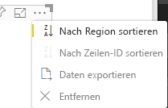

# <a name="sorting-options-for-power-bi-visuals"></a>Sortieroptionen für Power Bi-Visuals

In diesem Artikel wird beschrieben, wie *Sortieroptionen* das Sortierverhalten für Power BI-Visuals festlegen. 

Die Sortierfunktion erfordert einen der folgenden Parameter.

## <a name="default-sorting"></a>Standardsortierung

Die `default`-Option ist die einfachste Form. Sie ermöglicht es, die im DataMappings-Abschnitt dargestellten Daten zu sortieren. Durch diese Option kann der Benutzer Datenzuordnungen sortieren und die Sortierrichtung angeben.

```json
    "sorting": {
        "default": {   }
    }
```



## <a name="implicit-sorting"></a>Implizite Sortierung

Beim impliziten Sortieren wird die Sortierung mit dem Arrayparameter `clauses` ausgeführt, der die Sortierung für jede Datenrolle beschreibt. `implicit` bedeutet, dass die Sortierreihenfolge vom Benutzer des Visuals nicht geändert werden kann. In Power BI werden keine Sortieroptionen im Menü des Visuals angezeigt. Allerdings werden Daten von Power BI gemäß den festgelegten Einstellungen sortiert.

`clauses`-Parameter können mehrere Objekte mit zwei Parametern enthalten:

- `role`: Bestimmt `DataMapping` für die Sortierung
- `direction`: Bestimmt die Sortierrichtung (1 = aufsteigend, 2 = absteigend)

```json
    "sorting": {
        "implicit": {
            "clauses": [
                {
                    "role": "category",
                    "direction": 1
                },
                {
                    "role": "measure",
                    "direction": 2
                }
            ]
        }
    }
```

## <a name="custom-sorting"></a>Benutzerdefinierte Sortierung

Benutzerdefinierte Sortierung bedeutet, dass die Sortierung vom Entwickler im Code des Visuals verwaltet wird.
