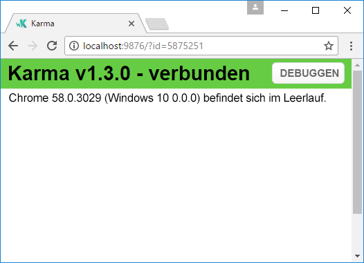
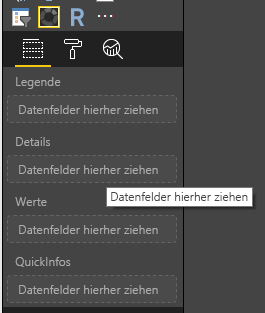
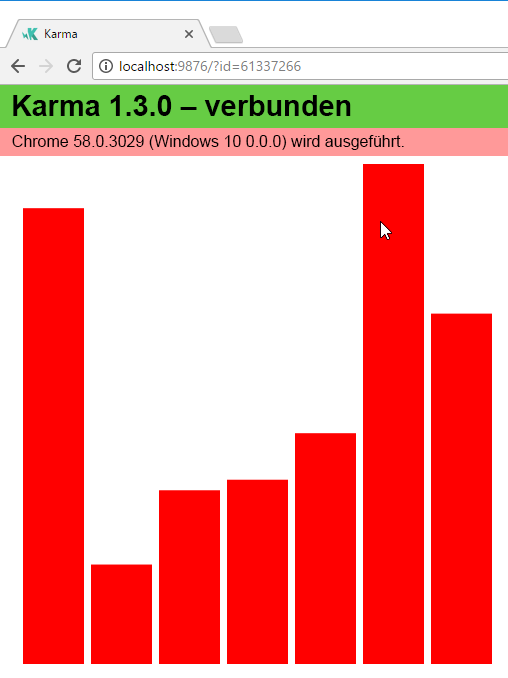
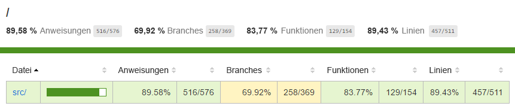
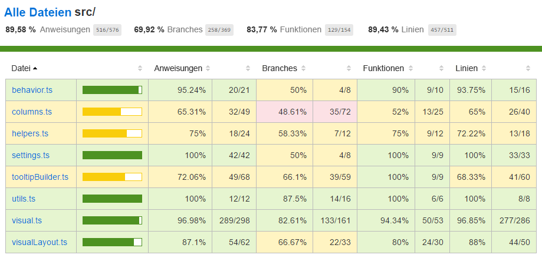

# <a name="tutorial-add-unit-tests-for-power-bi-visual-projects"></a>Tutorial: Hinzufügen von Komponententests zu Power BI-Visualprojekten

In diesem Tutorial werden die Grundlagen zum Schreiben von Komponententests für Power BI-Visuals beschrieben.

Die Themen in diesem Tutorial:

* Verwenden von Test Runner „karma.js“ und Testframework „jasmine.js“
* Verwenden des powerbi-visuals-utils-testutils-Pakets
* Festlegen von Simulationen für einfachere Komponententests in Power BI-Visuals

## <a name="prerequisites"></a>Voraussetzungen

* Sie verfügen über ein Power BI-Visualprojekt.
* Die Node.us-Umgebung wurde konfiguriert.

## <a name="install-and-configure-karmajs-and-jasmine"></a>„karma.js“ und „jasmine.js“ wurden installiert und konfiguriert.

Fügen Sie „package.json“ die erforderlichen Bibliotheken im `devDependencies`-Abschnitt hinzu:

```json
"@babel/polyfill": "^7.2.5",
"@types/d3": "5.5.0",
"@types/jasmine": "2.5.37",
"@types/jasmine-jquery": "1.5.28",
"@types/jquery": "2.0.41",
"@types/karma": "3.0.0",
"@types/lodash-es": "4.17.1",
"coveralls": "3.0.2",
"istanbul-instrumenter-loader": "^3.0.1",
"jasmine": "2.5.2",
"jasmine-core": "2.5.2",
"jasmine-jquery": "2.1.1",
"jquery": "3.1.1",
"karma": "3.1.1",
"karma-chrome-launcher": "2.2.0",
"karma-coverage": "1.1.2",
"karma-coverage-istanbul-reporter": "^2.0.4",
"karma-jasmine": "2.0.1",
"karma-junit-reporter": "^1.2.0",
"karma-sourcemap-loader": "^0.3.7",
"karma-typescript": "^3.0.13",
"karma-typescript-preprocessor": "0.4.0",
"karma-webpack": "3.0.5",
"puppeteer": "1.17.0",
"style-loader": "0.23.1",
"ts-loader": "5.3.0",
"ts-node": "7.0.1",
"tslint": "^5.12.0",
"webpack": "4.26.0"
```

In der folgenden Beschreibung erhalten Sie weitere Informationen zum Paket.

Speichern Sie `package.json`, und führen Sie das Element an der Befehlszeile in `package.json` aus:

```cmd
npm install
```

Vom Paket-Manager werden alle neuen Pakete installiert, die `package.json` hinzugefügt wurden.

Zum Ausführen der Komponententests müssen Sie den Test Runner und `webpack`.config konfigurieren. Beispiel der CONFIG-Datei

Beispiel von `test.webpack.config.js`:

```typescript
const path = require('path');
const webpack = require("webpack");

module.exports = {
    devtool: 'source-map',
    mode: 'development',
    optimization : {
        concatenateModules: false,
        minimize: false
    },
    module: {
        rules: [
            {
                test: /\.tsx?$/,
                use: 'ts-loader',
                exclude: /node_modules/
            },
            {
                test: /\.json$/,
                loader: 'json-loader'
            },
            {
                test: /\.tsx?$/i,
                enforce: 'post',
                include: /(src)/,
                exclude: /(node_modules|resources\/js\/vendor)/,
                loader: 'istanbul-instrumenter-loader',
                options: { esModules: true }
            },
            {
                test: /\.less$/,
                use: [
                    {
                        loader: 'style-loader'
                    },
                    {
                        loader: 'css-loader'
                    },
                    {
                        loader: 'less-loader',
                        options: {
                            paths: [path.resolve(__dirname, 'node_modules')]
                        }
                    }
                ]
            }
        ]
    },
    externals: {
        "powerbi-visuals-api": '{}'
    },
    resolve: {
        extensions: ['.tsx', '.ts', '.js', '.css']
    },
    output: {
        path: path.resolve(__dirname, ".tmp/test")
    },
    plugins: [
        new webpack.ProvidePlugin({
            'powerbi-visuals-api': null
        })
    ]
};
```

Beispiel von `karma.conf.ts`

```typescript
"use strict";

const webpackConfig = require("./test.webpack.config.js");
const tsconfig = require("./test.tsconfig.json");
const path = require("path");

const testRecursivePath = "test/visualTest.ts";
const srcOriginalRecursivePath = "src/**/*.ts";
const coverageFolder = "coverage";

process.env.CHROME_BIN = require("puppeteer").executablePath();

import { Config, ConfigOptions } from "karma";

module.exports = (config: Config) => {
    config.set(<ConfigOptions>{
        mode: "development",
        browserNoActivityTimeout: 100000,
        browsers: ["ChromeHeadless"], // or Chrome to use locally installed Chrome browser
        colors: true,
        frameworks: ["jasmine"],
        reporters: [
            "progress",
            "junit",
            "coverage-istanbul"
        ],
        junitReporter: {
            outputDir: path.join(__dirname, coverageFolder),
            outputFile: "TESTS-report.xml",
            useBrowserName: false
        },
        singleRun: true,
        plugins: [
            "karma-coverage",
            "karma-typescript",
            "karma-webpack",
            "karma-jasmine",
            "karma-sourcemap-loader",
            "karma-chrome-launcher",
            "karma-junit-reporter",
            "karma-coverage-istanbul-reporter"
        ],
        files: [
            "node_modules/jquery/dist/jquery.min.js",
            "node_modules/jasmine-jquery/lib/jasmine-jquery.js",
            {
                pattern: './capabilities.json',
                watched: false,
                served: true,
                included: false
            },
            testRecursivePath,
            {
                pattern: srcOriginalRecursivePath,
                included: false,
                served: true
            }
        ],
        preprocessors: {
            [testRecursivePath]: ["webpack", "coverage"]
        },
        typescriptPreprocessor: {
            options: tsconfig.compilerOptions
        },
        coverageIstanbulReporter: {
            reports: ["html", "lcovonly", "text-summary", "cobertura"],
            dir: path.join(__dirname, coverageFolder),
            'report-config': {
                html: {
                    subdir: 'html-report'
                }
            },
            combineBrowserReports: true,
            fixWebpackSourcePaths: true,
            verbose: false
        },
        coverageReporter: {
            dir: path.join(__dirname, coverageFolder),
            reporters: [
                // reporters not supporting the `file` property
                { type: 'html', subdir: 'html-report' },
                { type: 'lcov', subdir: 'lcov' },
                // reporters supporting the `file` property, use `subdir` to directly
                // output them in the `dir` directory
                { type: 'cobertura', subdir: '.', file: 'cobertura-coverage.xml' },
                { type: 'lcovonly', subdir: '.', file: 'report-lcovonly.txt' },
                { type: 'text-summary', subdir: '.', file: 'text-summary.txt' },
            ]
        },
        mime: {
            "text/x-typescript": ["ts", "tsx"]
        },
        webpack: webpackConfig,
        webpackMiddleware: {
            stats: "errors-only"
        }
    });
};
```

Sie können diese Konfiguration bei Bedarf ändern.

Einige Einstellungen von `karma.conf.js`:

* Durch die `recursivePathToTests`-Variable wird der Speicherort von Testcode ermittelt.

* Durch die `srcRecursivePath`-Variable wird der JS-Ausgabecode nach der Kompilierung ermittelt.

* Durch die `srcCssRecursivePath`-Variable wird der CSS-Ausgabecode nach der Kompilierung ermittelt (ohne Formatdatei).

* Durch die `srcOriginalRecursivePath`-Variable wird der Quellcode des Visuals ermittelt.

* Durch die `coverageFolder`-Variable wird der Ort ermittelt, an dem der Code Coverage-Bericht erstellt wird.

Einige Eigenschaften der CONFIG-Datei:

* `singleRun: true` – Der Test wird für das CI-System ausgeführt. Ein einzelner Durchgang genügt.
Sie können zu `false` wechseln, um die Tests zu debuggen. Der Browser wird von Karma weiterhin ausgeführt, sodass Sie die Konsole zum Debuggen verwenden können.

* `files: [...]` – In diesem Array können Sie Dateien festlegen, die in den Browser geladen werden.
Normalerweise handelt es sich um Quelldateien, Testfälle, Bibliotheken (Jasmine, Testhilfsprogramme). Sie können der Liste bei Bedarf weitere Dateien hinzufügen.

* `preprocessors` – In diesem Abschnitt der CONFIG-Datei konfigurieren Sie Aktionen, die vor den Komponententests ausgeführt werden. Dazu gehören die Vorkompilierung von TypeScript in JS, die Vorbereitung von Quellzuordnungsdateien und die Generierung des Code Coverage-Berichts. Sie können `coverage` deaktivieren, um die Tests zu debuggen. Durch „coverage“ wird zusätzlicher Coverage-Testcode generiert, wodurch das Debuggen von Tests erschwert wird.

**Beschreibung aller Konfigurationen, die Sie in der [Dokumentation](https://karma-runner.github.io/1.0/config/configuration-file.html) zu „Karma.js“ finden**

Zur Vereinfachung können Sie `scripts` den Testbefehl hinzufügen:

```json
{
    "scripts": {
        "pbiviz": "pbiviz",
        "start": "pbiviz start",
        "typings":"node node_modules/typings/dist/bin.js i",
        "lint": "tslint -r \"node_modules/tslint-microsoft-contrib\"  \"+(src|test)/**/*.ts\"",
        "pretest": "pbiviz package --resources --no-minify --no-pbiviz --no-plugin",
        "test": "karma start"
    }
    ...
}
```

Nun können Sie mit dem Schreiben von Komponententests beginnen.

## <a name="simple-unit-test-for-check-dom-element-of-the-visual"></a>Einfacher Komponententest zur Überprüfung des DOM-Elements des Visuals

Zu Testzwecken muss eine Instanz des Visuals erstellt werden.

### <a name="creating-visual-instance-builder"></a>Erstellen des Visualinstanz-Builders

Fügen Sie die Datei `visualBuilder.ts` dem Ordner `test` mit folgendem Code hinzu:

```typescript
import {
    VisualBuilderBase
} from "powerbi-visuals-utils-testutils";

import {
    BarChart as VisualClass
} from "../src/visual";

import  powerbi from "powerbi-visuals-api";
import VisualConstructorOptions = powerbi.extensibility.visual.VisualConstructorOptions;

export class BarChartBuilder extends VisualBuilderBase<VisualClass> {
    constructor(width: number, height: number) {
        super(width, height);
    }

    protected build(options: VisualConstructorOptions) {
        return new VisualClass(options);
    }

    public get mainElement() {
        return this.element.children("svg.barChart");
    }
}
```

Es gibt eine `build`-Methode, mit der Sie eine Instanz des Visuals erstellen können. `mainElement` ist eine get-Methode, die eine Instanz des DOM-Stammelements im Visual zurückgibt. Der Getter ist optional, erleichtert jedoch das Schreiben von Komponententests.

Der Builder für die Visualinstanz ist nun erstellt. Als Nächstes schreiben Sie den Testfall. Durch den Testfall werden die SVG-Elemente überprüft, die bei der Anzeige des Visuals erstellt werden.

### <a name="creating-typescript-file-to-write-test-cases"></a>Erstellen einer TypeScript-Datei zum Schreiben von Testfällen

Fügen Sie die Datei `visualTest.ts` für Testfälle mit folgendem Code hinzu:

```typescript
import powerbi from "powerbi-visuals-api";

import { BarChartBuilder } from "./VisualBuilder";

import {
    BarChart as VisualClass
} from "../src/visual";

import VisualBuilder = powerbi.extensibility.visual.test.BarChartBuilder;

describe("BarChart", () => {
    let visualBuilder: VisualBuilder;
    let dataView: DataView;

    beforeEach(() => {
        visualBuilder = new VisualBuilder(500, 500);
    });

    it("root DOM element is created", () => {
        expect(visualBuilder.mainElement).toBeInDOM();
    });
});
```

Es werden mehrere Methoden aufgerufen.

* Durch die [`describe`](https://jasmine.github.io/api/2.6/global.html#describe)-Methode wird der Testfall beschrieben. Im Kontext eines Jasmine-Frameworks wird häufig eine Gruppe von Spezifikationen aufgerufen.

* Die `beforeEach`-Methode wird jeweils vor dem Aufruf der `it`-Methode aufgerufen, die innerhalb der [`describe`](https://jasmine.github.io/api/2.6/global.html#beforeEach)-Methode definiert ist.

* Durch `it` wird eine einzelne Spezifikation definiert. Die [`it`](https://jasmine.github.io/api/2.6/global.html#it)-Methode sollte mindestens ein `expectations`-Element enthalten.

* Durch die [`expect`](https://jasmine.github.io/api/2.6/global.html#expect)-Methode wird eine Erwartung für eine Spezifikation erstellt. Eine Spezifikation ist erfolgreich, wenn alle Erwartungen ohne Fehler erfüllt sind.

* `toBeInDOM` ist eine der Matcher-Methoden. Weitere Informationen zu vorhandenen Matcher-Methoden finden Sie in der [Dokumentation](https://jasmine.github.io/api/2.6/matchers.html) zum Jasmine-Framework.

**Weitere Informationen zum Jasmine-Framework finden Sie in der offiziellen [Dokumentation](https://jasmine.github.io/).**

Anschließend können Sie den Komponententest ausführen, indem Sie einen Befehl in das Befehlszeilentool eingeben.

Mit diesem Test wird überprüft, ob das SVG-Stammelement der Visuals erstellt wird.

### <a name="launch-unit-tests"></a>Starten von Komponententests

Zum Ausführen des Komponententests können Sie den folgenden Befehl im Befehlszeilentool eingeben.

```cmd
npm run test
```

Durch `karma.js` wird der Testfall im Chrome-Browser ausgeführt.



> [!NOTE]
> Google Chrome muss lokal installiert sein.

In der Befehlszeile erhalten Sie folgende Ausgabe:

```cmd
> karma start

23 05 2017 12:24:26.842:WARN [watcher]: Pattern "E:/WORKSPACE/PowerBI/PowerBI-visuals-sampleBarChart/data/*.csv" does not match any file.
23 05 2017 12:24:30.836:WARN [karma]: No captured browser, open http://localhost:9876/
23 05 2017 12:24:30.849:INFO [karma]: Karma v1.3.0 server started at http://localhost:9876/
23 05 2017 12:24:30.850:INFO [launcher]: Launching browser Chrome with unlimited concurrency
23 05 2017 12:24:31.059:INFO [launcher]: Starting browser Chrome
23 05 2017 12:24:33.160:INFO [Chrome 58.0.3029 (Windows 10 0.0.0)]: Connected on socket /#2meR6hjXFmsE_fjiAAAA with id 5875251
Chrome 58.0.3029 (Windows 10 0.0.0): Executed 1 of 1 SUCCESS (0.194 secs / 0.011 secs)

=============================== Coverage summary ===============================
Statements   : 27.43% ( 65/237 )
Branches     : 19.84% ( 25/126 )
Functions    : 43.86% ( 25/57 )
Lines        : 20.85% ( 44/211 )
================================================================================
```

### <a name="how-to-add-static-data-for-unit-tests"></a>Hinzufügen statischer Daten zu Komponententests

Erstellen Sie die Datei `visualData.ts` im Ordner `test` mit folgendem Code:

```typescript
import powerbi from "powerbi-visuals-api";
import DataView = powerbi.DataView;

import {
    testDataViewBuilder,
    getRandomNumbers
} from "powerbi-visuals-utils-testutils";

export class SampleBarChartDataBuilder extends TestDataViewBuilder {
    public static CategoryColumn: string = "category";
    public static MeasureColumn: string = "measure";

    public constructor() {
        super();
        ...
    }

    public getDataView(columnNames?: string[]): DataView {
        let dateView: any = this.createCategoricalDataViewBuilder([
            ...
        ],
        [
            ...
        ], columnNames).build();

        // there's client side computed maxValue
        let maxLocal = 0;
        this.valuesMeasure.forEach((item) => {
                if (item > maxLocal) {
                    maxLocal = item;
                }
        });
        (<any>dataView).categorical.values[0].maxLocal = maxLocal;
    }
}
```

Durch die `SampleBarChartDataBuilder`-Klasse wird `TestDataViewBuilder` erweitert und die abstrakte Methode `getDataView` implementiert.

Wenn Sie Daten in Datenfeldbuckets eingeben, generiert Power BI ein `dataview`-Kategorieobjekt auf Grundlage der Daten.



In Komponententests stehen keine Power BI-Kernfunktionen für die Reproduktion zur Verfügung. Da Sie die statischen Daten jedoch dem `dataview`-Kategorieobjekt zuordnen müssen, werden Sie von der `TestDataViewBuilder`-Klasse dabei unterstützt.

[Weitere Informationen zu DataViewMapping](https://github.com/Microsoft/PowerBI-visuals/blob/master/Capabilities/DataViewMappings.md)

In der `getDataView`-Methode rufen Sie einfach die `createCategoricalDataViewBuilder`-Methode mit Ihren Daten auf.

Die Datei [capabilities.json](https://github.com/Microsoft/PowerBI-visuals-sampleBarChart/blob/master/capabilities.json#L2) des `sampleBarChart`-Visuals enthält das dataRoles-Objekt und das dataViewMapping-Objekt:

```json
"dataRoles": [
    {
        "displayName": "Category Data",
        "name": "category",
        "kind": "Grouping"
    },
    {
        "displayName": "Measure Data",
        "name": "measure",
        "kind": "Measure"
    }
],
"dataViewMappings": [
    {
        "conditions": [
            {
                "category": {
                    "max": 1
                },
                "measure": {
                    "max": 1
                }
            }
        ],
        "categorical": {
            "categories": {
                "for": {
                    "in": "category"
                }
            },
            "values": {
                "select": [
                    {
                        "bind": {
                            "to": "measure"
                        }
                    }
                ]
            }
        }
    }
],
```

Um die gleiche Zuordnung zu generieren, müssen Sie die folgenden Parameter auf die `createCategoricalDataViewBuilder`-Methode festlegen:

```typescript
([
    {
        source: {
            displayName: "Category",
            queryName: SampleBarChartData.ColumnCategory,
            type: ValueType.fromDescriptor({ text: true }),
            roles: {
                Category: true
            },
        },
        values: this.valuesCategory
    }
],
[
    {
        source: {
            displayName: "Measure",
            isMeasure: true,
            queryName: SampleBarChartData.MeasureColumn,
            type: ValueType.fromDescriptor({ numeric: true }),
            roles: {
                Measure: true
            },
        },
        values: this.valuesMeasure
    },
], columnNames)
```

Kategorien des `this.valuesCategory`-Arrays:

```ts
public valuesCategory: string[] = ["Monday", "Tuesday", "Wednesday", "Thursday", "Friday", "Saturday", "Sunday"];
```

Messwerte des `this.valuesMeasure`-Arrays für jede Kategorie. Beispiel:

```ts
public valuesMeasure: number[] = [742731.43, 162066.43, 283085.78, 300263.49, 376074.57, 814724.34, 570921.34];
```

Jetzt können Sie die `SampleBarChartDataBuilder`-Klasse im Komponententest verwenden.

Die `ValueType`-Klasse wird im `powerbi-visuals-utils-testutils`-Paket definiert. Darüber hinaus wird die `lodash`-Bibliothek von der `createCategoricalDataViewBuilder`-Methode benötigt.

Fügen Sie diese Pakete den Abhängigkeiten hinzu.

In `package.json` im Abschnitt `devDependencies`

```json
"lodash-es": "4.17.1",
"powerbi-visuals-utils-testutils": "2.2.0"
```

Aufruf

```cmd
npm install
```

zur Installation der `lodash-es`-Bibliothek

Nun können Sie den Komponententest erneut ausführen. Dabei müssen die die folgende Ausgabe erhalten:

```cmd
> karma start

23 05 2017 16:19:54.318:WARN [watcher]: Pattern "E:/WORKSPACE/PowerBI/PowerBI-visuals-sampleBarChart/data/*.csv" does not match any file.
23 05 2017 16:19:58.333:WARN [karma]: No captured browser, open http://localhost:9876/
23 05 2017 16:19:58.346:INFO [karma]: Karma v1.3.0 server started at http://localhost:9876/
23 05 2017 16:19:58.346:INFO [launcher]: Launching browser Chrome with unlimited concurrency
23 05 2017 16:19:58.394:INFO [launcher]: Starting browser Chrome
23 05 2017 16:19:59.873:INFO [Chrome 58.0.3029 (Windows 10 0.0.0)]: Connected on socket /#NcNTAGH9hWfGMCuEAAAA with id 3551106
Chrome 58.0.3029 (Windows 10 0.0.0): Executed 1 of 1 SUCCESS (1.266 secs / 1.052 secs)

=============================== Coverage summary ===============================
Statements   : 56.72% ( 135/238 )
Branches     : 32.54% ( 41/126 )
Functions    : 66.67% ( 38/57 )
Lines        : 52.83% ( 112/212 )
================================================================================
```

Außerdem muss der Chrome-Browser mit Ihrem Visual gestartet werden.



Beachten Sie die höhere Code Coverage in der Zusammenfassung. Öffnen Sie `coverage\index.html`, um mehr über die aktuelle Code Coverage zu erfahren.



Oder im Ordner `src`:



Auf der Ebene einzelner Dateien können Sie den Quellcode überprüfen. Durch die `Coverage`-Hilfsprogramme wird der Zeilenhintergrund rot hervorgehoben, falls der betreffende Code während der Komponententests nicht ausgeführt wurde.


> [!IMPORTANT]
> Code Coverage sagt jedoch noch nichts über eine gute Funktionsabdeckung des Visuals aus. Ein einfacher Komponententest ergab in `src\visual.ts` eine Abdeckung von über 96 %.

## <a name="next-steps"></a>Nächste Schritte

Sobald Ihr Visual fertig ist, können Sie es zur Veröffentlichung übermitteln.

[Weitere Informationen zur Veröffentlichung von Visuals in AppSource](../office-store.md)
