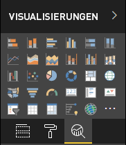

# <a name="power-bi-visual-project-structure"></a>Struktur von Visualprojekten in Power BI

Nach der Ausführung des neuen Ordners `<visual project name>` der pbiviz-Datei erstellt das Tool eine grundlegende Struktur der Dateien und Ordner im `<visual project name>`-Ordner.

## <a name="visual-project-structure"></a>Struktur von Visualprojekten


* `.vscode`: Dieser Ordner enthält Projekteinstellungen für VS Code. Bearbeiten Sie zum Konfigurieren des Arbeitsbereichs die `.vscode/settings.json`-Datei. Weitere Informationen zu den VS Code-Einstellungen finden Sie in der [Dokumentation](https://code.visualstudio.com/docs/getstarted/settings).

* `assets`: Dieser Ordner enthält nur die `icon.png`-Datei. Das Tool verwendet diese Datei als ein Symbol des Visuals im Visualisierungsbereich von Power BI.

    

* `node_modules`: Dieser Ordner enthält alle Pakete, [die vom Knotenpaket-Manager](https://docs.npmjs.com/files/folders.html) installiert werden.

* `src`: Dieser Ordner enthält den Quellcode des Visuals. Standardmäßig erstellt das Tool zwei Dateien:

  * `visual.ts`: Dies ist der Hauptquellcode des Visuals.

  * `settings.ts`: Dies ist der Einstellungscode für das Visual. Die Klassen in der Datei vereinfachen [die Arbeit mit Visualeigenschaften](./objects-properties.md#properties).

* `style`: Dieser Ordner enthält eine `visual.less`-Datei mit Formatvorlagen für das Visual.

* `capabilities.json`: Diese Datei enthält Haupteigenschaften und -einstellungen für das Visual. So wird dem Visual das Deklarieren von unterstützten Funktionen, Objekten, Eigenschaften und Zuordnungen von Datenansichten ermöglicht.

    Erfahren Sie mehr über [Funktionen und Eigenschaften von Power BI-Visuals](./capabilities.md).

* `package-lock.json`: Diese Datei wird automatisch für Vorgänge generiert, in der npm entweder die `node_modules`-Struktur oder die `package.json`-Datei ändert.

    [Weitere Informationen zur `package-lock.json`-Datei finden Sie in der offiziellen npm-Dokumentation](https://docs.npmjs.com/files/package-lock.json).

* `package.json`: Diese Datei beschreibt das Projektpaket. Diese enthält normalerweise Informationen zum Projekt, zu den Autoren, zur Beschreibung und zu den Abhängigkeiten des Projekts.

    [Weitere Informationen zur `package.json`-Datei finden Sie in der offiziellen npm-Dokumentation](https://docs.npmjs.com/files/package.json.html).

* `pbiviz.json`: Diese Datei enthält die Metadaten des Visuals. Geben Sie die Metadaten des Visuals in dieser Datei an.

    Der typische Inhalt der Datei:

  ```json
    {
        "visual": {
            "name": "<visual project name>",
            "displayName": "<visual project name>",
            "guid": "<visual project name>23D8B823CF134D3AA7CC0A5D63B20B7F",
            "visualClassName": "Visual",
            "version": "1.0.0",
            "description": "",
            "supportUrl": "",
            "gitHubUrl": ""
        },
        "apiVersion": "2.6.0",
        "author": { "name": "", "email": "" },
        "assets": { "icon": "assets/icon.png" },
        "externalJS": null,
        "style": "style/visual.less",
        "capabilities": "capabilities.json",
        "dependencies": null,
        "stringResources": []
    }
  ```

    Hierbei gilt:

  * `name` ist der interne Name des Visuals.

  * `displayName` ist der Name des Visuals in der Benutzeroberfläche von Power BI.

  * `guid` ist die eindeutige ID des Visuals.

  * `visualClassName` ist der Name der Hauptklasse des Visuals. Power BI erstellt die Instanz dieser Klasse, um mit der Verwendung des Visuals im Power BI-Bericht zu beginnen.

  * `version` ist die Versionsnummer des Visuals.

  * `author` enthält den Namen des Autors und die Kontakt-E-Mail-Adresse.

  * `icon` in `assets` ist der Pfad zum Dateisymbol für das Visual.

  * `externalJS` enthält Pfade für JS-Bibliotheken, die im Visual verwendet werden.

    > [!IMPORTANT]
    > Die neueste Version des Tools 3.x.x oder höher verwendet `externalJS` nicht mehr.

  * `style` ist der Pfad zu den Formatdateien.

  * `capabilities` ist der Pfad zur `capabilities.json`-Datei.

  * `dependencies` ist der Pfad zur `dependencies.json`-Datei. `dependencies.json` enthält Informationen über R-Pakete, die in R-basierten Visuals verwendet werden.

  * `stringResources` ist ein Array aus Pfaden zu den Dateien mit Lokalisierungen.

  Erfahren Sie mehr über die Lokalisierung in Visuals in dieser [Dokumentation](./localization.md).

* `tsconfig.json` ist die Konfigurationsdatei für TypeScript.

    Erfahren Sie mehr über die TypeScript-Konfiguration [in dieser offiziellen Dokumentation](https://www.typescriptlang.org/docs/handbook/tsconfig-json.html).

    Die `tsconfig.json`-Datei im `files`-Abschnitt muss den Pfad zur TS-Datei enthalten, in der sich die Hauptklasse des Visuals befindet, die in der `visualClassName`-Eigenschaft der `pbiviz.json`-Datei angegeben ist.

* Die `tslint.json`-Datei enthält die TSLint-Konfiguration.

    Erfahren Sie mehr über die TSLint-Konfiguration [in dieser offiziellen Dokumentation](https://palantir.github.io/tslint/usage/configuration/).

## <a name="next-steps"></a>Nächste Schritte

* Erfahren Sie mehr über [Power BI-Visualkonzepte](./power-bi-visuals-concept.md), um besser zu verstehen, wie Visual, Benutzer und Power BI miteinander interagieren.

* Beginnen Sie von Grund auf mit der Entwicklung Ihrer eigenen Power BI-Visuals mit der [ausführlichen Anleitung](./custom-visual-develop-tutorial.md).
