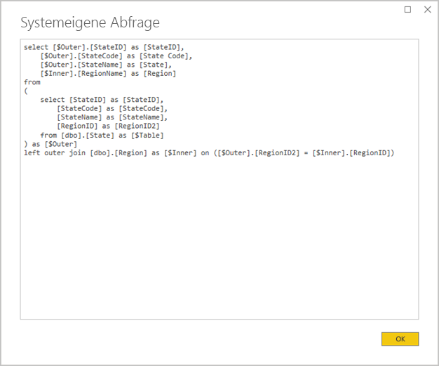
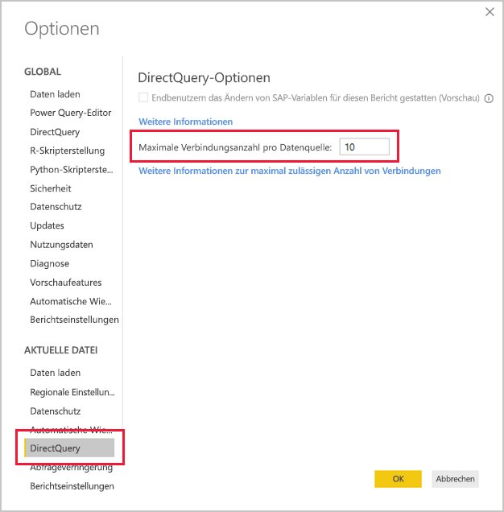

# <a name="directquery-model-guidance-in-power-bi-desktop"></a>Leitfaden für das DirectQuery-Model in Power BI Desktop

Dieser Artikel richtet sich an Datenmodellierer, die Power BI DirectQuery-Modelle entwickeln, entweder mit Power BI Desktop oder dem Power BI-Dienst. Es werden DirectQuery-Anwendungsfälle und -Einschränkungen beschrieben und Anleitungen gegeben. Insbesondere soll der Leitfaden Ihnen helfen zu bestimmen, ob DirectQuery der geeignete Modus für Ihr Modell ist, und die Leistung Ihrer auf DirectQuery-Modellen basierenden Berichte verbessern. Dieser Artikel gilt für DirectQuery-Modelle, die im Power BI-Dienst oder Power BI-Berichtsserver gehostet werden.

Dieser Artikel soll keine vollständige Darstellung des Entwurfs eines DirectQuery-Modells liefern. Eine Einführung finden Sie im Artikel [DirectQuery-Modelle in Power BI Desktop](../desktop-directquery-about.md). Eine ausführlichere Erläuterung finden Sie im Whitepaper [DirectQuery in SQL Server 2016 Analysis Services](https://download.microsoft.com/download/F/6/F/F6FBC1FC-F956-49A1-80CD-2941C3B6E417/DirectQuery%20in%20Analysis%20Services%20-%20Whitepaper.pdf). Beachten Sie, dass im Whitepaper die Verwendung von DirectQuery in SQL Server Analysis Services beschrieben wird. Ein Großteil der Inhalte gilt jedoch nach wie vor für Power BI DirectQuery-Modelle.

In diesem Artikel werden zusammengesetzte Modelle nicht direkt behandelt. Ein zusammengesetztes Modell besteht aus mindestens einer und möglicherweise mehreren DirectQuery-Quellen. Die in diesem Artikel beschriebene Anleitung ist nach wie vor (zumindest teilweise) für den Entwurf zusammengesetzter Modelle relevant. Die Auswirkungen des Kombinierens von Importtabellen mit DirectQuery-Tabellen werden in diesem Artikel jedoch nicht behandelt. Weitere Informationen finden Sie unter [Verwenden zusammengesetzter Modelle in Power BI Desktop](../desktop-composite-models.md).

Es ist wichtig zu verstehen, dass DirectQuery-Modelle eine unterschiedliche Workload für die Power BI-Umgebung (Power BI-Service oder Power BI-Berichtsserver) und auch für die zugrunde liegenden Datenquellen darstellen. Wenn Sie der Meinung sind, dass DirectQuery der richtige Entwurfsansatz ist, empfehlen wir Ihnen, die richtigen Personen mit dem Projekt zu beauftragen. Wir stellen oft fest, dass eine gelungene Implementierung von DirectQuery-Modellen das Ergebnis eines Teams von IT-Experten ist, das eng zusammenarbeitet. Das Team besteht in der Regel aus Modellentwicklern und den Administratoren der Quelldatenbank. Es kann auch Datenarchitekten, Data Warehouse- und ETL-Entwickler (Extrahieren, Transformieren, Laden) umfassen. Häufig müssen Optimierungen direkt auf die Datenquelle angewendet werden, um eine gute Leistung zu erzielen.

## <a name="design-in-power-bi-desktop"></a>Entwurf in Power BI Desktop

Sowohl Azure SQL Data Warehouse- als auch Azure HDInsight Spark-Datenquellen können direkt verbunden werden, ohne dass Power BI Desktop benötigt wird. Dies wird im Power BI-Dienst durch das Abrufen von Daten und Wählen der Kachel „Datenbanken“ erreicht. Weitere Informationen finden Sie unter [Azure SQL Data Warehouse mit DirectQuery](../service-azure-sql-data-warehouse-with-direct-connect.md).

Obwohl eine Direktverbindung praktisch ist, empfehlen wir Ihnen nicht, diesen Ansatz zu verfolgen. Der Hauptgrund ist, dass es nicht möglich ist, die Modellstruktur zu aktualisieren, wenn sich das zugrunde liegende Datenquellenschema ändert.

Wir empfehlen, Power BI Desktop zum Erstellen und Verwalten aller Ihrer DirectQuery-Modelle zu verwenden. Dieser Ansatz bietet Ihnen die vollständige Kontrolle über die Definition des benötigten Modells, einschließlich Nutzung unterstützter Funktionen wie Hierarchien, berechnete Spalten, Measures und mehr. Außerdem können Sie den Modellentwurf überarbeiten, sollte sich das zugrunde liegende Datenquellenschema ändern.

## <a name="optimize-data-source-performance"></a>Optimieren der Leistung von Datenquellen

Die relationale Datenbankquelle kann auf verschiedene Weisen optimiert werden, wie in der folgenden Aufzählung beschrieben.

> [!NOTE]
> Wir verstehen, dass nicht alle Modellentwickler die Berechtigung oder Qualifikation zum Optimieren einer relationalen Datenbank haben. Während es die bevorzugte Ebene zur Aufbereitung der Daten für ein DirectQuery-Modell ist, können einige Optimierungen auch im Modellentwurf erreicht werden, ohne die Quelldatenbank zu verändern. Die besten Optimierungsergebnisse werden jedoch oft durch Optimierungen der Quelldatenbank erzielt.

- **Gewährleisten der Datenintegrität:** Es ist besonders wichtig, dass Dimensionstabellen eine Spalte mit eindeutigen Werten (Dimensionsschlüssel) enthalten, die Faktentabellen zugeordnet sind. Es ist auch wichtig, dass Dimensionsspalten von Faktentabellen gültige Dimensionsschlüsselwerte enthalten. Sie ermöglichen die Konfiguration effizienterer Modellbeziehungen, die übereinstimmende Werte auf beiden Seiten von Beziehungen erwarten. Wenn es den Quelldaten an Integrität mangelt, wird empfohlen, einen „unbekannten“ Dimensionsdatensatz hinzuzufügen, um die Daten wirksam zu reparieren. Sie können beispielsweise der Tabelle **Product** eine Zeile hinzufügen, um ein unbekanntes Produkt darzustellen, und ihm dann einen Schlüssel zuweisen, der außerhalb des Bereichs liegt, z. B. -1. Wenn in Zeilen in der Tabelle **Sales** ein Produktschlüsselwert fehlt, ersetzen Sie sie durch -1. Dadurch wird sichergestellt, dass jeder Produktschlüsselwert in der Tabelle **Sales** eine entsprechende Zeile in der Tabelle **Product** hat.
- **Hinzufügen von Indizes:** Definieren Sie geeignete Indizes für Tabellen oder Sichten, um das effiziente Abrufen von Daten für die visuelle Filterung und Gruppierung des erwarteten Berichts zu unterstützen. Informationen zu SQL Server-, Azure SQL-Datenbank- oder Azure SQL Data Warehouse-Quellen finden Sie unter [Leitfaden zur Architektur und zum Design von SQL Server-Indizes](/sql/relational-databases/sql-server-index-design-guide?view=sql-server-2017), in dem Sie hilfreiche Informationen und eine Anleitung zum Entwurf von Indizes erhalten. Informationen zu flüchtigen SQL Server- oder Azure SQL-Datenbank-Quellen finden Sie unter [Erste Schritte mit Columnstore für die operative Echtzeitanalyse](/sql/relational-databases/indexes/get-started-with-columnstore-for-real-time-operational-analytics?view=sql-server-2017).
- **Entwerfen verteilter Tabellen:** Für Azure SQL Data Warehouse-Quellen, die die MPP-Architektur (Massively Parallel Processing) nutzen, sollten Sie die Konfiguration großer Faktentabellen mit Hashverteilung und von Dimensionstabellen für die Replikation über alle Computeknoten in Betracht ziehen. Weitere Informationen finden Sie unter [Leitfaden für das Entwerfen verteilter Tabellen in Azure SQL Data Warehouse](/azure/sql-data-warehouse/sql-data-warehouse-tables-distribute#what-is-a-distributed-table).
- **Sicherstellen, dass erforderliche Datentransformationen materialisiert werden:** Für relationale SQL Server-Datenbankquellen (und andere relationale Datenbankquellen) können berechnete Spalten zu Tabellen hinzugefügt werden. Diese Spalten basieren auf einem Ausdruck, wie z. B. **Quantity** multipliziert mit **UnitPrice**. Berechnete Spalten können persistiert (materialisiert) und wie reguläre Spalten mitunter indiziert werden. Weitere Informationen finden Sie unter [Indizes für berechnete Spalten](/sql/relational-databases/indexes/indexes-on-computed-columns?view=sql-server-2017).

    Berücksichtigen Sie auch indizierte Sichten, die Faktentabellendaten mit einem höheren Grad voraggregieren können. Wenn beispielsweise die Tabelle **Sales** Daten auf Auftragspositionsebene speichert, können Sie eine Sicht erstellen, um diese Daten zusammenzufassen. Die Sicht kann auf einer SELECT-Anweisung basieren, die die Daten in der Tabelle **Sales** nach Datum (auf Monatsebene), Kunde und Produkt gruppiert und Measurewerte wie Umsatz, Menge usw. zusammenfasst. Die Sicht kann anschließend indiziert werden. Informationen zu SQL Server- oder Azure SQL-Datendank-Quellen finden Sie unter [Erstellen von indizierten Sichten](/sql/relational-databases/views/create-indexed-views?view=sql-server-2017).
- **Materialisieren einer Datumstabelle:** Eine häufige Anforderung an die Modellierung besteht darin, eine Datentabelle hinzuzufügen, um eine zeitbasierte Filterung zu unterstützen. Um die bekannten zeitabhängigen Filter in Ihrer Organisation zu unterstützen, erstellen Sie eine Tabelle in der Quelldatenbank. Stellen Sie sicher, dass sie mit einer Reihe von Datumswerten geladen wird, die die Datumswerte der Faktentabelle umfassen. Stellen Sie auch sicher, dass sie Spalten für nützliche Zeiträume wie Jahr, Quartal, Monat, Woche usw. enthält.

## <a name="optimize-model-design"></a>Optimieren des Modellentwurfs

Ein DirectQuery-Modell kann auf verschiedene Weisen optimiert werden, wie in der folgenden Aufzählung beschrieben.

- **Vermeiden Sie komplexe Power Query-Abfragen:** Ein effizienter Modellentwurf lässt sich erreichen, indem darauf verzichtet wird, dass die Power Query-Abfragen Transformationen anwenden müssen. Dies bedeutet, dass jede Abfrage einer einzelnen Quelltabelle oder -sicht einer relationalen Datenbank zugeordnet ist. Sie können eine Vorschau einer Darstellung der tatsächlichen SQL-Abfrageanweisung für einen angewendeten Schritt von Power Query anzeigen, indem Sie die Option **Systemeigene Abfrage anzeigen** auswählen.

    
    
    

- **Überprüfen Sie Vorkommen von berechneten Spalten und Datentypänderungen:** DirectQuery-Modelle unterstützen das Hinzufügen von Berechnungen und Power Query-Schritten zum Konvertieren von Datentypen. Eine bessere Leistung lässt sich jedoch oft dadurch erzielen, dass die Transformationsergebnisse nach Möglichkeit in der relationalen Datenbankquelle materialisiert werden.
- **Verwenden Sie nicht die relative Datumsfilterung von Power Query:** Es ist möglich, in einer Power Query-Abfrage eine relative Datumsfilterung zu definieren. Sie können z. B. die Kundenaufträge abrufen, die (bezogen auf das heutige Datum) im letzten Jahr angelegt wurden. Dieser Filtertyp führt zu einer ineffizienten systemeigenen Abfrage wie folgt:

    ```SQL
    …
    from [dbo].[Sales] as [_]
    where [_].[OrderDate] >= convert(datetime2, '2018-01-01 00:00:00') and [_].[OrderDate] < convert(datetime2, '2019-01-01 00:00:00'))  
    ```
    
    Ein besserer Entwurfsansatz besteht darin, relative Zeitspalten in die Datumstabelle aufzunehmen. In diesen Spalten werden Offsetwerte relativ zum aktuellen Datum gespeichert. Beispielsweise stellt der Wert 0 in einer Spalte des Typs **RelativeYear** das aktuelle Jahr dar, -1 das Vorjahr, usw. Vorzugsweise wird die Spalte **RelativeYear** in der Datumstabelle materialisiert. Obwohl weniger effizient, kann sie auch als vom Modell berechnete Spalte hinzugefügt werden, und zwar basierend auf dem Ausdruck mit den DAX-Funktionen [TODAY](/dax/today-function-dax) und [DATE](/dax/date-function-dax).

- **Halten Sie Measures einfach:** Zumindest am Anfang wird empfohlen, Measures auf einfache Aggregate zu beschränken. Zu den Aggregatfunktionen zählen SUM, COUNT, MIN, MAX und AVERAGE. Wenn die Measures dann ausreichend reaktionsschnell sind, können Sie mit komplexeren Measures experimentieren, wobei Sie jedoch auf die Leistung jedes einzelnen achten sollten. Die DAX-Funktion [CALCULATE](/dax/calculate-function-dax) kann zwar verwendet werden, um komplexe Measure-Ausdrücke zu erzeugen, die den Filterkontext beeinflussen. Diese können aber aufwändige systemeigene Abfragen erzeugen, die eine schlechte Leistung liefern.
- **Vermeiden Sie Beziehungen in berechneten Spalten:** Modellbeziehungen können nur eine einzelne Spalte in einer Tabelle mit einer einzelnen Spalte in einer anderen Tabelle in Beziehung setzen. Mitunter ist es jedoch notwendig, Tabellen durch Verwendung mehrerer Spalten in Beziehung zu setzen. Beispiel: Die Tabellen **Sales** und **Geography** stehen über zwei Spalten in Beziehung: **Country** und **City**. Um eine Beziehung zwischen den Tabellen herzustellen, ist eine einzige Spalte erforderlich, und in der Tabelle **Geography** muss die Spalte eindeutige Werte enthalten. Durch die Verkettung von „Country“ und „City“ mit einem Bindestrich kann dieses Ergebnis erreicht werden.

    Die kombinierte Spalte kann entweder mit einer benutzerdefinierten Power Query-Spalte oder im Modell als berechnete Spalte erstellt werden. Dies sollte jedoch vermieden werden, da der Berechnungsausdruck in die Quellabfragen eingebettet wird. Es ist nicht nur ineffizient, sondern verhindert auch die Verwendung von Indizes. Fügen Sie stattdessen der relationalen Datenbankquelle materialisierte Spalten hinzu, und ziehen Sie deren Indizierung in Betracht. Sie können auch das Hinzufügen von Ersatzschlüsselspalten zu Dimensionstabellen erwägen, was beim Entwurf relationaler Data Warehouses üblich ist.
    
    Es gibt eine Ausnahme von dieser Leitlinie, die die Verwendung der DAX-Funktion [COMBINEVALUES](/dax/combinevalues-function-dax) betrifft. Zweck dieser Funktion ist es, mehrspaltige Modellbeziehungen zu unterstützen. Anstatt einen Ausdruck zu erzeugen, den die Beziehung verwendet, generiert sie ein mehrspaltiges SQL-Joinprädikat.
- **Vermeiden Sie Beziehungen zwischen Spalten des Typs „Eindeutiger Bezeichner“:** Power BI unterstützt nicht nativ den Datentyp „Eindeutiger Bezeichner“ (Globally Unique Identifier, GUID). Bei der Definition einer Beziehung zwischen Spalten dieses Typs erzeugt Power BI eine Quellabfrage mit einem Join, der eine Umwandlung vorsieht. Diese Datenkonvertierung zur Abfragezeit führt in der Regel zu einer schlechten Leistung. Bis dieser Fall optimiert ist, besteht die einzige Umgehung dieses Problems darin, Spalten mit einem alternativen Datentyp in der zugrunde liegenden Datenbank zu materialisieren.
- **Blenden Sie die Spalte mit der 1:-Seite von Beziehungen aus:** Die Spalte mit der 1:-Seite einer Beziehung muss ausgeblendet werden. (Dies ist in der Regel die Primärschlüsselspalte von Dimensionstabellen.) Falls ausgeblendet, ist sie im Bereich **Felder** nicht verfügbar und kann daher nicht zur Konfiguration eines Visuals verwendet werden. Die Spalte auf der n:-Seite kann sichtbar bleiben, wenn es hilfreich ist, Berichte nach den Spaltenwerten zu gruppieren oder zu filtern. Stellen Sie sich beispielsweise ein Modell vor, bei dem eine Beziehung zwischen den Tabellen **Sales** und **Product** besteht. Die Beziehungsspalten enthalten Werte für die Produkt-SKU (Stock Keeping Unit). Wenn die Produkt-SKU zu Visuals hinzugefügt werden muss, darf sie nur in der Tabelle **Sales** sichtbar sein. Wenn diese Spalte zum Filtern oder Gruppieren in einem Visual verwendet wird, generiert Power BI eine Abfrage, die nicht die Tabellen **Sales** und **Product** verknüpfen muss.
- **Legen Sie Beziehungen zum Erzwingen von Integrität fest:** Die Eigenschaft **Referenzielle Integrität voraussetzen** von DirectQuery-Beziehungen bestimmt, ob Power BI Quellabfragen unter Verwendung eines inneren Joins statt eines äußeren Joins erzeugt. Die Abfrageleistung wird dadurch generell verbessert, obwohl dies nicht von den Eigenheiten der relationalen Datenbankquelle abhängt. Weitere Informationen finden Sie unter [Einstellungen für „Referenzielle Integrität voraussetzen“ in Power BI Desktop](../desktop-assume-referential-integrity.md).
- **Vermeiden Sie die bidirektionale Beziehungsfilterung:** Die bidirektionale Beziehungsfilterung kann zu Abfrageanweisungen mit schwacher Leistung führen. Verwenden Sie diese Beziehungsfunktion nur bei Bedarf, was in der Regel der Fall ist, wenn eine m:n-Beziehung über eine Überbrückungstabelle implementiert wird. Weitere Informationen finden Sie unter [Beziehungen mit einer m:n-Kardinalität in Power BI Desktop](../desktop-many-to-many-relationships.md).
- **Begrenzen Sie parallele Abfragen:** Sie können die maximale Anzahl von Verbindungen festlegen, die DirectQuery für jede zugrunde liegende Datenquelle öffnet. Dadurch wird gesteuert, wie viele Abfragen gleichzeitig an die Datenquelle gesendet werden.

    
    
    Die Einstellung ist nur aktiviert, wenn mindestens eine DirectQuery-Quelle im Modell vorhanden ist. Der Wert gilt für alle DirectQuery-Quellen sowie für alle neuen DirectQuery-Quellen, die dem Modell hinzugefügt werden.

    Durch Erhöhen des Werts von **Maximale Verbindungsanzahl pro Datenquelle** wird eine größere Anzahl von Abfragen sichergestellt (entsprechend der angegebenen maximalen Anzahl), die an die zugrunde liegenden Datenquelle gesendet werden können. Dies ist hilfreich, wenn sich zahlreiche Visuals auf einer einzigen Seite befinden oder viele Benutzer gleichzeitig auf einen Bericht zugreifen. Sobald die maximale Anzahl von Verbindungen erreicht ist, werden weitere Abfragen in die Warteschlange gestellt, bis eine Verbindung verfügbar wird. Ein Erhöhen dieses Grenzwerts führt zu mehr Last für die zugrunde liegende Datenquelle. Daher ist nicht garantiert, dass durch die Einstellung die Gesamtleistung verbessert wird.
    
    Wenn das Modell in Power BI veröffentlicht wird, hängt die maximale Anzahl gleichzeitiger Abfragen der zugrunde liegenden Datenquelle auch von der Umgebung ab. Unterschiedliche Umgebungen (wie Power BI, Power BI Premium oder Power BI-Berichtsserver) können unterschiedliche Durchsatzeinschränkungen vorsehen. Weitere Informationen zu Ressourcenbeschränkungen bei der Power BI Premium-Kapazität finden Sie unter [Bereitstellen und Verwalten von Power BI Premium-Kapazitäten](https://docs.microsoft.com/power-bi/whitepaper-powerbi-premium-deployment).

## <a name="optimize-report-designs"></a>Optimieren von Berichtsentwürfen

Auf einem DirectQuery-Dataset basierende Berichte können auf verschiedene Weisen optimiert werden, wie in der folgenden Aufzählung beschrieben.

- **Aktivieren Sie Techniken zur Reduzierung von Abfragen:** In Power BI Desktop finden Sie in _Optionen und Einstellungen_ die Seite „Abfrageverringerung“. Diese Seite bietet drei hilfreiche Optionen. Es ist möglich, Kreuzhervorhebung und Kreuzfilterung standardmäßig zu deaktivieren. Dies kann jedoch durch die Bearbeitung von Interaktionen überschrieben werden. Es ist auch möglich, für Datenschnitte und Filter die Schaltfläche „Anwenden“ anzuzeigen. Die Optionen für Datenschnitte oder Filter werden erst angewendet, nachdem der Berichtsbenutzer auf die Schaltfläche geklickt hat. Wenn Sie diese Optionen aktivieren, empfehlen wir Ihnen, dies bei der Ersterstellung des Berichts zu tun.

    
    
- **Wenden Sie zuerst Filter an:** Beim ersten Entwurf von Berichten empfehlen wir Ihnen, alle anwendbaren Filter (auf Berichts-, Seiten- oder Visualebene) anzuwenden, bevor Sie den Visualfeldern Felder zuordnen. Anstatt beispielsweise die Measures **Country** und **Sales** hineinzuziehen und dann nach einem bestimmten Jahr zu filtern, wenden Sie den Filter zuerst auf das Feld **Year** an. Der Grund dafür ist, dass bei jedem Schritt zur Erstellung eines Visuals eine Abfrage gesendet wird. Obwohl es möglich ist, Änderungen vorzunehmen, bevor die erste Abfrage abgeschlossen ist, wird der zugrunde liegenden Datenquelle viel unnötige Last aufgebürdet. Indem Filter früh angewendet werden, werden diese zwischenzeitlichen Abfragen generell günstiger und schneller. Außerdem kann es, wenn Sie Filter nicht frühzeitig anwenden, zu einer Überschreitung des Grenzwerts von 1 Mio. Zeilen kommen (siehe oben).
- **Begrenzen Sie die Anzahl von Visuals auf einer Seite:** Wenn eine Berichtsseite geöffnet wird (und Seitenfilter angewendet werden), werden alle Visuals auf einer Seite aktualisiert. Es besteht jedoch eine Obergrenze für die Anzahl von Abfragen, die parallel gesendet werden können. Diese wird durch die Power BI-Umgebung und die Modelleinstellung **Maximale Verbindungsanzahl pro Datenquelle** vorgegeben (siehe oben). Mit zunehmender Anzahl von Seitenvisuals steigt daher die Wahrscheinlichkeit, dass sie seriell aktualisiert werden. Dies erhöht die zum Aktualisieren der gesamten Seite benötigte Zeit und die Wahrscheinlichkeit, dass Visuals (bei flüchtigen Datenquellen) inkonsistente Ergebnisse anzeigen. Aus diesem Grund wird empfohlen, die Anzahl von Visuals auf einer Seite zu begrenzen und stattdessen mehr einfachere Seiten zu haben. Das Ersetzen mehrerer Kartenvisuals durch ein einziges mehrzeiliges Kartenvisual kann ein ähnliches Seitenlayout ermöglichen.
- **Deaktivieren Sie die Interaktion zwischen Visuals:** Interaktionen mit Kreuzhervorhebung und Kreuzfilterung erfordern das Übermitteln von Abfragen an die zugrunde liegende Quelle. Sofern diese Interaktionen nicht notwendig sind, wird empfohlen, sie zu deaktivieren, wenn die Reaktionszeit auf die Auswahlkriterien von Benutzern unangemessen lang ist. Diese Interaktionen können entweder für den gesamten Bericht (wie oben in den Optionen zur Verringerung von Abfragen beschrieben) oder von Fall zu Fall deaktiviert werden. Weitere Informationen finden Sie unter [Gegenseitige Kreuzfilterung von Visuals in einem Power BI-Bericht](../consumer/end-user-interactions.md).

Zusätzlich zur oben aufgeführten Liste mit Optimierungstechniken kann jede der nachfolgenden Berichtsfunktionen zu Leistungsproblemen beitragen:

- **Measurefilter:** Visuals, die Measures (oder Aggregate von Spalten) enthalten, können Filter enthalten, die auf diese Measures angewendet wurden. Das Visual unten zeigt z. B. **Sales** nach **Category** an, aber nur einschließlich Kategorien mit Umsätzen von mehr als 15 Mio. US-Dollar.

    
    
    
    Dies kann dazu führen, dass zwei Abfragen an die zugrunde liegende Datenquelle gesendet werden:
    
    - Die erste Abfrage ruft die Kategorien ab, die die Bedingungen erfüllen (Sales > 15 Mio. US-Dollar).
    - Die zweite Abfrage ruft die notwendigen Daten für das Visual ab, einschließlich der Kategorien, die die Bedingung in der WHERE-Klausel erfüllen.
    
    Dies funktioniert in der Regel gut, wenn es wie in diesem Beispiel hunderttausende Kategorien gibt. Die Leistung kann sich jedoch verschlechtern, wenn die Anzahl der Kategorien wesentlich größer ist (tatsächlich schlägt die Abfrage fehl, wenn mehr als eine 1 Mio. Kategorien die Bedingung erfüllen. Der Grund dafür ist die Begrenzung auf 1 Mio. Zeilen, die zuvor erwähnt wurde).
- **TopN-Filter:** Erweiterte Filter können so definiert werden, dass sie nur die oberen (oder unteren) n Werte nach einem Measure filtern. Beispielsweise um nur die obersten fünf Kategorien im obigen Visual anzuzeigen. Wie bei den Measurefiltern führt dies auch dazu, dass zwei Abfragen an die zugrunde liegende Datenquelle gesendet werden. Allerdings gibt die erste Abfrage alle Kategorien der zugrunde liegenden Quelle zurück. Anschließend werden die obersten n basierend auf den zurückgegebenen Ergebnissen bestimmt. Abhängigkeit von der Kardinalität der beteiligten Spalte kann dies zu Leistungsproblemen führen (oder Abfragefehlern aufgrund des Zeilengrenzwerts von 1 Mio.).
- **Median:** Generell wird jede Aggregation (Sum, Count Distinct usw.) per Push an die zugrunde liegende Quelle übermittelt. Dies gilt allerdings nicht für „Median“, da dieses Aggregat nicht von der zugrunde liegenden Quelle unterstützt wird. In solchen Fällen werden die Detaildaten aus der zugrunde liegenden Quelle abgerufen, woraufhin Power BI den Median anhand der zurückgegebenen Ergebnisse berechnet. Dies ist sinnvoll, wenn der Median über eine relativ kleine Anzahl von Ergebnissen berechnet werden soll. Es treten jedoch Leistungsprobleme (oder Abfragefehler aufgrund der Zeilenbegrenzung von 1 Mio) auf, wenn die Kardinalität groß ist. Den Median der Bevölkerungszahl eines Landes zu ermitteln, kann sinnvoll sein, nicht jedoch die Ermittlung des Medians von Verkaufspreisen.
- **Datenschnitte mit Mehrfachauswahl:** Das Zulassen der Mehrfachauswahl in Datenschnitten und Filtern kann zu Leistungsproblemen führen. Denn wenn der Benutzer zusätzliche Datenschnittelemente auswählt (z. B. bis zu den 10 Produkten, die ihn interessieren), führt jede neue Auswahl dazu, dass eine neue Abfrage an die zugrunde liegende Quelle gesendet wird. Der Benutzer kann das nächste Element auswählen, bevor die Abfrage abgeschlossen ist, was zu zusätzlicher Last für die zugrunde liegende Quelle führen kann. Diese Situation kann vermieden werden, indem Sie die Schaltfläche „Anwenden“ anzeigen, wie oben in den Techniken zur Abfrageverringerung beschrieben.
- **Sichtbare Gesamtwerte:** Standardmäßig werden in Tabellen und Matrizen Summen und Teilsummen angezeigt. In vielen Fällen müssen zusätzliche Abfragen an die zugrunde liegende Quelle gesendet werden, um die Werte für die Summen abzurufen. Dies gilt immer, wenn die Aggregate „Count Distinct“ oder „Median“ verwendet wird oder wenn DirectQuery über SAP HANA oder SAP Business Warehouse verwendet wird. Solche Summen müssen (im Bereich „Format“) deaktiviert werden, wenn sie nicht erforderlich sind.

## <a name="convert-to-a-composite-model"></a>Konvertieren in ein zusammengesetztes Modell

Die Vorteile des Imports und von DirectQuery-Modellen können in einem einzigen Modell kombiniert werden, indem der Speichermodus der Modelltabellen konfiguriert wird. Der Tabellenspeichermodus kann „Importieren“ oder „DirectQuery“ oder beides sein, was als „Dual“ bezeichnet wird. Wenn ein Modell Tabellen mit unterschiedlichen Speichermodi enthält, wird es als zusammengesetztes Modell bezeichnet. Weitere Informationen finden Sie unter [Verwenden zusammengesetzter Modelle in Power BI Desktop](../desktop-composite-models.md).

Es gibt viele Funktions- und Leistungsverbesserungen, die durch die Konvertierung eines DirectQuery-Modells in ein zusammengesetztes Modell erreicht werden können. Ein zusammengesetztes Modell kann mehr als eine DirectQuery-Quelle integrieren und auch Aggregationen einschließen. Aggregationstabellen können DirectQuery-Tabellen hinzugefügt werden, um eine zusammengefasste Darstellung der Tabelle zu importieren. Sie können drastische Leistungssteigerungen erzielen, wenn Visuals Aggregate auf höherer Ebene abfragen. Weitere Informationen finden Sie unter [Aggregationen in Power BI Desktop](../desktop-aggregations.md).

## <a name="educate-users"></a>Schulen von Benutzern

Es ist wichtig, Ihre Benutzer darüber zu informieren, wie sie effizient mit Berichten arbeiten können, die auf DirectQuery-Datasets basieren. Ihre Berichtsautoren sollten sich mit dem Inhalt des Themas [Optimieren von Berichtsentwürfen](#optimize-report-designs section) vertraut machen.

Wir empfehlen, dass Sie Ihre Berichtsempfänger über Ihre Berichte informieren, die auf DirectQuery-Datasets basieren. Es kann für sie hilfreich sein, die allgemeine Datenarchitektur zu verstehen, einschließlich der in diesem Artikel beschriebenen wesentlichen Einschränkungen. Lassen Sie sie wissen, dass die Aktualisierung von Antworten und interaktive Filterung zuweilen langsam sein können. Wenn Berichtsbenutzer verstehen, warum eine Leistungsverschlechterung erfolgen kann, ist es weniger wahrscheinlich, dass sie das Vertrauen in die Berichte und Daten verlieren.

Wenn Sie Berichte zu flüchtigen Datenquellen bereitstellen, sollten Sie die Berichtsbenutzer über den Zweck der Schaltfläche „Aktualisieren“ informieren. Lassen Sie sie auch wissen, dass möglicherweise inkonsistente Ergebnisse auftreten können und dass eine Aktualisierung des Berichts eventuelle Inkonsistenzen auf der Berichtsseite beheben kann.

## <a name="next-steps"></a>Nächste Schritte

Weitere Informationen zu DirectQuery finden Sie in den folgenden Ressourcen:

- [DirectQuery-Modelle in Power BI Desktop](../desktop-directquery-about.md)
- [Verwenden von DirectQuery in Power BI Desktop](../desktop-use-directquery.md)
- [Problembehandlung für das DirectQuery-Model in Power BI Desktop](../desktop-directquery-troubleshoot.md)
- Haben Sie Fragen? [Stellen Sie Ihre Frage in der Power BI-Community.](https://community.powerbi.com/)
