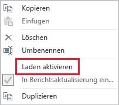

# Verfahren zur Datenreduktion für die Importmodellierung

Dieser Artikel richtet sich an Power BI Desktop-Datenmodellierer, die Importmodelle entwickeln. Im Folgenden werden die verschiedenen Verfahren zur Reduktion von Daten beschrieben, die in Importmodelle geladen werden.

In Importmodelle werden Daten geladen, die zuerst komprimiert und optimiert und anschließend von der VertiPaq-Speicher-Engine auf dem Datenträger gespeichert werden. Wenn Quelldaten in den Arbeitsspeicher geladen werden, ist der Komprimierungsfaktor 10 realistisch. Sie können deswegen davon ausgehen, dass 10 GB Quelldaten auf ca. 1 GB komprimiert werden. Wenn eine persistente Speicherung auf einem Datenträger durchgeführt wird, ist eine weitere Reduktion um 20 % möglich.

Trotz der Effizienz der VertiPaq-Speicher-Engine sollten Sie die Daten, die in Ihre Modelle geladen werden, so weit wie möglich reduzieren. Dies gilt insbesondere für große Modelle und Modelle, die im Laufe der Zeit voraussichtlich größer werden. Vier Gründe sprechen für eine Reduktion der Daten:

- Größere Modelle werden von Ihrer Kapazität möglicherweise nicht unterstützt. Eine gemeinsam genutzte Kapazität kann Modelle mit einer Größe von bis zu 1 GB hosten, während Premium-Kapazitäten Modelle mit einer Größe von bis zu 13 GB hosten können. Weitere Informationen finden Sie im Artikel [Unterstützung von Datasets in Power BI Premium](../service-premium-large-datasets.md).
- Kleinere Modelle führen zu weniger Konflikten bei Kapazitätsressourcen. Dies gilt insbesondere für den Arbeitsspeicher. Dadurch können mehr Modelle über längere Zeiträume gleichzeitig geladen werden, was zu niedrigeren Entfernungsraten führt. Weitere Informationen finden Sie im Whitepaper [Power BI Premium-Bereitstellung](../whitepaper-powerbi-premium-deployment.md) unter [Funktionsweise von Kapazitäten](../whitepaper-powerbi-premium-deployment.md#how-capacities-function).
- In kleineren Modellen werden Daten schneller aktualisiert, was zu niedrigeren Latenzen, einem höheren Durchsatz bei Aktualisierungen von Datasets und einer geringeren Auslastung des Quellsystems sowie der Kapazitätsressourcen führt.
- Eine geringere Anzahl von Tabellenzeilen kann zu einer schnelleren Auswertung der Berechnungen führen, wodurch eine Zunahme der Gesamtabfrageleistung möglich ist.

In diesem Artikel werden acht Verfahren zur Reduktion von Daten behandelt. Dazu gehören:

- [Entfernen von unnötigen Spalten](#remove-unnecessary-columns)
- [Entfernen von unnötigen Zeilen](#remove-unnecessary-rows)
- [Gruppieren nach und Zusammenfassen](#group-by-and-summarize)
- [Optimieren von Spaltendatentypen](#optimize-column-data-types)
- [Verwenden von benutzerdefinierten Spalten](#preference-for-custom-columns)
- [Deaktivieren des Ladevorgangs für Power Query-Abfragen](#disable-power-query-query-load)
- [Datum/Uhrzeit automatisch deaktivieren](#disable-auto-datetime)
- [Wechseln in den gemischten Modus](#switch-to-mixed-mode)

## Entfernen von unnötigen Spalten

Tabellenspalten in Modellen erfüllen zwei Hauptaufgaben:

- **Berichterstellung:** Bei diesem Vorgang sollen Berichtsentwürfe entstehen, mit denen sich Modelldaten filtern, gruppieren und zusammenfassen lassen.
- **Modellstrukturierung:** Bei diesem Vorgang werden Modellbeziehungen und -berechnungen, Sicherheitsrollen und sogar die Farbformatierung von Daten unterstützt.

Spalten, die diese Aufgaben nicht erfüllen, können vermutlich entfernt werden. Das Entfernen von Spalten wird auch als _vertikales Filtern_ bezeichnet.

Sie sollten für Ihre Modelle eine Spaltenzahl festlegen, die sich aus den Anforderungen an die Berichterstellung ergibt. Natürlich können sich diese Anforderungen im Laufe der Zeit ändern. Es ist jedoch einfacher, später Spalten hinzuzufügen, als zu entfernen. Wenn Spalten entfernt werden, kann das dazu führen, dass Berichte nicht mehr funktionieren oder die Modellstruktur Fehler aufweist.

## Entfernen von unnötigen Zeilen

Modelltabellen sollten mit möglichst wenigen Zeilen geladen werden. Dazu können gefilterte Rowsets in Modelltabellen geladen und dann nach Entität oder Zeit gefiltert werden. Das Entfernen von Zeilen wird auch als _horizontales Filtern_ bezeichnet.

Beim **Filtern nach Entität** wird eine Teilmenge der Quelldaten in das Modell geladen. Beispielsweise können so Verkaufsfakten nur für eine einzelne Region statt für alle Regionen geladen werden. Dieser Entwurfsansatz führt zu vielen kleineren Modellen und kann auch verhindern, dass die Sicherheit auf Zeilenebene festgelegt werden muss. Dafür müssen jedoch bestimmte Datasetberechtigungen im Power BI-Dienst erteilt und duplizierte Berichte erstellt werden, die eine Verbindung mit jedem Dataset herstellen. Mithilfe von Power Query-Parametern und Power BI-Vorlagendateien können Sie die Verwaltung und Veröffentlichung von Berichten vereinfachen. Weitere Informationen finden Sie im Blogbeitrag [Ausführliche Informationen zu Abfrageparametern und Power BI-Vorlagen](https://powerbi.microsoft.com/blog/deep-dive-into-query-parameters-and-power-bi-templates/).

Beim **Filtern nach Zeit** wird die Menge der _Verlaufsdaten_ begrenzt, die in Faktentabellen geladen wird. Außerdem wird die Zahl der Datumszeilen eingeschränkt, die in die Datumstabellen des Modells geladen werden. Sie sollten nur dann alle verfügbaren Verlaufsdaten automatisch laden, wenn dies eine Anforderung an die Berichterstellung ist. Die zeitbasierten Power Query-Filter sind parametrisierbar und können auch auf relative Zeiträume (relativ zum Aktualisierungsdatum und z. B. bezogen auf die letzten fünf Jahre) festgelegt werden. Nachträgliche Änderungen an Zeitfiltern führen außerdem nicht zu Berichtsfehlern, sondern nur dazu, dass weniger oder mehr Verlaufsdaten in Berichten verfügbar sind.

## Gruppieren nach und Zusammenfassen

Das wohl effektivste Verfahren zur Verringerung der Modellgröße umfasst das Laden vorab zusammengefasster Daten. Bei dieser Methode kann die Granularität (Grain) der Faktentabellen erhöht werden. Der Nachteil besteht jedoch in einem Informationsverlust.

Angenommen, in einer Faktentabelle mit Quelldaten zu Verkaufszahlen wird für jede Auftragsposition eine Zeile gespeichert. Wenn alle Verkaufsmetriken zusammengefasst und nach Datum, Kunde und Produkt gruppiert werden, könnte eine erhebliche Datenreduktion erzielt werden. Dieser Vorgang könnte sogar noch optimiert werden, wenn _auf der Monatsebene_ nach Datum gefiltert wird. Dadurch kann die Modellgröße zwar um bis zu 99 % verringert werden, jedoch ist dann eine Berichterstellung auf Tagesebene oder auf der Ebene einer Auftragsposition nicht mehr möglich. Wenn Daten aus Faktentabellen zusammengefasst werden, hat dies immer auch Nachteile. Die Auswirkungen dieser Nachteile lassen sich mit einem gemischten Modell einschränken. Dies wird im Abschnitt [Wechseln in den gemischten Modus](#switch-to-mixed-mode) beschrieben.

## Optimieren von Spaltendatentypen

Die VertiPaq-Speicher-Engine verwendet für jede Spalte eigene Datenstrukturen. Diese sind entwurfsbedingt für numerische Spaltendaten optimiert, für die eine Wertcodierung verwendet wird. Für Text und andere nicht numerische Daten wird hingegen die Hashcodierung genutzt. Die Speicher-Engine muss daher jedem eindeutigen Textwert in der Spalte einen numerischen Bezeichner zuweisen, der dann in der Datenstruktur gespeichert wird. Beim Speichern und Abfragen von Werten ist eine Hashsuche in dieser Datenstruktur erforderlich.

In bestimmten Fällen können Sie Quelltextdaten in numerische Werte konvertieren. So kann beispielsweise Auftragsnummern durchgängig ein Textwert (z. B. „SO123456“) vorangestellt werden. Dieses Präfix könnte dann entfernt und der Wert der Auftragsnummer in eine ganze Zahl konvertiert werden. Bei großen Tabellen kann dies vor allem dann zu einer erheblichen Datenreduktion führen, wenn die Spalten eindeutige Werte oder Werte mit hoher Kardinalität enthalten.

In diesem Beispiel wird empfohlen, die Spalteneigenschaft „Default Summarization“ (Standardzusammenfassung) auf „Nicht zusammenfassen“ festzulegen. Dadurch werden ungeeignete Zusammenfassungen der Auftragsnummerwerte vermieden.

## Verwenden von benutzerdefinierten Spalten

Die VertiPaq-Speicher-Engine speichert (in DAX definierte) berechnete Modellspalten ebenso wie reguläre Power Query-Quellspalten. Die Datenstrukturen werden jedoch etwas anders gespeichert. Außerdem ist deren Komprimierung in der Regel weniger effizient. Die Datenstrukturen werden erst erstellt, nachdem alle Power Query-Tabellen geladen wurden, was zu längeren Aktualisierungszeiten für Daten führen kann. Tabellenspalten, die als _berechnete Spalten_ hinzugefügt werden, sind daher weniger effizient als (in M definierte) _berechnete Power Query-Spalten_.

Aus diesem Grund sollten vorzugsweise benutzerdefinierte Spalten in Power Query erstellt werden. Wenn es sich bei der Quelle um eine Datenbank handelt, können Sie die Ladeeffizienz auf zwei Arten optimieren. Die Berechnung kann in der SQL-Anweisung (mithilfe der nativen Abfragesprache des Anbieters) definiert werden oder als Spalte in der Datenquelle materialisiert werden.

Gelegentlich sind jedoch berechnete Modellspalten möglicherweise die bessere Wahl. Dies kann der Fall sein, wenn durch die Formel Measures ausgewertet werden oder für die Formel bestimmte Modellierungsfunktionen erforderlich sind, die nur in DAX-Funktionen unterstützt werden. Informationen zu einem solchen Beispiel finden Sie im Artikel [Grundlegendes zu Funktionen für Hierarchien aus über- und untergeordneten Elementen in DAX](/dax/understanding-functions-for-parent-child-hierarchies-in-dax).

## Deaktivieren des Ladevorgangs für Power Query-Abfragen

Power Query-Abfragen, die zur Datenintegration mit anderen Abfragen vorgesehen sind, sollten nicht in das Modell geladen werden. Deaktivieren Sie daher in diesen Fällen den Ladevorgang für Abfragen.

## Datum/Uhrzeit automatisch deaktivieren

Power BI Desktop enthält eine Option mit dem Namen _Datum/Uhrzeit automatisch_. Wenn diese Option aktiviert ist, wird eine verborgene automatische Datums-/Uhrzeittabelle für Datumsspalten erstellt, um Berichtsautoren beim Konfigurieren von Filtern, Gruppieren und Drilldown für Kalenderzeiträume zu unterstützen. Die verborgenen Tabellen sind tatsächlich berechnete Tabellen, die die Größe des Modells anwachsen lassen. Anleitungen zum Verwenden dieser Option finden Sie im Artikel [Auto date/time guidance in Power BI Desktop](../desktop-auto-date-time.md) (Anleitungen zum automatischen Datum/der automatischen Uhrzeit in Power BI Desktop).

## Wechseln in den gemischten Modus

In Power BI Desktop wird im gemischten Modus ein zusammengesetztes Modell erzeugt. Damit können Sie den Speichermodus für _jede Tabelle_ festlegen. Für jede Tabelle kann daher die Eigenschaft „Speichermodus“ auf „Importieren“, „DirectQuery“ oder „Dual“ festgelegt werden.

Ein wirksames Verfahren zum Verringern der Modellgröße besteht darin, die Eigenschaft „Speichermodus“ für größere Faktentabellen auf „DirectQuery“ festzulegen. Dieser Entwurfsansatz kann in einigen Fällen gut mit der Strategie kombiniert werden, die unter [Gruppieren nach und Zusammenfassen](#group-by-and-summarize) beschrieben wurde. So könnten z. B. zusammengefasste Verkaufsdaten verwendet werden, um Zusammenfassungsberichte effizient zu erstellen. Auf einer Drillthroughseite könnten außerdem Verkäufe für einen bestimmten (eingegrenzten) Filterkontext detailgenau aufgeführt werden, in dem alle zugehörigen Auftragspositionen angezeigt werden. In diesem Beispiel würde die Drillthroughseite Visuals enthalten, die auf einer DirectQuery-Tabelle basieren, mit der die Auftragsdaten abgerufen werden.

Wenn Sie zusammengesetzte Modelle verwenden, müssen Sie jedoch auch zahlreiche Auswirkungen auf die Sicherheit und Leistung berücksichtigen. Weitere Informationen finden Sie im Artikel [Verwenden zusammengesetzter Modelle in Power BI Desktop](../desktop-composite-models.md).

## Nächste Schritte

Weitere Informationen zum Entwerfen von Power BI-Importmodellen finden Sie in den folgenden Artikeln:

- [Verwenden zusammengesetzter Modelle in Power BI Desktop](../desktop-composite-models.md)
- [Speichermodus in Power BI Desktop](../desktop-storage-mode.md)
