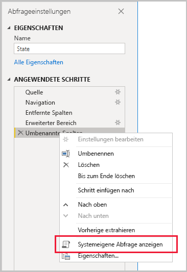
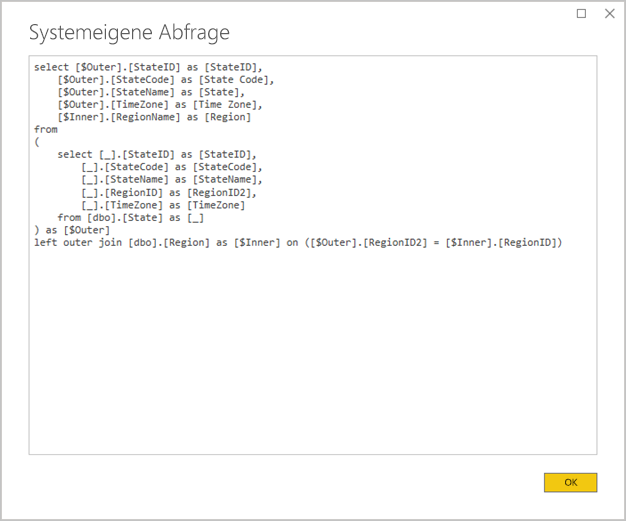
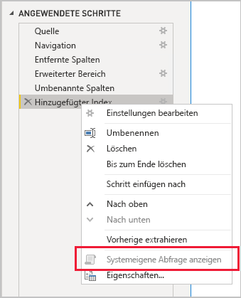

# <a name="the-importance-of-query-folding"></a>Die Bedeutung von Query Folding

Dieser Artikel richtet sich an Datenmodellierer, die Modelle in Power BI Desktop entwickeln. Zunächst wird erläutert, was Query Folding bedeutet und warum es wichtig ist. Außerdem werden die Datenquellen und Transformationen beschrieben, für die ein Query Folding erzielt werden kann, und Sie erfahren, wie Sie bestimmen können, ob ein Query Folding für Ihre Power Query-Abfragen möglich ist – ganz oder teilweise. Schließlich werden Best Practices dazu vorgestellt, wann und wie das Query Folding eingesetzt werden sollte.

Als Query Folding wird die Fähigkeit einer Power Query-Abfrage bezeichnet, eine einzelne Abfrageanweisung zum Abrufen und Transformieren von Quelldaten zu generieren. Die Mashup-Engine von Power Query strebt nach Möglichkeit immer ein Query Folding an, weil dies die effizienteste Methode zur Verbindungsherstellung zwischen einer Power BI-Modelltabelle und der zugrunde liegenden Datenquelle ist.

Das Query Folding ist aus mehreren Gründen ein wichtiges Konzept bei der Datenmodellierung:

- **Importieren von Modelltabellen:** Es wird – in Bezug auf Ressourcenauslastung und Aktualisierungsdauer – eine effiziente Datenaktualisierung für das Importieren von Modelltabellen durchgeführt.
- **Tabellen im Speichermodus „DirectQuery“ und „Dual“:** Jede Tabelle im Speichermodus „DirectQuery“ oder „Dual“ muss auf einer Power Query-Abfrage basieren, für die ein Query Folding möglich ist.
- **Inkrementelle Aktualisierung:** Es wird – in Bezug auf Ressourcenauslastung und Aktualisierungsdauer – eine effiziente inkrementelle Datenaktualisierung durchgeführt. Tatsächlich erhalten Sie über das Konfigurationsfenster „Inkrementelles Aktualisieren“ eine Warnung, wenn festgestellt wird, dass für die Tabelle kein Query Folding möglich ist. Hierdurch wird das Ziel der inkrementellen Aktualisierung verfehlt. Die Mashup-Engine müsste in diesem Fall alle Quellzeilen abrufen und anschließend Filter anwenden, um inkrementelle Änderungen zu ermitteln.

Das Query Folding kann auf eine gesamte Power Query-Abfrage oder auf eine Teilmenge der zugehörigen Schritte angewendet werden. Wenn kein Query Folding möglich ist – weder vollständig noch teilweise –, muss die Power Query-Mashup-Engine in Power BI dies kompensieren, indem sie die Datentransformationen selbst verarbeitet. Dies kann durch Abrufen der Quellabfrageergebnisse erreicht werden, bei großen Datasets ist dies jedoch ein sehr ressourcenintensiver und langsamer Vorgang.

Datenmodellierern wird empfohlen, beim Entwurf ihrer Importmodelle zum Erzielen optimaler Effizienz überall dort das Query Folding einzusetzen, wo dies möglich ist.

## <a name="sources-that-support-query-folding"></a>Quellen, die das Query Folding unterstützen

Die meisten Datenquellen, die das Konzept einer Abfragesprache verwenden, unterstützen das Query Folding. Zu diesen Datenquellen zählen beispielsweise relationale Datenbanken, OData-Feeds (einschließlich von SharePoint-Listen), Exchange und Active Directory. Datenquellen wie Flatfiles, Blobs oder Webquellen unterstützen das Query Folding in der Regel nicht.

## <a name="transformations-that-can-achieve-query-folding"></a>Transformationen, für die ein Query Folding möglich ist

Transformationen für relationale Datenquellen, die das Query Folding unterstützen, können als einzelne SELECT-Anweisung geschrieben werden. Eine SELECT-Anweisung kann mit geeigneten WHERE-, GROUP BY- und JOIN-Klauseln erstellt werden. Darüber hinaus kann die Anweisung Spaltenausdrücke (Berechnungen) enthalten, die gängige integrierte Funktionen verwenden, die von SQL-Datenbanken unterstützt werden.

Die folgende allgemeine Liste zeigt Transformationen, für die ein Query Folding möglich ist.

- Entfernen von Spalten
- Umbenennen von Spalten (SELECT-Spaltenaliase)
- Filtern von Zeilen mit statischen Werten oder Power Query-Parametern (WHERE-Klauselprädikate)
- Gruppieren und Zusammenfassen (GROUP BY-Klausel)
- Erweitern von Datensatzspalten (Quell-Fremdschlüsselspalten), um zwei Quelltabellen zusammenzuführen (JOIN-Klausel)
- Zusammenführen von Abfragen mit Unterstützung des Query Folding ohne Fuzzylogik basierend auf derselben Quelle (JOIN-Klausel)
- Anfügen von Abfragen mit Unterstützung des Query Folding basierend auf derselben Quelle (UNION ALL-Operator)
- Hinzufügen benutzerdefinierter Spalten mithilfe einer _einfachen Logik_ (SELECT-Spaltenausdrücke). Eine einfache Logik umfasst unkomplizierte Vorgänge, möglicherweise einschließlich der Verwendung von M-Funktionen, für die äquivalente Funktionen in der SQL-Datenquelle vorliegen, z. B. mathematische Funktionen oder Funktionen zur Textbearbeitung. Beispielsweise gibt der folgende Ausdruck die Jahreskomponente des **OrderDate**-Spaltenwerts zurück (um einen numerischen Wert zurückzugeben).

    ```powerquery-m
    Date.Year([OrderDate])
    ```

- Pivotieren und Entpivotieren (PIVOT- und UNPIVOT-Operatoren)

## <a name="transformations-that-prevent-query-folding"></a>Transformationen, die ein Query Folding verhindern

Die folgende allgemeine Liste zeigt Transformationen, die ein Query Folding verhindern. Diese Liste erhebt keinen Anspruch auf Vollständigkeit.

- Zusammenführen von Abfragen basierend auf verschiedenen Quellen
- Anfügen (UNION) von Abfragen basierend auf verschiedenen Quellen
- Hinzufügen benutzerdefinierter Spalten mithilfe einer _komplexen Logik_. Eine komplexe Logik impliziert die Verwendung von M-Funktionen, für die keine äquivalenten Funktionen in der Datenquelle vorliegen. Beispielsweise wird mit dem folgenden Ausdruck der **OrderDate**-Spaltenwert formatiert (um einen Textwert zurückzugeben).

    ```powerquery-m
    Date.ToText([OrderDate], "yyyy")
    ```

- Hinzufügen von Indexspalten
- Ändern eines Spaltendatentyps

Wenn eine Power Query-Abfrage mehrere Datenquellen umfasst, kann eine Inkompatibilität der Datenschutzebenen der Datenquellen ein Query Folding verhindern. Weitere Informationen finden Sie im Artikel [Power BI Desktop-Datenschutzebenen](../desktop-privacy-levels.md).

## <a name="determine-when-a-query-can-be-folded"></a>Bestimmen, ob eine Abfrage das Query Folding unterstützt

Im Power Query-Editor-Fenster können Sie bestimmen, ob eine Abfrage das Query Folding unterstützt. Wenn Sie im Bereich **Abfrageeinstellungen** mit der rechten Maustaste auf den zuletzt angewendeten Schritt klicken und die Option **Native Abfrage anzeigen** aktiviert ist (nicht abgeblendet dargestellt wird), dann ist ein Query Folding möglich.



Um die Abfrage nach dem Query Folding anzuzeigen, setzen Sie den Vorgang fort und wählen die Option **Native Abfrage anzeigen** aus. Daraufhin wird die native Abfrage angezeigt, die Power Query zum Abrufen von Daten durchführt.



Wenn die Option **Native Abfrage anzeigen** nicht aktiviert ist (abgeblendet dargestellt wird), weist dies darauf hin, dass ein Query Folding nicht für alle Abfrageschritte möglich ist. Es ist allerdings möglich, dass für eine Teilmenge der Schritte ein Query Folding durchgeführt werden kann. Arbeiten Sie sich ausgehend vom letzten rückwärts vor, und überprüfen Sie für jeden Schritt, ob die Option **Native Abfrage anzeigen** aktiviert ist. In diesem Fall wissen Sie, ab wo in der Schrittfolge kein Query Folding mehr möglich ist.



## <a name="best-practice-guidance"></a>Best Practices-Leitfaden

Kurz gesagt: Für eine Tabelle mit dem Speichermodus „DirectQuery“ oder „Dual“ muss die Power Query-Abfrage das Query Folding unterstützen. Für eine Importtabelle, die auf einer relationalen Quelle basiert und für die eine einzelne SELECT-Anweisung erstellt werden kann, wird _die bestmögliche Leistung bei der Datenaktualisierung_ erzielt, indem ein Query Folding sichergestellt wird. Wenn die Mashup-Engine weiterhin zum Verarbeiten von Transformationen benötigt wird, sollten Sie den Arbeitsaufwand so gering wie möglich halten, insbesondere bei großen Datasets.

Die folgende Liste gibt einen Überblick über die empfohlenen Best Practices.

- **Delegieren eines größtmöglichen Anteils an der Verarbeitung an die Datenquelle:** Wenn es nicht möglich ist, ein Query Folding für alle Schritte einer Power Query-Abfrage durchzuführen, ermitteln Sie den Schritt, der ein Query Folding verhindert. Verschieben Sie nachfolgende Schritte nach Möglichkeit an eine höhere Position in der Sequenz, damit sie beim Query Folding einbezogen werden können. Die Mashup-Engine von Power Query ist möglicherweise so intelligent, dass Ihre Abfrageschritte beim Generieren der Quellabfrage neu angeordnet werden.

Wenn für eine relationale Datenquelle der Schritt, der das Query Folding verhindert, in einer einzelnen SELECT-Anweisung oder innerhalb der prozeduralen Logik einer gespeicherten Prozedur erreicht werden kann, sollten Sie die Verwendung einer nativen Abfrageanweisung in Betracht ziehen (siehe unten).

- **Verwenden einer nativen SQL-Abfrage:** Wenn eine Power Query-Abfrage Daten aus einer relationalen Quelle abruft, kann eine native SQL-Abfrage verwendet werden. Die Abfrage kann eine beliebige gültige Anweisung sein, einschließlich der Ausführung einer gespeicherten Prozedur. Wenn die Anweisung mehrere Resultsets generiert, wird nur das erste zurückgegeben. In der Anweisung können Parameter deklariert werden, und es wird empfohlen, die M-Funktion [Value.NativeQuery](/powerquery-m/value-nativequery) zu verwenden, um Parameterwerte sicher und bequem zu übergeben. Es ist wichtig zu verstehen, dass die Mashup-Engine von Power Query kein Query Folding für nachfolgende Abfrageschritte durchführen kann. Deshalb ist es von wesentlicher Bedeutung, die gesamte Transformationslogik (oder den größtmöglichen Teil) in die native Abfrageanweisung einzuschließen.

    Es gibt zwei wesentliche Aspekte, die Sie bei der Verwendung nativer SQL-Abfragen beachten müssen:

    - Für eine DirectQuery-Modelltabelle muss als Abfrage eine SELECT-Anweisung verwendet werden, und diese darf keine allgemeinen Tabellenausdrücke oder gespeicherte Prozeduren enthalten.
    - Eine inkrementelle Aktualisierung kann eine native SQL-Abfrage nicht nutzen, sodass die Mashup-Engine von Power Query gezwungen wäre, alle Quellzeilen abzurufen und dann Filter anzuwenden, um inkrementelle Änderungen zu bestimmen.

    > [!IMPORTANT]
    > Eine native Abfrage kann potenziell mehr leisten als nur Daten abzurufen. Es kann eine beliebige gültige Anweisung ausgeführt werden (möglicherweise auch mehrmals) – einschließlich von Anweisungen, die Daten ändern oder löschen. Es ist wichtig, das Prinzip der geringsten Privilegien anzuwenden. So ist sichergestellt, dass das für den Datenbankzugriff verwendete Konto nur Leserechte für die erforderlichen Daten besitzt.

- **Vorbereiten und Transformieren von Daten in der Quelle:** Wenn Sie feststellen, dass für bestimmte Power Query-Abfrageschritte kein Query Folding möglich ist, können Sie die Transformationen möglicherweise in der Datenquelle anwenden. Dies könnte entweder durch Schreiben einer Datenbanksicht ermöglicht werden, die Quelldaten logisch transformiert, oder durch eine physische Vorbereitung und Umsetzung von Daten vor der Abfrage durch Power BI. Ein relationales Data Warehouse ist ein hervorragendes Beispiel für vorbereitete Daten, da es üblicherweise aus vorab integrierten Quellen von Organisationsdaten besteht.

## <a name="next-steps"></a>Nächste Schritte

Weitere Informationen zum Query Folding und zugehörige Artikel finden Sie in den folgenden Ressourcen:

- [Verwenden zusammengesetzter Modelle in Power BI Desktop](../desktop-composite-models.md)
- [Inkrementelle Aktualisierung in Power BI Premium](../service-premium-incremental-refresh.md)
- [Verwenden von Table.View zum Implementieren des Query Folding](/power-query/handlingqueryfolding)
- Haben Sie Fragen? [Stellen Sie Ihre Frage in der Power BI-Community.](https://community.powerbi.com/)
