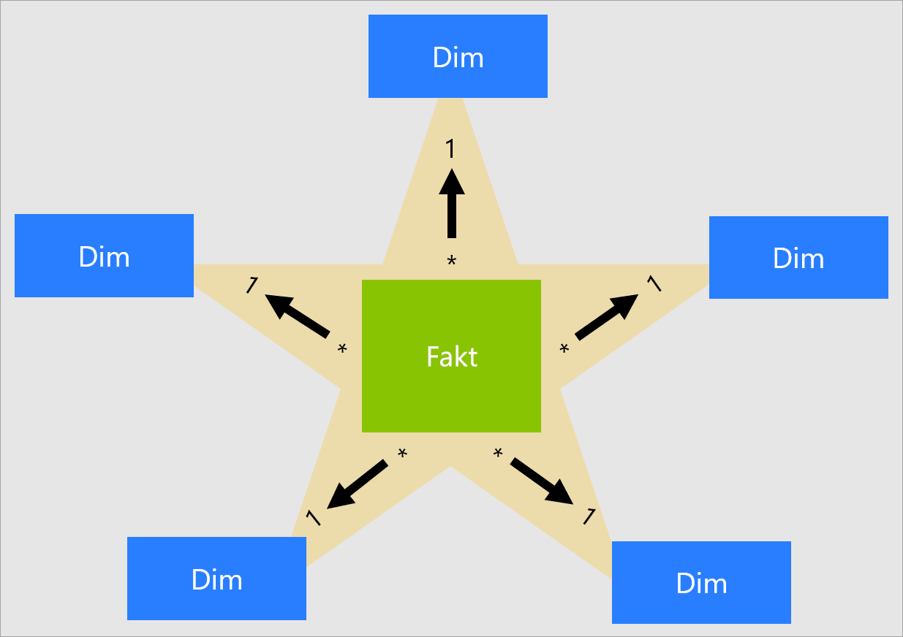
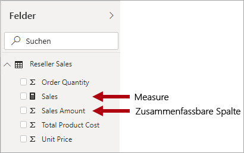
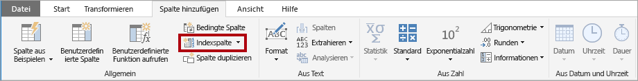
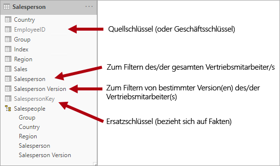
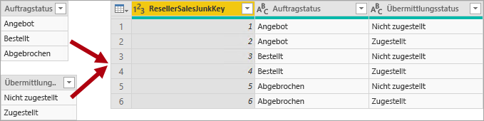
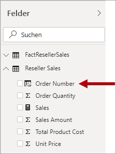

# Informationen zum Sternschema und der Wichtigkeit für Power BI

Dieser Artikel befasst sich mit Power BI Desktop-Datenmodellierern. In diesem Artikel wird der Sternschemaentwurf und dessen Relevanz für die Entwicklung von Power BI-Datenmodellen beschrieben, die für Leistung und Benutzerfreundlichkeit optimiert sind.

Dieser Artikel ist nicht für die Bereitstellung einer umfassenden Erörterung des Sternschemaentwurfs vorgesehen. Weitere Informationen finden Sie in veröffentlichten Inhalten, z. B. im Buch **The Data Warehouse Toolkit: The Complete Guide to Dimensional Modeling** (2. Auflage, 2002) (Das Data Warehouse-Toolkit: Der ausführliche Leitfaden zur dimensionalen Modellierung) von Ralph Kimball.

## Übersicht über das Sternschema

Das **Sternschema** ist ein ausgereifter Modellierungsansatz, der von relationalen Data Warehouse weitgehend übernommen wird. Hierzu müssen Modellierer ihre Modelltabellen entweder als _Dimension_ oder _Fakt_ klassifizieren.

**Dimensionstabellen** beschreiben Geschäftsentitäten, die „Dinge“, die Sie modellieren. Entitäten können Produkte, Personen, Orte und Konzepte, einschließlich der Zeit selbst, enthalten. Die Tabelle mit der meisten Konsistenz in einem Sternschema ist eine Datumsdimensionstabelle. Eine Dimensionstabelle enthält eine Schlüsselspalte (oder Spalten), die als eindeutiger Bezeichner fungiert, und beschreibende Spalten.

**Faktentabellen** enthalten Beobachtungen oder Ereignisse. Dabei kann es sich um Verkaufsaufträge, Lagerbestände, Wechselkurse, Temperaturen usw. handeln. Eine Faktentabelle enthält Dimensionsschlüsselspalten, die sich auf Dimensionstabellen beziehen, und numerische Measurespalten. Die Dimensionsschlüsselspalten bestimmen die _Dimensionalität_ einer Faktentabelle, während die Dimensionsschlüsselwerte die _Granularität_ einer Faktentabelle bestimmen. Stellen Sie sich beispielsweise eine Faktentabelle vor, die zum Enthalten von Verkaufszielen entworfen wurde, die die zweidimensionalen Schlüsselspalten **Date** und **ProductKey** enthält. Es ist leicht zu verstehen, dass die Tabelle zwei Dimensionen enthält. Die Granularität kann jedoch nicht ermittelt werden, ohne die Dimensionsschlüsselwerte zu berücksichtigen. Beachten Sie, dass die Werte in diesem Beispiel in der Spalte **Date** dem ersten Tag eines jeden Monats entsprechen. In diesem Fall handelt es sich bei der Granularität um die monatliche Produktebene.

Im Allgemeinen enthalten Dimensionstabellen eine relativ kleine Anzahl von Zeilen. Faktentabellen können dagegen eine sehr große Zeilenanzahl enthalten und im Laufe der Zeit größer werden.

## Relevanz von Sternschemas für Power BI-Modelle

Der Sternschemaentwurf und viele verwandte Konzepte, die in diesem Artikel vorgestellt werden, sind ein wichtiger Bestandteil der Entwicklung von Power BI-Modellen mit optimierter Leistung und Benutzerfreundlichkeit.

Denken Sie daran, dass jede Power BI-Berichtvisualisierung eine Abfrage generiert, die an das Power BI-Modell (das der Power BI-Dienst als Dataset bezeichnet) gesendet wird. Diese Abfragen werden zum Filtern, Gruppieren und Zusammenfassen der Modelldaten verwendet. Demnach ist ein gut entworfenes Modell eines, das Tabellen für Filterung und Gruppierung sowie Tabellen für die Zusammenfassung bereitstellt. Dies fügt sich gut in die Entwurfsprinzipien für Sternschemas ein:

- Dimensionstabellen unterstützen die _Filterung_ und _Gruppierung_.
- Faktentabellen unterstützen die _Zusammenfassung_.

Obwohl es keine Tabelleneigenschaft gibt, die Modellierer festgelegen, um den Tabellentyp (Dimension oder Fakt) zu konfigurieren, wird er mithilfe der Modellbeziehungen bestimmt. Eine Modellbeziehung erstellt einen Filterweitergabepfad zwischen zwei Tabellen. Dabei wird der Tabellentyp von der **Kardinalitätseigenschaft** der Beziehung bestimmt. Gängige Beziehungskardinalitäten sind „1:n“ und dessen umgekehrte Variante „n:1“. Die Seite „1“ ist immer eine Dimensionstabelle, während die Seite „n“ immer eine Faktentabelle ist.

Ein gut strukturierter Modellentwurf sollte Tabellen enthalten, die entweder Dimensions- oder Faktentabellen sind. Sie sollten vermeiden, beide Tabellentypen in einer einzelnen Tabelle zu vermischen. Außerdem wird empfohlen, dass Sie die richtige Anzahl von Tabellen mit den richtigen Beziehungen bereitstellen. Es ist auch wichtig, dass Faktentabellen Daten immer konsistent laden.

Letztlich sollten Sie wissen, dass ein optimaler Modellentwurf aus einem Teil Wissenschaft und einem Teil Kunst besteht. Manchmal können Sie die bewährten Methoden ignorieren, wenn dies sinnvoll ist.

Es gibt viele weitere Konzepte im Zusammenhang mit dem Sternschemaentwurf, die auf ein Power BI-Modell angewendet werden können. Dazu gehören:

- [Measures](#measures)
- [Ersatzschlüssel](#surrogate-keys)
- [Schneeflockendimensionen](#snowflake-dimensions)
- [Dimensionen mit unterschiedlichen Rollen](#role-playing-dimensions)
- [Langsam veränderliche Dimensionen](#slowly-changing-dimensions)
- [Junkdimensionen](#junk-dimensions)
- [Degenerierte Dimensionen](#degenerate-dimensions)
- [Faktenlose Faktentabellen](#factless-fact-tables)

## Measures

Im Sternschemaentwurf ist ein **Measure** eine Faktentabellenspalte, die Werte enthält, die zusammengefasst werden sollen.

Im Power BI-Modell weisen **Measures** eine andere, aber ähnliche, Definition auf. Dabei handelt es sich um eine in [DAX (Data Analysis Expressions)](https://docs.microsoft.com/dax/data-analysis-expressions-dax-reference) geschriebene Formel, die die Zusammenfassung ermöglicht. Measureausdrücke nutzen oft DAX-Aggregationsfunktionen wie SUM, MIN, MAX, AVERAGE usw., um zur Abfragezeit ein Skalarwertergebnis zu erzeugen (Werte werden nie im Modell gespeichert). Measureausdrücke können zwischen einfachen Spaltenaggregationen und komplexeren Formeln variieren, die den Filterkontext und bzw. oder die Beziehungsweitergabe überschreiben. Weitere Informationen finden Sie im Artikel zu den [DAX-Grundlagen in Power BI Desktop](https://docs.microsoft.com/power-bi/desktop-quickstart-learn-dax-basics).

Sie sollten wissen, dass Power BI-Modelle eine zweite Methode für die Zusammenfassung unterstützen. Alle Spalten, in der Regel numerische Spalten, können mithilfe einer Berichtsvisualisierung oder mit Q&A zusammengefasst werden. Für Sie als Modellentwickler ist das eine praktische Funktion, da Sie in vielen Fällen keine Measures erstellen müssen. Beispielsweise könnte die Spalte **Sales Amount** (Verkaufsquote) für die Verkäufe des Adventure Works-Wiederverkäufers auf verschiedene Weisen zusammengefasst werden (sum, count, average, median, min, max usw.), ohne dass ein Measure für jeden möglichen Aggregationstyp erstellt werden muss.

Es gibt jedoch zwei überzeugende Gründe für die Erstellung von Measures, auch für einfache Zusammenfassungen auf Spaltenebene:

- Wenn Sie wissen, dass Berichtsautoren das Modell mithilfe von [mehrdimensionalen Ausdrücken (MDX)](https://docs.microsoft.com/sql/analysis-services/multidimensional-models/mdx/mdx-query-the-basic-query?view=sql-server-2017) abfragen, muss das Modell Measures enthalten. MDX können Spaltenwerte nicht zusammenfassen. Dies ist insbesondere relevant, wenn ein Power BI-Dataset mithilfe von MDX abgefragt wird. Dies ist beispielsweise der Fall, wenn [In Excel analysieren](https://docs.microsoft.com/power-bi/service-analyze-in-excel) verwendet wird (PivotTables verwenden MDX-Abfragen).
- Wenn Sie sicherstellen müssen, dass Berichtsautoren Spalten nur auf bestimmte Weisen zusammenfassen können. Beispielsweise kann die Spalte **Unit Price** (Einzelpreis) des Wiederverkäufers (die einen Preis pro Einheit darstellt) zusammengefasst werden, aber nur mithilfe spezifischer Aggregationsfunktionen. Diese Spalte sollte nie zusammengefast werden, jedoch ist es angebracht, sie mithilfe anderer Aggregationsfunktionen zusammenzufassen (min, max, average usw.). In diesem Fall kann der Modellierer die Spalte **Unit Price** (Einzelpreis) ausblenden und Measures für alle entsprechenden Aggregationsfunktionen erstellen.

Hinweis: Dieser Entwurfsansatz eignet sich für Berichte, die im Power BI-Dienst erstellt wurden, und für Q&A. Jedoch können Power BI Desktop-Liveverbindungen Berichtsautoren ermöglichen, ausgeblendete Felder im Bereich **Felder** anzuzeigen, wodurch dieser Entwurfsansatz umgangen werden kann.

## Ersatzschlüssel

**Ersatzschlüssel** sind eindeutige Bezeichner, die Sie zu einer Tabelle hinzufügen können, um die Sternschemamodellierung zu unterstützen. Sie werden definitionsgemäß nicht in den Quelldaten definiert oder gespeichert. Ersatzschlüssel werden in der Regel zu relationalen Data Warehouse-Dimensionstabellen hinzugefügt, um einen eindeutigen Bezeichner für jede Zeile der Dimensionstabelle bereitzustellen.

Beziehungen des Power BI-Modells basieren auf einer einzelnen eindeutigen Spalte in einer Tabelle, die Filter an eine einzelne Spalte in einer anderen Tabelle weiterleitet. Wenn eine Dimensionstabelle in Ihrem Modell keine einzige eindeutige Spalte enthält, müssen Sie einen eindeutigen Bezeichner hinzufügen, der als „1“-Seite der Beziehung verwendet wird. Dies können Sie mühelos in Power BI Desktop durchführen, indem Sie eine [Power Query-Indexspalte](https://docs.microsoft.com/powerquery-m/table-addindexcolumn) erstellen.

Sie müssen diese Abfrage mit der Abfrage der „n“-Seite zusammenführen, damit Sie auch die Indexspalte hinzufügen können. Wenn Sie diese Abfragen in das Modell laden, können Sie anschließend eine 1:n-Beziehung zwischen den Modelltabellen erstellen.

## Schneeflockendimensionen

**Schneeflockendimensionen** bestehen aus normalisierten Tabellen für eine einzelne Geschäftseinheit. Zum Beispiel klassifiziert Adventure Works Produkte anhand der Kategorie und der Unterkategorie. Die Kategorien werden Unterkategorien zugewiesen, und Produkte werden wiederum Unterkategorien zugewiesen. Im relationalen Adventure Works-Data Warehouse ist die Produktdimension normalisiert und wird in drei verknüpften Tabellen gespeichert: **DimProductCategory**, **DimProductSubcategory** und **DimProduct**.

Mit ein wenig Fantasie können Sie sich die normalisierten Tabellen außerhalb der Faktentabelle vorstellen, wodurch sich ein Schneeflockendesign ergibt.

In Power BI Desktop können Sie entscheiden, ob Sie ein Schneeflockendesign für die Dimension imitieren möchten (möglicherweise, weil Ihre Quelldaten dies tun) oder ob Sie die Quelltabellen in ein einzelne Modelltabelle integrieren möchten (Denormalisieren). Im Allgemeinen überwiegen die Vorteile einer einzelnen Modelltabelle die Vorteile mehrerer Modelltabellen. Die optimale Entscheidung kann davon abhängen, welche Datenmengen und Anforderungen an die Nutzbarkeit für das Modell bestehen.

Folgendes geschieht, wenn Sie sich für das Imitieren eines Schneeflockendimensionsentwurfs entscheiden:

- Power BI lädt weitere Tabellen, was in Hinsicht auf Speicher und Leistung weniger effizient ist. Diese Tabellen müssen Spalten enthalten, um Modellbeziehungen zu unterstützen, was zu einer größeren Modellgröße führen kann.
- Längere Weitergabeketten für Beziehungsfilter müssen durchlaufen werden, was wahrscheinlich weniger effizient ist, als Filter die auf eine einzelne Tabelle angewendet werden.
- Der Bereich **Felder** stellt mehrere Modelltabellen für Berichtsautoren dar, was zu einer weniger intuitiven Benutzung führen kann, insbesondere, wenn Schneeflockendimensionstabellen nur eine oder zwei Spalten enthalten.
- Es ist nicht möglich, eine Hierarchie zu erstellen, die die Tabellen umfasst.

Wenn Sie sich für die Integration in eine einzelne Modelltabelle entscheiden, können Sie auch eine Hierarchie definieren, die die allgemeinen und genauen Ebenen der Dimension umfasst. Möglicherweise kann die Speicherung redundanter denormalisierter Daten zu einem größeren Modellspeicherbedarf führen, insbesondere bei sehr großen Dimensionstabellen.

## Langsam veränderliche Dimensionen

**Langsam veränderliche Dimensionen** (SCDs) verwalten die Änderung von Dimensionselementen im Laufe der Zeit ordnungsgemäß. Dies gilt auch, wenn Geschäftseinheitswerte sich im Laufe der Zeit oder spontan ändern. Ein gutes Beispiel für eine _langsam_ veränderliche Dimension ist eine Kundendimension, genauer gesagt dessen Spalten für Kontaktinformationen wie E-Mail-Adressen und Telefonnummern. Im Gegensatz dazu werden einige Dimensionen als Dimensionen betrachtet, die sich _schnell_ ändern, wenn sich ein Dimensionsattribut häufig ändert, z. B. der Marktpreis einer Aktie. Der gängige Ansatz in diesen Fällen besteht darin, sich häufig ändernde Attributwerte in einem Faktentabellenmeasure zu speichern.

Die Theorie des Sternschemaentwurfs bezieht sich auf zwei gängige Arten sich langsam ändernder Dimensionen: Typ 1 und Typ 2. Eine Dimensionstabelle kann Typ 1 oder Typ 2 entsprechen oder beide Typen gleichzeitig für verschiedene Spalten unterstützen.

### SCD Typ 1

Eine **SCD** vom **Typ 1** stellt immer die neuesten Werte dar. Wenn dann Änderungen an den Quelldaten ermittelt werden, werden die Daten in der Dimensionstabelle einfach überschrieben. Dieser Entwurfsansatz wird häufig für Spalten verwendet, die ergänzende Werte enthalten, z. B. E-Mail-Adressen oder Telefonnummern von Kunden. Wenn die E-Mail-Adresse oder Telefonnummer eines Kunden geändert wird, aktualisiert die Dimensionstabelle die Kundenzeile mit den neuen Werten. Dies erfolgt so, als hätte der Kunde schon immer über diese Kontaktinformationen verfügt.

Eine nicht inkrementelle Aktualisierung einer Dimensionstabelle des Power BI-Modells erzielt das Ergebnis einer langsam veränderlichen Dimension vom Typ 1. Dabei werden die Tabellendaten aktualisiert, um sicherzustellen, dass die neuesten Werte geladen werden.

### SCD Typ 2

Eine **SCD** vom **Typ 2** unterstützt die Versionskontrolle für Dimensionselemente. Wenn das Quellsystem keine Versionen speicher, werden Änderungen in der Regel vom Ladevorgang des Data Warehouse erkannt, und die Änderung wird in der Dimensionstabelle ordnungsgemäß verwaltet. In diesem Fall muss die Dimensionstabelle einen Ersatzschlüssel verwenden, um einen eindeutigen Verweis auf eine _Version_ des Dimensionselements bereitzustellen. Sie enthält auch Spalten, die die Gültigkeit des Datumsbereichs der Version definieren (z. B. **StartDate** und **EndDate**) und eine Flagspalte (z. B. **IsCurrent**), um mühelos nach aktuellen Dimensionselementen zu filtern.

Beispielsweise weist Adventure Works Vertriebsmitarbeiter zu einer Vertriebsregion zu. Wenn ein Vertriebsmitarbeiter einer anderen Region zugewiesen wird, muss eine neue Version des Vertriebsmitarbeiters erstellt werden, um sicherzustellen, dass Verlaufsdaten weiterhin der vorherigen Region zugeordnet bleiben. Die Dimensionstabelle muss Versionen von Vertriebsmitarbeitern und ihren zugeordneten Regionen enthalten, um eine genaue Verlaufsanalyse der Verkäufe pro Vertriebsmitarbeiter zu ermöglichen. Die Tabelle sollte auch Werte für das Start- und Enddatum enthalten, um die Gültigkeitsdauer zu definieren. Aktuelle Versionen können ein leeres Enddatum (oder 31. 12. 9999) definieren, was angibt, dass die Zeile der aktuellen Version entspricht. Die Tabelle muss außerdem einen Ersatzschlüssel definieren, weil der Geschäftsschlüssel (in diesem Fall die Mitarbeiter-ID) nicht eindeutig ist.

Denken Sie daran, dass Sie ein Zwischensystem (beispielsweise ein Data Warehouse) zum Ermitteln und Speichern von Änderungen verwenden müssen, wenn die Quelldaten die Versionen nicht speichert. Der Tabellenladevorgang muss vorhandene Daten beibehalten und Änderungen ermitteln. Wenn eine Änderung ermittelt wird, muss der Tabellenladevorgang die aktuelle Version aktualisieren. Dies erfolgt durch Aktualisieren des Werts **EndDate** und Einfügen einer neuen Version mit dem Wert **StartDate**, der ab dem vorherigen Wert von **EndDate** beginnt. Verwandte Fakten müssen außerdem eine zeitbasierte Suche verwenden, um den entsprechenden Dimensionsschlüsselwert für das Faktendatum abzurufen. Ein Power BI-Model, das Power Query verwendet, kann dies nicht durchführen. Allerdings kann es Daten aus einer vorab geladenen Dimensionstabelle vom SCD Typ 2 laden.

Das Power BI-Modell sollte das Abfragen von Verlaufsdaten für Elemente und für die Versionen von Elementen, die einen bestimmten Zustand zu einem bestimmten Zeitpunkt für das Element darstellen, unabhängig von Änderungen unterstützen. Für Adventure Works ermöglicht dies das Abfragen des Vertriebsmitarbeiters unabhängig von der zugewiesenen Vertriebsregion oder einer bestimmten Version des Vertriebsmitarbeiters.

Hierzu muss die Dimensionstabelle des Power BI-Modells eine Spalte zum Filtern der Vertriebsmitarbeiter und eine andere Spalte zum Filtern nach der spezifischen Version der Vertriebsmitarbeiter enthalten. Es ist wichtig, dass die Versionsspalte eine genaue Beschreibung enthält, z. B. „Michael Blythe (15. 12. 2008 – 26. 06. 2019)“ oder „Michael Blythe (aktuell)“. Außerdem ist es wichtig, dass Berichtsautoren und Benutzer über die Grundlagen von SCD Typ 2 informiert sind und wissen, wie geeignete Berichtsentwürfe durch Anwendung der richtigen Filter erstellt werden.

Es wird außerdem empfohlen, eine Hierarchie zu verwenden, die das Ausführen von Drilldowns zur Versionsebene der Visuals ermöglicht.

## Dimensionen mit unterschiedlichen Rollen

Eine **Dimension mit unterschiedlichen Rollen** ist eine Dimension, die verwandte Fakten auf verschiedene Weisen filtern kann. Angenommen, die Datumsdimensionstabelle von Adventure Works weist drei Beziehungen mit Verkaufsfakten von Wiederverkäufern auf, dann kann dieselbe Dimensionstabelle zum Filtern der Fakten nach Bestelldatum, Versanddatum und Lieferdatum verwendet werden.

Für Data Warehouses besteht der akzeptierte Entwurfsansatz darin, eine einzelne Datumsdimensionstabelle zu definieren. Die „Rolle“ der Datumsdimension wird anhand der Faktenspalte festgelegt, die zur Abfragezeit zum Verknüpfen der Tabellen verwendet wird. Wenn Sie beispielsweise die Verkäufe nach Datum analysieren, bezieht sich die Tabellenverknüpfung auf die Spalte für Verkäufe nach Datum des Wiederverkäufers.

In einem Power BI-Modell kann dieser Entwurf imitiert werden, indem mehrere Beziehungen zwischen zwei Tabellen erstellt werden. Im Adventure Works-Beispiel würden die Datums- und Verkaufstabellen des Wiederverkäufers über drei Beziehungen verfügen. Dies ist zwar möglich, jedoch sollte darauf geachtet werden, dass nur eine aktive Beziehung zwischen zwei Power BI-Modelltabellen bestehen kann. Alle anderen Beziehungen müssen als „inaktiv“ festgelegt werden. Wenn eine einzelne aktive Beziehung vorliegt, bedeutet das, dass eine Standardfilterweitergabe von Datum an Verkäufe des Wiederverkäufers vorliegt. In diesem Fall wird die aktive Beziehung auf den allgemeinsten Filter festgelegt, die von Berichten verwendet wird. Bei Adventure Works wäre dies die Beziehung für das Bestelldatum.

Die einzige Möglichkeit, eine inaktive Beziehung zu verwenden, besteht darin, einen DAX-Ausdruck zu verwenden, der die [USERELATIONSHIP-Funktion](https://docs.microsoft.com/dax/userelationship-function-dax) verwendet. In diesem Beispiel muss der Modellentwickler Measures erstellen, um die Analyse der Verkäufe des Wiederverkäufers anhand des Versand- und Lieferdatums zu ermöglichen. Insbesondere wenn die Wiederverkäufertabelle viele Measures definiert, kann dies mühsam sein. Außerdem sorgt der Überfluss an Measures für Unordnung im Bereich **Felder**. Außerdem gibt es weitere Einschränkungen:

- Wenn Berichtsautoren sich auf das Zusammenfassen von Spalten verlassen, anstatt Measures zu definieren, können inaktive Beziehungen nicht zusammengefasst werden, ohne ein Measure auf Berichtebene zu erstellen. Measures auf Berichtebene können nur beim Erstellen von Berichten in Power BI Desktop definiert werden.
- Mit nur einem aktiven Beziehungspfad zwischen Datum und Verkäufen des Wiederverkäufers ist es nicht möglich, die Verkäufe des Wiederverkäufers gleichzeitig anhand verschiedener Datumsarten zu filtern. Beispielsweise können Sie kein Visual erstellen, dass das Bestelldatum von Verkäufen anhand des Versanddatums abbildet.

Die gängige Methode der Power BI-Modellierung zum Umgehen dieser Einschränkungen besteht darin, eine Dimensionstabelle für jede Instanz mit eigener Rolle zu erstellen. In der Regel erstellen Sie die zusätzlichen Dimensionstabellen mithilfe von DAX-Ausdrücken als [berechnete Tabellen](https://docs.microsoft.com/dax/calculatetable-function-dax). Mithilfe von berechneten Tabellen kann das Modell eine **Datumstabelle**, eine **Versanddatumstabelle** und eine **Lieferdatumstabelle** enthalten, die jeweils eine einzelne aktive Beziehung zur jeweiligen Tabellenspalte für die Verkäufe durch Wiederverkäufer aufweisen.

Für diesen Entwurfsansatz müssen Sie nicht mehrere Measures für verschiedene Datumsrollen definieren, und er ermöglicht die gleichzeitige Filterung anhand unterschiedlicher Datumsrollen. Dieser Entwurfsansatz hat jedoch den kleinen Nachteil, dass die Datumsdimensionstabelle dupliziert wird, was zu einem größeren Speicherbedarf für das Modell führt. Da Dimensionstabellen in der Regel weniger Zeilen als Faktentabellen enthalten, ist dies nur selten ein Problem.

Beachten Sie die folgenden bewährten Methoden beim Erstellen von Modelldimensionstabellen für jede Rolle:

- Stellen Sie sicher, dass alle Spaltennamen sich selbst beschreiben. Es ist zwar möglich, in allen Datumstabellen über eine Spalte für das **Jahr** zu verfügen (Spaltennamen sind innerhalb ihrer Tabelle eindeutig), jedoch ist sie in den Standardtiteln für Visuals nicht selbst beschreibend. Es empfiehlt sich, die Spalten in allen Dimensionsrollentabellen umzubenennen, damit die Tabelle **Versanddatum** über eine Jahresspalte namens **Versandjahr** verfügt usw.
- Sofern es relevant ist, sollten Sie sicherstellen, dass die Tabellenbeschreibungen Feedback zur Konfiguration der Filterweitergabe für die Berichtsautoren bereitstellen (über QuickInfos im Bereich **Felder**). Diese Verdeutlichung ist wichtig, wenn das Modell eine Tabelle mit einem allgemeinen Namen, z. B. **Datum**, enthält, die zum Filtern vieler Faktentabellen verwendet wird. Wenn diese Tabelle beispielsweise über eine aktive Verbindung zur Spalte für das Bestelldatum von Verkäufen durch Wiederverkäufer verfügt, sollten Sie eventuell eine Tabellenbeschreibung wie „Filter für die Verkäufe durch Wiederverkäufer nach Bestelldatum“ einfügen.

## Junkdimensionen

Eine **Junkdimension** ist nützlich, wenn viele Dimensionen vorliegen, insbesondere wenn diese aus nur wenigen Attributen bestehen (z. B. aus nur einem) und wenn diese Attribute nur wenige Werte enthalten. Gute Kandidaten hierfür sind Bestellstatusspalten oder Kundendemografiespalten (Geschlecht, Altersgruppe usw.).

Das Ziel des Entwurfs einer Junkdimension ist es, viele „kleine“ Dimensionen in einer einzelnen Dimension zusammenzufassen, um sowohl den Speicherbedarf des Modells zu reduzieren als auch für Ordnung im Bereich **Felder** durch weniger Modelltabellen zu sorgen.

Eine Junkdimensionstabelle ist in der Regel das kartesische Produkt aller Dimensionsattributelemente mit einer Ersatzschlüsselspalte. Der Ersatzschlüssel stellt einen eindeutigen Verweis auf jede Zeile in der Tabelle bereit. Sie können die Dimension in einer Data Warehouse-Instanz oder durch Erstellen einer Abfrage mit Power Query erstellen, die [vollständige äußere Abfragejoins](https://docs.microsoft.com/powerquery-m/table-join) durchführt und dann einen Ersatzschlüssel hinzufügt (Indexspalte).

Diese Abfrage laden Sie als Dimensionstabelle in das Modell. Außerdem müssen Sie diese Abfrage mit der Faktenabfrage zusammenführen, damit die Indexspalte in das Modell geladen wird, um die Erstellung einer 1:n-Modellbeziehung zu unterstützen.

## Degenerierte Dimensionen

**Degenerierte Dimensionen** beziehen sich auf ein Attribut der Faktentabelle, die für die Filterung erforderlich ist. Die Bestellnummern für die Verkäufe durch Wiederverkäufer bei Adventure Works sind ein gutes Beispiel hierfür. In diesem Fall wäre es nicht im Sinne eines guten Modellentwurfs, eine unabhängige Tabelle zu erstellen, die nur aus dieser einen Spalte besteht, da der Speicherbedarf des Modells erhöht und der Bereich **Felder** überladen werden würde.

Im Power BI-Modell kann es sich als sinnvoll erweisen, die Bestellnummerspalte zur Faktentabelle hinzuzufügen, um die Filterung und Gruppierung anhand der Bestellnummer für Verkäufe zu ermöglichen. Dies ist eine Ausnahme für die zuvor vorgestellte Regel, dass Sie Tabellentypen nicht mischen sollten (dass Modelltabellen im Allgemeinen entweder für Dimensionen oder Fakten vorgesehen sein sollten).

## Faktenlose Faktentabellen

**Faktenlose Faktentabellen** enthalten keine Measurespalten. Sie enthalten nur Dimensionsschlüssel.

Faktenlose Faktentabellen können Beobachtungen enthalten, die mit Dimensionsschlüsseln definiert werden. Zum Beispiel wenn sich ein bestimmter Kunde zu einem bestimmten Datum und zu einer bestimmten Uhrzeit bei Ihrer Website anmeldet. Sie könnten ein Measure definieren, um die Zeilen der faktenlosen Faktentabelle zu zählen, um Analysen für Zeitpunkt und Anzahl von Kundenanmeldungen durchzuführen.

Eine überzeugendere Verwendungsmöglichkeit für faktenlose Faktentabellen besteht darin, Beziehungen zwischen Dimensionen zu enthalten. Dies ist der Power BI-Modelentwurfsansatz, der zum Definieren von m:n-Dimensionsbeziehungen empfohlen wird. Im Entwurf von m:n-Dimensionsbeziehungen wird die faktenlose Faktentabelle als _bridging table_ (Überbrückungstabelle) bezeichnet.

Denken Sie beispielsweise daran, dass Vertriebsmitarbeiter einer _oder mehrerer_ Vertriebsregionen zugewiesen werden können. Die Überbrückungstabelle würde als faktenlose Faktentabelle konzipiert werden, die aus zwei Spalten besteht: Vertriebsmitarbeiterschlüssel und Regionsschlüssel. Beide Spalten können doppelte Werte enthalten.

Dieser m:n-Entwurfsansatz ist gut dokumentiert und ist auch ohne Überbrückungstabelle möglich. Allerdings gilt der Ansatz mit der Überbrückungstabelle als bewährte Methode, wenn zwei Dimensionen in Relation gebracht werden. Weitere Informationen finden Sie unter [Beziehungen mit einer m:n-Kardinalität in Power BI Desktop](https://docs.microsoft.com/power-bi/desktop-many-to-many-relationships).

## Nächste Schritte

Weitere Informationen zum Entwurf von Sternschemas und Power BI-Modellen finden Sie in den folgenden Artikeln:

- [Wikipedia-Artikel zur dimensionalen Modellierung](https://go.microsoft.com/fwlink/p/?linkid=246459)
- [Erstellen und Verwalten von Beziehungen in Power BI Desktop](https://docs.microsoft.com/power-bi/desktop-create-and-manage-relationships)
- [Beziehungen mit einer m:n-Kardinalität in Power BI Desktop](https://docs.microsoft.com/power-bi/desktop-many-to-many-relationships)
- [Geführtes Tutorial: Modellierung](https://docs.microsoft.com/power-bi/guided-learning/modeling)