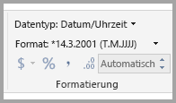
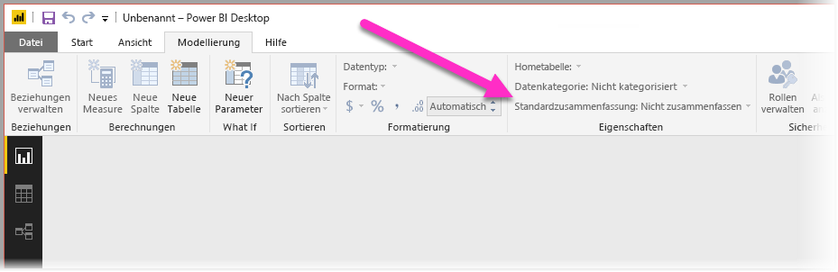
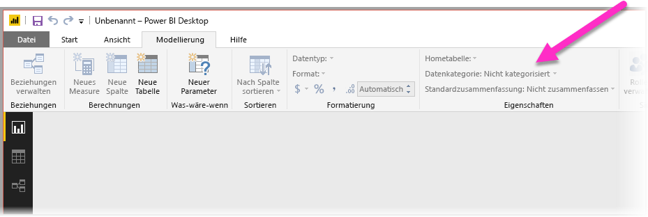
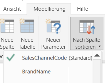

# Best Practices zum Optimieren von Q&A in Power BI
Indem Sie gängige Ausdrücke und natürliche Sprache verwenden, können Sie Ihre Daten effizient auswerten. Noch besser ist es, wenn Ihre Daten Ihnen Antworten liefern – und genau das ist mit Q&A in Power BI möglich.

Damit Q&A die Vielzahl von Fragen, die vom Programm beantwortet werden können, erfolgreich interpretieren kann, muss Q&A Annahmen über das Modell machen. Wenn die Struktur des Modells nicht mindestens einer dieser Annahmen entspricht, müssen Sie Ihr Modell anpassen. Diese Anpassungen für Q&A sind die gleichen Optimierungen, die als bewährte Methoden für jedes Modell in Power BI vorgenommen werden, unabhängig davon, ob Sie Q&A verwenden.

In den folgenden Abschnitten wird beschrieben, wie Sie Ihr Modell anpassen, um es für Q&A in Power BI zu optimieren.

## Von Q&A durchgeführte Anpassungen

### Measuretabellen

In Vorgängerversionen von Q&A führten Measuretabellen in Q&A zu Fehlern, da die zugrunde liegende Tabelle getrennt vorlag. Ab sofort kann Q&A Measuretabellen ordnungsgemäß verarbeiten.

### Konflikte zwischen Tabellen- und Spaltennamen

In Vorgängerversionen von Q&A hatte bei gleichnamigen Tabellen und Spalten die Tabelle Vorrang. Dieses Problem wurde behoben, deshalb müssen Sie dies in Ihren Modellen nicht länger berücksichtigen.

## Manuelle Schritte zum Verbessern von Q&A

### Verwenden der neuen Q&A-Tools zum Korrigieren Ihrer Fragen

Mit den neuen Q&A-Tools können Sie Q&A für Ihre grundlegende Geschäftsterminologie trainieren und Fragen korrigieren, die von Ihren Endbenutzern gestellt werden. Gelegentlich können einige Fragen weiterhin nicht beantwortet werden, weil die Daten falsch geformt sind oder Daten fehlen. Lesen Sie in diesem Fall die Abschnitte unten, um Hilfe bei der Optimierung zu erhalten. Erfahren Sie mehr über die [Q&A-Tools](q-and-a-tooling-intro.md).

## Hinzufügen fehlender Beziehungen

Wenn in Ihrem Modell Beziehungen zwischen Tabellen fehlen, können weder Power BI-Berichte noch Q&A interpretieren, wie diese Tabellen verknüpft werden müssen. Beziehungen sind die Grundlage eines qualifizierten Modells. Sie können beispielsweise nicht nach dem Gesamtumsatz für Kunden in Seattle fragen, wenn die Beziehung zwischen der Tabelle *Orders* und der Tabelle *Customers* fehlt. Die folgenden Abbildungen zeigen ein Modell, das noch bearbeitet werden muss, und ein Modell, für das Q&A verwendet werden kann. 

**Überarbeitung erforderlich**

In der ersten Abbildung sind keine Beziehungen zwischen den Tabellen „Customers“, „Sales“ und „Products“ vorhanden.

**Geeignet für Q&A**

In der ersten Abbildung sind Beziehungen zwischen den Tabellen definiert.

## Umbenennen von Tabellen und Spalten

Die Auswahl von Tabellen und Spalten ist wichtig für Q&A. Angenommen, Sie besitzen z. B. eine Tabelle namens *CustomerSummary*, die eine Liste Ihrer Kunden enthält. Sie müssten Abfragen wie „Die Kundenzusammenfassungen in Chicago auflisten“ durchführen und nicht „Die Kunden in Chicago auflisten“. 

Q&A kann einfache Wortumbrüche und Pluralformen erkennen, es wird aber davon ausgegangen, dass die Tabellen- und Spaltennamen den Inhalt genau widerspiegeln.

Betrachten Sie ein anderes Beispiel. Angenommen, Sie verfügen über eine Tabelle namens *Headcount* (Mitarbeiterzahl), die die Vor- und Nachnamen sowie die Mitarbeiternummern enthält. Sie besitzen eine andere Tabelle namens *Employees* (Mitarbeiter), die die Mitarbeiternummern, Stellennummer und das jeweilige Anfangsdatum enthält. Personen, die mit diesem Modell vertraut sind, verstehen diese Struktur möglicherweise. Andere Personen, die die Abfrage „Mitarbeiter zählen“ durchführen, erhalten eine Anzahl der Zeilen aus der Tabelle „Mitarbeiter“. Dieses Ergebnis ist wahrscheinlich nicht das, was sie im Sinn hatten, da dieses Ergebnis die Anzahl von Stellen angibt, die jeder Mitarbeiter einmal innehatte. Es wäre sinnvoller, diese Tabellen umzubenennen, um ihren Inhalt eindeutig zu definieren.

**Überarbeitung erforderlich**

Tabellennamen wie *StoreInfo* (Ladeninformationen) und *Product List* (Produktliste) müssen überarbeitet werden.

**Geeignet für Q&A**

Tabellen namens *Store* (Laden) und *Products* (Produkte) sind besser geeignet.

## Korrigieren von falschen Datentypen

Importierte Daten können falsche Datentypen aufweisen. Insbesondere *Datums-* und *Zahlenspalten*, die als *Zeichenfolgen* importiert werden, werden von Q&A nicht als Datumsangaben und Zahlen interpretiert. Stellen Sie daher sicher, dass Sie den richtigen Datentyp in Ihrem Power BI-Modell auswählen.

## Markieren von Jahres- und Bezeichnerspalten mit „Nicht zusammenfassen“

Power BI aggregiert standardmäßig numerische Spalten aggressiv, sodass bei Fragen wie „total sales by year“ eine Gesamtsumme der Umsätze und eine Gesamtsumme der Jahre zurückgegeben werden können. Wenn Power BI dieses Verhalten bei bestimmten Spalten nicht zeigen soll, legen Sie die Eigenschaft **Standardzusammenfassung nach** für die Spalte auf **Nicht zusammenfassen** fest. Achten Sie auf Spalten wie **Jahr**, **Monat**, **Tag** und **ID**, da bei diesen Spalten am häufigsten Probleme auftreten. Bei anderen Spalten, bei denen eine Summe nicht aussagekräftig ist, z. B. *Alter*, kann es ebenfalls sinnvoll sein, **Standardzusammenfassung nach** auf **Nicht zusammenfassen** oder **Durchschnitt** festzulegen. Sie finden diese Einstellung auf der Registerkarte **Modellierung**.

## Auswählen einer Datenkategorie für Datums- und Geografiespalten

Die **Datenkategorie** bietet über den Datentyp hinaus zusätzliche semantische Informationen zum Inhalt einer Spalte. Beispielsweise kann eine Spalte mit ganzen Zahlen als Postleitzahl gekennzeichnet werden, eine Zeichenfolgenspalte kann als Ort, Land, Region definiert werden usw. Diese Informationen werden von Q&A auf zweierlei Art und Weise verwendet: Zur Auswahl der Visualisierung und für die Sprachtendenzen.

Erstens verwendet Q&A die Informationen unter **Datenkategorie**, um das zu verwendende Visual auszuwählen. Es wird beispielsweise erkannt, dass Spalten mit Datums- oder Zeitangaben als **Datenkategorie** normalerweise eine gute Option für die horizontale Achse eines Liniendiagramms oder der Wiedergabeachse in einem Blasendiagramm sind. Ergebnisse mit Spalten, die geografische **Datenkategorien** aufweisen, werden hingegen als gut geeignet für eine Karte erkannt.

Zweitens schätzt Q&A, wie Benutzer wahrscheinlich über Datums- und Geografiespalten sprechen, um bestimmte Arten von Fragen verstehen zu können. „When“ in „When was John Smith hired“ verweist z.B. mit hoher Wahrscheinlichkeit auf eine Datumsspalte, und „Brown“ in „Count customers in Brown“ vermutlich auf eine Stadt und nicht auf die Haarfarbe.

## Auswählen einer Sortierspalte für relevante Spalten

Mit der Eigenschaft **Nach Spalte sortieren** kann festgelegt werden, dass beim Sortieren nach einer Spalte automatisch stattdessen nach einer anderen Spalte sortiert wird. Bei „sort customers by shirt size“ soll vermutlich die Spalte mit der Kleidergröße nach den entsprechenden Größen (XS, S, M, L, XL) und nicht alphabetisch (L, M, S, XL, XS) sortiert werden.

## Normalisieren des Modells

Sie müssen nicht befürchten, dass Sie das gesamte Modell neu strukturieren müssen. Bestimmte Strukturen sind allerdings so kompliziert, dass sie von Q&A nicht richtig behandelt werden können. Wenn Sie eine einfache Normalisierung der Struktur Ihres Modells durchführen, wird die Aussagekraft von Power BI-Berichten sowie die Genauigkeit der Q&A-Ergebnisse deutlich gesteigert.

Befolgen Sie diese allgemeine Regel: Jedes eindeutige „Ding“, über das der Benutzer spricht, sollte von genau einem Modellobjekt (Tabelle oder Spalte) dargestellt werden. Wenn die Benutzer also z.B. über Kunden sprechen, sollte es ein Objekt *Kunde* geben. Und wenn die Benutzer über Umsätze sprechen, sollte es ein Objekt *Umsatz* geben. Klingt einfach, oder? Abhängig von der Form der Daten, mit denen Sie beginnen, kann es das auch sein. Im **Abfrage-Editor** sind umfangreiche Funktionen für die Datenstrukturierung verfügbar. Viele der unkomplizierteren Transformationen sind aber auch einfach mit Berechnungen im Power BI-Modell möglich.

Die folgenden Abschnitte enthalten einige allgemeine Transformationen, die Sie möglicherweise durchführen müssen.

### Erstellen von neuen Tabellen für mehrspaltige Entitäten

Wenn Sie mehrere Spalten haben, die als eine Einheit innerhalb einer größeren Tabelle fungieren können, sollten diese Spalten in eine eigene Tabelle abgeteilt werden. Nehmen wir beispielsweise an, dass Sie die Spalten „Contact Name“, „Contact Title“ und „Contact Phone“ innerhalb Ihrer *Firmen*-Tabelle besitzen. Das Design kann verbessert werden, indem eine separate *Kontakttabelle* (Contacts) den Namen, den Titel und die Telefonnummer sowie eine Verknüpfung zurück zur *Firmentabelle* (Company) enthält. Dies erleichtert es, Fragen zu Kontakten unabhängig von Fragen zu den entsprechenden Unternehmen zu stellen. Außerdem wird die Flexibilität der Anzeige gesteigert.

**Überarbeitung erforderlich**

**Geeignet für Q&A**

### Pivotieren zur Vermeidung von Eigenschaftenbehältern

Wenn Ihr Modell *Eigenschaftenbehälter* umfasst, sollten diese so umstrukturiert werden, dass sie genau eine Spalte pro Eigenschaft enthalten. Eigenschaftenbehälter sind zwar praktisch, um eine große Anzahl von Eigenschaften zu verwalten, sie bedeuten aber auch automatisch Einschränkungen, die weder mit Power BI-Berichten noch mit Q&A umgangen werden können.

Betrachten Sie beispielsweise die Tabelle *CustomerDemographics* mit Spalten für Kunden-ID, Eigenschaft und Wert, in der jede Zeile eine andere Eigenschaft des Kunden darstellt (z. B. Alter, Familienstand, Stadt usw.). Wenn die Bedeutung der Wertspalte auf Grundlage der Eigenschaftenspalte überladen wird, kann Q&A die meisten Abfragen, in denen darauf verwiesen wird, nicht mehr interpretieren. Eine einfache Frage wie „show the age of each customer“ kann möglicherweise funktionieren, da sie als „show the customers and customer demographics where property is age“ interpretiert werden kann. Die Struktur des Modells unterstützt aber keine etwas komplexeren Fragen wie „average age of customers in Chicago“. Auch wenn Benutzer, die Power BI-Berichte direkt erstellen, in einigen Fällen Möglichkeiten finden, die gesuchten Daten abzurufen, funktioniert Q&A nur, wenn jede Spalte nur eine Bedeutung hat.

**Überarbeitung erforderlich**

**Geeignet für Q&A**

### Vereinen zum Eliminieren von Partitionierungen

Wenn Sie Ihre Daten auf mehrere Tabellen aufgeteilt oder Werte in mehreren Spalten pivotiert haben, können Benutzer verschiedene Vorgänge nur schwer oder gar nicht ausführen. Betrachten Sie zunächst eine typische Tabellenpartitionierung: eine Tabelle *Sales2000-2010* und eine Tabelle *Sales2011-2020*. Wenn alle wichtigen Berichte auf ein bestimmtes Jahrzehnt beschränkt sind, können Sie diese Partitionierung für Power BI-Berichte vermutlich beibehalten. Durch die Flexibilität von Q&A erwarten die Benutzer jedoch Antworten auf Fragen wie „Gesamtumsatz nach Jahr“. Damit diese Abfrage funktioniert, müssen Sie die Daten in einer einzigen Power BI-Modelltabelle vereinen.

Betrachten Sie entsprechend eine pivotierte Wertspalte: die Tabelle *BookTour* mit den Spalten „Author“, „Book“, „City1“, „City2“ und „City3“. Mit einer solchen Struktur können selbst einfache Fragen wie „count books by city“ nicht richtig interpretiert werden. Damit diese Abfrage funktioniert, erstellen Sie eine separate *BookTourCities*-Tabelle, in der die Werte für die Städte in einer Spalte vereint werden.

**Überarbeitung erforderlich**

**Geeignet für Q&A**

### Teilen von formatierten Spalten

Wenn die Quelle, aus der Sie Ihre Daten importieren, formatierte Spalten enthält, greifen Power BI-Berichte (und Q&A) nicht auf die Spalte zu, um den Inhalt zu analysieren. Wenn Sie also z. B. eine Spalte **Full Address** (vollständige Adresse) haben, die Adresse, Stadt und Land enthält, sollten Sie diese in Spalten für Adresse, Stadt und Land unterteilen, damit die Benutzer diese einzeln abfragen können.

**Überarbeitung erforderlich**

**Geeignet für Q&A**

Wenn Sie mit Spalten mit dem vollständigen Namen einer Person arbeiten, sollten Sie entsprechend die Spalten **Vorname** und **Nachname** hinzufügen, falls Fragen zu den einzelnen Namensteilen gestellt werden. 

### Erstellen von neuen Tabellen für Spalten mit mehreren Werten

Eine ähnliche Situation: Wenn die Quelle, aus der Sie Ihre Daten importieren, Spalten mit mehreren Werten enthält, greifen Power BI-Berichte (und Q&A) nicht auf die Spalte zu, um den Inhalt zu analysieren. Wenn Sie z.B. eine Spalte „Composer“ haben, die die Namen mehrerer Komponisten für einen Musiktitel enthält, sollten Sie diese auf mehrere Zeilen in einer separaten Tabelle *Composers* aufteilen.

**Überarbeitung erforderlich**

**Geeignet für Q&A**

### Denormalisieren zum Entfernen inaktiver Beziehungen

Die einzige Ausnahme zur Regel „Normalisierung ist besser“ gilt, wenn es mehr als einem Pfad gibt, um von einer Tabelle zu einer anderen zu gelangen. Angenommen, Sie haben eine Tabelle *Flights* mit den Spalten „SourceCityID“ und „DestinationCityID“, die jeweils mit der Tabelle *Cities* verknüpft sind. Eine der Beziehungen muss als inaktiv markiert werden. Da Q&A nur aktive Beziehungen verwenden kann, können Sie dann abhängig von der ausgewählten Beziehung keine Fragen zum Abflug- oder Zielort stellen. Wenn Sie stattdessen die Spalten mit den Städtenamen in die Tabelle *Flights* denormalisieren, können Sie Abfragen wie „Alle Flüge für morgen mit dem Abflugort Seattle und dem Zielort San Francisco auflisten“ ausführen.

**Überarbeitung erforderlich**

**Geeignet für Q&A**

### Hinzufügen von Synonymen in Tabellen und Spalten

Dieser Schritt bezieht sich speziell auf Q&A (und nicht auf Power BI-Berichte im Allgemeinen). Benutzer nutzen häufig verschiedene Begriffe, um auf etwas zu verweisen, z.B. Gesamtumsatz, Nettoumsatz, Gesamtnettoumsatz. Sie können diese Synonyme zu Tabellen und Spalten im Power BI-Modell hinzufügen. 

Dieser Schritt kann von Bedeutung sein. Selbst bei unkomplizierten Tabellen- und Spaltennamen stellen die Benutzer von Q&A Fragen mit den Wörtern, die ihnen spontan einfallen. Sie wählen nicht aus einer vordefinierten Liste von Spalten aus. Je mehr sinnvolle Synonyme Sie hinzufügen können, desto höher ist die Benutzerfreundlichkeit Ihres Berichts. Um Synonyme hinzuzufügen, wechseln Sie in Power BI Desktop zur Modellansicht, klicken Sie auf die Registerkarte „Modellierung“, und wählen Sie ein Feld oder eine Tabelle aus. Das Eigenschaftenfenster zeigt das Feld **Synonyme** an, in dem Sie Synonyme hinzufügen können.

 Seien Sie beim Hinzufügen von Synonymen vorsichtig. Das Hinzufügen desselben Synonyms zu mehr als einer Spalte oder Tabelle führt zu Mehrdeutigkeit. Q&A nutzt nach Möglichkeit den Kontext, um bei mehrdeutigen Synonymen zu entscheiden, allerdings ist nicht bei allen Fragen ausreichend Kontext vorhanden. Wenn der Benutzer z. B. „Kunden zählen“ eingibt und im Modell an drei Stellen das Synonym „Kunden“ vorkommt, wird vermutlich nicht die gesuchte Antwort zurückgegeben. Stellen Sie in diesen Fällen sicher, dass das primäre Synonym eindeutig ist, da dies in der Anpassung verwendet wird. So kann der Benutzer auf die Mehrdeutigkeit hingewiesen werden (z.B. bei der Anpassung „show the number of archived customer records“), sodass er die Frage noch einmal anders formulieren kann.
