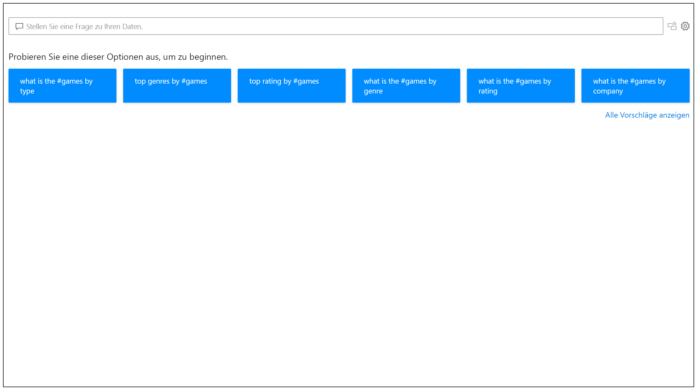
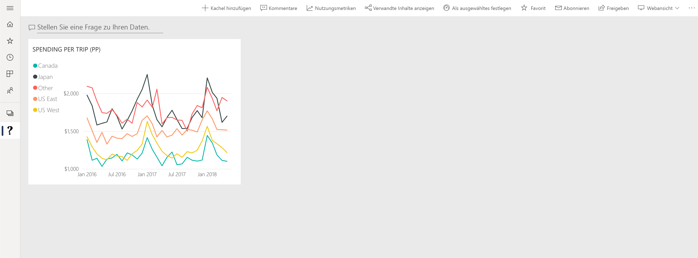

# Einführung in Power BI Q&A

Manchmal erhalten Sie am schnellsten eine Antwort in Bezug auf Ihre Daten, indem Sie mithilfe einer Frage in natürlicher Sprache eine Suche in Ihren Daten durchführen. Mit dem Q&A-Feature in Power BI können Sie Ihre Daten in Ihren eigenen Worten in natürlicher Sprache untersuchen. Q&A ist interaktiv und macht sogar Spaß. Häufig führt eine Frage zur nächsten, weil die Visualisierungen interessante Aspekte für eine Weiterverfolgung aufwerfen. Fragen stellen ist erst der Anfang. Erkunden Sie Ihre Daten, verfeinern oder erweitern Sie Ihre Frage, entdecken Sie neue Informationen, sehen Sie sich Details genauer an, oder lassen Sie Details aus, um sich einen allgemeineren Überblick zu verschaffen. Das Feature ist interaktiv und liefert dank Unterstützung durch einen In-Memory-Speicher schnell Ergebnisse. 

Power BI Q&A ist kostenfrei und für alle Benutzer verfügbar. In Power BI Desktop können Bericht-Designer mithilfe von Q&A Daten untersuchen und Visualisierungen erstellen. Im Power BI-Dienst können Benutzer ihre Daten mit Q&A untersuchen. Wenn Sie über die Berechtigung zum Bearbeiten eines Dashboards oder eines Berichts verfügen, können Sie Ihre Q&A-Ergebnisse auch anheften.

## Verwenden von Q&A

Noch bevor Sie mit der Eingabe beginnen, zeigt Q&A einen neuen Bildschirm mit Vorschlägen für die Formulierung Ihrer Frage an. Starten Sie entweder anhand einer der vorgeschlagenen Fragen, oder geben Sie eigene Fragen ein. Q&A unterstützt eine Vielzahl von Fragen und bietet u. a. die folgenden Funktionen:

- **Stellen Sie Fragen in natürlicher Sprache**: Welche Verkäufe weisen den höchsten Umsatz auf?
- **Verwenden Sie eine relative Datenfilterung**: Verkäufe im letzten Jahr anzeigen
- **Geben Sie nur die ersten n Ergebnisse zurück**: Die 10 wichtigsten Produkte nach Umsatz
- **Verwenden Sie einen Filter**: Verkäufe in den USA anzeigen
- **Geben Sie komplexe Bedingungen an**: Verkäufe in Produktkategorie 1 oder 2 anzeigen
- **Geben Sie ein bestimmtes Visual zurück**: Verkäufe nach Produkt als Kreisdiagramm anzeigen
- **Verwenden Sie komplexe Aggregationen**: Medianwert der Verkäufe nach Produkt anzeigen
- **Sortieren Sie Ergebnisse**: Die 10 wichtigsten Länder nach Verkäufen anzeigen, sortiert nach Ländercode
- **Vergleichen Sie Daten**: Daten nach Gesamtumsatz und Gesamtkosten im Vergleich anzeigen
- **Zeigen Sie Trends an**: Verkäufe im Zeitverlauf anzeigen

### AutoVervollständigen

Bei der Eingabe Ihrer Frage zeigt Power BI Q&A relevante und kontextuelle Vorschläge an, die Ihnen helfen, schnell mit natürlicher Sprache produktiv zu werden. Sie erhalten während der Eingabe sofort Feedback und Ergebnisse. Die Funktionalität ist vergleichbar mit der Eingabe in eine Suchmaschine.

### Rote/blaue Unterstreichungen

Q&A zeigt Wörter mit Unterstreichungen an, damit Sie sehen können, welche Wörter das System verstanden oder nicht erkannt hat. Eine durchgezogene blaue Unterstreichung zeigt an, dass das System das Wort erfolgreich einem Feld oder Wert im Datenmodell zugeordnet hat. Das Beispiel unten zeigt, dass Q&A das Wort *EU Sales* verstanden hat.

Bei der Eingabe eines Worts in Q&A wird dieses häufig rot unterstrichen. Eine rote Unterstreichung kann auf zwei potenzielle Probleme hinweisen. Der erste Problemtyp wird als *geringe Konfidenz* kategorisiert. Wenn Sie ein ungenaues oder mehrdeutiges Wort eingeben, wird das Feld rot unterstrichen. Ein Beispiel hierfür ist das Wort „Umsatz“. Das Wort „Umsatz“ kann in verschiedenen Feldern enthalten sein, deshalb werden Sie vom System durch die rote Unterstreichung aufgefordert, das von Ihnen gemeinte Feld auszuwählen. Ein weiteres Beispiel für eine geringe Zuverlässigkeit läge vor, wenn Sie das Wort „Bereich“ eingeben, aber die Spalte das Wort „Region“ enthält. Power BI Q&A erkennt dank Integration von Bing und Office Wörter mit gleicher Bedeutung. Q&A unterstreicht das betreffende Wort in Rot, damit Sie wissen, dass es sich nicht um eine direkte Übereinstimmung handelt.

Der zweite Problemtyp liegt vor, wenn Q&A das Wort überhaupt nicht erkennt. Dieses spezifische Problem kann auftreten, wenn Sie einen domänenspezifischen Begriff verwenden, der nirgends in den Daten erwähnt wird, oder wenn die Datenfelder falsch benannt sind. Ein Beispiel könnte die Verwendung des Worts „Kosten“ sein, obwohl es in den Daten nirgendwo enthalten ist. Das Wort ist in einem Wörterbuch enthalten, wird aber von Q&A mit einer roten Unterstreichung markiert.

> [!NOTE]
> Sie können die blauen/roten Unterstreichungen im Bereich **Visuelle Formatierung** von Q&A anpassen. Im Artikel [Q&A-Tools](q-and-a-tooling-teach-q-and-a.md) wird außerdem das *Q&A-Training* erläutert, mit dem Sie Begriffe definieren können, die von Q&A nicht erkannt wurden.

### Ergebnisse der Visualisierung

Während Sie Ihre Frage eingeben, versucht Q&A, die Antwort sofort zu interpretieren und zu visualisieren. Q&A versucht, die Frage anhand der letzten Aktualisierungen zu interpretieren und die Felder automatisch auf der richtigen Achse zu positionieren. Wenn Sie beispielsweise „Umsatz nach Jahr“ eingeben, erkennt Q&A, dass es sich bei dem Jahr um ein Datumsfeld handelt, und platziert dieses Feld immer auf der X-Achse. Wenn Sie den Visualisierungstyp ändern möchten, geben Sie im Anschluss an die Frage „als *Diagrammtyp*“ ein. Q&A unterstützt aktuell diese Arten von Visualisierungen:

- Liniendiagramm
- Balkendiagramm
- Matrix
- Tabelle
- Karte
- Fläche
- Kreisdiagramm
- Punkt-/Blasendiagramm
 

## Hinzufügen von Q&A zu einem Bericht

Sie können Q&A auf zwei unterschiedliche Arten zu einem Bericht in Power BI Desktop oder im Power BI-Dienst hinzufügen:

- Hinzufügen eines Q&A-Visuals
- Hinzufügen einer Q&A-Schaltfläche

Um einem Bericht ein Q&A-Visual hinzuzufügen, klicken Sie auf das neue Symbol **Q&A**, um das neue Q&A-Visual in den Visualisierungsbereich einzufügen. Alternativ können Sie auf eine beliebige Stelle in der Berichtscanvas doppelklicken, um das Q&A-Visual einzufügen.

Um eine Schaltfläche hinzuzufügen, wählen Sie im Menüband **Start** die Option **Schaltflächen** > **Q&A** aus. Sie können das Bild für die Q&A-Schaltfläche vollständig anpassen.

> [!NOTE]
> Wenn Sie Q&A über die Schaltfläche starten, wird weiterhin die alte Q&A-Oberfläche verwendet. In zukünftigen Versionen von Power BI wird dies geändert.

## Verwenden von Q&A für Dashboards

Standardmäßig steht Q&A im oberen Bereich eines Dashboards zur Verfügung. Geben Sie zur Verwendung von Q&A Ihre Frage im Feld **Stellen Sie eine Frage zu Ihren Daten** ein.

## Nächste Schritte

Sie können natürliche Sprache auf verschiedene Weise in Ihre Berichte integrieren. Weitere Informationen finden Sie in folgenden Artikeln:

* [Q&A-Visual](../visuals/power-bi-visualization-q-and-a.md)
* [Q&A: Best Practices](q-and-a-best-practices.md)
