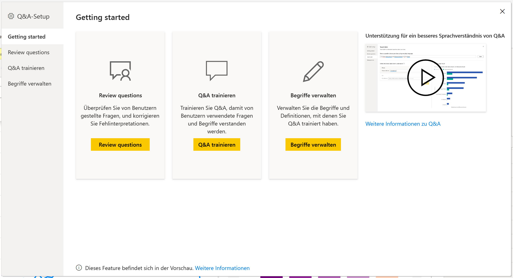
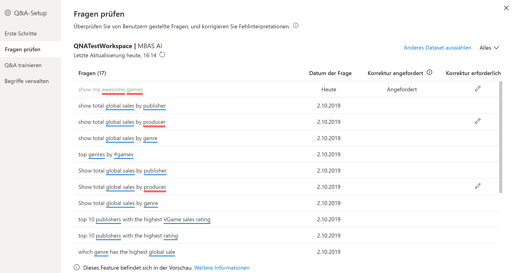
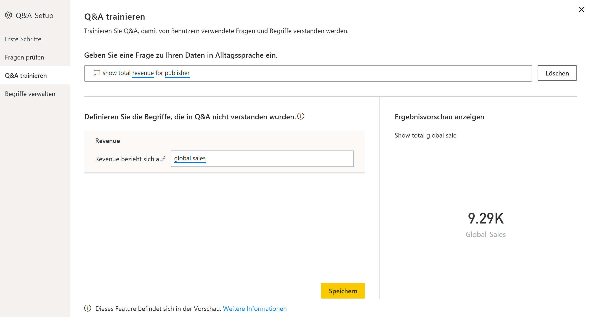
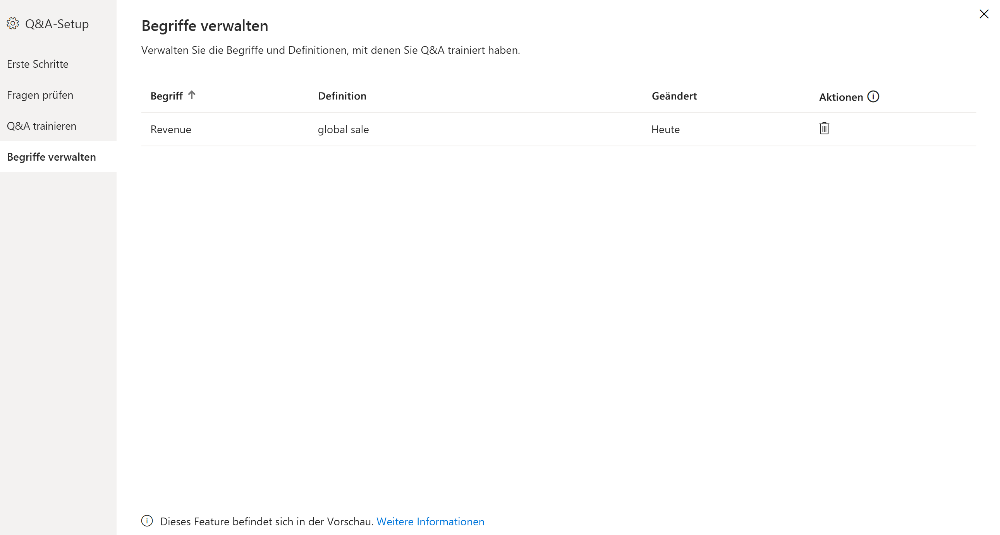
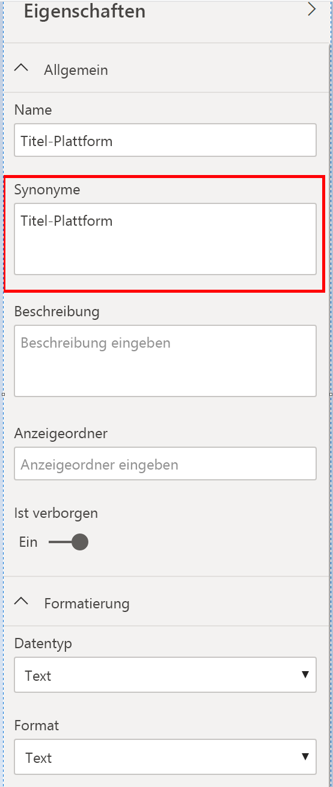

# Einführung in Q&A-Tools zum Trainieren von Power BI Q&A (Vorschau)

Mithilfe von Power BI Q&A-*Tools* können Sie die Funktionen für natürliche Sprache für Ihre Benutzer verbessern. Als Designer oder Administrator interagieren Sie mit der Engine für natürliche Sprache und nehmen Verbesserungen in drei Bereichen vor: 

- Überprüfen von Fragen, die Benutzer stellen
- Trainieren der Q&A-Engine im Hinblick auf das Verstehen von Fragen
- Verwalten von Begriffen, die Sie der Q&A-Engine beigebracht haben

Zusätzlich zu diesen dedizierten Toolfunktionen finden Sie auf der Registerkarte **Modellierung** in Power BI Desktop weitere Optionen:  

- Synonyme
- Zeilenbeschriftungen
- Für Q&A ausblenden
- Konfigurieren des linguistischen Schemas (erweitert)

## Erste Schritte mit Q&A-Tools

Q&A-Tools sind nur in Power BI Desktop verfügbar und unterstützen derzeit ausschließlich den Importmodus.

1. Öffnen Sie Power BI Desktop, und verwenden Sie Q&A, um ein Visual zu erstellen. 
2. Klicken Sie am Rand des Visuals auf das Zahnradsymbol. 

    

    Dann wird die Seite „Erste Schritte“ geöffnet.  

    

### Fragen zur Überprüfung

Klicken Sie auf **Fragen prüfen**, um eine Liste der Datasets aufzurufen, die im Power BI-Dienst für Ihren Mandanten verwendet werden. Auf der Seite **Fragen prüfen** werden auch der Besitzer des Datasets, der Arbeitsbereich und das Datum der letzten Aktualisierung angezeigt. Auf dieser Seite können Sie ein Dataset auswählen und prüfen, welche Fragen die Benutzer gestellt haben. Außerdem werden Wörter angezeigt, die nicht erkannt wurden. Es werden alle Daten der letzten 28 Tage angezeigt.

### Q&A trainieren

Im Abschnitt **Q&A-Training** können Sie die Q&A-Engine im Hinblick auf das Erkennen von Wörtern trainieren. Geben Sie zunächst eine Frage ein, die mindestens ein Wort enthält, das die Q&A-Engine nicht erkannt hat. Q&A fordert Sie dazu auf, diesen Begriff zu definieren. Geben Sie entweder einen Filter oder einen Feldnamen ein, der zu diesem Begriff passt. Q&A interpretiert anschließend die ursprüngliche Frage neu. Wenn Sie mit den Ergebnissen zufrieden sind, speichern Sie Ihre Eingabe. Weitere Informationen finden Sie unter [Q&A-Training](q-and-a-tooling-teach-q-and-a.md).

### Verwalten von Begriffen

Alle Elemente, die Sie dem Abschnitt „Q&A-Training“ entnommen und gespeichert haben, werden hier angezeigt, sodass Sie die von Ihnen definierten Begriffe prüfen oder löschen können. Derzeit ist es nicht möglich, vorhandene Definitionen zu bearbeiten. Wenn Sie einen Begriff neu definieren möchten, müssen Sie diesen löschen und einen neuen Eintrag erstellen.

## Weitere Q&A-Einstellungen

### Mehrere Synonyme

Die Registerkarte **Modellierung** in Power BI Desktop umfasst noch weitere Optionen zur Verbesserung der Q&A-Funktionen. 

1. Klicken Sie in Power BI Desktop auf die Ansicht „Modellierung“.

2. Klicken Sie auf ein Feld oder eine Tabelle, um den Bereich **Eigenschaften** anzuzeigen.  In diesem Bereich, der auf der rechten Seite der Canvas angezeigt wird, finden Sie mehrere Q&A-Aktionen. Eine der Optionen heißt **Synonyme**. Im Feld **Synonyme** können Sie ganz einfach Alternativen für die ausgewählte Tabelle oder das ausgewählte Feld definieren. Sie können zwar auch im Abschnitt **Q&A-Training** des Dialogfelds „Tooling“ (Tools) Synonyme definieren, aber es geht häufig schneller, wenn Sie die Synonyme für mehrere Felder in einer Tabelle über dieses Feld festlegen.

    

3. Wenn Sie mehrere Synonyme für ein einzelnes Feld definieren möchten, trennen Sie die einzelnen Synonyme durch Kommas voneinander ab.

### Für Q&A ausblenden

Sie können auch Felder und Tabellen ausblenden, damit sie nicht in den Q&A-Ergebnissen angezeigt werden. 

1. Klicken Sie in Power BI Desktop auf die Ansicht „Modellierung“.

2. Klicken Sie auf ein Feld oder eine Tabelle, um den Bereich **Eigenschaften** anzuzeigen, und legen Sie die Option **Ist verborgen** auf **On** (Ein) fest.

    Q&A berücksichtigt diese Einstellung und sorgt dafür, dass das Feld nicht erkannt wird. Sie sollten beispielsweise ID-Felder und Fremdschlüssel ausblenden, um unnötige Duplikate von Feldern mit demselben Namen zu vermeiden. Auch wenn Sie das Feld ausblenden, können Sie es weiterhin außerhalb von Q&A in Visuals in Power BI Desktop verwenden.

### Festlegen einer Zeilenbeschriftung

Mithilfe einer Zeilenbeschriftung können Sie definieren, welche Spalte (oder welches *Feld*) eine einzelne Zeile in einer Tabelle am besten beschreibt. Für eine Tabelle mit dem Namen „Kunde“ lautet die Zeilenbeschriftung z. B. in der Regel „Anzeigename“. Durch die Angabe dieser zusätzlichen Metadaten kann Q&A nützlichere Visuals erstellen, wenn Benutzer z. B. die Aufforderung „Umsätze nach Kunden sortiert anzeigen“ eingeben. Q&A kann dann die Beschriftung „Anzeigename“ verwenden, anstatt den Begriff „Kunde“ als eine Tabelle zu behandeln, und ein Balkendiagramm mit den Umsätzen der einzelnen Kunden anzeigen. Sie können nur die Zeilenbeschriftung für die Ansicht „Modellierung“ festlegen. 

1. Klicken Sie in Power BI Desktop auf die Ansicht „Modellierung“.

2. Klicken Sie auf eine Tabelle, um den Bereich **Eigenschaften** anzuzeigen.

3. Wählen Sie im Feld **Zeilenbeschriftung** ein Feld aus.

## Konfigurieren des linguistischen Schemas (erweitert)

In Power BI können Sie die Engine für natürliche Sprache vollständig in Q&A trainieren und erweitern, einschließlich der Bewertung und Gewichtung der zugrunde liegenden Ergebnisse in natürlicher Sprache. Weitere Informationen finden Sie unter [Bearbeiten des linguistischen Schemas für Q&A und Hinzufügen von Ausdrücken](q-and-a-tooling-advanced.md).

## Nächste Schritte

Es gibt verschiedene bewährte Methoden zur Verbesserung der Engine für natürliche Sprache. Weitere Informationen finden Sie im folgenden Artikel:

* [Q&A: Bewährte Methoden](q-and-a-best-practices.md)
